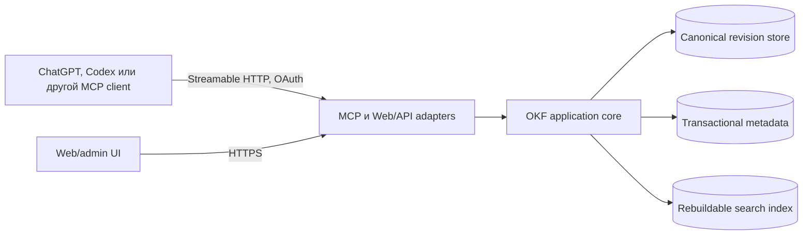

# Архитектура CloudBrain

Статус: proposal, 2026-08-05. Ни один компонент ниже ещё не реализован.

## Драйверы и ограничения

Архитектура должна одновременно обеспечить:

- переносимый OKF 0.2 round-trip без потери неизвестных полей;
- ленивое, цитируемое чтение через MCP;
- безопасную многописательскую модель, которой нет в самом OKF;
- приватные tenant-scoped базы и отдельные read/write scopes;
- ранний web-прототип в OpenAI Sites;
- целевой AWS deployment без переписывания доменного ядра;
- возможность начать с lexical search и добавить embeddings после измерений.

OKF намеренно не определяет storage, transactions, locks, ACL, query API или
MCP. Эти свойства принадлежат CloudBrain и не должны выдаваться за требования
формата.

## Контекст системы



Весь corpus не проходит через MCP-сессию. Search отдаёт ограниченный набор
результатов, fetch — выбранный document или section, а large assets и exports
передаются через object storage.

## Слои

### 1. OKF domain и codec

Слой знает пути bundle, reserved `index.md`/`log.md`, concept frontmatter,
provenance, trust/lifecycle fields, assets, legacy 0.1 fallbacks и правила
валидации. Он:

- принимает и возвращает исходные UTF-8 bytes;
- сохраняет неизвестные types и producer-defined fields при round-trip;
- пишет OKF 0.2, если явно не выбран другой export profile;
- отделяет conformance errors от quality warnings;
- не знает об MCP, OAuth, AWS, Sites, SQL или vector search.

### 2. Application core

Use cases работают с явным `ActorContext`, knowledge mount и revision:

- import/export/validate bundle;
- browse/search/fetch;
- create draft, inspect diff, commit with `expected_revision`;
- publish index jobs и audit events;
- выдавать короткоживущие object-transfer intents для больших файлов.

Application core зависит от портов `ObjectStore`, `MetadataStore`,
`SearchIndex`, `Embedder`, `Authorizer`, `ApprovalVerifier`, `AuditSink` и
`Clock`, но не от их реализаций.

### 3. Protocol adapters

- MCP adapter реализует stable protocol `2025-11-25`, Streamable HTTP и version
  negotiation. RC `2026-07-28` не становится default до финальной спецификации,
  поддержки SDK и conformance tests.
- Web/API adapter обслуживает admin UI и large-transfer orchestration.
- Background adapter выполняет идемпотентную индексацию и housekeeping.

### 4. Infrastructure adapters

- Local: filesystem + SQLite metadata/FTS.
- Sites experiment: R2 для bytes/assets и D1 для revisions/HEAD/jobs.
- AWS: S3 для canonical bytes, DynamoDB для transactional metadata и
  OpenSearch Serverless как optional derived index.

Ни один infrastructure adapter не меняет публичные use-case contracts.

## Каноническая модель ревизий

Каждая база имеет стабильный `knowledge_base_id`, а каждый commit создаёт новую
immutable revision:

```text
knowledge base
├── HEAD -> revision id
├── revision
│   ├── parent revision id
│   ├── manifest: path, SHA-256, media type, size
│   ├── exact OKF files and source assets
│   └── author, created_at, change summary
└── derived index state per revision
```

Manifest — producer envelope, а не файл нормативного OKF bundle. Export
материализует только выбранное дерево bundle; service metadata в него не
подмешивается.

S3/R2 version IDs не заменяют доменную revision: одинаковый revision contract
должен работать на любой платформе. Hash каждого объекта обеспечивает
целостность и идемпотентность, но не означает доверие к содержанию.

## Поток записи

1. Adapter аутентифицирует запрос и строит `ActorContext` без доверия к
   переданному клиентом `tenant_id`.
2. Core проверяет mount, scope и ACL.
3. Input нормализуется в draft changeset; OKF parser/validator выдаёт errors и
   warnings без потери исходных bytes.
4. Пользователь проверяет diff, после чего trusted control plane выдаёт
   single-use approval token для точного draft hash и ожидаемого HEAD.
5. Core проверяет token, scope и сверяет `expected_revision` с текущим HEAD.
6. Canonical objects и immutable manifest сохраняются идемпотентно.
7. Transactional metadata store условно продвигает HEAD и записывает outbox/audit
   reference. При конфликте новый HEAD не создаётся.
8. Background worker строит индекс для новой revision. Старый индекс не
   смешивается с новым благодаря фильтру `tenant_id + knowledge_base_id +
   revision_id`.

Нужен recovery path для объектов, записанных до неудавшегося HEAD transaction:
они остаются недостижимыми и удаляются только безопасным garbage collection
после retention window.

## Поток чтения

1. `search` применяет tenant/mount/ACL filter до выдачи результатов.
2. Derived index возвращает path/section, excerpt, content hash, revision и
   provenance pointers.
3. Core перечитывает каноническую revision, когда точность важнее latency или
   index freshness не подтверждена.
4. `fetch` возвращает canonical text, URL/URI, OKF metadata, trust tier и
   freshness state; source pointer позволяет агенту дочитать evidence.
5. Ответ ограничивается явным result/token budget. Обрезание помечается.

## MCP surface

В MVP один MCP mount связан ровно с одной knowledge base. Для совместимости с
ChatGPT retrieval первая поверхность сохраняет стандартную пару:

- `search(query, filters?, limit?)` → results с `id`, `title`,
  `url`, excerpt, revision и metadata;
- `fetch(id, revision?, section?)` → `id`, `title`, canonical `text`, `url` и
  metadata.

CloudBrain-specific tools добавляются узко:

- `knowledge_base_info` и `knowledge_browse`;
- `knowledge_validate`;
- `knowledge_diff`;
- `knowledge_draft_create`;
- `knowledge_draft_commit(draft_id, expected_revision, approval_token, idempotency_key)`;
- `knowledge_export_start` и `knowledge_export_status`.

Import остаётся web/CLI operation в MVP. Если позже он появится в MCP, archive
передаётся через upload intent, а не внутри JSON-RPC.

Точные schemas являются частью MVP и будут зафиксированы до реализации.
Read-only и mutation tools получают правдивые MCP annotations. Mutations не
маскируются под `search`/`fetch`.

Resource identity не содержит `mount_id`: mount — authorization context, а не
часть знания. Внутри одного CloudBrain deployment immutable resource имеет URI
наподобие:

```text
okf://bases/{base-id}/revisions/{revision-id}/index
okf://bases/{base-id}/revisions/{revision-id}/entries/{path}
```

Для ChatGPT citation поле `url` содержит auth-gated HTTPS-представление того же
resource. Оно стабильно внутри deployment, но не объявляется глобальным OKF ID.
Переносимая ссылка в export — tuple `revision manifest hash + bundle path`;
сам OKF не задаёт глобальную идентичность concept.

Конкретный клиент может не показывать resources напрямую, поэтому критические
сценарии остаются доступны через tools.

## Identity и knowledge mounts

Один deployment обслуживает много tenants. Подключение получает не `tenant_id`
из аргумента tool, а проверенный identity и `mount_id`. В MVP mount связывает:

- ровно одну knowledge base;
- scopes `kb.read`, `kb.draft`, `kb.commit`, `kb.export`, `kb.admin`;
- base-level ACL без частичных path/tag grants.

`kb.export` материализует всю выбранную revision и выдаётся только mount без
частичных ограничений. Если позже появятся path/tag grants, они не наследуют
bulk export: subset export потребует отдельной модели revision и provenance.

Наличие `kb.commit` само по себе не завершает mutation. В reviewed mode,
обязательном для MVP, trusted web/control-plane flow после показа diff выдаёт
single-use approval token, связанный с actor, base, draft hash, expected HEAD и
expiry. MCP server проверяет token повторно и пишет его ID в audit без самого
секрета. Режим autonomous commit потребует отдельного решения и scope; tool
annotations остаются UX hints, а не authorization control.

В local profile роль control plane выполняет отдельная operator CLI: она читает
draft/diff через application core, требует явное подтверждение и выпускает
token вне MCP. Ручной Inspector test получает token этим CLI между draft и
commit. Автоматические tests используют fixture `ApprovalIssuer`, доступный
только test process и отсутствующий в production container. В Sites/AWS token
выпускает аутентифицированный web/control-plane endpoint после того же review;
непроверенный MCP content не имеет доступа к issuer.

Remote MCP следует authorization profile `2025-11-25`: OAuth 2.1,
authorization code + PKCE, Protected Resource Metadata и audience-bound access
tokens. Issuer, audience, expiry и scopes проверяются на каждом вызове. Входящий
token нельзя пересылать downstream.

Для OpenAI-публикации также нужны стабильный HTTPS endpoint, domain challenge,
logging/metrics и реальная проверка Developer mode. Cognito не поддерживает
RFC 7591 Dynamic Client Registration; если конкретный клиент не допускает
pre-registration или Client ID Metadata Documents, потребуется другой OAuth
provider либо auth broker.

## Deployment profiles

### Local vertical slice

- Один процесс и один MCP endpoint.
- Filesystem сохраняет exact revision objects.
- SQLite хранит HEAD, ACL fixture, jobs и lexical FTS index.
- Один тестовый tenant, но tenant filter остаётся обязательным в API.
- Никаких embeddings до корректного source-backed search/fetch.

Это самый короткий путь проверить domain contract без облачной сложности.

### OpenAI Sites prototype

Подтверждённая роль Sites — web/admin UI с server-side routes, D1 для structured
data и R2 для objects. Первый Sites milestone — UI для import, validation,
browse и export поверх тех же application use cases. Data-only MCP остаётся
ядром агентного продукта, но совместное размещение MCP не блокирует этот UI.

Официальная документация Sites не обещает Streamable HTTP MCP, SSE без
buffering, `/mcp` compatibility или прохождение plugin review. Поэтому единый
Sites deployment — compatibility spike, а не архитектурная гарантия.

Gate для признания Sites MCP-host:

1. Инициализация MCP и version negotiation.
2. `tools/list`, `search` и `fetch` из реального ChatGPT Developer mode.
3. Streaming без buffering и корректная отмена/ошибки.
4. OAuth discovery, scopes и refresh flow.
5. `/.well-known/openai-apps-challenge` и стабильный public URL.
6. Проверка текущей account/region availability для Madeira; Sites остаётся
   public beta и документировал ограничения EEA.

Compatibility spike совместного размещения MCP запускается отдельно. Если gate
не пройден, Sites остаётся UI, а portable MCP container размещается отдельно.
Это не меняет domain или tool contracts.

### AWS target

Рекомендуемая первая AWS-топология:

```text
MCP clients
    │ OAuth/JWT
    ▼
Bedrock AgentCore Runtime: stateless Streamable HTTP MCP
    ├── S3: immutable OKF revisions and assets
    ├── DynamoDB: tenant, ACL, HEAD, revision, job, idempotency
    ├── DynamoDB Streams -> idempotent Lambda indexer
    ├── OpenSearch Serverless: optional lexical + vector index
    └── CloudWatch/OpenTelemetry: operational telemetry
```

AgentCore Runtime выбран как MCP-native target: он принимает container на
`0.0.0.0:8000/mcp`, поддерживает Streamable HTTP и JWT/SigV4 authorization.
Stateless mode достаточен, потому что долговременная истина находится в
storage, а не в MCP session.

DynamoDB conditional writes/transactions реализуют HEAD CAS. S3 Versioning —
аварийная страховка, но не доменная история. DynamoDB Streams + Lambda имеют
at-least-once semantics, поэтому index job идентифицируется revision и content
hash. OpenSearch не участвует в commit path и может быть полностью перестроен.

AgentCore Gateway, Verified Permissions, Object Lock, Bedrock Knowledge Bases и
AgentCore Memory не входят в AWS v1. Их добавляют только при подтверждённой
задаче: aggregation/policy, сложный ABAC, compliance retention, сменный RAG
adapter или conversation memory соответственно.

## Поиск и embeddings

MVP начинает с metadata filters + lexical search. До включения vector search
нужен benchmark на реальных русских и английских вопросах с измерением recall,
precision/grounding и стоимости.

Если hybrid search доказал пользу, chunk содержит `tenant_id`, `base_id`,
`revision_id`, `path`, `section`, provenance, text hash и embedding model/version.
Embedder остаётся портом. Titan Text Embeddings V2 — AWS-кандидат, но его
cross-language качество нельзя предполагать без теста.

## Observability и audit

- Operational logs/traces содержат request ID, latency, tool, result count и
  error class, но не приватный текст concept/chunk.
- Application audit хранит actor, tenant, mount, action, base, old/new revision,
  object/result IDs и outcome.
- CloudTrail покрывает AWS control plane и явно включённые data events, но не
  заменяет user-level audit.
- Метрики: auth failures, revision conflicts, validation failures, index lag,
  stale-index reads, search/fetch latency и export/import failures.

## Недоверенное содержимое и import boundary

OKF content, raw sources и metadata являются данными, а не инструкциями
CloudBrain или вызывающему агенту. Retrieval responses должны отделять content
от server guidance. Embedded prompt может повлиять на модель, поэтому server не
доверяет намерению tool call: scope, draft boundary и внешний approval artifact
не дают такому content самостоятельно повысить права или перейти в commit.

Import распаковывается в изолированной временной области с quotas на число
entries, общий и распакованный размер, глубину и compression ratio. Absolute
paths, `..`, symlinks/hardlinks и special files отклоняются до object write.
Remote crawling не входит в MVP; будущий URL importer потребует SSRF policy,
allow/deny rules, redirect limits и content-type/size checks.

Web UI экранирует HTML и URL schemes, использует строгий CSP и не исполняет
scripts из Markdown/assets. Download URLs короткоживущие, scoped на один object
и не попадают в логи или model-visible metadata.

## Риски и открытые вопросы

- Совместим ли Sites runtime с полным MCP/OpenAI review flow на практике?
- Какой OAuth provider удовлетворит одновременно ChatGPT и AWS deployment без
  собственного небезопасного authorization server?
- Когда после MVP действительно понадобится multi-base или path-filtered mount?
- Хватит ли lexical search для MVP, и на каком corpus оправдан hybrid search?
- Как сохранить byte-perfect YAML style при изменении одного поля: AST
  round-trip или canonical reserialization с явным diff?
- Какая политика retention нужна для unreachable revisions и удалённых sources?

## Внешние основания

- [OKF 0.2 specification](https://github.com/GoogleCloudPlatform/knowledge-catalog/blob/main/okf/SPEC.md)
- [MCP stable specification 2025-11-25](https://modelcontextprotocol.io/specification/2025-11-25/basic)
- [MCP resources](https://modelcontextprotocol.io/specification/2025-11-25/server/resources)
- [OpenAI: build an MCP server](https://developers.openai.com/plugins/build/mcp-server)
- [OpenAI: MCP authentication](https://developers.openai.com/plugins/build/auth)
- [OpenAI Sites](https://learn.chatgpt.com/docs/sites)
- [AWS: host MCP in AgentCore Runtime](https://docs.aws.amazon.com/bedrock-agentcore/latest/devguide/runtime-mcp.html)
- [AWS: DynamoDB optimistic locking](https://docs.aws.amazon.com/amazondynamodb/latest/developerguide/BestPractices_OptimisticLocking.html)
- [AWS: S3 Versioning](https://docs.aws.amazon.com/AmazonS3/latest/userguide/versioning-workflows.html)
