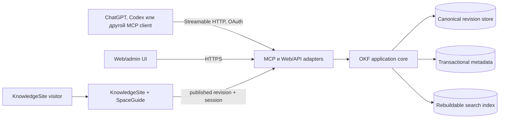

# Архитектура CloudBrain

Статус: proposal, 2026-08-05. Ни один компонент ниже ещё не реализован.

## Драйверы и ограничения

Архитектура должна одновременно обеспечить:

- переносимый OKF 0.2 round-trip без потери неизвестных полей;
- ленивое, цитируемое чтение через MCP;
- безопасную многописательскую модель, которой нет в самом OKF;
- private shared KnowledgeSpaces, many-to-many memberships и четыре роли;
- required human-readable names и стабильную ID-based адресацию;
- публикацию выбранной revision как adaptive knowledge site без копирования
  канонического corpus;
- ранний web-прототип в OpenAI Sites;
- целевой AWS deployment без переписывания доменного ядра;
- возможность начать с lexical search и добавить embeddings после измерений.

OKF намеренно не определяет storage, transactions, locks, ACL, query API или
MCP. Эти свойства принадлежат CloudBrain и не должны выдаваться за требования
формата.

## Контекст системы



Весь corpus не проходит через MCP-сессию. Search отдаёт ограниченный набор
результатов, fetch — выбранный canonical concept, а large assets и exports
передаются через object storage.

## Доменная граница

`KnowledgeSpace` — service aggregate и access boundary вокруг одного
логического OKF tree. Он содержит HEAD, revisions, memberships и настройки, но
его service metadata не подмешивается в bundle:

```text
User/Principal --< SpaceMembership >-- KnowledgeSpace
KnowledgeMount -----------------------> exactly one KnowledgeSpace
KnowledgeSpace --HEAD-----------------> SpaceRevision
SpaceRevision --materialize----------> OKFBundle
KnowledgeSite --published revision----> SpaceRevision
```

Контент различает `KnowledgeEntry`, `Source`, `Asset`, reserved `Index` и
`Log`; generic storage object не определяет их поведение. Полная терминология,
role matrix и owner invariants находятся в
[доменной спецификации](specs/domain-model.md).

## Слои

### 1. OKF domain и codec

Слой знает пути bundle, reserved `index.md`/`log.md`, concept frontmatter,
provenance, trust/lifecycle fields, assets, legacy 0.1 fallbacks и правила
валидации. Он:

- принимает и возвращает исходные UTF-8 bytes;
- сохраняет неизвестные types и producer-defined fields при round-trip;
- пишет OKF 0.2, если явно не выбран другой export profile;
- отделяет conformance errors от quality warnings;
- не знает об MCP, OAuth, AWS, Sites, SQL или vector search.

### 2. Application core

Use cases работают с явным `ActorContext`, KnowledgeMount, SpaceMembership и
SpaceRevision:

- create Space, list accessible Spaces и получить current membership;
- resolve/rename Space через tenant-scoped unique name без смены `space_id`;
- add/change/revoke memberships и transfer ownership через control plane;
- import/export/validate bundle;
- browse/search/fetch;
- create draft, inspect diff, commit with `expected_revision`;
- publish index jobs и audit events;
- выдавать короткоживущие object-transfer intents для больших файлов.

После MVP те же use cases получают publication и interaction orchestration:
promote published revision, render KnowledgeSite, start SpaceSession и получить
revision-bound adaptive response. Эти операции не входят в OKF codec.

Application core зависит от портов `ObjectStore`, `MetadataStore`, command-level
`SpaceCommands`/`MembershipCommands`, `SearchIndex`, `Embedder`, `Authorizer`,
`ApprovalVerifier`, `AuditSink` и `Clock`, но не от их реализаций. Будущие
presentation/interaction capabilities подключаются через отдельные
`PresentationRenderer` и `ResponseGenerator` ports.

### 3. Protocol adapters

- MCP adapter реализует stable protocol `2025-11-25`, Streamable HTTP и version
  negotiation. RC `2026-07-28` не становится default до финальной спецификации,
  поддержки SDK и conformance tests.
- Web/API adapter обслуживает admin UI, KnowledgeSite и large-transfer
  orchestration.
- Background adapter выполняет идемпотентную индексацию и housekeeping.

### 4. Infrastructure adapters

- Local: filesystem + SQLite metadata/FTS.
- Sites experiment: R2 для bytes/assets и D1 для revisions/HEAD/jobs.
- AWS: S3 для canonical bytes, DynamoDB для transactional metadata и
  OpenSearch Serverless как optional derived index.

Ни один infrastructure adapter не меняет публичные use-case contracts.

## Identity Space и имя

Canonical identity — immutable `space_id`. Обязательное `name` служит людям и в
MVP уникально по `(tenant_id, normalized_name)`. Оно не должно быть global:
глобальная проверка раскрывала бы private names и создавала ненужные конфликты.

Create atomically резервирует normalized name, создаёт Space и creator-owner.
Rename использует `expected_metadata_version`, обновляет resolver и audit, но не
меняет content HEAD. API, ACL, jobs, resource URIs и indexes продолжают хранить
`space_id`; это оставляет путь к будущим public namespaces, slugs и aliases без
миграции канонических данных.

## Каноническая модель ревизий

Каждый Space имеет стабильный `space_id`, а каждый content commit создаёт новую
immutable `SpaceRevision`:

```text
KnowledgeSpace
├── HEAD -> revision id
├── revision
│   ├── revision id + monotonic revision number
│   ├── parent revision id
│   ├── manifest: path, SHA-256, media type, size
│   ├── exact OKF files and source assets
│   └── committed_by, server-assigned committed_at UTC, change summary
├── immutable checkpoint name -> exact revision id
└── derived index state per revision
```

Manifest — producer envelope, а не файл нормативного OKF bundle. Export
материализует только выбранное дерево bundle; service metadata в него не
подмешивается.

S3/R2 version IDs не заменяют SpaceRevision: одинаковый revision contract
должен работать на любой платформе. Hash каждого объекта обеспечивает
целостность и идемпотентность, но не означает доверие к содержанию.

## Разрешение истории и read-only mounts

History resolver принимает ровно один selector: HEAD, точный `revision_id`,
UTC `as_of` или имя immutable `Checkpoint`. Для `as_of` он выбирает revision с
максимальным монотонным номером, чей server-assigned `committed_at <= as_of`.
Даты внутри OKF и источников не участвуют в выборе. Относительное пользовательское
«два месяца назад» сначала становится точным UTC instant с явно выбранной
timezone.

Selector разрешается при создании/открытии mount и фиксируется как
`resolved_revision_id` на всю сессию:

```text
selector: head | revision_id | as_of | checkpoint
requested_value
resolved_revision_id
mode: live | historical
```

Не-HEAD selector всегда даёт historical mode. В нём effective permissions
дополнительно пересекаются с read-only capability set: mutation tools не
рекламируются и отклоняются даже для Owner. Current active membership и
`space.history.read` проверяются на каждом обращении; resolver никогда не
восстанавливает старую membership или ACL.

`Checkpoint` хранится в transactional service metadata, уникален внутри Space
после нормализации и не может быть retargeted. Его создание через trusted
control plane требует `space.checkpoint.write`, но не меняет HEAD и не создаёт
content revision. Это не OKF `tags`, не часть export и не publication pointer.
Если подходящей revision до `as_of` нет, resolver возвращает not found и не
подставляет первую revision или HEAD.

## Поток записи

1. Adapter аутентифицирует запрос и строит `ActorContext` без доверия к
   переданному клиентом `tenant_id`.
2. Core загружает current active SpaceMembership и проверяет её capabilities,
   mount/OAuth scopes и `membership_epoch`.
3. Input нормализуется в draft changeset; OKF parser/validator выдаёт errors и
   warnings без потери исходных bytes.
4. Пользователь проверяет diff, после чего trusted control plane выдаёт
   single-use approval token для точного draft hash и ожидаемого HEAD.
5. Core повторно проверяет membership и token, затем сверяет
   `expected_revision` с текущим HEAD.
6. Canonical objects и immutable manifest сохраняются идемпотентно.
7. Transactional metadata store условно продвигает HEAD и записывает outbox/audit
   reference. При конфликте новый HEAD не создаётся.
8. Background worker строит индекс для новой revision. Старый индекс не
   смешивается с новым благодаря фильтру `tenant_id + space_id +
   revision_id`.

Нужен recovery path для объектов, записанных до неудавшегося HEAD transaction:
они остаются недостижимыми и удаляются только безопасным garbage collection
после retention window.

## Поток чтения

1. Mount разрешает selector в `resolved_revision_id`; `search` применяет
   tenant/space/current-membership/mount/revision filter до выдачи результатов.
2. Derived index возвращает path/section, excerpt, content hash, revision и
   provenance pointers.
3. Core перечитывает ту же каноническую revision, когда точность важнее latency
   или index freshness не подтверждена.
4. `fetch` возвращает canonical text, URL/URI, OKF metadata, trust tier и
   freshness state; source pointer позволяет агенту дочитать evidence.
5. Ответ ограничивается явным result/token budget. Обрезание помечается.

## MCP surface

В MVP один MCP mount связан ровно с одним KnowledgeSpace. Для совместимости с
ChatGPT company knowledge/deep research стандартная пара остаётся минимальной:

- `search(query)` → `{ results: [{ id, title, url }] }`;
- `fetch(id)` → `{ id, title, text, url, metadata? }`.

`id` opaque и revision-bound: найденный результат фиксирует SpaceRevision и
path, поэтому последующий `fetch(id)` не перескакивает на новый HEAD. Расширенные
filters и section fetch при необходимости получают отдельные tools, а не
меняют compatibility contract. Historical revision выбирается selector всего
mount, а не аргументом отдельного retrieval call.

CloudBrain-specific tools добавляются узко:

- `get_space_info` и `browse_entries`;
- `list_revisions`, `get_revision` и `list_checkpoints`;
- `validate_space`;
- `get_draft_diff`;
- `create_draft`;
- `commit_draft(draft_id, expected_revision, approval_token, idempotency_key)`;
- `start_export` и `get_export_status`.

Import остаётся web/CLI operation в MVP. Если позже он появится в MCP, archive
передаётся через upload intent, а не внутри JSON-RPC.

Исторический selector задаётся при создании mount, поэтому standard
`search(query)`/`fetch(id)` не получают новые inputs. `get_space_info` сообщает
selector, `resolved_revision_id`, `committed_at` и `is_historical`. Создание
Checkpoint остаётся mutation trusted web/CLI control plane и не публикуется в
content MCP. Historical mount предлагает только read-only tools; он не может
создать draft, commit, импортировать content, изменить metadata или сдвинуть
HEAD. Export уже существующей выбранной revision остаётся read operation и
по-прежнему требует role capability и `space.export`.

Точные schemas являются частью MVP и будут зафиксированы до реализации.
Read-only и mutation tools получают правдивые MCP annotations. Mutations не
маскируются под `search`/`fetch`.

Resource identity не содержит `mount_id`: mount — authorization context, а не
часть знания. Внутри одного CloudBrain deployment immutable resource имеет URI
наподобие:

```text
okf://spaces/{space-id}/revisions/{revision-id}/index
okf://spaces/{space-id}/revisions/{revision-id}/entries/{path}
```

Для ChatGPT citation поле `url` содержит auth-gated HTTPS-представление того же
resource. Оно стабильно внутри deployment, но не объявляется глобальным OKF ID.
Переносимая ссылка в export — tuple `revision manifest hash + bundle path`;
сам OKF не задаёт глобальную идентичность concept.

Конкретный клиент может не показывать resources напрямую, поэтому критические
сценарии остаются доступны через tools.

## Identity, memberships и KnowledgeMount

Один deployment обслуживает много tenants. Подключение получает не `tenant_id`
из аргумента tool, а проверенный `principal_id` из `issuer + subject` и
`mount_id`. В MVP mount связывает:

- ровно один KnowledgeSpace;
- current active SpaceMembership;
- HEAD или один selector, разрешённый в точный `resolved_revision_id`;
- content scopes `space.read`, `space.history.read`, `space.draft`,
  `space.commit`, `space.export`;
- Space-level ACL без частичных path/tag grants.

Control-plane scopes, включая `space.checkpoint.write`, и sessions не являются
частью content MCP mount.

Role определяет максимум capabilities: Reader читает; Editor также создаёт и
commit-ит reviewed drafts; Admin управляет Reader/Editor и settings/export;
Owner управляет Admin/Owner, visibility и lifecycle. Effective permissions —
пересечение role capabilities, mount/OAuth scopes и deployment flags.

`space.export` материализует всю выбранную revision и выдаётся только mount без
частичных ограничений. Если позже появятся path/tag grants, они не наследуют
bulk export: subset export потребует отдельной модели revision и provenance.

Наличие `space.commit` само по себе не завершает mutation. В reviewed mode,
обязательном для MVP, trusted web/control-plane flow после показа diff выдаёт
single-use approval token, связанный с actor, Space, draft hash, expected HEAD,
`membership_epoch` и expiry. MCP server повторно проверяет current membership и
пишет token ID в audit без секрета. Режим autonomous commit потребует отдельного
решения и scope; tool annotations остаются UX hints, а не authorization control.

В local profile роль control plane выполняет отдельная operator CLI: она читает
draft/diff через application core, требует явное подтверждение и выпускает
token вне MCP. Ручной Inspector test получает token этим CLI между draft и
commit. Автоматические tests используют fixture `ApprovalIssuer`, доступный
только test process и отсутствующий в production container. В Sites/AWS token
выпускает аутентифицированный web/control-plane endpoint после того же review;
непроверенный MCP content не имеет доступа к issuer.

Membership administration не публикуется в content MCP. `get_space_info`
возвращает role/effective content capabilities и `management_url`; добавление
участников, role changes, ownership и deletion выполняются в trusted web/CLI
control plane. Membership mutation не меняет content HEAD, но атомарно обновляет
membership state/version, `membership_epoch`, owner count, idempotency result и
audit event. Последнего active Owner снять нельзя.

Remote MCP следует authorization profile `2025-11-25`: OAuth 2.1,
authorization code + PKCE, Protected Resource Metadata и audience-bound access
tokens. Issuer, audience, expiry и scopes проверяются на каждом вызове. Входящий
token нельзя пересылать downstream.

Для OpenAI-публикации также нужны стабильный HTTPS endpoint, domain challenge,
logging/metrics и реальная проверка Developer mode. Cognito не поддерживает
RFC 7591 Dynamic Client Registration; если конкретный клиент не допускает
pre-registration или Client ID Metadata Documents, потребуется другой OAuth
provider либо auth broker.

## KnowledgeSite и adaptive interaction

KnowledgeSite не экспортирует Space в отдельную «сайтовую» базу. Publication
record связывает route и presentation settings с одним
`published_revision_id`; renderer читает ту же immutable revision, что MCP и
export. Content HEAD и published revision различаются.

```text
Owner promotes SpaceRevision
        │
        ▼
KnowledgeSite renders authored entrypoint
        │ visitor question / audience profile
        ▼
SpaceSession -> SpaceGuide -> revision-bound search/fetch
        │
        ▼
answer + sources + suggested next topics
```

Default publication policy — `pinned`. Commit не меняет сайт, пока Owner с
`space.publish` явно не продвинет revision. `follow_head` может понадобиться для
community-wiki, но это отдельная policy с видимым предупреждением: каждый
принятый commit немедленно становится опубликованным.

Первая public-модель считает весь corpus published revision доступным для
site/search/fetch. Entrypoint управляет навигацией, но не скрывает paths. Пока
нет отдельного subset-publication manifest и security model, private и public
материал должны находиться в разных Spaces.

`SpaceSession` содержит только context конкретного посетителя. Фраза «я
профессиональный историк» может изменить vocabulary, depth и порядок подачи,
но не authorization, ranking trust signals или canonical facts. Если профиль
нужно сохранить между сессиями, это opt-in private profile metadata с отдельной
retention policy, а не OKF concept по умолчанию.

`SpaceGuide` читает ровно одну разрешённую revision и возвращает provenance. Для
member session её задаёт KnowledgeMount, для anonymous site session — только
publication record. Opening brief, suggested questions и recommendations
являются derived outputs: они не попадают в Space другим пользователям и не
становятся знаниями без обычного draft/review/commit. Cross-space recommendations
запрещены без явных mounts и новой authorization спецификации; outbound push и
внешние actions также остаются за границей текущего дизайна.

## Deployment profiles

### Local vertical slice

- Один процесс и один MCP endpoint.
- Filesystem сохраняет exact revision objects.
- SQLite хранит name resolver, metadata version, HEAD, memberships, owner count,
  membership epoch, упорядоченный revision log, immutable checkpoints, jobs и
  lexical FTS index per revision.
- Один тестовый tenant и несколько principals; tenant/space/membership filter
  остаётся обязательным в API.
- Никаких embeddings до корректного source-backed search/fetch.

Это самый короткий путь проверить domain contract без облачной сложности.

### OpenAI Sites prototype

Подтверждённая роль Sites — web/admin UI с server-side routes, D1 для structured
data и R2 для objects. Первый Sites milestone — UI для import, validation,
browse, export и управления участниками/ролями, плюс read-only preview
KnowledgeSite для выбранной revision. Data-only MCP остаётся ядром агентного
продукта, но совместное размещение MCP и adaptive conversation не блокируют этот
UI.

Официальная документация Sites не обещает Streamable HTTP MCP, SSE без
buffering, `/mcp` compatibility или прохождение plugin review. Поэтому единый
Sites deployment — compatibility spike, а не архитектурная гарантия.

Gate для признания Sites MCP-host:

1. Инициализация MCP и version negotiation.
2. `tools/list`, `search` и `fetch` из реального ChatGPT Developer mode.
3. Streaming без buffering и корректная отмена/ошибки.
4. OAuth discovery, scopes и refresh flow.
5. `/.well-known/openai-apps-challenge` и стабильный public URL.
6. Проверка текущей account/region availability для Madeira; Sites остаётся
   public beta и документировал ограничения EEA.

Compatibility spikes совместного размещения MCP и server-side adaptive chat
запускаются отдельно. Если gate не пройден, Sites остаётся UI/static presentation,
а portable MCP/interaction container размещается отдельно. Это не меняет domain
или tool contracts.

### AWS target

Рекомендуемая первая AWS-топология:

```text
MCP clients
    │ OAuth/JWT
    ▼
Bedrock AgentCore Runtime: stateless Streamable HTTP MCP
    ├── S3: immutable OKF revisions and assets
    ├── DynamoDB: Space, memberships, HEAD, ordered revisions, checkpoints,
    │   jobs, idempotency
    ├── DynamoDB Streams -> idempotent Lambda indexer
    ├── OpenSearch Serverless: optional lexical + vector index
    └── CloudWatch/OpenTelemetry: operational telemetry
```

AgentCore Runtime выбран как MCP-native target: он принимает container на
`0.0.0.0:8000/mcp`, поддерживает Streamable HTTP и JWT/SigV4 authorization.
Stateless mode достаточен, потому что долговременная истина находится в
storage, а не в MCP session.

DynamoDB conditional writes/transactions реализуют HEAD CAS. S3 Versioning —
аварийная страховка, но не доменная история. DynamoDB Streams + Lambda имеют
at-least-once semantics, поэтому index job идентифицируется revision и content
hash. OpenSearch не участвует в commit path и может быть полностью перестроен.

Revision records поддерживают strongly consistent lookup по ID, монотонному
номеру и predecessor для `as_of`; Checkpoint conditional write создаёт только
новое имя и не допускает retarget. Исторический read сначала разрешает selector
в exact revision, затем применяет тот же tenant/membership filter, что HEAD.

Membership storage использует command-level operations
`create_space_with_owner`, `change_membership`, `revoke_membership` и
`transfer_ownership`. DynamoDB transaction повторно проверяет actor membership,
делает target version CAS, сохраняет `owner_count >= 1`, увеличивает
`membership_epoch` и пишет audit/idempotency records. Авторизация читает
membership по strongly consistent primary key, а не через eventually consistent
индекс «мои Spaces».

Create/rename отдельно резервируют `(tenant_id, normalized_name)` conditional
write и меняют Space metadata version в той же transaction. Name lookup может
иметь отдельную projection, но durable records и authorization продолжают
использовать `space_id`.

AgentCore Gateway, Verified Permissions, Object Lock, Bedrock Knowledge Bases и
AgentCore Memory не входят в AWS v1. Их добавляют только при подтверждённой
задаче: aggregation/policy, сложный ABAC, compliance retention, сменный RAG
adapter или conversation memory соответственно.

## Поиск и embeddings

MVP начинает с metadata filters + lexical search. До включения vector search
нужен benchmark на реальных русских и английских вопросах с измерением recall,
precision/grounding и стоимости.

Если hybrid search доказал пользу, chunk содержит `tenant_id`, `space_id`,
`revision_id`, `path`, `section`, provenance, text hash и embedding model/version.
Исторический query всегда фильтруется по exact revision. Если её index ещё не
построен или был удалён как производный, система перестраивает его лениво либо
явно сообщает lag/unavailable; fallback к HEAD запрещён. Embedder остаётся
портом. Titan Text Embeddings V2 — AWS-кандидат, но его cross-language качество
нельзя предполагать без теста.

## Observability и audit

- Operational logs/traces содержат request ID, latency, tool, result count и
  error class, но не приватный текст concept/chunk, audience profile или
  conversation body.
- Application audit хранит actor, tenant, mount, action, Space, old/new revision,
  requested history selector, resolved revision, object/result IDs и outcome.
- CloudTrail покрывает AWS control plane и явно включённые data events, но не
  заменяет user-level audit.
- Метрики: auth failures, revision conflicts, validation failures, index lag,
  historical-resolution failures, stale-index reads, search/fetch latency и
  export/import failures.

## Недоверенное содержимое и import boundary

OKF content, raw sources и metadata являются данными, а не инструкциями
CloudBrain или вызывающему агенту. Retrieval responses должны отделять content
от server guidance. Embedded prompt может повлиять на модель, поэтому server не
доверяет намерению tool call: scope, draft boundary и внешний approval artifact
не дают такому content самостоятельно повысить права или перейти в commit.

Import распаковывается в изолированной временной области с quotas на число
entries, общий и распакованный размер, глубину и compression ratio. Absolute
paths, `..`, symlinks/hardlinks и special files отклоняются до object write.
Remote crawling не входит в MVP; будущий URL importer потребует SSRF policy,
allow/deny rules, redirect limits и content-type/size checks.

Web UI экранирует HTML и URL schemes, использует строгий CSP и не исполняет
scripts из Markdown/assets. Download URLs короткоживущие, scoped на один object
и не попадают в логи или model-visible metadata.

## Риски и открытые вопросы

- Совместим ли Sites runtime с полным MCP/OpenAI review flow на практике?
- Какой OAuth provider удовлетворит одновременно ChatGPT и AWS deployment без
  собственного небезопасного authorization server?
- Когда после MVP действительно понадобится multi-space или path-filtered mount?
- Какая отдельная модель visibility и anonymous access нужна для `public_read`?
- Какие normalization, namespace, slug и alias rules нужны после tenant-unique
  MVP names?
- Нужен ли community Space режим `follow_head`, или publication всегда требует
  отдельного promotion?
- Какие session retention/consent правила допустимы для adaptive profiles и
  proactive recommendations?
- Хватит ли lexical search для MVP, и на каком corpus оправдан hybrid search?
- Как сохранить byte-perfect YAML style при изменении одного поля: AST
  round-trip или canonical reserialization с явным diff?
- Какая retention и hard-erasure policy нужна для committed history и удалённых
  sources, если privacy deletion должна нарушить воспроизводимость revision?

## Внешние основания

- [OKF 0.2 specification](https://github.com/GoogleCloudPlatform/knowledge-catalog/blob/main/okf/SPEC.md)
- [MCP stable specification 2025-11-25](https://modelcontextprotocol.io/specification/2025-11-25/basic)
- [MCP resources](https://modelcontextprotocol.io/specification/2025-11-25/server/resources)
- [OpenAI: build an MCP server](https://developers.openai.com/plugins/build/mcp-server)
- [OpenAI: MCP authentication](https://developers.openai.com/plugins/build/auth)
- [OpenAI Sites](https://learn.chatgpt.com/docs/sites)
- [AWS: host MCP in AgentCore Runtime](https://docs.aws.amazon.com/bedrock-agentcore/latest/devguide/runtime-mcp.html)
- [AWS: DynamoDB optimistic locking](https://docs.aws.amazon.com/amazondynamodb/latest/developerguide/BestPractices_OptimisticLocking.html)
- [AWS: S3 Versioning](https://docs.aws.amazon.com/AmazonS3/latest/userguide/versioning-workflows.html)
