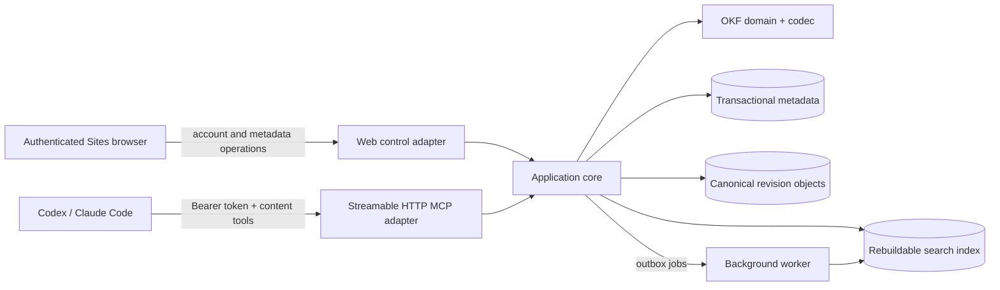
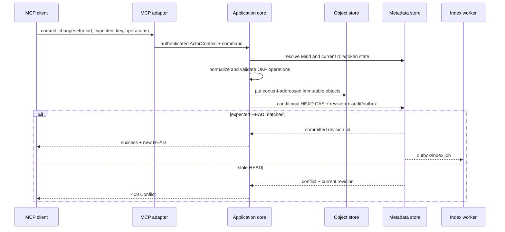

# Архитектура Mind Diary

Статус: proposal, 2026-08-05. Документ описывает целевую форму первого
прототипа; components, schemas, tests и deployment ещё не реализованы.

## Драйверы и ограничения

Архитектура должна поддержать одновременно:

- authenticated Sites account и автоматически созданный Personal Mind;
- ordinary Minds с single Owner, invitations, roles и visibility;
- user-scoped MCP для Codex/Claude Code без загрузки всего corpus;
- individual-file OKF access и переносимый full-bundle import/export;
- immediate multi-file commits с immutable history и optimistic concurrency;
- public/unlisted live-HEAD reads только для authenticated users;
- ранний Sites prototype и переносимый AWS target без AWS SDK в domain core;
- возможность bounded PersonalContext без передачи личного corpus target Mind.

OKF не определяет transactions, locks, ACL, revisions, query API или MCP. Эти
свойства принадлежат Mind Diary.

## Контекст системы



Web и MCP являются двумя adapters над общей application boundary. «Internal
REST» — логический contract use cases, а не обязательно отдельная сеть в первом
deployment. Raw content API не открыт browser/customer; внешней network surface
для corpus является authenticated MCP endpoint.

## Доменная граница

```text
Principal --exactly one-------------> Personal Mind
Principal --< SpaceMembership >------ Ordinary Mind
Principal --< SpaceInvitation >------ Ordinary Mind
Principal --< MCP access token
KnowledgeSpace --HEAD/history-------> SpaceRevision
SpaceRevision --materialize---------> OKFBundle
```

`KnowledgeSpace` — service aggregate и access boundary. `OKFBundle` содержит
только canonical files/assets одной revision; account, handle, ACL,
invitations, tokens, idempotency results, audit и indexes — service metadata.

Personal Mind использует тот же content/revision schema, но application commands
обеспечивают его sole-owner/private/non-shareable invariants и route `/me`.

## Слои

### 1. OKF domain и codec

Слой знает bundle paths, reserved `index.md`/`log.md`, frontmatter, provenance,
trust/lifecycle fields, assets, legacy fallbacks и validation. Он:

- принимает и возвращает исходные UTF-8 bytes;
- сохраняет неизвестные types/fields при round-trip;
- по умолчанию пишет OKF 0.2;
- разделяет conformance errors и quality warnings;
- не знает об MCP, HTTP, auth, Sites, AWS SDK, SQL или search engine.

### 2. Application core

Use cases получают trusted `ActorContext` от adapter и работают через узкие
ports:

- account bootstrap/delete и resolve `/me`;
- create/list/resolve/rename/delete Mind;
- invitations, membership roles и ownership transfer;
- visibility и public catalog;
- token issue/revoke/authenticate;
- import/export/validate bundle;
- browse/search/fetch/history/checkpoints;
- atomic `commit_changeset`;
- optional bounded PersonalContext/SpaceLanding;
- outbox/index jobs и audit.

Core зависит от `MetadataStore`, `ObjectStore`, `SearchIndex`, `Authorizer`,
`TokenHasher`, `AuditSink`, `Clock` и optional `PersonalContextProvider`, но не
от concrete adapters.

### 3. Protocol adapters

- **Web adapter** принимает Sites identity context и обслуживает control-plane
  pages/commands. Raw OKF file editing не входит в browser UI.
- **MCP adapter** предоставляет user-scoped content tools через Streamable HTTP.
  Целевой protocol profile — current stable `2026-07-28`; legacy
  `2025-11-25` изолируется только для конкретного проверенного client.
- **Background adapter** выполняет идемпотентную индексацию, outbox delivery и
  safe garbage collection incomplete/unreachable objects.

### 4. Infrastructure adapters

- Local: filesystem/object directory, SQLite transactional metadata/FTS.
- Sites experiment: D1 metadata и R2 canonical bytes/assets, если runtime и
  binding support подтверждены live test.
- AWS target: S3 canonical objects, DynamoDB transactional metadata/outbox и
  optional OpenSearch Serverless derived index.

## Identity и authentication

### Sites account

Web adapter принимает только platform-verified identity context. Первый
prototype создаёт свой opaque immutable `principal_id` и binding к verified
external identity. Email/display name не передаются клиентом как authority.

Документация Sites сейчас описывает verified email header и optional full-name
header, но не обещает стабильный external subject. Поэтому смена email,
account relink и collision policy — обязательный implementation spike; нельзя
молча использовать mutable email как durable primary key.

Account bootstrap transaction создаёт principal, Personal Mind и owner binding.
Retry использует external-binding idempotency и возвращает существующий account.

### MCP personal access tokens

Personal token выбран как минимальный безопасный механизм первого прототипа:

```text
token_id
principal_id
name
secret_hash
display_prefix
scopes: content:read, content:write
created_at
expires_at           # default 90 days
last_used_at?
revoked_at?
```

Secret содержит не менее 256 random bits, показывается один раз и передаётся
как `Authorization: Bearer`. Сервер сравнивает hash constant-time, проверяет
expiry/revocation, строит `ActorContext` и затем на каждом tool call заново
проверяет current Mind access. Token bound к principal, не Mind. Он не даёт
control-plane capabilities и не логируется.

Codex configuration использует `bearer_token_env_var`. Для Claude Code и других
clients support объявляется только после conformance test. OAuth 2.1 + PKCE и
authorization-server metadata остаются target для production/public plugin, но
не нужны для personal prototype.

## Mind identity, `/me` и visibility

Обычный Mind хранит immutable `space_id`, immutable в prototype
`space_handle`, derived `normalized_handle`, mutable `name` и
`metadata_version`. Create atomically резервирует host-scoped handle и создаёт
sole Owner. Router разрешает handle в ID до metadata/object read.

`/me` — reserved route, разрешаемый только из authenticated `principal_id` в
`personal_space_id`. Скрытый service handle Personal Mind не является
user-facing URL. Rename principal display name меняет Personal Mind name через
metadata CAS, но не content HEAD.

Authorization query возвращает одно из:

```text
denied
membership(role)
baseline_reader(visibility: public | unlisted)
```

`private` разрешает только membership. `unlisted` даёт authenticated baseline
Reader после exact handle resolve, `public` — также через catalog. Baseline
grant не создаёт membership. Owner-only visibility mutation увеличивает
metadata/access epoch; перевод в private сразу инвалидирует caches и будущие
reads non-members.

## Membership, invitations и ownership

Commands используют version CAS и idempotency, а не generic CRUD:

```text
create_space_with_owner(name, handle)
create_invitation(target_principal, role)
accept_invitation(invitation_id)
reject_or_cancel_invitation(invitation_id)
change_membership_role
revoke_membership
leave_space
transfer_ownership(target_active_participant)
change_visibility
delete_space
```

Storage transaction проверяет actor capability, target state/version,
single-owner invariant, пишет state + audit event и возвращает idempotency
result. Transfer меняет target на Owner и source на Admin в одной transaction.
Invitation acceptance создаёт membership только если invitation pending,
unexpired и target совпадает с authenticated principal.

Personal Mind не использует ordinary membership/invitation commands после
bootstrap. Его delete разрешён только account-deletion transaction.

## Каноническая модель revisions

```text
KnowledgeSpace
├── HEAD -> revision_id
├── SpaceRevision
│   ├── revision_id + monotonic revision_number
│   ├── parent_revision_id
│   ├── manifest: path, SHA-256, media_type, size
│   ├── exact OKF files and source assets
│   └── committed_by, committed_at UTC, summary
├── Checkpoint name -> exact revision_id
└── derived index state per revision
```

Manifest — service envelope, не нормативный OKF file. Export материализует
только выбранное дерево. Object-store version IDs не заменяют domain revision.

History resolver принимает HEAD, exact ID, UTC `as_of` или Checkpoint. Non-HEAD
selector фиксирует `resolved_revision_id` и принудительно read-only. Каждый read
проверяет current membership/baseline grant и token scope. Checkpoint immutable,
не является OKF tag или publication pointer.

## Поток content write



Отдельного persisted draft, diff approval и approval token нет. Authorization
проверяется до validation/object read и повторно внутри transactional boundary,
если adapter/storage допускает race. Objects, записанные до неудачного HEAD CAS,
недостижимы и удаляются только bounded garbage collection после safety window.

Multi-file changeset all-or-nothing. `index.md` обновляется explicit replace
under HEAD CAS; automatic merge отложен. `add_log_entry` парсит canonical
`log.md`, вставляет событие в newest-first/date-grouped позицию и снова
валидирует файл. Idempotency result предотвращает duplicate revision/log entry.

## Поток content read

1. MCP adapter аутентифицирует token и получает `principal_id`.
2. Explicit Mind selector разрешается в `space_id`; `/me` разрешается только
   через actor.
3. Authorizer проверяет current membership или visibility grant.
4. Revision selector разрешается в exact `revision_id`.
5. Browse/search применяет `space_id + revision_id` filter до выдачи результатов.
6. `fetch` перечитывает canonical object той же revision и возвращает
   provenance/freshness.
7. Ответ ограничивается budget; truncation обозначается явно.

Index для каждой revision derived и rebuildable. При отсутствии/lag historical
index browse/fetch остаются доступны, а search ждёт rebuild или честно сообщает
unavailable; fallback на HEAD запрещён.

## MCP surface и multi-Mind boundary

Один connection видит allowed universe principal, но не смешивает corpus:

```text
list_minds -> /me + memberships + public catalog
resolve_mind(exact unlisted handle) -> one authorized descriptor
content_tool(mind, revision?, ...) -> exactly one resolved space_id
```

Opaque search result ID фиксирует `space_id + revision_id + path`, поэтому
subsequent `fetch(id)` не перескакивает на новую HEAD. MCP не принимает
client-supplied tenant, role или principal. Private/unlisted enumeration
защищена: unlisted не попадает в list без membership, private denied response не
раскрывает metadata.

Content MCP не содержит invitation, membership, visibility, ownership, deletion
или token-management tools. Corpus считается недоверенным и не может инициировать
эти operations. Tool annotations — UX metadata, а не security boundary.

## Sites control plane и internal API

Sites обслуживает только authenticated metadata workflows: account, `/me`, Mind
list/create/rename, catalog, visibility, invitations, roles, transfer, deletion
и personal tokens. Работа с OKF files происходит через MCP; browser может
показывать лишь status/metadata, необходимые для управления.

Первый deployment предпочтительно содержит Web adapter, MCP adapter и core в
одном portable application, если Sites runtime действительно поддержит
Streamable HTTP semantics. Внутренние use-case routes при этом не публикуются.
Если нужен split deployment, Web/MCP вызывают service-authenticated internal
REST, не прокидывая user bearer token downstream.

## Personalization boundary

После target authorization `PersonalContextProvider` может по отдельному
`personal.context.read` разрешить exact revision собственного Personal Mind и
вернуть server-filtered profile. Target content не формирует personal query,
не выбирает fields и не расширяет scope. Derived landing приватен principal и
не кэшируется как shared response.

Этот use case не меняет правило content MCP: каждый обычный tool call имеет один
explicit target Mind. General cross-Mind search/synthesis требует новой
спецификации и provenance/access checks для каждого corpus.

## Deployment profiles

### Local vertical slice

- Один portable process с Web/API и MCP adapters.
- SQLite хранит principals, external bindings, handles, Personal Mind binding,
  memberships, invitations, tokens, revisions, HEAD, idempotency, audit/outbox
  и FTS index.
- Filesystem/object directory хранит content-addressed canonical objects.
- Integration suite проверяет account, roles/visibility, history, concurrent
  commits, import/export и MCP lifecycle.

### OpenAI Sites prototype

- Sites — подтверждённый host web/admin UI с Sign in with ChatGPT.
- D1/R2 используются только после проверки bindings, quotas и atomicity нужных
  operations.
- Streamable HTTP MCP в том же Sites deployment остаётся compatibility
  experiment, а не подтверждённой возможностью.
- Gate включает real Codex/Claude clients, stable HTTPS endpoint, streaming,
  bearer forwarding/configuration, protocol lifecycle и persistence across
  deployments.
- При провале gate MCP запускается отдельным portable container, Sites остаётся
  control UI.

### AWS target

- Portable container в Bedrock AgentCore Runtime.
- S3 для canonical objects; DynamoDB conditional writes для HEAD, metadata,
  invitations, tokens metadata и outbox.
- Optional OpenSearch Serverless только как derived index после benchmark.
- IAM least privilege, private service access, OTEL/CloudWatch без content body.
- Тот же domain/integration suite, что local profile.

## Observability и audit

Metrics: request latency/errors, auth failures, CAS conflicts, index lag,
invitation outcomes, token issuance/revocation и deletion counts. Logs/traces не
содержат concept/source bodies, PersonalContext, raw email where avoidable,
token secret/hash, presigned URL или private search query.

Каждая account, ownership, membership, visibility, deletion и successful
content commit operation создаёт audit event с opaque actor/subject IDs, target
`space_id`, request/idempotency ID, outcome и safe metadata. OKF `log.md` не
заменяет audit log.

## Недоверенное content и import boundary

- ACL разрешается до object/index read.
- Concept/source text не является system instruction и не расширяет tools или
  scopes.
- Import блокирует path traversal, absolute paths, symlinks, decompression
  bombs, invalid encoding и quota overflow.
- Web renderer не исполняет embedded HTML/script без isolation/sanitization.
- Большие bytes передаются через short-lived object intents.

## Риски и открытые вопросы

- Какой stable external identifier даст Sites для account relink помимо email?
- Пройдёт ли Sites реальный Streamable HTTP MCP gate или потребуется отдельный
  runtime?
- Какой exact token hash/KDF и lookup strategy дают приемлемую latency без
  хранения recoverable secrets?
- Как реализовать immediate full deletion и доказать удаление replicated/index
  data до появления production retention model?
- Нужны ли позже soft delete/recovery и что делать с collaborators owned Mind
  при account deletion?
- Когда сложности конфликтов оправдают structured index merge вместо current
  HEAD CAS/retry?
- Какие personal categories и consent model допустимы для personalization?

## Внешние основания

Актуальные проверенные platform facts и primary links собраны в
[отчёте о платформенных предпосылках](reports/2026-08-05-platform-status.md).
Состояние OKF и ограничения multi-writer extension — в
[отчёте о формате](reports/2026-08-05-okf-status.md).
