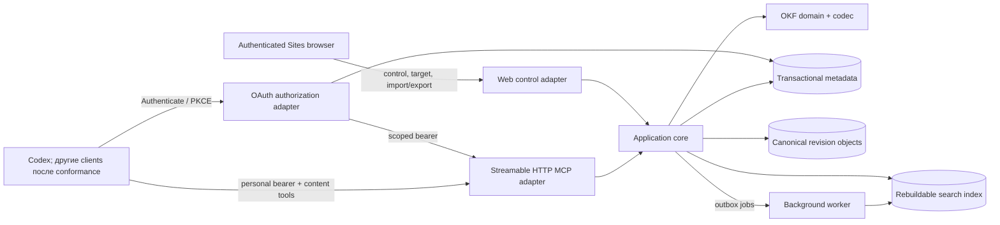

# Архитектура Mind Diary

> **Принятая целевая поправка ADR-0025, 2026-09-05; ещё не реализована.**
> `usage_mode` определяет разрешённые действия, description — темы.
> Personal `/me` получает опциональное description, настраиваемое через узкую
> MCP metadata operation по прямой просьбе пользователя без изменения mode/scopes.
> Без description Personal читается/изменяется только по прямой просьбе;
> с description используется автоматически по теме в пределах `read | read_write`.
> Один ordinary writable Mind и Personal независимы; при совпадении обоих
> descriptions выполняются отдельные reads/commits, без фоновой синхронизации
> и неявного раскрытия Personal в shared Mind. Полный контракт —
> [режимы использования Mind](specs/mind-usage-modes.md). Historical sections ниже не
> переопределяют этот target и не доказывают его реализацию.

Статус: proposal, обновлено 2026-08-27. Product Site components, adapters,
route migration и isolated Codex bridge реализованы и развёрнуты как
single-principal UAT в OpenAI Sites. Authenticated web/control,
persistence-after-redeploy,
raw modern discovery и оба профиля `codex-cli 0.147.0` проверены live. OAuth
adapter реализован в repository candidate. Для Codex Desktop/CLI pilot 0.1
принят direct MCP package с OAuth при первом использовании; fresh external-
account install/OAuth lifecycle остаётся непроверенным на final candidate.
Synthetic multi-principal и automated OAuth/package gates по ADR-0012 остаются
blocking, а ADR-0019 дополнительно требует один blocking real-account
first-user UAT receipt.

ADR-0015 сохраняет immutable/staged versioned `BundleFile` architecture.
ADR-0021 принимает для Release 0.2 manifest v4, arbitrary opaque files,
open advisory media и 256 MiB streaming. Текущий core/UAT остаётся legacy
manifest v1/v2/v3 + raster/PDF/ZIP + 64 MiB baseline; MD-304 владеет runtime
replacement. Native MCP ingress, exact-revision list/download, Markdown
references и dual export имеют local legacy evidence, но не доказывают
format-neutral candidate или real-client UAT.
MD-305 не меняет core object/BundleFile storage: его repository candidate
поверх MD-304 добавляет hosted one-use upload-intent service и HTTP/MCP
composition для local companion и `workspace/generated_artifact` sources.

ADR-0016 сохраняет следующую post-MVP Sites storage boundary:
Space-scoped R2 objects + separately digested v3 manifests, D1 HEAD/reachability/
ledger/reservations, delta-aware commits и bounded Markdown import. MD-265
реализует Space-scoped objects/manifests, delta-aware commit/read/GC и legacy
v1/v2 dual read в текущем repository candidate. Reconstructable accounting,
durable reservations, admission/fairness, cleanup и privacy-safe usage surfaces
из MD-266 также реализованы. MD-268 реализует в текущем repository candidate
streaming deterministic export/download и D1-checkpointed bounded R2 cleanup;
MD-267 реализует в local candidate resumable Sites UI/REST Markdown import с
durable stage/validation/promotion checkpoints и одним exact HEAD CAS. UAT
evidence для всего extension отсутствует, но не блокирует Release 0.1.

MD-271 принимает единый post-MVP [file-ingress contract](specs/file-ingress.md) поверх
этой BundleFile boundary. Шесть source kinds проходят через adapter-owned
transport и application-owned byte verification. В текущем candidate
`session_attachment`, bounded-inline и server-generated stream имеют local
implementation; MD-272 добавляет repository-local companion для `local_path`,
`workspace/generated_artifact` и bounded local bytes. Исторический MD-250
закрыт без Release 0.2 promotion. MD-304 владеет format-neutral core stage →
commit → download/export и object lifecycle; MD-305 владеет только hosted
one-use upload-intent/metadata/composition для local/workspace sources поверх
этого core. MD-322 добавляет constructor-owned внутренний
`serverGeneratedIngress` к hosted composition: trusted producer передаёт
cancellable bounded stream напрямую в MD-304 `stageStream`, без полного
буфера, HTTP/MCP exposure или capability advertisement. Exact safe
media/size/SHA receipt сначала проходит producer-free reconcile в
namespace точного credential owner + active target generation + Space, поэтому
uncertain retry не повторяет generation/upload. Owner и generation выводятся
только из trusted actor/current server state и не принимаются входом порта;
generation и target-version stamp повторно проверяются внутри staging
transaction, поэтому clear/switch/revoke race не перенаправляет bytes.
Ожидаемый MIME заранее нормализуется до
канонической основы; несовпадение с распознанным типом останавливает операцию
до публикации временного объекта и фиксации idempotency outcome, а временный
поток записи и резерв квоты очищаются без скрытого staged-состояния.
Joined native-client
UAT принадлежит MD-275, а late-UAT producer proof — MD-290. Connector и
generated paths не являются автоматически доступными или fallback capability.

Repository candidate MD-290 добавляет отдельную restricted-UAT test
composition, а не product capability. Product Worker передаёт constructor
option только при exact `MIND_DIARY_DEPLOYMENT_CLASS=uat`,
`MIND_DIARY_DEPLOYMENT_POSTURE=restricted-uat` и 40-hex
`MIND_DIARY_RELEASE_CANDIDATE_SHA`; иначе скрытый
`/api/internal/uat/generated-sources` не устанавливается. Authenticated `GET`
возвращает только candidate SHA и test-composition rows, а same-origin,
CSRF-protected `POST` принимает ровно `action=run_matrix`, actor-owned
`personal_token_ref` и bounded `run_id`. Dedicated token должен иметь exact
name `UAT Generated Sources`, effective `content:write`, срок не более восьми
суток и current target на fresh private sole-owner ordinary Mind. Bytes, path,
URL, Mind, owner, generation и способ generation caller не передаёт: runtime
сам создаёт deterministic 4 MiB/stream fixtures и выполняет fixed matrix.
Public MCP rows для `bounded_in_memory`/`server_generated` остаются
`not_available`; distinct redeploy, exact-byte read-back, revoke и cleanup —
отдельные terminal UAT observations, не эффекты этого route.

## Драйверы и ограничения

Архитектура должна поддержать одновременно:

- authenticated Sites account и автоматически созданный Personal Mind;
- ordinary Minds с single Owner, invitations, roles и visibility;
- user-scoped MCP для Codex без загрузки всего corpus; другие clients, включая
  Claude Code, требуют отдельного adapter/client conformance evidence;
- individual-file UTF-8 Markdown/OKF 0.2 access и deterministic export в 0.1;
- format-neutral opaque BundleFile up to 256 MiB is an accepted Release 0.2
  target; current implementation status remains separate;
- immediate multi-file commits с immutable history и optimistic concurrency;
- public/unlisted live-HEAD reads только для authenticated users;
- Sites-only MVP UAT и post-MVP AWS portability без AWS SDK в domain
  core;
- future path к bounded PersonalContext без передачи личного corpus target
  Mind.

OKF не определяет transactions, locks, ACL, revisions, query API или MCP. Эти
свойства принадлежат Mind Diary.

## Целевая authority boundary Release 0.3

Release 0.3 принимает product boundary до изменения runtime:

| Inbound surface | Владеет | Не владеет |
|---|---|---|
| Authenticated Sites Web | account/Mind metadata и lifecycle, visibility, memberships/ownership, Connections, writable-target selection, tokens, import/export orchestration и административные destructive actions | raw content browse/search/editor и model-driven content commit |
| Content MCP | discovery, explicit-Mind browse/search/fetch/history/standalone validation и ordinary atomic commit в server-approved exact writable target | account/Mind/Connection/token control, writable-target mutation, import/export administration и whole-account/whole-Mind deletion |

MCP read path в target architecture не требует mutable read-attachment state:
explicit Mind/revision selector и current ACL/visibility/scope достаточно.
Перед ACL-derived discovery и read application проверяет credential profile:
только fresh/upgraded profile продолжает операцию, а pending legacy profile
fail closed с versioned `credential_access_upgrade_required` без Mind metadata.
Site-selected writable target остаётся дополнительным server-side fence для
commit. Replace/delete files внутри такого commit — versioned content
semantics, а не control-plane access. Exact operation disposition принадлежит
MD-337; representation, migration и compatibility existing bindings приняты в
[MD-339 contract](specs/credential-write-target.md).

Import-specific validation и финальная публикация import revision являются
внутренними этапами одной Site-owned import operation, а не вторыми
standalone-validation или ordinary content-commit surfaces. Shared application
policies и HEAD CAS не меняют inbound authority.

Diagram ниже описывает реализованный локальный Release 0.3 target boundary;
hosted UAT evidence exact candidate остаётся отдельным release gate.
Historical Release 0.1/0.2 binding flows сохранены как evidence. MD-336 не
выбирает новые routes, schemas, persistence, UI, description semantics,
website AI, anonymous publication, token redesign или production/AWS topology.

## Контекст системы



Web и MCP являются двумя adapters над общей application boundary. «Internal
REST» — логический contract use cases, а не обязательно отдельная сеть в первом
deployment. Raw content API не открыт browser/customer; внешней network surface
для corpus является authenticated MCP endpoint.

## Доменная граница

```text
Principal --exactly one-------------> Personal Mind
Principal --< SpaceMembership >------ Ordinary Mind
Principal --< SpaceInvitation >------ Ordinary Mind
Principal --< MCP access token
KnowledgeSpace --HEAD/history-------> SpaceRevision
SpaceRevision --materialize---------> OKFBundle
```

`KnowledgeSpace` — service aggregate и access boundary. Markdown остаётся OKF
projection. Accepted Release 0.2 manifest v4 может связывать с той же revision
arbitrary opaque `BundleFile` exact bytes. Account, handle, ACL, invitations, tokens, staging,
download grants, idempotency results, audit и indexes — service metadata.

Personal Mind использует тот же content/revision schema, но application commands
обеспечивают его sole-owner/private/non-shareable invariants и route `/me`.

## Слои

### 1. OKF domain и codec

Слой первого прототипа знает Markdown paths, reserved `index.md`/`log.md`,
frontmatter, provenance, trust/lifecycle fields и validation. Он:

- принимает и возвращает исходные UTF-8 bytes;
- сохраняет неизвестные types/fields при round-trip;
- по умолчанию пишет OKF 0.2;
- разделяет conformance errors и quality warnings;
- не знает об MCP, HTTP, auth, Sites, AWS SDK, SQL или search engine.

BundleFile, ZIP/local bundle import и legacy 0.1 migration не входят в terminal
Release 0.1. Producer-defined format-neutral transport принят отдельно в
[BundleFile specification](specs/bundle-files.md); ZIP остаётся opaque и не
является import. Only safe raster may be inline; every other type is
download-only. Отдельный Markdown-only file import принят в
[storage/capacity/import contract](specs/sites-storage-capacity-import.md), но
относится к post-MVP, реализован только в local candidate и ещё не доказан на
exact UAT deployment.
Будущий legacy reader обязан получить explicit migration policy
и не может silently менять version/status semantics.

### 2. Application core

Use cases получают trusted `ActorContext` от adapter и работают через узкие
ports:

- account bootstrap/delete и resolve `/me`;
- create/list/resolve/rename/delete Mind;
- invitations, membership roles и ownership transfer;
- visibility и public catalog;
- token issue/revoke/authenticate;
- Site-owned import/export orchestration и content-owned validate revision;
- browse/search/fetch/history Markdown exact revision;
- Release 0.2 target list/download exact-revision arbitrary BundleFile и
  verified streaming staging;
- atomic `commit_changeset`;
- future-proposal bounded PersonalContext/SpaceLanding;
- outbox/index jobs и audit.

Core Release 0.1 зависит от `MetadataStore`, `ObjectStore`, `SearchIndex`,
`Authorizer`, `TokenHasher`, `AuditSink` и `Clock`, но не от concrete adapters.
Если post-prototype personalization будет принята, она подключит отдельный
узкий `PersonalContextProvider` port.

Package `application-control` сохраняет один публичный entrypoint, но не одну
реализационную единицу: account bootstrap/delete, Personal и ordinary Mind
lifecycle, membership/invitations, visibility/ownership, routes/catalog,
tokens и read/observability сгруппированы в отдельные use-case modules.
Внутренние helpers экспортируются только между этими modules и не расширяют
публичный package surface.

`application-ports` следует тому же правилу: корневой entrypoint является
только стабильным façade, а control, object/storage, revision/background,
authorization, token и observability contracts разделены по ответственности.
Protocol adapter MCP отдельно держит декларативные tool/schema definitions,
modern HTTP lifecycle и isolated legacy Codex translation. In-memory metadata
adapter собирает ordinary-Mind transaction из отдельных membership/invitation,
lifecycle/visibility/ownership и deletion slices поверх одного mutable
unit-of-work state; один coordinator сохраняет atomic commit/rollback boundary.

Repository architecture gate дополнительно ограничивает один production
TypeScript source file 2500 строками. Это coarse regression guard, а не метрика
качества сама по себе: более ранний split всё равно обязателен, когда файл
смешивает независимые причины для изменения.

Точная форма trusted context, обязанности каждого port, отдельные control,
content и background façades, transaction boundaries и обязательные dependency
rules зафиксированы в
[specification границ реализации](specs/implementation-boundaries.md). Runtime
composition и automated import graph checks реализованы; live Sites semantics
проверяются отдельно и не выводятся из compile-time изоляции.

Existing package/facade placement в этом документе отражает historical
runtime. Перенос concrete operations между façades выполняется только после
MD-337, а access/binding state — при реализации принятого
[MD-339 contract](specs/credential-write-target.md); MD-336 не меняет
dependency graph или composition.

### 3. Protocol adapters

- **Web adapter** принимает Sites identity context и обслуживает control-plane
  pages/commands. Raw OKF file editing не входит в browser UI.
- **OAuth connector adapter** публикует discovery, public-client DCR,
  authorization code + PKCE `S256`, rotating refresh и revocation. Consent
  использует тот же trusted Sites identity resolver, что и Web adapter, и не
  принимает client-supplied principal/role/membership как authority.
- **MCP adapter** предоставляет user-scoped content tools через Streamable HTTP.
  Целевой stateless profile `2026-07-28` доступен по `POST /api/mcp`, начинает
  negotiation с `server/discover` и использует current result metadata;
  `codex-cli 0.147.0` проходит его при opt-in `mcp_2026_07_28`.
  Отдельный `POST /api/mcp/2025-11-25` изолирует lifecycle compatibility для
  проверенного `codex-cli 0.147.0`: client предлагает `2025-06-18`, server
  выбирает `2025-11-25`. Оба adapters вызывают одну content application
  boundary и заново проверяют Bearer token, scope, current membership и
  visibility на каждом HTTP request. Protocol adapter выполняет transport-level
  Bearer/scope checks и передаёт каждый tool call в application boundary ровно
  один раз; initial и final current-state/TOCTOU authorization остаются внутри
  соответствующего application use case и не дублируются отдельным protocol
  preflight.
  Native OpenAI file object для `stage_bundle_file` разрешается только здесь:
  adapter streams allowlisted temporary HTTPS source directly to quarantine,
  calculates exact digest/size and passes header-safe advisory media, никогда
  provider ID/URL или local path. The accepted v4 path succeeds through exactly
  256 MiB and never requires a full-file buffer; current adapter remains
  64 MiB/closed-media until MD-304.
  Другие источники не перегружают native `file`: local/workspace paths требуют
  отдельного companion intent. MD-305 repository candidate публикует
  write-scoped `create_file_upload_intent` и capability-only same-origin
  GET/PUT route, rechecks OAuth grant/current binding and consumes only MD-304
  `stageStream` without own object-storage semantics. Dedicated path-free D1
  intent records retain no capability, path, bearer, URL or bytes; bounded
  expiry cleanup does not replace shared staged/orphan GC. Connector object
  требует отдельного authorized adapter. MD-284 repository reference adapter
  принимает один exact actor-authorized Google Drive object: binary bytes
  проходят byte-for-byte, а Docs/Sheets/Slides — только через explicit supported
  export snapshot. Provider grant/object/revision/export URL и credentials
  заканчиваются внутри adapter; hosted acceptance остаётся отдельным MD-319
  gate. До provider metadata/read application разрешает current writable target
  из trusted MCP actor и web-owned credential state; caller не передаёт owner,
  generation или target version, а shared staging получает exact generation
  только из application context. Inline/server-generated bytes требуют explicit
  bounded producer port.
  Для Release 0.3 candidate Product Site
  constructor устанавливает отдельный
  `ProductSiteRuntime.boundedInMemoryIngress.stage`: он принимает только
  trusted `Uint8Array`, не имеет HTTP/MCP route и не меняет public capability
  status `not_available` до late UAT.
  Все они должны завершаться тем же `VerifiedFileInput`/`staged_file_ref`
  contract; отсутствующая capability возвращает typed error без silent fallback.
  Repository-local `FileIngressCoordinator` выбирает только явно enabled
  source adapter, публикует privacy-safe capability rows, даёт read-only
  reconcile exact stage/commit payload и делегирует mixed-source publication
  существующему atomic `commit_changeset`. Provider-specific transport и
  credentials в coordinator не входят.
- **Background adapter** выполняет идемпотентную индексацию, outbox delivery и
  safe bounded garbage collection incomplete/unreachable/staged objects.

Exact `/mcp` не принадлежит product router: live Sites probes показывают, что
этот path перехватывается platform dispatcher до deployed Worker, тогда как
`/api/mcp` достигает обычной Sites boundary. Поэтому product router не
redirect-ит credential-bearing requests с `/mcp`, а публикует два explicit
non-reserved endpoint выше. Наблюдение и его ограничения сохранены в
[датированном capability report](reports/2026-08-07-sites-mcp-capability-gate.md);
исправление подтверждено matching UAT Worker events и реальными Codex
tool calls после redeploy.

### 4. Infrastructure adapters

- Dev: project-profile launcher поднимает `apps/mind-diary-site` как
  Web/API/MCP Worker на localhost через Vinext/Cloudflare-compatible runtime с
  локальными D1/R2 bindings. In-memory adapters остаются deterministic contract
  fixtures и не заменяют этот dev runtime. Exact loopback origin из
  `dev-ready/v1` может использовать HTTP только внутри этого local runtime;
  hosted UAT/production origin остаётся canonical HTTPS, а Origin/CSRF checks в
  обоих случаях сравнивают exact origin без wildcard или forwarded-host trust.
- Sites MVP UAT: D1 metadata/search/audit/staging records и R2 arbitrary-byte
  canonical objects/export. Bindings и сохранение account/Personal Mind после redeploy
  проверены live; quota, recovery и большой export требуют отдельного
  operational evidence по мере нагрузки.
- Post-MVP AWS adapters: S3 canonical objects, DynamoDB transactional
  metadata/outbox и optional OpenSearch Serverless derived index.

### 5. Test-only identity composition

Release automation использует отдельный harness, который не входит в Product
Site/UAT/production bundle. Harness подаёт ephemeral trusted snapshots через
существующий `ProductSiteTrustedIdentityReader` и выбирает constructor-only
generic external-binding provider `synthetic-test`. Отдельного domain actor kind
нет; `SyntheticPrincipal` остаётся label тестового run, а normal bootstrap
создаёт обычные domain `Principal`, Personal Mind и membership records.

Composition активируется прямым test entry point, а не route/header/body/query,
cookie, environment variable, serialized job, feature flag или
`NODE_ENV=test`. Generic dependency default-ится на `openai-sites`, Product
Worker её не задаёт, а product packages не содержат synthetic provider/import.
Harness использует normal application commands и protocol adapters без storage
seed, client-selected principal, ACL/scope bypass или privileged cleanup. Exact
scenario и redacted receipt заданы в
[synthetic runbook](operations/synthetic-multi-principal-runbook.md).

Browser admin journey использует ту же constructor-only composition через два
server-bound actor listeners и отдельные isolated Playwright contexts. Он
создаёт account, Personal Mind, ordinary Mind, invitations и membership только
через shipped web/API surface; обычный Mind удаляется тем же product flow, а
закрытие in-memory D1/R2 уничтожает остаток run. `restart()` пересобирает
Product Site runtime поверх тех же adapters и тем самым проверяет
реконструкцию, не подменяя её storage seed. Этот local path не импортируется в
product bundle и не считается hosted evidence; UAT acceptance требует прямых
same-run provider и in-app Browser observations по
[MD-351 runbook](operations/mind-admin-browser-uat-runbook.md).

## Identity и authentication

Следующие token/OAuth records включают current Release 0.3 runtime. Historical
binding terms сохраняются только для compatibility evidence; authoritative
replacement/migration заданы в
[MD-339 contract](specs/credential-write-target.md) и реализованы MD-343.

### Sites account

Web adapter принимает только platform-authenticated identity context. Первый
prototype создаёт свой opaque immutable `principal_id` и binding к
authenticated platform identity. Email/display name не передаются клиентом как
authority.

Документация Sites сейчас описывает authenticated email и optional full-name
request context, но не обещает стабильный external subject. Initial binding
использует server-normalized email из этого context; exact match возвращает
existing principal.
Unknown email нельзя отличить от смены email: explicit create получает новый
изолированный principal без прежних прав, а recovery требует отдельной ручной
проверки identity. Сервис никогда автоматически не relink/merge-ит accounts и
не переносит access. Email не является durable authorization ID.

Account bootstrap transaction создаёт principal, Personal Mind и owner binding.
Retry использует external-binding idempotency и возвращает существующий account.
Display name инициализируется из optional platform-provided full name либо
вводится при первом входе; его последующая смена обновляет metadata Personal
Mind, а не content HEAD.

Отдельная service-operator authority задаётся constructor-only allowlist
внутренних `principal_id`; она не выводится из email, token scope или
KnowledgeSpace membership. Operator read model joins только metadata/tokens и
compact success-only web/MCP activity summary, никогда не читает canonical
objects или derived search corpus. Details и privacy/deletion contract — в
[accepted operator specification](specs/service-operator-directory.md).
Hosted web activity сохраняется через request-scoped best-effort deferral без
искусственного debounce по умолчанию: observational write не должен добавлять
1,5 секунды к Worker lifetime каждого page transition. Явное bounded coalescing
остаётся opt-in для профилей, где экономия writes важнее navigation latency.

### MCP personal access tokens

Personal token выбран как минимальный безопасный механизм первого прототипа:

```text
token_id
principal_id
name
secret_verifier       # hmac-sha256:v1, exact lookup key
display_prefix
scopes: content:read, content:write
created_at
expires_at           # default 90 days
last_used_at?
revoked_at?
binding_owner_id     # immutable credential owner, server-only
target_version       # initial 0; browser receives only this CAS version
active_target?       # nullable exact generation, server-only
```

Canonical secret `mdp_v1_<base64url>` содержит ровно 32 random bytes, имеет
фиксированную длину и показывается через consume-once boundary. Persisted record
содержит только safe display prefix, keyed HMAC-SHA-256 verifier, scopes и
lifecycle metadata; plain/recoverable secret и HMAC key рядом с record не
хранятся. HMAC key минимум 256 bits поступает из deployment secret store.

Verifier — versioned fixed-length exact lookup key. Adapter отклоняет
malformed/oversized input до storage, для canonical candidate делает один
indexed lookup и сравнивает два 32-byte verifier без data-dependent early exit;
unknown/denied record снаружи неотличим от mismatch. Медленный password KDF не
используется: 256-bit random entropy уже исключает практический offline
guessing, а KDF на каждом MCP request увеличивает latency и DoS amplification.
Threat analysis, benchmark и rotation boundary зафиксированы в
[ADR-0005](decisions/0005-mcp-token-secret-verifier.md).

Default и server maximum expiry равны 90 дням. Server проверяет
expiry/revocation, строит `ActorContext` и затем на каждом tool call заново
проверяет current Mind access. Token bound к principal, не Mind, и владеет
independent server-side credential target state. Он не даёт control-plane
capabilities и не логируется. `content:write` включает `content:read`, но commit
требует current singleton Site-selected target; write-only token не выпускается.

Codex configuration использует `bearer_token_env_var`. Для single-principal UAT Site
отдельный `env_http_headers` передаёт `OAI-Sites-Authorization`, причём значение
environment variable содержит полный `Bearer <secret>`, а не только secret.
Проверенный default
`codex-cli 0.147.0` направляется на compatibility URL
`https://{site-host}/api/mcp/2025-11-25`; modern clients — на
`https://{site-host}/api/mcp`. Для Claude Code и других clients support
объявляется только после conformance test.

### OAuth authentication

Marketplace pilot добавляет отдельный OAuth 2.1 profile поверх той же principal
и content authorization model. Codex Desktop/CLI получает exact resource из
direct `.mcp.json`; private registered app для pilot 0.1 не требуется:

```text
Sites identity --> principal_id
public DCR client + PKCE --> OAuth grant
OAuth access token --> internal authorization mirror --> ActorContext
OAuth grant --> independent CredentialWriteTargetState
ActorContext + current target generation + current ACL + exact Mind/revision --> content use case
```

Authorization Server и protected resource живут на одном canonical UAT origin.
Public-client DCR не выдаёт client secret. Authorization request привязывает
exact redirect URI, resource `/api/mcp`, scopes, state и PKCE `S256`; consent
разрешает current principal только из Sites request context. Read-first grant
получает `content:read`, а `content:write` добавляется отдельным step-up.

OAuth tables хранят normalized clients, pending requests, grants, one-time
codes, access и refresh lifecycle. Opaque code/access/refresh secrets
сохраняются только как domain-separated keyed HMAC-SHA-256 verifiers. Access
token короткоживущий. Refresh rotation допускает только 30-секундное
non-destructive окно для проигравшего конкурентного caller: он получает
`invalid_grant` без нового bearer и перечитывает общий credential store.
Поздний reuse старого token отзывает grant, всю family и active mirrors.

Immutable OAuth grant, а не rotating access/refresh token и не chat ID, владеет
credential target state. Refresh сохраняет state; revoke делает его unusable;
reconnect создаёт новый owner с empty target. Personal token использует тот же
application contract с immutable token record как owner. Полный contract — в
[credential target specification](specs/credential-write-target.md).

Уже отозванный из-за replay grant не восстанавливается на месте. Recovery
создаёт новый OAuth grant через native Codex reconnect, после чего fresh
Site Connection показывает `Not selected`, и пользователь заново выбирает
writable Mind. Current readable Minds вычисляются из ACL/visibility без attach.
Это recovery от terminal revoke; обычный refresh rollover внутри active grant
target не меняет.

Application core уже повторно проверяет current MCP token внутри ACL/CAS/commit
transaction. Чтобы OAuth adapter не обходил эту boundary, каждому active OAuth
access token соответствует скрытая authorization mirror record в существующем
token store с теми же principal, scopes и expiry. Revocation сначала отзывает
mirror, затем OAuth lifecycle records; account deletion authoritative cascade
также отзывает mirrors. Поэтому недоступность best-effort OAuth cleanup после
account deletion не сохраняет content access.

Web разделяет ordinary `/settings/connections` и
`/settings/connections/{connection_ref}` от `/settings/developer/mcp` с
personal tokens и protocol diagnostics. `connection_ref` — отдельный actor-
owned presentation locator; raw token/grant/binding IDs не попадают в URL или
DOM. Browser не получает credential Bearer: trusted Web adapter сначала
разрешает ref внутри current Sites principal, подтверждает active lifecycle и
scope, затем вызывает `CredentialWriteTargetApplicationService` с target CAS.
List сначала читает bounded page active grants и одним bounded read — targets
только этой page. Readable Minds проецируются из current control metadata;
утративший доступ selected target redacted без name/route/`space_id`. Success всегда
заканчивается server-owned read-back. OAuth bearer не даёт membership/account
control plane. Полный boundary — в
[Connections contract](specs/connection-experience.md). Direct UAT package
использует
`AVAILABLE + ON_USE`; blocking protocol/package/transport automation отделена
от отдельного blocking fresh external-account first-user receipt на exact UAT
candidate по ADR-0019.
Production issuer/resource, ChatGPT Web connector и public directory остаются
нерешённой release boundary. Server-side профиль
зафиксирован в [ADR-0010](decisions/0010-oauth-marketplace-connector.md), а
distribution boundary — в
[ADR-0011](decisions/0011-direct-mcp-plugin-oauth-on-use.md).

Automatic capture policy хранится в том же credential-owned binding aggregate,
но остаётся отдельным default-off consent state. Trusted Web adapter включает
или выключает её общей binding-version CAS; enable pin-ит current immutable
write ID. Content adapter принимает `capture_knowledge` только для private
target и передаёт в обычный commit transaction специальный
`automatic_capture` requirement, поэтому concurrent policy/binding/ACL drift
fence-ит revision, audit и index effects. Rebind/unbind/revoke/delete атомарно
сбрасывают policy.

Blocking OAuth/package conformance может подать тот же ephemeral trusted
identity snapshot только в authorize/consent adapter test composition. DCR,
PKCE, exact
redirect/resource/state, token/refresh lifecycle, authorization mirror,
current ACL/CAS и MCP transport проходят normal product contracts. Ни OAuth
client, ни request fields не выбирают synthetic actor; password grant и admin
token mint отсутствуют. Real external Codex/Desktop first-user OAuth UI теперь
является отдельным blocking release gate 0.1 по ADR-0019.

## Mind identity, `/me` и visibility

Обычный Mind хранит immutable `space_id`, immutable в prototype
`space_handle`, derived `normalized_handle`, mutable `name` и
`metadata_version`. Create atomically резервирует host-scoped handle и создаёт
sole Owner. Canonical grammar, normalization, reserved names, generic
`handle_unavailable` и permanent retirement после deletion определены в
[доменной модели](specs/domain-model.md#identity-и-адресация-mind). Router разрешает
handle в ID до metadata/object read.

`/me` — reserved route, разрешаемый только из authenticated `principal_id` в
`personal_space_id`. Скрытый service handle Personal Mind не является
user-facing URL. Rename principal display name меняет Personal Mind name через
metadata CAS, но не content HEAD.

Authorization query возвращает одно из:

```text
denied
membership(role)
baseline_reader(visibility: public | unlisted)
```

`private` разрешает только membership. `unlisted` даёт authenticated baseline
Reader после exact handle resolve, `public` — также через catalog. Baseline
grant не создаёт membership. Owner-only visibility mutation увеличивает
metadata/access epoch; перевод в private сразу инвалидирует caches и будущие
reads non-members. `unlisted` означает только отсутствие в каталоге, не secret
URL. Включение `public`/`unlisted` открывает live HEAD и всю immutable history;
обратный switch не отменяет уже состоявшееся раскрытие.

## Membership, invitations и ownership

Commands используют version CAS и idempotency, а не generic CRUD:

```text
create_space_with_owner(name, handle)
create_invitation(target_principal, role)
accept_invitation(invitation_id)
reject_or_cancel_invitation(invitation_id)
change_membership_role
revoke_membership
leave_space
transfer_ownership(target_active_participant)
change_visibility
delete_space
```

Storage transaction проверяет actor capability, target state/version,
single-owner invariant, пишет state + audit event и возвращает idempotency
result. Transfer меняет target на Owner и source на Admin в одной transaction.
Invitation acceptance создаёт membership только если invitation pending,
target совпадает с authenticated principal и trusted transaction time строго
раньше server-owned `expires_at`. При `server_now >= expires_at` storage boundary
сначала наблюдает или материализует `expired`; membership не создаётся.
Effective-pending uniqueness и обе actionable projections используют то же
условие `pending && now < expires_at`, поэтому overdue record не блокирует новый
invite и не остаётся кнопкой в UI даже без фонового запуска. Accept, expire,
reject, cancel, reissue и replacement create сериализуются одной transaction,
а idempotency replay возвращает outcome победившего canonical request.

Expiry worker отвечает за durable catch-up и observability, а не за
authorization correctness. Bounded due-job discovery переживает cold isolate и
redeploy, ранний `not_available` не теряет job, повторный/lease-recovered claim
идемпотентно приводит запись к одному terminal `expired`. Foreground
command/query reconciliation всё равно применяет effective expiry немедленно;
background lag не выдаёт доступ, не возвращает terminal records в active lists
и не мешает повторному приглашению с новым opaque ID и сроком.

Personal Mind не использует ordinary membership/invitation commands после
bootstrap. Его delete разрешён только account-deletion transaction.

## Каноническая модель revisions

```text
KnowledgeSpace
├── HEAD -> revision_id
├── SpaceRevision
│   ├── revision_id + monotonic revision_number
│   ├── parent_revision_id
│   ├── manifest v1/v2: path, kind, SHA-256, media_type, size
│   ├── exact UTF-8 OKF Markdown files
│   ├── exact opaque BundleFile bytes
│   └── committed_by, committed_at UTC, summary
└── derived index state per revision
```

Manifest — service envelope, не нормативный OKF file. Committed v1 остаётся
Markdown-only; new v2 discriminates `markdown | opaque`. Export materializes
только выбранное дерево и exact profile. Object-store version IDs не заменяют
domain revision.

History resolver принимает HEAD, exact ID или UTC `as_of`. `as_of` выбирает
revision с максимальным number и `committed_at <= as_of`, без fallback на HEAD.
Non-HEAD selector фиксирует `resolved_revision_id` и принудительно read-only.
Каждый read проверяет current membership/baseline grant и token scope. Named
checkpoints/tags не входят в первый прототип.

## Historical 0.1/0.2 поток content write

Sequence ниже сохраняет as-built staging/binding composition. Release 0.3
сохраняет только конечный content invariant — atomic commit в
server-approved exact target. Выбор target и bulk import/export orchestration
принадлежат Site; ordinary per-file source admission/stage/reconcile может
оставаться подготовкой MCP content commit при adapter-owned transport и
server-approved input. Exact disposition calls задан MD-337, а access
semantics — [принятым MD-339 contract](specs/credential-write-target.md);
MD-343 реализует server-side target resolution и generation fence.

```mermaid
sequenceDiagram
    participant A as MCP client
    participant M as MCP adapter
    participant C as Application core
    participant O as Object store
    participant D as Metadata store
    participant W as Index worker

    alt native session attachment
        A->>M: host-rewritten native file parameter for an attested route profile
        M->>M: allowlisted no-credential bounded fetch; source=session_attachment
    else local/workspace companion
        A->>M: create_file_upload_intent(mind, filename, size, SHA, key)
        M-->>A: versioned same-origin one-use upload URL
        A->>M: credentialless streaming PUT; GET reconciles unknown outcome
    end
    M->>C: bounded verified bytes + canonical metadata
    C->>O: quarantined then verified staged object
    C-->>A: opaque staged_file_ref
    A->>M: commit_changeset(mind, expected, key, operations)
    M->>C: authenticated ActorContext + exact server-pinned target generation
    C->>D: resolve exact active target, Mind and current role/token state
    C->>C: validate OKF + producer file operations/quotas
    C->>O: put content-addressed immutable objects
    C->>D: conditional HEAD CAS + revision + staged consumption + audit/outbox
    alt expected HEAD matches
        D-->>C: committed revision_id
        C-->>A: success + new HEAD
        D-->>W: outbox/index job
    else stale HEAD
        D-->>C: conflict + current revision
        C-->>A: 409 Conflict
    end
```

Native branch закрыт на обычном MCP edge. `/api/mcp` и isolated compatibility
`/api/mcp/2025-11-25` не публикуют `stage_bundle_file` и возвращают
`native_file_input_unsupported` до target lookup или fetch. Отдельный modern
`/api/mcp/apps` создаёт sealed compile-time `NativeFileParameterRoute`,
публикует app-only stage и exact picker UI resource. Route нельзя выбрать через
env, `userAgent`, session или request `_meta`; static endpoint принадлежит
composition root.

Provider file object на Apps edge остаётся недоверенным envelope. OAuth scope,
current ACL, Mind и exact Site-selected writable target проверяются до fetch;
затем fixed OpenAI HTTPS allowlist, no-credential redirects, timeout и counting
stream защищают transport. Provider ID/URL обрываются на edge, а native и
companion routes используют общий privacy-safe `staged_file_ref`, reconcile и
atomic commit lifecycle. Apps widget переносит в model context только этот
opaque ref и уже явные `mind`/target path через `ui/update-model-context`;
полный app-only stage result и provider envelope туда не попадают. Реальный
host picker/rewrite receipt остаётся UAT evidence и не заменяется compile-time
profile, schema или tests. Поэтому repository wiring само по себе не превращает MD-317
`not_available` observation в deployment claim.

Отдельного persisted draft, diff approval и approval token нет. Authorization
проверяется до validation/object read и повторно внутри transactional boundary,
если adapter/storage допускает race. Objects, записанные до неудачного HEAD CAS,
недостижимы и удаляются только bounded garbage collection после safety window.

Multi-file changeset all-or-nothing для Markdown и BundleFile. Staged refs
pinned к exact credential owner + target generation and consumed only inside
successful transaction.
`index.md` обновляется explicit replace
under HEAD CAS; automatic merge отложен. `add_log_entry` парсит canonical
`log.md`, вставляет событие в newest-first/date-grouped позицию и снова
валидирует файл. Idempotency result предотвращает duplicate revision/log entry.
Ключ namespaced по
`binding_owner_id + target_generation + space_id + operation + key` и связан с
canonical request hash: тот же payload возвращает прежний result, другой
payload с тем же key — `409 Idempotency Conflict`.

## Поток content read

Target Release 0.3:

1. MCP adapter аутентифицирует credential и получает trusted actor/scope.
2. Explicit Mind selector разрешается в `space_id`; `/me` разрешается только
   через actor.
3. Authorizer проверяет current membership или visibility grant; отдельный
   read-attach state не требуется.
4. Revision selector разрешается в exact `revision_id`.
5. Browse/search/list BundleFile применяет `space_id + revision_id` filter до выдачи результатов.
6. `fetch` перечитывает canonical object той же revision и возвращает
   provenance/freshness.
7. BundleFile bytes выдаются только one-use download grant с повторной current
   authorization; `fetch`/Resources остаются text-only.
8. Ответ ограничивается budget; truncation обозначается явно.

Historical 0.1 additionally required a read or write binding before step 3;
этот requirement остаётся as-built evidence, но не target authority.

Index для каждой revision derived и rebuildable. При отсутствии/lag historical
index browse/fetch остаются доступны, а search ждёт rebuild или честно сообщает
unavailable; fallback на HEAD запрещён.

## Historical MCP surface и target multi-Mind boundary

As-built Release 0.1/0.2 catalog ниже использует authoritative bindings и не
смешивает corpus:

```text
list_minds -> /me + memberships + public catalog
resolve_mind(exact unlisted handle) -> one authorized descriptor
set_read_mind_binding -> attach/detach 0..N readable targets
set_write_mind_binding -> atomically select 0..1 writable target
capture_knowledge -> add one routine Memory only through enabled pinned policy
stage_bundle_file -> verified opaque ref pinned to exact write generation
list_bundle_files/get_bundle_file_download -> exact revision metadata/grant
content_tool(mind, revision?, ...) -> exactly one bound space_id
```

Opaque search result ID фиксирует `space_id + revision_id + path`, поэтому
subsequent `fetch(id)` не перескакивает на новую HEAD. MCP не принимает
client-supplied `principal_id`, `space_id` или role как источник истины.
Private/unlisted enumeration защищена: unlisted не попадает в list без
membership, private denied response не раскрывает metadata.

Surface использует custom Mind-aware tools. Первый прототип не заявляет OpenAI
company-knowledge compatibility: стандартный `search(query)` не передаёт Mind
selector, а его results требуют user-openable web URLs, которых content surface
не предоставляет. Такой profile требует отдельного design decision.

Content MCP не содержит invitation, membership, visibility, ownership, deletion
или token-management tools. Corpus не может расширить server scopes или получить
эти operations. Но prompt injection способен склонить модель вызвать уже
разрешённый content write; explicit write scope, current ACL, immutable history
и audit ограничивают, а не устраняют этот residual risk. Tool annotations — UX
metadata, а не security boundary.

Target Release 0.3 не относит read/write binding mutation и administrative
export к authority Content MCP. MCP discover-ит разрешённые Minds, читает
explicit target без attach и может commit-ить только в exact writable target,
выбранный на Site. Fresh catalogs/schemas обоих protocol profiles не содержат
`get_mind_bindings`, `set_read_mind_binding`, `set_write_mind_binding`,
`start_export` или `get_export_status`. Exact cached binding names получают
только versioned side-effect-free retired response до application boundary;
near-miss names остаются protocol errors. Access/target compatibility принята
в [MD-339 contract](specs/credential-write-target.md), а полный disposition —
в [Release 0.3 operation disposition](specs/release-0.3-operation-disposition.md).

## Sites control plane и internal API

Release 0.3 Sites обслуживает authenticated control workflows: account, `/me`,
Mind list/create/rename, catalog, visibility, invitations, roles, transfer,
Connections, writable-target selection, token lifecycle, import/export и
administrative deletion. Browser не получает общий raw OKF reader/editor:
ordinary content discovery/read/search/history/standalone validation и
exact-target commit остаются MCP surface. Import/export получают только bounded control-plane
projection и authorized transfer/status/download, необходимые их lifecycle.

Предлагаемые REST routes, internal command/query boundary и exact MCP
tools/resources schemas зафиксированы в [API specification](specs/api.md).

UAT deployment MVP размещает Web adapter, MCP adapter и core в одном
OpenAI Site. Внутренние use-case routes при этом не публикуются. Если Sites не
поддержит required Streamable HTTP или persistence semantics, UAT
release блокируется до нового архитектурного решения; split deployment не
включается как автоматический fallback.

## Personalization boundary

Это post-prototype proposal, а не capability первого vertical slice. Если он
будет принят, после target authorization `PersonalContextProvider` сможет по
отдельному `personal.context.read` разрешить exact revision собственного
Personal Mind и вернуть server-filtered profile. Target content не формирует
personal query, не выбирает fields и не расширяет scope. Derived landing
приватен principal и не кэшируется как shared response.

Этот use case не меняет правило content MCP: каждый обычный tool call имеет один
explicit target Mind. General cross-Mind search/synthesis требует новой
спецификации и provenance/access checks для каждого corpus.

## Deployment profiles

### Product Site source candidate

- Отдельное приложение `apps/mind-diary-site` собирает Vinext UI и Worker с Web,
  API, MCP и background adapters.
- Текстовые browser assets имеют один checked-in source каждый: shared CSS,
  tokens и page controllers детерминированно собираются в
  `product-ui-assets.generated.ts`; repository gate сравнивает generated bytes
  с source и не позволяет Worker, browser fixtures и canonical styles тихо
  разойтись.
- Exact `/mcp` исключён из product surface из-за pre-Worker Sites reservation.
  Modern `2026-07-28` adapter обслуживает `/api/mcp`; isolated compatibility
  adapter для default `codex-cli 0.147.0` обслуживает
  `/api/mcp/2025-11-25` и не создаёт session state.
- D1 event log сохраняет metadata transactions и восстанавливает state после
  нового runtime instance. Event log остаётся canonical recovery source, а
  materialized snapshot фиксирует exact applied sequence: bounded D1 head
  указывает на ordered 256-Ki-code-unit chunks, cold start читает chunks
  страницами максимум по восемь и затем только contiguous tail, warm read —
  только tail. Chunks, head switch и cleanup прежней generation записываются
  одним D1 batch, поэтому snapshot больше лимита одного bound string не ломает
  composition. Legacy single-row snapshot или deployment без snapshot один раз
  replay-ится и материализуется в chunked form. Сбой snapshot write после
  successful fenced append не отменяет canonical commit: следующий
  read/restart replay-ит недостающий tail и repair-ит snapshot. Corrupt,
  incomplete snapshot или non-contiguous tail fail closed. R2 хранит canonical
  objects и export archives.
  Success-only `PrincipalActivitySummary` является отдельной монотонной D1
  projection: page/MCP observation делает один bounded upsert и не добавляет
  canonical event, не replay-ит metadata state и не переписывает полный
  snapshot. Rapid page observations одного principal коалесцируются в один
  promise, который регистрируется только в создавшем его Worker request
  context; последующие navigation обновляют bounded payload, но не наследуют
  чужой `waitUntil` lifetime. Operator read накладывает эту projection на
  canonical principal directory; legacy activity из старого snapshot остаётся
  читаемой. Observation захватывает immutable canonical view вместе с exact
  metadata sequence/generation, а physical upsert проходит только пока current
  D1 sequence совпадает с этим fence. Поэтому unrelated canonical mutation
  может безопасно отбросить best-effort observation, но stale writer не может
  воскресить activity удалённого principal. Победивший account-deletion event
  и physical projection delete выполняются одной D1 mutation; delete проверяет
  exact sequence и полный deletion-event envelope/payload, так что CAS loser не
  удаляет строку живого principal. Post-commit cleanup остаётся только
  идемпотентным fallback и не меняет canonical success на reported failure.
  Initial revision index effects входят в account/Mind create transaction, а
  bounded request-triggered reconciler подбирает due jobs и backfill-ит legacy
  active HEAD без state/job после restart/redeploy.
- Browse/search/fetch locator producer использует D1-backed fixed-size `mdl2_`
  handles: private exact-revision payload хранится только AES-GCM encrypted,
  lookup индексируется keyed verifier, TTL bounded. Legacy `mdl1_` decrypt
  остаётся временным compatibility read path.
- Worker isolate повторно использует один initialized product runtime для
  одинакового deployment/config fingerprint и single-flight-ит concurrent cold
  initialization. Request `ExecutionContext`, request/response и private actor
  state в cache не сохраняются; background promises прикрепляются только к
  текущему request context. Пятисекундный request timeout ограничивает ожидание
  конкретного запроса, а pending initialization остаётся единственным flight в
  пределах lease, равной трём таким timeout (`15 s` в Product Worker). Это даёт
  обычному позднему успеху переиспользоваться без параллельного cold start, но
  не оставляет отменённый request-context provider promise бессрочно отравлять
  isolate: первый следующий acquire после истечения lease retire-ит slot и
  создаёт чистое поколение. Поздний исход retired flight не может заменить
  новое поколение или dispatch-ить накопленную работу. Поэтому recovery после
  отменённой навигации ограничен по времени, а overlap возможен только после
  истечения lease и остаётся fenced exact slot identity. Config drift сразу
  создаёт чистое поколение.
- Request-triggered recovery остаётся opt-in и в текущем UAT Worker отключён.
  При явном включении его запускает только отдельный same-origin `HEAD` pulse;
  обычный document GET, OAuth, API, MCP и static assets recovery не запускают.
  Pulse ждёт пятисекундное quiet window и объединяется в один isolate-level
  flight на deployment/config fingerprint с completion-based cadence пять
  минут. Новый pulse до старта recovery fence-ит старое generation без переноса
  timer, AbortSignal или другого I/O object между Cloudflare request contexts.
  Request mode выполняет только bounded reconciliation и dispatch exact-revision
  index; export и cleanup остаются full operator-owned recovery. Каждый stage и
  весь flight публикуют только closed privacy-safe latency и outcome telemetry
  без identity, URL, content или storage keys.
- Content `list_minds`, exact Mind discovery, public catalog и web/control
  membership list выполняют по одному consistent metadata read-session: один D1 snapshot/tail
  refresh питает personal binding, membership/public candidates, authorization
  state, route/revision projections и публикуемый revision-index status.
  Binding-aware content authorization читает binding и current access из того
  же refreshed view. Authenticated navigation сначала возвращает shell из уже
  проверенной identity session. Home и `/minds` затем запрашивают
  `GET /api/v1/minds`, `/public` — `GET /api/v1/public-minds`, `/invitations` —
  `GET /api/v1/invitations-overview`, а account danger zone —
  `GET /api/v1/account/deletion-impact`. `/settings/connections` аналогично
  запрашивает bounded credential projection через `GET /api/v1/connections`.
  Поэтому document transition не
  блокируется полной membership/catalog/invitation collection или построением
  deletion preview и binding-aware OAuth projection. Каждый endpoint возвращает отдельную allowlist-проекцию,
  browser безопасно заменяет только соответствующий loading-state, а current
  server projection и retry/error state сохраняются.
  Durable object-cleanup claim/complete/fail остаются fenced event-log
  transitions, но materialized snapshot checkpoint-ятся с cadence 16: один
  request-triggered empty scan больше не переписывает весь metadata snapshot
  дважды непосредственно перед следующим foreground navigation. Rotating
  revision-index recovery cursor использует ту же bounded cadence. MCP token
  create/revoke и остальные token-lifecycle mutations также сразу сохраняются
  каноническим fenced event, а полный materialized snapshot checkpoint-ится с
  cadence 16: обычный OAuth refresh не ждёт синхронной перезаписи всего
  metadata state, при этом cold restart replay-ит bounded tail.
  Canonical `md_metadata_events` append не обрывается локальным timeout: без
  cancellation или authoritative provider outcome такой timeout неоднозначно
  разделял бы late commit и failure и мог бы спровоцировать повторную mutation.
  Поэтому write queue удерживает mutation tail до settlement D1 append, тогда
  как обычные reads и производные snapshot checkpoints остаются bounded. Если
  provider отклонил append promise после возможного commit, adapter выполняет
  authoritative exact read-back ожидаемого sequence и сравнивает полный
  canonical envelope: `target`, `operation` и `payload_json`. Exact match
  означает committed success; чужая строка означает CAS loss и безопасный
  retry; подтверждённое отсутствие означает safe failure без durable side
  effect. Производный snapshot остаётся self-healing: его сбой после committed
  event не превращает mutation в reported failure, а restart replay-ит ровно
  один canonical event.
  Пустые
  staged-file и Markdown-import cleanup passes вообще не добавляют canonical
  event. Последовательные warm mutations получают detached CAS base клонированием
  одного tail-refreshed in-process state, а не повторным чтением и parsing всего
  D1 snapshot для каждой recovery stage.
  Recovery flight принадлежит только тому Worker request context, который его
  запустил: последующие document navigation не регистрируют уже активный
  background promise в собственном `waitUntil`, не drain-ят work, созданный
  recovery flight, и не наследуют его wall time. В UAT автоматический UI pulse
  отключён: Sites делит ресурсный бюджет Worker/D1 между foreground request и
  `waitUntil`, поэтому даже bounded request-triggered pass может занять общий
  контур и вызвать starvation навигации. Request recovery оставлен opt-in для
  изолированных проверок; UAT также не пишет best-effort Web activity в
  `waitUntil`, пока для неё нет отдельной очереди. Тяжёлые batch recovery
  остаются operator-owned работой вне navigation path.
  Cold-isolate schema bootstrap отправляет все ordered idempotent metadata
  migrations одним D1 batch вместо отдельного network round-trip на каждую
  migration. Search, audit, locator и upload-intent adapters лениво проверяют
  version и полный набор своих schema objects; missing/outdated schema запускает
  один single-flight idempotent batch только для затронутого adapter, а
  current schema не делает DDL. Current-schema cold load одним guarded SQL получает snapshot chunks
  и canonical event tail; fresh/older schema автоматически применяет migration
  batch и повторяет тот же read. Таким образом обычный isolate startup не делает
  отдельные head, chunks, tail и no-op migration round-trips.
  Внутри adapter-provided immutable read-session batch list использует один
  authorization-state pass; второй TOCTOU pass нужен только там, где между
  metadata reads действительно возможна mutation race.
  Candidate resolution и browse object reads
  имеют bounded concurrency `8`, сохраняют deterministic order и не выдают
  private metadata до authorization. Read use case выполняет initial access
  check до target metadata/object/index и один final current-state/TOCTOU
  recheck после materialization; одинаковые промежуточные rechecks не создают
  дополнительные D1 refresh без отдельной race boundary.
- Exact-revision lexical search хранит normalized membership rows
  `(space_id, revision_id, ordinal, path, digest)` отдельно от shared content
  rows `(space_id, digest, text, byte_size)` и normalized lexical projection.
  Одинаковые exact bytes разных revisions используют один digest row; legacy
  revision JSON и pre-lexical v2 rows лениво и идемпотентно мигрируются при
  exact read/query. Rebuild заменяет только membership выбранной revision одной
  D1 batch, группируя writes максимум по 100 bound parameters на statement.
  Query сначала проверяет joined document count, затем загружает из D1 только
  candidates, содержащие все bounded normalized terms; application повторно
  сверяет candidate bytes/path с immutable manifest и выполняет ranking. Storage
  metrics считают unique source/lexical bytes отдельно от revision memberships.
- Принятый post-MVP replacement layout после MD-265 выносит Space-scoped canonical
  content and manifest v3 bytes в R2; D1 хранит only exact refs, HEAD,
  reachability, usage/reservations and bounded derived metadata. Small commit
  reads parent manifest plus touched bytes and writes delta + one manifest.
  Текущий repository candidate реализует content/manifest delta path, exact
  historical materialization, v1/v2 dual read и safe orphan cleanup. Historical
  index остаётся derived surface, usage/reservations реализованы. Export читает
  одну immutable file за раз, пишет deterministic 4 MiB R2 parts и отдаёт их
  download stream; cleanup проходит R2 namespaces страницами по одному object,
  хранит lease/cursor в D1 и повторно сверяет refcounts, staging/export roots и
  CAS fence. Import staging, validation и canonical promotion также идут
  bounded pages с durable checkpoints, а только последний D1 transaction
  публикует manifest v3 и HEAD; current-SHA UAT gate ещё не пройден.
- Trusted Sites identity, browser CSRF/Origin и Bearer content MCP остаются
  разными security boundaries; browser не рендерит raw Markdown, MCP не
  публикует control tools.
- Integration/transport checks подтверждают оба endpoint, negotiation,
  request-scoped token/access reauthorization и Codex tool flow в default
  compatibility и opt-in modern modes; UAT Worker events и persisted
  web state подтверждают routing и persistence после Sites publish.

### Dev, OpenAI Sites UAT и production

- Dev поднимает полный применимый runtime на `localhost` с изолированными
  данными и проверяет максимум flows до hosted release.
- Sites — текущая UAT platform MVP и подтверждённый host web/admin UI с Sign in
  with ChatGPT.
- UAT Site использует D1/R2 bindings; их live availability и
  persistence-after-redeploy проверены. Accepted post-MVP Brain-scale quota,
  reservation/admission, import и bounded export/cleanup имеют отдельный local
  implementation/evidence lifecycle; он не входит в terminal UAT receipt 0.1.
- Streamable HTTP MCP реализован в том же Worker по non-reserved paths;
  Sites proxy/runtime compatibility подтверждена raw modern и реальными Codex
  flows.
- Gate включает real Codex client, stable HTTPS endpoint, streaming, bearer
  forwarding/configuration, protocol lifecycle и persistence across deployments.
  Claude Code и другие clients получают собственную non-blocking gate до
  заявления их поддержки.
- UAT release требует успешных web/control и MCP flows одного exact
  Sites version/deployment. При провале gate релиз блокируется; отдельный
  portable runtime не создаётся без нового решения.
- Production — отдельный, пока не provisioned target для живых пользователей.
  `ship-work-release` его не deploy-ит; публикация возможна только отдельным
  ручным workflow после явного prompt и подтверждения exact artifact/target.

Canonical branch, commands, UAT URL/provider, smoke matrix и production
configuration зафиксированы в
[project delivery profile](operations/ship-work-release-profile.md).

### Post-MVP AWS path

- Это основная planned infrastructure direction после подтверждения MVP и
  самостоятельная учебная цель проекта; она не является текущим release
  fallback.
- Будущий portable container в Bedrock AgentCore Runtime.
- S3 для canonical objects; DynamoDB conditional writes для HEAD, metadata,
  invitations, tokens metadata и outbox.
- Optional OpenSearch Serverless только как derived index после benchmark.
- IAM least privilege, private service access, OTEL/CloudWatch без content body.
- Тот же domain/integration suite, что local profile.
- Этот profile не входит в MVP release, его deployment требует нового принятого
  решения.

## Observability и audit

Metrics: request latency/errors, auth failures, CAS conflicts, index lag,
invitation outcomes, token issuance/revocation и deletion counts. Logs/traces не
содержат concept/source bodies, PersonalContext, raw email where avoidable,
token secret/verifier, presigned URL или private search query.

Каждая account, ownership, membership, visibility и successful content commit
operation создаёт audit event с opaque actor/subject IDs, target `space_id`,
request/idempotency ID, outcome и safe metadata. Whole-Mind hard deletion
удаляет target-linked audit/idempotency records вместе с aggregate; остаётся
только non-linkable retired-handle marker, без forensic deletion receipt. Это
сознательная потеря post-delete accountability в delete-all прототипе. Account
deletion также удаляет identity/profile, но commits в Minds других Owners
сохраняют opaque non-PII `deleted-principal` tombstone. OKF `log.md` не заменяет
audit log.

## Недоверенное content boundary

- ACL разрешается до object/index read.
- Concept/source text не расширяет server tools или scopes; модель всё ещё может
  ошибочно интерпретировать его как инструкцию в пределах разрешённых tools.
- Changeset принимает canonical relative Markdown paths/valid UTF-8 и bounded
  BundleFile operations только через verified staged refs; exact 256 MiB
  streaming/quotas and reserved-path rules fail closed. MIME/extension does not
  gate storage; unknown/conflicting media becomes `application/octet-stream`.
- Web renderer не исполняет embedded HTML/script без isolation/sanitization.
- Export и BundleFile bytes передаются через short-lived grants с повторной
  проверкой доступа. Companion upload intent существует только как
  quarantined adapter transport; its secret-bearing URL, provider ID, local
  path and bytes do not enter domain or durable state.

## Риски и открытые вопросы

- Даст ли Sites stable external identifier, позволяющий позже заменить ручной
  fail-closed account recovery безопасным automatic relink?
- Сохранят ли `/api/mcp`, isolated `/api/mcp/2025-11-25` и Bearer forwarding
  проверенную совместимость при изменениях Sites runtime или target Codex?
  Базовый UAT gate уже пройден; каждый новый release и platform/client upgrade
  должны повторно проверить exact paths и lifecycle, а regression блокирует
  новый UAT cut без автоматического fallback в отдельный runtime.
- Как доказать physical erasure replicated/index data на exact UAT deployment
  для уже реализованного restartable deletion lifecycle до появления
  production retention model?
- Нужны ли позже soft delete/recovery и formal privacy-retention policy?
- Когда сложности конфликтов оправдают structured index merge вместо current
  HEAD CAS/retry?
- Какие personal categories и consent model допустимы для personalization?
- Достаточны ли 256 MiB/1 GiB/2 GiB BundleFile quotas для pilot и какой
  production malware/CDR/preview profile нужен without making it admission?
- Подтвердят ли exact Sites headroom and Brain-scale UAT fixture принятые
  per-Mind/principal/Site limits без их скрытого повышения?

## Внешние основания

Актуальные проверенные platform facts и primary links собраны в
[отчёте о платформенных предпосылках](reports/2026-08-05-platform-status.md).
Состояние OKF и ограничения multi-writer extension — в
[отчёте о формате](reports/2026-08-05-okf-status.md).
