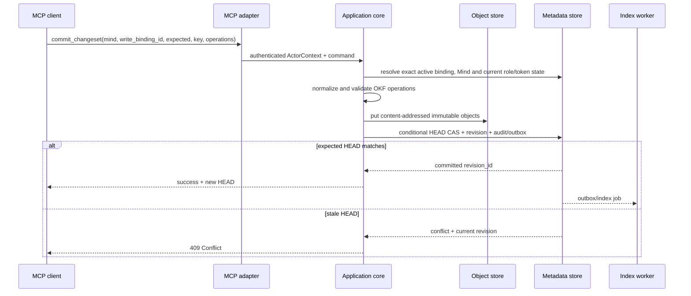

# Архитектура Mind Diary

Статус: proposal, обновлено 2026-08-22. Product Site components, adapters,
route migration и isolated Codex bridge реализованы и развёрнуты как
single-principal UAT в OpenAI Sites. Authenticated web/control,
persistence-after-redeploy,
raw modern discovery и оба профиля `codex-cli 0.147.0` проверены live. OAuth
adapter реализован в repository candidate. Для Codex Desktop/CLI pilot 0.1
принят direct MCP package с OAuth при первом использовании; fresh external-
account install/OAuth lifecycle остаётся informational canary. Blocking release
evidence теперь дают отдельные synthetic multi-principal и automated
OAuth/package gates по ADR-0012; оба harness реализованы. Fresh external
Codex/Desktop OAuth UI остаётся informational canary, а не blocking evidence.

## Драйверы и ограничения

Архитектура должна поддержать одновременно:

- authenticated Sites account и автоматически созданный Personal Mind;
- ordinary Minds с single Owner, invitations, roles и visibility;
- user-scoped MCP для Codex без загрузки всего corpus; другие clients, включая
  Claude Code, требуют отдельного adapter/client conformance evidence;
- individual-file UTF-8 Markdown access и переносимый deterministic export;
- immediate multi-file commits с immutable history и optimistic concurrency;
- public/unlisted live-HEAD reads только для authenticated users;
- Sites-only MVP UAT и post-MVP AWS portability без AWS SDK в domain
  core;
- future path к bounded PersonalContext без передачи личного corpus target
  Mind.

OKF не определяет transactions, locks, ACL, revisions, query API или MCP. Эти
свойства принадлежат Mind Diary.

## Контекст системы


Web и MCP являются двумя adapters над общей application boundary. «Internal
REST» — логический contract use cases, а не обязательно отдельная сеть в первом
deployment. Raw content API не открыт browser/customer; внешней network surface
для corpus является authenticated MCP endpoint.

## Доменная граница

```text
Principal --exactly one-------------> Personal Mind
Principal --< SpaceMembership >------ Ordinary Mind
Principal --< SpaceInvitation >------ Ordinary Mind
Principal --< MCP access token
KnowledgeSpace --HEAD/history-------> SpaceRevision
SpaceRevision --materialize---------> OKFBundle
```

`KnowledgeSpace` — service aggregate и access boundary. `OKFBundle` export
содержит только canonical Markdown files одной revision; account, handle, ACL,
invitations, tokens, idempotency results, audit и indexes — service metadata.

Personal Mind использует тот же content/revision schema, но application commands
обеспечивают его sole-owner/private/non-shareable invariants и route `/me`.

## Слои

### 1. OKF domain и codec

Слой первого прототипа знает Markdown paths, reserved `index.md`/`log.md`,
frontmatter, provenance, trust/lifecycle fields и validation. Он:

- принимает и возвращает исходные UTF-8 bytes;
- сохраняет неизвестные types/fields при round-trip;
- по умолчанию пишет OKF 0.2;
- разделяет conformance errors и quality warnings;
- не знает об MCP, HTTP, auth, Sites, AWS SDK, SQL или search engine.

ZIP/local bundle import, transport producer-defined non-Markdown files и legacy
0.1 migration не входят в этот slice. Будущий legacy reader обязан получить
explicit migration policy
и не может silently менять version/status semantics.

### 2. Application core

Use cases получают trusted `ActorContext` от adapter и работают через узкие
ports:

- account bootstrap/delete и resolve `/me`;
- create/list/resolve/rename/delete Mind;
- invitations, membership roles и ownership transfer;
- visibility и public catalog;
- token issue/revoke/authenticate;
- export/validate revision;
- browse/search/fetch/history;
- atomic `commit_changeset`;
- future-proposal bounded PersonalContext/SpaceLanding;
- outbox/index jobs и audit.

Core первого прототипа зависит от `MetadataStore`, `ObjectStore`, `SearchIndex`,
`Authorizer`, `TokenHasher`, `AuditSink` и `Clock`, но не от concrete adapters.
Если post-prototype personalization будет принята, она подключит отдельный
узкий `PersonalContextProvider` port.

Точная форма trusted context, обязанности каждого port, отдельные control,
content и background façades, transaction boundaries и обязательные dependency
rules зафиксированы в
[specification границ реализации](specs/implementation-boundaries.md). Runtime
composition и automated import graph checks реализованы; live Sites semantics
проверяются отдельно и не выводятся из compile-time изоляции.

### 3. Protocol adapters

- **Web adapter** принимает Sites identity context и обслуживает control-plane
  pages/commands. Raw OKF file editing не входит в browser UI.
- **OAuth connector adapter** публикует discovery, public-client DCR,
  authorization code + PKCE `S256`, rotating refresh и revocation. Consent
  использует тот же trusted Sites identity resolver, что и Web adapter, и не
  принимает client-supplied principal/role/membership как authority.
- **MCP adapter** предоставляет user-scoped content tools через Streamable HTTP.
  Целевой stateless profile `2026-07-28` доступен по `POST /api/mcp`, начинает
  negotiation с `server/discover` и использует current result metadata;
  `codex-cli 0.147.0` проходит его при opt-in `mcp_2026_07_28`.
  Отдельный `POST /api/mcp/2025-11-25` изолирует lifecycle compatibility для
  проверенного `codex-cli 0.147.0`: client предлагает `2025-06-18`, server
  выбирает `2025-11-25`. Оба adapters вызывают одну content application
  boundary и заново проверяют Bearer token, scope, current membership и
  visibility на каждом HTTP request.
- **Background adapter** выполняет идемпотентную индексацию, outbox delivery и
  safe garbage collection incomplete/unreachable objects.

Exact `/mcp` не принадлежит product router: live Sites probes показывают, что
этот path перехватывается platform dispatcher до deployed Worker, тогда как
`/api/mcp` достигает обычной Sites boundary. Поэтому product router не
redirect-ит credential-bearing requests с `/mcp`, а публикует два explicit
non-reserved endpoint выше. Наблюдение и его ограничения сохранены в
[датированном capability report](reports/2026-08-07-sites-mcp-capability-gate.md);
исправление подтверждено matching UAT Worker events и реальными Codex
tool calls после redeploy.

### 4. Infrastructure adapters

- Dev: project-profile launcher поднимает `apps/mind-diary-site` как
  Web/API/MCP Worker на localhost через Vinext/Cloudflare-compatible runtime с
  локальными D1/R2 bindings. In-memory adapters остаются deterministic contract
  fixtures и не заменяют этот dev runtime. Exact loopback origin из
  `dev-ready/v1` может использовать HTTP только внутри этого local runtime;
  hosted UAT/production origin остаётся canonical HTTPS, а Origin/CSRF checks в
  обоих случаях сравнивают exact origin без wildcard или forwarded-host trust.
- Sites MVP UAT: D1 metadata/search/audit и R2 canonical
  objects/export. Bindings и сохранение account/Personal Mind после redeploy
  проверены live; quota, recovery и большой export требуют отдельного
  operational evidence по мере нагрузки.
- Post-MVP AWS adapters: S3 canonical objects, DynamoDB transactional
  metadata/outbox и optional OpenSearch Serverless derived index.

### 5. Test-only identity composition

Release automation использует отдельный harness, который не входит в Product
Site/UAT/production bundle. Harness подаёт ephemeral trusted snapshots через
существующий `ProductSiteTrustedIdentityReader` и выбирает constructor-only
generic external-binding provider `synthetic-test`. Отдельного domain actor kind
нет; `SyntheticPrincipal` остаётся label тестового run, а normal bootstrap
создаёт обычные domain `Principal`, Personal Mind и membership records.

Composition активируется прямым test entry point, а не route/header/body/query,
cookie, environment variable, serialized job, feature flag или
`NODE_ENV=test`. Generic dependency default-ится на `openai-sites`, Product
Worker её не задаёт, а product packages не содержат synthetic provider/import.
Harness использует normal application commands и protocol adapters без storage
seed, client-selected principal, ACL/scope bypass или privileged cleanup. Exact
scenario и redacted receipt заданы в
[synthetic runbook](operations/synthetic-multi-principal-runbook.md).

## Identity и authentication

### Sites account

Web adapter принимает только platform-authenticated identity context. Первый
prototype создаёт свой opaque immutable `principal_id` и binding к
authenticated platform identity. Email/display name не передаются клиентом как
authority.

Документация Sites сейчас описывает authenticated email и optional full-name
request context, но не обещает стабильный external subject. Initial binding
использует server-normalized email из этого context; exact match возвращает
existing principal.
Unknown email нельзя отличить от смены email: explicit create получает новый
изолированный principal без прежних прав, а recovery требует отдельной ручной
проверки identity. Сервис никогда автоматически не relink/merge-ит accounts и
не переносит access. Email не является durable authorization ID.

Account bootstrap transaction создаёт principal, Personal Mind и owner binding.
Retry использует external-binding idempotency и возвращает существующий account.
Display name инициализируется из optional platform-provided full name либо
вводится при первом входе; его последующая смена обновляет metadata Personal
Mind, а не content HEAD.

### MCP personal access tokens

Personal token выбран как минимальный безопасный механизм первого прототипа:

```text
token_id
principal_id
name
secret_verifier       # hmac-sha256:v1, exact lookup key
display_prefix
scopes: content:read, content:write
created_at
expires_at           # default 90 days
last_used_at?
revoked_at?
binding_set_id       # service metadata, initial empty
```

Canonical secret `mdp_v1_<base64url>` содержит ровно 32 random bytes, имеет
фиксированную длину и показывается через consume-once boundary. Persisted record
содержит только safe display prefix, keyed HMAC-SHA-256 verifier, scopes и
lifecycle metadata; plain/recoverable secret и HMAC key рядом с record не
хранятся. HMAC key минимум 256 bits поступает из deployment secret store.

Verifier — versioned fixed-length exact lookup key. Adapter отклоняет
malformed/oversized input до storage, для canonical candidate делает один
indexed lookup и сравнивает два 32-byte verifier без data-dependent early exit;
unknown/denied record снаружи неотличим от mismatch. Медленный password KDF не
используется: 256-bit random entropy уже исключает практический offline
guessing, а KDF на каждом MCP request увеличивает latency и DoS amplification.
Threat analysis, benchmark и rotation boundary зафиксированы в
[ADR-0005](decisions/0005-mcp-token-secret-verifier.md).

Default и server maximum expiry равны 90 дням. Server проверяет
expiry/revocation, строит `ActorContext` и затем на каждом tool call заново
проверяет current Mind access. Token bound к principal, не Mind, и владеет
independent server-side binding set. Он не даёт control-plane capabilities и не
логируется. `content:write` включает `content:read`, но commit требует current
singleton write binding; write-only token не выпускается.

Codex configuration использует `bearer_token_env_var`. Для single-principal UAT Site
отдельный `env_http_headers` передаёт `OAI-Sites-Authorization`, причём значение
environment variable содержит полный `Bearer <secret>`, а не только secret.
Проверенный default
`codex-cli 0.147.0` направляется на compatibility URL
`https://{site-host}/api/mcp/2025-11-25`; modern clients — на
`https://{site-host}/api/mcp`. Для Claude Code и других clients support
объявляется только после conformance test.

### OAuth authentication

Marketplace pilot добавляет отдельный OAuth 2.1 profile поверх той же principal
и content authorization model. Codex Desktop/CLI получает exact resource из
direct `.mcp.json`; private registered app для pilot 0.1 не требуется:

```text
Sites identity --> principal_id
public DCR client + PKCE --> OAuth grant
OAuth access token --> internal authorization mirror --> ActorContext
OAuth grant --> independent MindBindingSet
ActorContext + current binding + current ACL + exact Mind/revision --> content use case
```

Authorization Server и protected resource живут на одном canonical UAT origin.
Public-client DCR не выдаёт client secret. Authorization request привязывает
exact redirect URI, resource `/api/mcp`, scopes, state и PKCE `S256`; consent
разрешает current principal только из Sites request context. Read-first grant
получает `content:read`, а `content:write` добавляется отдельным step-up.

OAuth tables хранят normalized clients, pending requests, grants, one-time
codes, access и refresh lifecycle. Opaque code/access/refresh secrets
сохраняются только как domain-separated keyed HMAC-SHA-256 verifiers. Access
token короткоживущий; refresh token rotation с reuse detection отзывает grant.

Immutable OAuth grant, а не rotating access/refresh token и не chat ID, владеет
binding set. Refresh сохраняет state; revoke делает его unusable; reconnect
создаёт новый пустой state. Personal token использует тот же application
contract с `token_id` как stable owner. Полный contract находится в
[Mind bindings](specs/mind-bindings.md).

Application core уже повторно проверяет current MCP token внутри ACL/CAS/commit
transaction. Чтобы OAuth adapter не обходил эту boundary, каждому active OAuth
access token соответствует скрытая authorization mirror record в существующем
token store с теми же principal, scopes и expiry. Revocation сначала отзывает
mirror, затем OAuth lifecycle records; account deletion authoritative cascade
также отзывает mirrors. Поэтому недоступность best-effort OAuth cleanup после
account deletion не сохраняет content access.

Web `/settings/mcp` показывает connected apps и немедленный revoke отдельно от
personal tokens, а внутри каждой credential card — `0..N` read bindings и один
write binding. Browser не получает credential Bearer: trusted Web adapter
сначала заново подтверждает Sites principal → exact token/grant ownership,
active lifecycle и scope, затем вызывает тот же `MindBindingApplicationService`
с binding CAS. Accessible targets проецируются из current control metadata;
утративший доступ target redacted без name/route/`space_id`. Success всегда
заканчивается server-rendered read-back. OAuth bearer не даёт
membership/account control plane. Direct UAT package использует
`AVAILABLE + ON_USE`; blocking protocol/package/transport automation отделена
от informational fresh external-account canary.
Production issuer/resource, ChatGPT Web connector и public directory остаются
нерешённой release boundary. Server-side профиль
зафиксирован в [ADR-0010](decisions/0010-oauth-marketplace-connector.md), а
distribution boundary — в
[ADR-0011](decisions/0011-direct-mcp-plugin-oauth-on-use.md).

Blocking OAuth/package conformance может подать тот же ephemeral trusted
identity snapshot только в authorize/consent adapter test composition. DCR,
PKCE, exact
redirect/resource/state, token/refresh lifecycle, authorization mirror,
current ACL/CAS и MCP transport проходят normal product contracts. Ни OAuth
client, ни request fields не выбирают synthetic actor; password grant и admin
token mint отсутствуют. Real external Codex/Desktop OAuth UI остаётся
informational canary, а не release gate 0.1.

## Mind identity, `/me` и visibility

Обычный Mind хранит immutable `space_id`, immutable в prototype
`space_handle`, derived `normalized_handle`, mutable `name` и
`metadata_version`. Create atomically резервирует host-scoped handle и создаёт
sole Owner. Canonical grammar, normalization, reserved names, generic
`handle_unavailable` и permanent retirement после deletion определены в
[доменной модели](specs/domain-model.md#identity-и-адресация-mind). Router разрешает
handle в ID до metadata/object read.

`/me` — reserved route, разрешаемый только из authenticated `principal_id` в
`personal_space_id`. Скрытый service handle Personal Mind не является
user-facing URL. Rename principal display name меняет Personal Mind name через
metadata CAS, но не content HEAD.

Authorization query возвращает одно из:

```text
denied
membership(role)
baseline_reader(visibility: public | unlisted)
```

`private` разрешает только membership. `unlisted` даёт authenticated baseline
Reader после exact handle resolve, `public` — также через catalog. Baseline
grant не создаёт membership. Owner-only visibility mutation увеличивает
metadata/access epoch; перевод в private сразу инвалидирует caches и будущие
reads non-members. `unlisted` означает только отсутствие в каталоге, не secret
URL. Включение `public`/`unlisted` открывает live HEAD и всю immutable history;
обратный switch не отменяет уже состоявшееся раскрытие.

## Membership, invitations и ownership

Commands используют version CAS и idempotency, а не generic CRUD:

```text
create_space_with_owner(name, handle)
create_invitation(target_principal, role)
accept_invitation(invitation_id)
reject_or_cancel_invitation(invitation_id)
change_membership_role
revoke_membership
leave_space
transfer_ownership(target_active_participant)
change_visibility
delete_space
```

Storage transaction проверяет actor capability, target state/version,
single-owner invariant, пишет state + audit event и возвращает idempotency
result. Transfer меняет target на Owner и source на Admin в одной transaction.
Invitation acceptance создаёт membership только если invitation pending,
unexpired и target совпадает с authenticated principal.

Personal Mind не использует ordinary membership/invitation commands после
bootstrap. Его delete разрешён только account-deletion transaction.

## Каноническая модель revisions

```text
KnowledgeSpace
├── HEAD -> revision_id
├── SpaceRevision
│   ├── revision_id + monotonic revision_number
│   ├── parent_revision_id
│   ├── manifest: path, SHA-256, media_type, size
│   ├── exact UTF-8 OKF Markdown files
│   └── committed_by, committed_at UTC, summary
└── derived index state per revision
```

Manifest — service envelope, не нормативный OKF file. Export материализует
только выбранное дерево. Object-store version IDs не заменяют domain revision.

History resolver принимает HEAD, exact ID или UTC `as_of`. `as_of` выбирает
revision с максимальным number и `committed_at <= as_of`, без fallback на HEAD.
Non-HEAD selector фиксирует `resolved_revision_id` и принудительно read-only.
Каждый read проверяет current membership/baseline grant и token scope. Named
checkpoints/tags не входят в первый прототип.

## Поток content write



Отдельного persisted draft, diff approval и approval token нет. Authorization
проверяется до validation/object read и повторно внутри transactional boundary,
если adapter/storage допускает race. Objects, записанные до неудачного HEAD CAS,
недостижимы и удаляются только bounded garbage collection после safety window.

Multi-file changeset all-or-nothing. `index.md` обновляется explicit replace
under HEAD CAS; automatic merge отложен. `add_log_entry` парсит canonical
`log.md`, вставляет событие в newest-first/date-grouped позицию и снова
валидирует файл. Idempotency result предотвращает duplicate revision/log entry.
Ключ namespaced по
`binding_owner_id + write_binding_id + space_id + operation + key` и связан с
canonical request hash: тот же payload возвращает прежний result, другой
payload с тем же key — `409 Idempotency Conflict`.

## Поток content read

1. MCP adapter аутентифицирует token и получает `principal_id` + trusted
   `binding_owner_id`.
2. Explicit Mind selector разрешается в `space_id`; `/me` разрешается только
   через actor.
3. Application требует active read binding либо exact write binding.
4. Authorizer проверяет current membership или visibility grant.
5. Revision selector разрешается в exact `revision_id`.
6. Browse/search применяет `space_id + revision_id` filter до выдачи результатов.
7. `fetch` перечитывает canonical object той же revision и возвращает
   provenance/freshness.
8. Ответ ограничивается budget; truncation обозначается явно.

Index для каждой revision derived и rebuildable. При отсутствии/lag historical
index browse/fetch остаются доступны, а search ждёт rebuild или честно сообщает
unavailable; fallback на HEAD запрещён.

## MCP surface и multi-Mind boundary

Один connection discover-ит allowed universe principal, но content использует
только authoritative bindings и не смешивает corpus:

```text
list_minds -> /me + memberships + public catalog
resolve_mind(exact unlisted handle) -> one authorized descriptor
set_read_mind_binding -> attach/detach 0..N readable targets
set_write_mind_binding -> atomically select 0..1 writable target
content_tool(mind, revision?, ...) -> exactly one bound space_id
```

Opaque search result ID фиксирует `space_id + revision_id + path`, поэтому
subsequent `fetch(id)` не перескакивает на новую HEAD. MCP не принимает
client-supplied `principal_id`, `space_id` или role как источник истины.
Private/unlisted enumeration защищена: unlisted не попадает в list без
membership, private denied response не раскрывает metadata.

Surface использует custom Mind-aware tools. Первый прототип не заявляет OpenAI
company-knowledge compatibility: стандартный `search(query)` не передаёт Mind
selector, а его results требуют user-openable web URLs, которых content surface
не предоставляет. Такой profile требует отдельного design decision.

Content MCP не содержит invitation, membership, visibility, ownership, deletion
или token-management tools. Corpus не может расширить server scopes или получить
эти operations. Но prompt injection способен склонить модель вызвать уже
разрешённый content write; explicit write scope, current ACL, immutable history
и audit ограничивают, а не устраняют этот residual risk. Tool annotations — UX
metadata, а не security boundary.

## Sites control plane и internal API

Sites обслуживает только authenticated metadata workflows: account, `/me`, Mind
list/create/rename, catalog, visibility, invitations, roles, transfer, deletion
и personal tokens. Работа с OKF files происходит через MCP; browser может
показывать лишь status/metadata, необходимые для управления.

Предлагаемые REST routes, internal command/query boundary и exact MCP
tools/resources schemas зафиксированы в [API specification](specs/api.md).

UAT deployment MVP размещает Web adapter, MCP adapter и core в одном
OpenAI Site. Внутренние use-case routes при этом не публикуются. Если Sites не
поддержит required Streamable HTTP или persistence semantics, UAT
release блокируется до нового архитектурного решения; split deployment не
включается как автоматический fallback.

## Personalization boundary

Это post-prototype proposal, а не capability первого vertical slice. Если он
будет принят, после target authorization `PersonalContextProvider` сможет по
отдельному `personal.context.read` разрешить exact revision собственного
Personal Mind и вернуть server-filtered profile. Target content не формирует
personal query, не выбирает fields и не расширяет scope. Derived landing
приватен principal и не кэшируется как shared response.

Этот use case не меняет правило content MCP: каждый обычный tool call имеет один
explicit target Mind. General cross-Mind search/synthesis требует новой
спецификации и provenance/access checks для каждого corpus.

## Deployment profiles

### Product Site source candidate

- Отдельное приложение `apps/mind-diary-site` собирает Vinext UI и Worker с Web,
  API, MCP и background adapters.
- Exact `/mcp` исключён из product surface из-за pre-Worker Sites reservation.
  Modern `2026-07-28` adapter обслуживает `/api/mcp`; isolated compatibility
  adapter для default `codex-cli 0.147.0` обслуживает
  `/api/mcp/2025-11-25` и не создаёт session state.
- D1 event log сохраняет metadata transactions и восстанавливает state после
  нового runtime instance; R2 хранит canonical objects и export archives.
- Trusted Sites identity, browser CSRF/Origin и Bearer content MCP остаются
  разными security boundaries; browser не рендерит raw Markdown, MCP не
  публикует control tools.
- Integration/transport checks подтверждают оба endpoint, negotiation,
  request-scoped token/access reauthorization и Codex tool flow в default
  compatibility и opt-in modern modes; UAT Worker events и persisted
  web state подтверждают routing и persistence после Sites publish.

### Dev, OpenAI Sites UAT и production

- Dev поднимает полный применимый runtime на `localhost` с изолированными
  данными и проверяет максимум flows до hosted release.
- Sites — текущая UAT platform MVP и подтверждённый host web/admin UI с Sign in
  with ChatGPT.
- UAT Site использует D1/R2 bindings; их live availability и
  persistence-after-redeploy проверены, а quota и recovery остаются
  operational follow-up.
- Streamable HTTP MCP реализован в том же Worker по non-reserved paths;
  Sites proxy/runtime compatibility подтверждена raw modern и реальными Codex
  flows.
- Gate включает real Codex client, stable HTTPS endpoint, streaming, bearer
  forwarding/configuration, protocol lifecycle и persistence across deployments.
  Claude Code и другие clients получают собственную non-blocking gate до
  заявления их поддержки.
- UAT release требует успешных web/control и MCP flows одного exact
  Sites version/deployment. При провале gate релиз блокируется; отдельный
  portable runtime не создаётся без нового решения.
- Production — отдельный, пока не provisioned target для живых пользователей.
  `ship-work-release` его не deploy-ит; публикация возможна только отдельным
  ручным workflow после явного prompt и подтверждения exact artifact/target.

Canonical branch, commands, UAT URL/provider, smoke matrix и production
configuration зафиксированы в
[project delivery profile](operations/ship-work-release-profile.md).

### Post-MVP AWS path

- Это основная planned infrastructure direction после подтверждения MVP и
  самостоятельная учебная цель проекта; она не является текущим release
  fallback.
- Будущий portable container в Bedrock AgentCore Runtime.
- S3 для canonical objects; DynamoDB conditional writes для HEAD, metadata,
  invitations, tokens metadata и outbox.
- Optional OpenSearch Serverless только как derived index после benchmark.
- IAM least privilege, private service access, OTEL/CloudWatch без content body.
- Тот же domain/integration suite, что local profile.
- Этот profile не входит в MVP release, его deployment требует нового принятого
  решения.

## Observability и audit

Metrics: request latency/errors, auth failures, CAS conflicts, index lag,
invitation outcomes, token issuance/revocation и deletion counts. Logs/traces не
содержат concept/source bodies, PersonalContext, raw email where avoidable,
token secret/verifier, presigned URL или private search query.

Каждая account, ownership, membership, visibility и successful content commit
operation создаёт audit event с opaque actor/subject IDs, target `space_id`,
request/idempotency ID, outcome и safe metadata. Whole-Mind hard deletion
удаляет target-linked audit/idempotency records вместе с aggregate; остаётся
только non-linkable retired-handle marker, без forensic deletion receipt. Это
сознательная потеря post-delete accountability в delete-all прототипе. Account
deletion также удаляет identity/profile, но commits в Minds других Owners
сохраняют opaque non-PII `deleted-principal` tombstone. OKF `log.md` не заменяет
audit log.

## Недоверенное content boundary

- ACL разрешается до object/index read.
- Concept/source text не расширяет server tools или scopes; модель всё ещё может
  ошибочно интерпретировать его как инструкцию в пределах разрешённых tools.
- Changeset принимает только canonical relative Markdown paths и valid UTF-8,
  ограничивает размер/число operations и отклоняет reserved-path misuse.
- Web renderer не исполняет embedded HTML/script без isolation/sanitization.
- Full export передаётся через short-lived download URL с повторной проверкой
  доступа; upload intent в первом прототипе отсутствует.

## Риски и открытые вопросы

- Даст ли Sites stable external identifier, позволяющий позже заменить ручной
  fail-closed account recovery безопасным automatic relink?
- Сохранят ли `/api/mcp`, isolated `/api/mcp/2025-11-25` и Bearer forwarding
  проверенную совместимость при изменениях Sites runtime или target Codex?
  Базовый UAT gate уже пройден; каждый новый release и platform/client upgrade
  должны повторно проверить exact paths и lifecycle, а regression блокирует
  новый UAT cut без автоматического fallback в отдельный runtime.
- Как доказать physical erasure replicated/index data на exact UAT deployment
  для уже реализованного restartable deletion lifecycle до появления
  production retention model?
- Нужны ли позже soft delete/recovery и formal privacy-retention policy?
- Когда сложности конфликтов оправдают structured index merge вместо current
  HEAD CAS/retry?
- Какие personal categories и consent model допустимы для personalization?

## Внешние основания

Актуальные проверенные platform facts и primary links собраны в
[отчёте о платформенных предпосылках](reports/2026-08-05-platform-status.md).
Состояние OKF и ограничения multi-writer extension — в
[отчёте о формате](reports/2026-08-05-okf-status.md).
