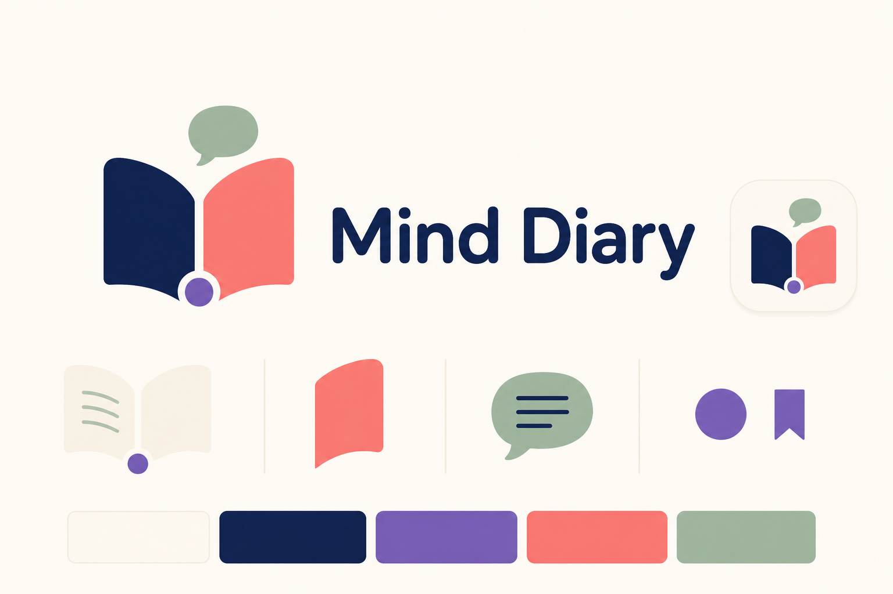

# Базовая айдентика Mind Diary

Статус: baseline v0.1, 2026-08-05. Это рабочая система для прототипов и ранней
коммуникации, а не окончательный production brand book.

## Ядро бренда

**Mind Diary** превращает разрозненные знания в Minds, которые можно пополнять,
разделять с другими и расспрашивать. Каждая добавленная запись — Memory.

- Основная формула: **Build a Mind from Memories.**
- Короткое обещание: **Knowledge that remembers and responds.**
- Одно предложение: **Mind Diary is a place to build Minds from Memories and
  talk to what they know.**

Бренд должен ощущаться живым и человечным, но не изображать Mind как
самостоятельное сознание. Он отвечает на основе выбранного знания и источников,
а не «думает вместо пользователя».

## Имена сущностей

Принятое соответствие зафиксировано в
[ADR-0001](decisions/0001-product-name-and-language.md):

| Уровень | Product language | Technical language |
|---|---|---|
| Продукт | `Mind Diary` | имя сервиса |
| База знаний | `Mind` / `Minds` | `KnowledgeSpace` / `Space` |
| Запись | `Memory` / `Memories` | `KnowledgeEntry`; при необходимости точнее `Source` или `Asset` |

Рабочее UI-имя designated Personal Space — **My Mind**, но оно ещё требует
проверки на реальных onboarding-сценариях и пока не является частью ADR.

## Характер

Mind Diary говорит и выглядит:

- **понятно** — знакомые слова, одна мысль за раз;
- **тепло** — бумага, мягкие формы, живые акценты вместо стерильного AI-blue;
- **любознательно** — приглашает открыть, спросить и дополнить;
- **надёжно** — показывает источники, версии и границы ответа;
- **спокойно** — не обещает магию, сверхразум или автоматическую истину.

Не подходит бренду:

- анатомический мозг, нейроны, микросхемы и роботы;
- неоновые AI-градиенты, cyberpunk и чёрный «секретный vault»;
- детский дневник с замком, сердечками и рукописными клише;
- академическая тяжеловесность и слова, которые нужно объяснять до использования.

## Знак

Знак объединяет четыре простых смысла:

1. две страницы — diary и накопленное знание;
2. верхний контур страниц образует мягкую `M` — Mind;
3. фиолетовая точка у корешка — одна Memory, из которой растёт Mind;
4. зелёная реплика — с Mind можно разговаривать.

Канонические baseline-assets:

- [отдельный знак](assets/brand/mind-diary-mark.svg);
- [горизонтальный lockup](assets/brand/mind-diary-lockup.svg);
- [app icon](assets/brand/mind-diary-app-icon.svg).

Правила v0.1:

- основной вариант — полноцветный знак на `Paper` или белом фоне;
- свободное поле вокруг знака — не меньше диаметра фиолетовой Memory-dot;
- знак не растягивается, не поворачивается и не получает тени;
- цвета страниц не меняются местами;
- для очень малого размера сначала тестируется читаемость реплики; отдельный
  micro-mark пока не принят;
- SVG lockup использует live text и годится для прототипов/документации. Перед
  production-печатью wordmark потребуется оптически доработать и перевести в
  outlines.

## Палитра

| Token | HEX | Назначение |
|---|---|---|
| `Ink` | `#172B5B` | Основной текст, тёмная страница, навигация |
| `Paper` | `#FFF9F0` | Тёплый основной фон |
| `Memory Violet` | `#5B4BC4` | Primary actions, focus, Memory-dot |
| `Living Coral` | `#F26B5E` | Эмоциональный акцент и вторая страница |
| `Quiet Sage` | `#9AAF9E` | Реплика, supporting graphics, спокойные состояния |
| `White` | `#FFFFFF` | Нейтральные поверхности и inverse text |

Те же значения доступны как
[CSS reference tokens](assets/brand/mind-diary-tokens.css). Это исходная точка,
а не обещание окончательной component theme.

Проверенные пары для обычного текста:

- `Ink` на `Paper`: contrast ratio около `13.1:1`;
- `Memory Violet` на `Paper`: около `6.2:1`;
- `White` на `Ink`: около `13.7:1`;
- `White` на `Memory Violet`: около `6.5:1`.

`Living Coral` и `Quiet Sage` не используются как цвет мелкого текста на
`Paper`: их контраст недостаточен. Смысл состояния нельзя кодировать только
цветом.

## Типографика

- **Manrope 700/800** — wordmark, hero headings и короткие эмоциональные фразы.
- **Inter 400/500/600** — интерфейс, документация и служебные подписи.
- `system-ui, sans-serif` — обязательный fallback.

На одном экране используется не больше двух семейств. Длинное содержимое Mind
должно оптимизироваться под чтение, а не имитировать рукописный дневник.
Шрифтовые файлы пока не входят в репозиторий; способ доставки и лицензии нужно
проверить до production implementation.

## Формы и композиция

- Карточки Memories напоминают отдельные листы: светлая поверхность, спокойный
  радиус `16–24px`, тонкая граница вместо тяжёлой тени.
- Фиолетовая точка может отмечать новую Memory, источник или точку продолжения,
  но не должна появляться как декоративный конфетти-паттерн.
- Группы страниц и точек образуют supporting pattern; линии нейронной сети не
  используются.
- Иллюстрации плоские или editorial, с большим количеством воздуха и одним
  понятным действием. Photorealistic brains и псевдонаучные схемы запрещены.
- Motion строится вокруг открытия страницы и появления одной Memory; без
  бесконечного свечения и «магической генерации».

## Голос и тексты

Пишем коротко, конкретно и как помощник, а не как всезнающий AI.

| Задача | Предпочтительно | Не использовать |
|---|---|---|
| Создание | `Create a Mind` | `Initialize knowledge repository` |
| Добавление | `Add a Memory` | `Ingest data` |
| Разговор | `Ask this Mind` | `Query the AI brain` |
| Совместная работа | `Share this Mind` | `Configure multi-tenant access` |
| Пустое состояние | `Add the first Memory` | `No entities found` |
| Ограничение | `This Mind may not know yet` | `Hallucination detected` |

Фразы `train your Mind` и `the Mind knows everything` запрещены: первая
создаёт ложное ожидание обучения модели, вторая скрывает границы corpus и
источников.

## Exploratory board

Board создан для проверки направления «diary + conversation + Memory-dot».
Он не является master artwork: в нём есть generated gradients и оптические
неточности. Для реализации используются SVG-assets и точные HEX tokens выше.

Точный prompt built-in image generation сохранён
[рядом с board](assets/brand/mind-diary-identity-board-v1.prompt.txt).

## Что проверить в следующей итерации

- узнаваемость знака за 3–5 секунд без подписи;
- воспринимается ли продукт как knowledge tool, а не личный mood diary;
- слово `Diary` в shared/community сценариях;
- доступность названия, domains и trademarks;
- оптическая доработка wordmark и micro-mark для `16–20px`;
- dark mode, monochrome version и favicon export;
- русская и английская onboarding copy на реальных экранах.
