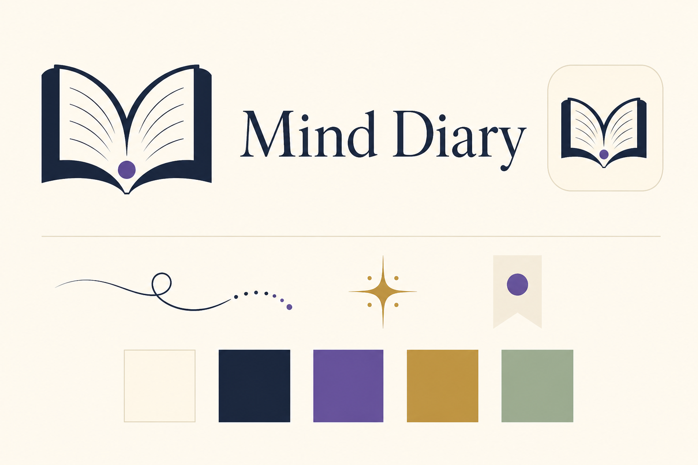

# Базовая айдентика Mind Diary

Статус: baseline v0.2, 2026-08-05. Это рабочая система для прототипов и ранней
коммуникации, а не окончательный production brand book.

## Ядро бренда

**Mind Diary** превращает разрозненные знания в Minds, которые можно пополнять,
разделять с другими и расспрашивать. Каждая добавленная запись — Memory.

- Основная формула: **Build a Mind from Memories.**
- Короткое обещание: **Knowledge that remembers and responds.**
- Одно предложение: **Mind Diary is a place to build Minds from Memories and
  talk to what they know.**

Бренд должен ощущаться живым и человечным, но не изображать Mind как
самостоятельное сознание. Он отвечает на основе выбранного знания и источников,
а не «думает вместо пользователя».

## Имена сущностей

Принятое соответствие зафиксировано в
[ADR-0001](decisions/0001-product-name-and-language.md):

| Уровень | Product language | Technical language |
|---|---|---|
| Продукт | `Mind Diary` | имя сервиса |
| База знаний | `Mind` / `Minds` | `KnowledgeSpace` / `Space` |
| Запись | `Memory` / `Memories` | `KnowledgeEntry`; `Source` и `Asset` остаются отдельными техническими типами |

В навигации Personal Mind можно обозначать как **My Mind**, но это label, а не
его display name. Display name автоматически следует за именем пользователя.
В web он открывается по `/me`; user-facing copy не показывает его служебный
`space_handle`.

## Написание имени и технические slugs

| Контекст | Форма | Правило |
|---|---|---|
| Продукт, сайт и UI | `Mind Diary` | Всегда два слова с пробелом |
| GitHub repository и локальная папка | `MindDiary` | Каноническое техническое имя проекта |
| Site/deployment/package slug | `mind-diary` | Preferred lowercase form, когда платформа позволяет выбрать slug |
| URL отдельного Mind | `/{space_handle}` | Независим от slug продукта и выбирается для каждого Space |
| URL Personal Mind | `/me` | Reserved route текущего authenticated пользователя |

`MindDiary` и `mind-diary` не используются как пользовательский wordmark.
Точное production domain name пока не принято. В OpenAI Sites видимое имя
должно быть **Mind Diary**, а preferred Site slug — `mind-diary`, если он
доступен и платформа позволяет его зафиксировать.

## Характер

Mind Diary говорит и выглядит:

- **понятно** — знакомые слова, одна мысль за раз;
- **тепло** — бумага, мягкие формы, живые акценты вместо стерильного AI-blue;
- **любознательно** — приглашает открыть, спросить и дополнить;
- **надёжно** — показывает источники, версии и границы ответа;
- **спокойно** — ощущение открытия не подменяет источники, границы ответа и
  работу пользователя обещанием автоматического чуда.

Не подходит бренду:

- анатомический мозг, нейроны, микросхемы и роботы;
- неоновые AI-градиенты, cyberpunk и чёрный «секретный vault»;
- детский дневник с замком, сердечками и рукописными клише;
- узнаваемые логотипы, реквизит, гербы, цветовые системы и title treatments
  конкретных книжных или экранных франшиз;
- академическая тяжеловесность и слова, которые нужно объяснять до использования.

## Знак

Знак объединяет пять простых смыслов:

1. две страницы — diary и накопленное знание;
2. верхний контур страниц образует мягкую `M` — Mind;
3. фиолетовая точка у корешка — одна Memory, из которой растёт Mind;
4. зелёная реплика — с Mind можно разговаривать;
5. одна четырёхлучевая искра внутри реплики — момент найденной связи или
   открытия, а не самостоятельная «магическая генерация».

Канонические baseline-assets:

- [отдельный знак](assets/brand/mind-diary-mark.svg);
- [горизонтальный lockup](assets/brand/mind-diary-lockup.svg);
- [app icon](assets/brand/mind-diary-app-icon.svg);
- [supporting motifs](assets/brand/mind-diary-motifs.svg).

Правила v0.2:

- основной вариант — полноцветный знак на `Paper` или белом фоне;
- свободное поле вокруг знака — не меньше диаметра фиолетовой Memory-dot;
- знак не растягивается, не поворачивается и не получает тени;
- цвета страниц не меняются местами;
- искра всегда одна, четырёхлучевая и вторична по отношению к книге и
  Memory-dot; россыпь звёзд не используется;
- для очень малого размера сначала тестируется читаемость реплики; отдельный
  micro-mark пока не принят;
- SVG lockup использует live text и годится для прототипов/документации. Перед
  production-печатью wordmark потребуется оптически доработать и перевести в
  outlines.

## Палитра

| Token | HEX | Назначение |
|---|---|---|
| `Ink` | `#182642` | Основной текст, тёмная страница, навигация |
| `Paper` | `#FFF7E8` | Тёплый основной фон |
| `Memory Plum` | `#6C4BB6` | Primary actions, focus, Memory-dot |
| `Living Coral` | `#EB6F64` | Эмоциональный акцент и вторая страница |
| `Quiet Brass` | `#B88A3B` | Только искра, тонкие разделители и редкие supporting accents |
| `Quiet Sage` | `#9AAE9D` | Реплика, supporting graphics, спокойные состояния |
| `White` | `#FFFFFF` | Нейтральные поверхности и inverse text |

Те же значения доступны как
[CSS reference tokens](assets/brand/mind-diary-tokens.css). Это исходная точка,
а не обещание окончательной component theme.

Проверенные пары для обычного текста:

- `Ink` на `Paper`: contrast ratio около `14.1:1`;
- `Memory Plum` на `Paper`: около `5.9:1`;
- `White` на `Ink`: около `15.1:1`;
- `White` на `Memory Plum`: около `6.3:1`.

`Living Coral`, `Quiet Brass` и `Quiet Sage` не используются как цвет мелкого
текста на `Paper`: их контраст недостаточен. Смысл состояния нельзя кодировать
только цветом.

## Типографика

- **Fraunces 600–700** — wordmark, hero headings и короткие фразы. Мягкая
  editorial serif добавляет книжность, но не превращается в fantasy display.
- **Inter 400/500/600** — интерфейс, документация и служебные подписи.
- `system-ui, sans-serif` — обязательный fallback.

На одном экране используется не больше двух семейств. Fraunces не набирает
мелкий UI-текст или длинные passages. Длинное содержимое Mind должно
оптимизироваться под чтение, а не имитировать рукописный дневник.
Шрифтовые файлы пока не входят в репозиторий; способ доставки и лицензии нужно
проверить до production implementation.

## Слой книжного чуда

Лёгкий cultural echo создаётся через жанр «тайная библиотека и неожиданная
связь между знаниями», а не через конкретный вымышленный мир. Допустимы только
общие и независимо нарисованные приёмы:

- тёплая `Paper`-поверхность, глубокие чернила и редкий латунный акцент;
- спокойная contemporary serif в крупных заголовках;
- одна четырёхлучевая editorial spark как метафора найденной связи;
- тонкий чернильный маршрут, который заканчивается несколькими Memory-dots;
- бумажная закладка или marginal note без печати, герба и псевдолатыни.

Прямые отсылки запрещены: молния, круглые очки, сова, замок-школа, герб или
quartered shield, факультетские животные и цветовые пары, волшебная палочка как
предмет, метла, шляпа, поезд/платформа, характерная остроконечная fantasy
типографика, имена, цитаты и композиции конкретной франшизы. На primary surface
используется не больше одного «чудесного» приёма одновременно.

## Формы и композиция

- Карточки Memories напоминают отдельные листы: светлая поверхность, спокойный
  радиус `16–24px`, тонкая граница вместо тяжёлой тени.
- Фиолетовая точка может отмечать новую Memory, источник или точку продолжения,
  но не должна появляться как декоративный конфетти-паттерн.
- Группы страниц и точек образуют supporting pattern; линии нейронной сети не
  используются.
- Чернильный маршрут — одна свободная кривая без наконечника и без предмета в
  руке; он не становится wand trail или постоянным декоративным бордюром.
- Иллюстрации плоские или editorial, с большим количеством воздуха и одним
  понятным действием. Photorealistic brains и псевдонаучные схемы запрещены.
- Motion строится вокруг открытия страницы, появления одной Memory и, изредка,
  однократного проявления искры; без бесконечного свечения и «магической
  генерации».

## Голос и тексты

Пишем коротко, конкретно и как помощник, а не как всезнающий AI.

| Задача | Предпочтительно | Не использовать |
|---|---|---|
| Создание | `Create a Mind` | `Initialize knowledge repository` |
| Добавление | `Add a Memory` | `Ingest data` |
| Разговор | `Ask this Mind` | `Query the AI brain` |
| Совместная работа | `Share this Mind` | `Configure access-control policies` |
| Пустое состояние | `Add the first Memory` | `No entities found` |
| Ограничение | `This Mind may not know yet` | `Hallucination detected` |

Фразы `train your Mind` и `the Mind knows everything` запрещены: первая
создаёт ложное ожидание обучения модели, вторая скрывает границы corpus и
источников.

## Exploratory board

Board v2 проверяет направление «diary + conversation + Memory-dot + literary
wonder». Он не является master artwork: в нём есть generated gradients и
оптические неточности. Для реализации используются SVG-assets и точные HEX
tokens выше. [Board v1](assets/brand/mind-diary-identity-board-v1.png) сохранён
как предыдущая exploration, но больше не задаёт направление.

Точный prompt built-in image generation сохранён
[рядом с board](assets/brand/mind-diary-identity-board-v2.prompt.txt).

## Что проверить в следующей итерации

- узнаваемость знака за 3–5 секунд без подписи;
- воспринимается ли продукт как knowledge tool, а не личный mood diary;
- слово `Diary` в shared/community сценариях;
- доступность названия, domains и trademarks;
- оптическая доработка wordmark и micro-mark для `16–20px`;
- независимый trademark/design clearance до публичного запуска;
- dark mode, monochrome version и favicon export;
- русская и английская onboarding copy на реальных экранах.
