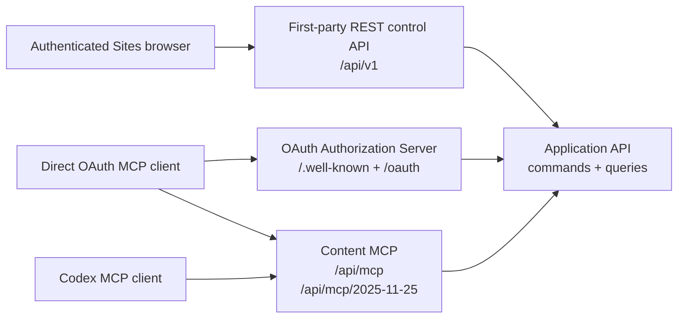

# REST и MCP API Mind Diary

Статус: proposal для верификации, обновлено 2026-08-22. Документ уточняет
wire-level контракты первого прототипа на основе принятых product decisions.
Product API и direct MCP route/compatibility repair реализованы, развёрнуты как
single-principal UAT в OpenAI Sites и проверены raw modern calls и реальным
`codex-cli 0.147.0` на обоих profiles. OAuth server/client surface реализована в
repository candidate. Для Codex Desktop/CLI pilot 0.1 принят direct MCP package
с OAuth при первом использовании; fresh external-account lifecycle ещё не
является blocking release evidence и остаётся informational canary. Blocking
multi-principal и OAuth/package automation принята ADR-0012, но её harness
implementation теперь завершена. Machine-readable OpenAPI и MCP JSON Schemas
проверяются на соответствие этому документу и реализации.

ADR-0015 и [BundleFile specification](bundle-files.md) добавляют accepted
Release 0.1 wire contract; его implementation/live UAT status остаётся
`read_export_implemented_local` после MD-247–MD-249: native MCP staging, mixed
commit, exact-revision list/download, Markdown references и deterministic dual
export реализованы и покрыты local conformance/integration tests. Real-client
exact-SHA UAT остаётся MD-250. Поэтому deployed claims пока не включают
подтверждённый native-file client flow.

ADR-0016 and
[Sites storage/capacity/import specification](sites-storage-capacity-import.md)
принимают следующую application/wire boundary для usage, reservations and
Markdown import. MD-265/MD-266/MD-268 storage, capacity и streaming
export/cleanup реализованы в local candidate; MD-267 import session APIs и
Sites UI также реализованы локально, а прежний UAT deployment не является
evidence нового candidate.

ADR-0018 and [the unified file-ingress specification](file-ingress.md) define
the portable source boundary for `session_attachment`, `local_path`,
`workspace/generated_artifact`, `connector_object`, `bounded_in_memory` and
`server_generated`. Native `session_attachment`, bounded inline and local
server-generated streaming are implemented locally; MD-272 also implements the
repository-local companion boundary for local/workspace and bounded local
generated bytes. MD-274 adds a repository-local coordinator with explicit
capability discovery plus read-only exact-payload stage/commit reconciliation;
it reuses the existing atomic `commit_changeset` rather than defining another
revision transaction. Native client/profile UAT and hosted
upload-intent/producer evidence remain MD-250/downstream gates; provider
connector bindings remain unavailable even though their provider-neutral
authorized-reader/staging boundary is implemented locally.
No source may be inferred as hosted capability or used as a silent
base64/URL/path fallback.

## Назначение и граница

Mind Diary имеет четыре разные API-границы:



1. **First-party REST control API** обслуживает Sites UI: account, metadata
   Minds, visibility, invitations, memberships, ownership, deletion и MCP
   tokens. Это не публичный developer API.
2. **OAuth Authorization Server** связывает DCR client с тем же
   Sites-authenticated principal и выпускает scoped content tokens. Он не даёт
   control-plane capabilities.
3. **Content MCP** даёт агенту browse/search/fetch/history/validate/export и
   immediate content commits. Control-plane tools в нём отсутствуют.
4. **Internal application API** — типизированная граница use cases, которую
   вызывают REST и MCP adapters. В первом Sites deployment это не обязательно
   отдельная сеть или HTTP service.

Raw Markdown не выдаётся browser REST API. Узкий Markdown import ingress
принимает bytes только на запись в private staging и не добавляет browser read
surface; остальные content reads идут через authenticated MCP. Если adapters позже станут
отдельными services, internal HTTP должен получить service authentication и
не становится customer API автоматически.

## Что уже принято и что предлагается здесь

Принятые product invariants, которые этот документ не меняет:

- authenticated-only доступ и private-by-default;
- один principal-bound MCP connection для discovery всех разрешённых Minds и
  independent binding set каждого OAuth grant/personal token;
- `0..N` read bindings, `0..1` active write binding и fail-closed content
  access вне них;
- ровно один explicit Mind и одна resolved revision на content call;
- immutable revisions, HEAD CAS и immediate commits без server draft;
- роли `reader | editor | admin | owner` и scopes
  `content:read | content:write`;
- отсутствие control-plane operations в content MCP;
- UTF-8 Markdown/OKF 0.2 plus bounded producer-defined raster/PDF/ZIP
  BundleFile; BundleFile не является OKF entity;
- отсутствие ZIP/binary/legacy import/extraction; Markdown-only file import
  implemented locally but remains unavailable until the exact UAT gate;
- отсутствие company-knowledge compatibility claim.

Предлагаемые для верификации wire-level решения:

- REST prefix `/api/v1`, JSON naming, pagination и error envelope;
- конкретный набор first-party REST routes;
- общие JSON-типы descriptors, selectors и errors;
- точные input/output shapes MCP tools;
- non-reserved modern endpoint и isolated Codex compatibility endpoint;
- OAuth discovery, DCR, PKCE/token/revoke и protected-resource challenges;
- tagged union для `commit_changeset.operations`;
- ограниченная MCP Resources surface для exact immutable files;
- tool annotations и разделение protocol/tool execution errors.

## Общие соглашения

### Имена и кодирование

- JSON fields используют `snake_case`.
- JSON requests и responses используют UTF-8.
- Timestamps используют RFC 3339 UTC, например `2026-08-05T22:00:00Z`.
- Calendar dates используют ISO 8601 `YYYY-MM-DD`.
- IDs — opaque case-sensitive strings. Клиент не парсит prefix или payload.
- Content paths используют `/` независимо от OS и всегда относительны корню
  bundle.
- Canonical Markdown path заканчивается на `.md`, не начинается с `/`, не
  содержит empty segment, `.`/`..`, backslash, control characters или
  percent-encoded separator.
- Canonical BundleFile path already uses Unicode NFC, has at most 1024 UTF-8
  bytes/255 per segment, does not end in `.md`, does not begin `.mind-diary/`
  and follows the remaining relative-path prohibitions above.
- Неизвестные JSON fields в request отклоняются, если schema не говорит иное.
  Это не относится к неизвестным OKF frontmatter fields: codec обязан их
  сохранять.

### Opaque identifiers

Внешние descriptors могут содержать:

| Field | Назначение |
|---|---|
| `mind_id` | Server-issued locator Mind; не bearer capability и не raw authority. |
| `revision_id` | Immutable domain revision ID. |
| `entry_id` | Exact locator, bound к `space_id + revision_id + path`; producer и consumer ограничивают его 512 characters. Новые `mdl2_` handles имеют fixed 37-character form и server-side encrypted payload с TTL. |
| `job_id` | Export job locator. |
| `token_id` | Metadata ID MCP token; никогда не secret. |
| `binding_owner_id` | Server-derived OAuth-grant/personal-token owner; first-party UI может передать его только как opaque locator собственного credential, после чего server заново проверяет ownership/state/scopes. Он никогда не является authority claim. |
| `read_binding_id` | Immutable service record одного attached read target. |
| `write_binding_id` | Immutable active generation singleton write target. |
| `staged_file_ref` | Opaque verified staged file pinned to binding owner + Mind + exact write generation; expires and is not a content locator. |
| `request_id` | Correlation ID безопасного request log. |

Server повторно проверяет actor, scope и текущий доступ при использовании
любого ID. Знание ID не даёт access.

### MCP token secret и verifier

Token secret первого прототипа имеет один bounded canonical format:

```text
mdp_v1_<43 base64url characters without padding>
```

- payload декодируется ровно в 32 random bytes (256 bits), полученных через
  cryptographically secure random generator;
- общая длина secret — ровно 50 ASCII characters; другой prefix, padding,
  Unicode, лишние separators и oversized input отклоняются до storage lookup;
- для list/UI сохраняется только `display_prefix` вида
  `mdp_v1_<первые 6 payload characters>…`; он раскрывает не более 36 random
  bits, поэтому у secret остаётся не менее 220 неизвестных bits;
- lookup выполняется не по display prefix и не по raw/unkeyed secret hash, а по
  exact 32-byte HMAC-SHA-256 verifier полного canonical secret. HMAC key —
  отдельный deployment secret минимум 256 bits, не хранящийся рядом с token
  records;
- persisted verifier имеет versioned fixed-length encoding
  `hmac-sha256:v1:<64 lowercase hex characters>` и служит unique indexed
  lookup key. Это даёт один bounded lookup без scan/collision bucket;
- server после lookup сравнивает вычисленный и persisted verifier как два
  fixed-length byte arrays без data-dependent early exit. Для valid-format
  unknown/denied lookup выполняется тот же comparison с dummy verifier;
- различия malformed-format parsing и storage latency не считаются
  cryptographically constant-time. Внешний auth response всё равно generic и
  не раскрывает, найден ли record;
- выпуск возвращает secret через consume-once boundary. Retry не может получить
  прежний secret: он либо получает уже сохранённый safe результат без secret,
  либо создаёт новый token record с новым independently generated secret.

Медленный password KDF не применяется. При 256-bit random bearer secret
offline guessing не является реалистичной атакой, а PBKDF2/scrypt/Argon2 на
каждом MCP request увеличили бы latency и amplification для online DoS. Keyed
HMAC дополнительно отделяет read-only compromise token table от verifier key.
Решение и воспроизводимый benchmark зафиксированы в
[ADR-0005](../decisions/0005-mcp-token-secret-verifier.md).

### OAuth secrets, grants и verifier

OAuth client flow использует отдельные bounded opaque secrets:

```text
mdo_code_<43 base64url characters without padding>
mdo_access_<43 base64url characters without padding>
mdo_refresh_<43 base64url characters without padding>
```

Каждый payload содержит ровно 32 CSPRNG bytes. Server хранит только
domain-separated keyed HMAC-SHA-256 verifier и lifecycle metadata; один secret
нельзя принять в роли другого. Authorization code живёт 5 минут и потребляется
один раз, access token — 15 минут, rotating refresh token — не более 30 дней.
Повторное использование уже заменённого refresh token отзывает весь grant и
его active authorization records.

OAuth grant связан с `principal_id + client_id + resource`, а не с одним Mind.
Allowed resource для pilot — exact canonical modern MCP URL `/api/mcp`.
Поддерживаются scopes `content:read` и `content:write`; write всегда включает
read. Access token получает internal authorization mirror в существующем MCP
token store. Mirror не является user-visible personal token, но позволяет
application authorizer заново проверить token status, expiry и scopes внутри
ACL/CAS/commit transaction. Grant revoke и account deletion отзывают mirror до
best-effort cleanup OAuth normalized records.

Grant владеет independent `MindBindingSet`; refresh rotation сохраняет его,
revoke делает unusable, reconnect создаёт новый empty set. Для personal-token
path stable owner — `token_id`. Полный record/lifecycle/tool contract находится
в [Mind bindings](mind-bindings.md).

### Pagination

List operations используют:

```json
{
  "cursor": "opaque-cursor",
  "limit": 50
}
```

- `cursor` отсутствует на первой странице и не разбирается клиентом;
- response возвращает `next_cursor: null`, если следующей страницы нет;
- ordering стабилен внутри одной pagination snapshot;
- expired/invalid cursor возвращает `invalid_cursor`;
- default и maximum `limit` должны быть зафиксированы implementation config и
  conformance tests до release. Предлагаемый default — `50`, maximum — `100`.

### Idempotency и concurrency

- REST mutation передаёт `Idempotency-Key` header.
- MCP `stage_bundle_file`, `commit_changeset`, `capture_knowledge` и `start_export` передают
  `idempotency_key` как
  explicit tool argument.
- Key namespaced server-side по actor, operation и target aggregate и связан с
  canonical request hash.
- Retry с тем же key и payload возвращает прежний result.
- Тот же key с другим payload возвращает `idempotency_conflict`.
- Metadata mutations используют `expected_metadata_version`.
- Content mutation использует exact `expected_revision` текущей HEAD.
- Server не выполняет last-writer-wins, hidden merge или partial commit.

### Common error

Application-layer error имеет стабильный machine code:

```json
{
  "code": "revision_conflict",
  "message": "HEAD changed; re-read the Mind and rebuild the changeset.",
  "retryable": true,
  "request_id": "req_opaque",
  "details": {
    "current_revision": "rev_opaque"
  }
}
```

`message` пригоден для человека и модели, но клиенты ветвятся только по
`code`. `details` не раскрывает private metadata при denied/not-found cases.
Все строковые codes ниже определены продуктом Mind Diary и не являются
зарегистрированными числовыми JSON-RPC/MCP error codes. REST adapter переносит
их в Problem Details, а MCP adapter — в tool execution result; protocol error
используется только в случаях, прямо отделённых в разделе
[MCP protocol и application errors](#mcp-protocol-и-application-errors).

Базовая taxonomy:

| Code | Смысл |
|---|---|
| `authentication_required` | Нет действующей authenticated identity/token. |
| `token_expired` | MCP token истёк. |
| `token_revoked` | MCP token отозван. |
| `insufficient_scope` | Token не имеет нужного scope. |
| `forbidden` | Actor известен, но capability отсутствует. |
| `mind_not_found` | Mind не существует либо не должен быть различим caller. |
| `handle_unavailable` | Handle occupied, reserved или retired. |
| `revision_not_found` | Exact revision/as-of не разрешается. |
| `historical_read_only` | Mutation направлена не в current HEAD. |
| `metadata_conflict` | `expected_metadata_version` stale. |
| `revision_conflict` | `expected_revision` stale. |
| `idempotency_conflict` | Key повторно использован с другим payload. |
| `mind_binding_required` | Target не подключён для content read. |
| `write_binding_required` | Active singleton write target отсутствует. |
| `write_binding_stale` | Переданный immutable write binding больше не active/exact. |
| `binding_version_conflict` | `expected_binding_version` stale. |
| `binding_owner_revoked` | Grant/token больше не может использовать binding state. |
| `binding_state_unavailable` | Persisted binding state malformed или временно недоступен. |
| `invalid_cursor` | Cursor malformed, expired или относится к другому query. |
| `invalid_path` | Path нарушает canonical path policy. |
| `file_exists` | `create_file` направлен в существующий path. |
| `file_not_found` | Replace/delete не находит path в expected revision. |
| `native_file_input_unsupported` | Pinned client/profile cannot supply the required native file parameter. |
| `file_ingress_source_unsupported` | No enabled adapter/profile can read the requested source kind. |
| `file_ingress_source_unavailable` | Source object or ownership cannot be established without revealing existence. |
| `file_ingress_transport_unavailable` | Bounded source transport failed transiently; retry the exact request/key. |
| `file_ingress_intent_expired` | One-use out-of-band upload intent expired or was consumed. |
| `file_ingress_intent_conflict` | Upload intent key/payload was replayed with different metadata or bytes. |
| `bundle_file_size_limit_exceeded` | One opaque file exceeds 64 MiB. |
| `bundle_file_operation_limit_exceeded` | More than 20 BundleFile operations. |
| `bundle_file_changeset_size_limit_exceeded` | Staged bytes referenced by one changeset exceed 128 MiB. |
| `bundle_file_quota_exceeded` | Resulting 1 GiB revision or 2 GiB retained Space quota would be exceeded. |
| `staging_quota_exceeded` | Binding owner has more than 256 MiB outstanding staged bytes. |
| `unsupported_bundle_file_type` | Detected type is outside PNG/JPEG/GIF/WebP/PDF/ZIP allowlist. |
| `bundle_file_media_mismatch` | Declared MIME/extension disagrees with detected bytes. |
| `staged_file_unavailable` | Ref is missing/foreign without revealing ownership/existence. |
| `staged_file_expired` | Own verified ref passed its 60-minute TTL. |
| `staged_file_consumed` | Own ref was already bound by another successful commit. |
| `staged_file_rejected` | Static quarantine gate rejected own ref. |
| `staged_file_binding_stale` | Ref is pinned to an invalidated write generation. |
| `bundle_file_exists` | Create targets an existing exact path. |
| `bundle_file_not_found` | Replace/delete/read target is absent without private leakage. |
| `bundle_file_digest_mismatch` | Opaque replace/delete precondition differs. |
| `bundle_file_integrity_failure` | Manifest digest/size and stored exact bytes differ. |
| `bundle_file_download_expired` | One-use file download grant expired/was consumed. |
| `export_profile_required` | Mixed revision needs explicit `MD-BUNDLE-ZIP-1`; legacy export cannot omit files. |
| `okf_validation_failed` | Resulting changeset либо exact export revision не образует valid OKF 0.2 bundle. |
| `revision_integrity_failure` | Exact committed manifest/object bytes не прошли integrity materialization. |
| `archive_limit_exceeded` | Exact bundle превышает classic-ZIP limits `MD-OKF-ZIP-1`; ZIP64 fallback отсутствует. |
| `search_index_unavailable` | Exact revision index отсутствует/lag; HEAD не подмешивается. |
| `export_not_ready` | Export ещё не завершён. |
| `export_expired` | Job либо download grant больше не доступен. |
| `rate_limited` | Превышен применимый request/tool quota. |

## Общие response-типы

### `MindDescriptor`

```json
{
  "mind_id": "mind_opaque",
  "route": "/research-notes",
  "handle": "research-notes",
  "name": "Research Notes",
  "is_personal": false,
  "visibility": "private",
  "discovery": "membership",
  "access": {
    "kind": "membership",
    "role": "editor",
    "capabilities": ["content:read", "content:write"]
  },
  "metadata_version": 7,
  "head": {
    "revision_id": "rev_opaque",
    "revision_number": 18,
    "committed_at": "2026-08-05T21:57:00Z"
  }
}
```

Rules:

- Personal Mind имеет `route: "/me"`, `handle: null`, `is_personal: true` и
  `visibility: "private"`.
- `discovery` — `personal | membership | public_catalog | exact_handle`.
- Baseline reader имеет `access.kind: "visibility"`, `role: null` и только
  read capabilities.
- Private denial не возвращает descriptor.

### `RevisionDescriptor`

```json
{
  "revision_id": "rev_opaque",
  "revision_number": 18,
  "parent_revision_id": "rev_previous",
  "committed_at": "2026-08-05T21:57:00Z",
  "committed_by": {
    "kind": "principal",
    "id": "actor_opaque",
    "display_name": "Andrey"
  },
  "summary": "Add API design notes",
  "manifest_hash": "sha256:...",
  "is_head": true
}
```

`committed_by.display_name` отсутствует для `deleted-principal` tombstone и
может отсутствовать по privacy policy.

### `RevisionSelector`

Если selector отсутствует, server разрешает current HEAD в exact
`resolved_revision_id` в начале call.

```json
{ "kind": "head" }
```

```json
{ "kind": "revision", "revision_id": "rev_opaque" }
```

```json
{ "kind": "as_of", "as_of": "2026-08-05T21:57:00Z" }
```

`as_of` выбирает revision с максимальным `revision_number`, для которой
`committed_at <= as_of`. Любой resolved non-HEAD selector read-only.

## First-party REST control API

### Transport и authentication

- Base path: `/api/v1`.
- Content type: `application/json`; errors — `application/problem+json`.
- REST adapter принимает только trusted Sites identity context, добавленный
  platform/server boundary. JSON fields, query params и browser-supplied
  `principal_id`, email, role или Sites identity headers не являются authority.
- `GET /session` и `POST /account` допускают platform-authenticated identity,
  для которой principal ещё не создан. Все остальные routes требуют active
  registered principal.
- MCP bearer token не принимается REST control API.
- Mutating browser requests требуют valid same-origin `Origin` и CSRF
  protection. Предлагаемый wire field — `X-CSRF-Token`, полученный из
  `GET /api/v1/session`; exact Sites integration остаётся compatibility gate.
- Secret, CSRF token, authenticated/account email, private query/body и
  deletion download grants не логируются.

### Signed-out browser entry

Public reachability OpenAI Site не является anonymous REST или Mind access.
Adapter различает human UI entry и machine endpoints до product data access:

| Request | Signed-out result |
|---|---|
| `GET`/`HEAD` распознанного UI route (`/`, `/me`, `/minds`, `/public`, `/invitations`, `/settings/account`, `/settings/mcp`, `/help`, canonical `/{handle}`) | `200 text/html`; одинаковый static sign-in shell со ссылкой exact `/signin-with-chatgpt`, `Cache-Control: no-store`, без CSRF и product projections. `HEAD` возвращает те же status/headers без body. |
| Любой `/api/v1/**` без trusted Sites identity | JSON `401 authentication_required`; HTML не возвращается. |
| UI или REST при недоступном trusted identity provider/binding | JSON `503 identity_binding_unavailable`; sign-in shell не маскирует outage. |
| `/api/mcp`, `/api/mcp/2025-11-25` без valid product Bearer | Existing MCP `401` + `WWW-Authenticate` contract; Sites sign-in shell не участвует. |
| OAuth routes | Existing authorization-server contract; product Web adapter не реализует `/signin-with-chatgpt`, `/signout-with-chatgpt` или callback. |

Signed-out UI shell route-agnostic: он не отражает handle или target metadata,
поэтому response на `/{handle}` не подтверждает существование Mind и не
создаёт enumeration channel. После platform sign-in следующий request заново
разрешает trusted identity и authorization. Никакой client-supplied identity,
account association, ACL, Origin/CSRF или scope rule этим entry contract не
ослабляется.

Официальный Sites contract на момент обновления документирует
`oai-authenticated-user-email` как authenticated email address и optional
`oai-authenticated-user-full-name`, но не обещает immutable external subject
или отдельный provider-level `verified` claim. Initial normalized-email binding
— принятый project profile поверх trusted header; после bootstrap authority
задаёт immutable internal `principal_id`. Изменение platform semantics требует
повторной compatibility проверки, а не automatic relink.

### REST response envelope

Successful JSON response:

```json
{
  "data": {},
  "request_id": "req_opaque"
}
```

List response:

```json
{
  "data": [],
  "next_cursor": null,
  "request_id": "req_opaque"
}
```

Problem Details response:

```json
{
  "type": "https://mind-diary.example/problems/revision-conflict",
  "title": "Revision conflict",
  "status": 409,
  "code": "revision_conflict",
  "detail": "HEAD changed; re-read and retry.",
  "request_id": "req_opaque",
  "details": {
    "current_revision": "rev_opaque"
  }
}
```

Основные HTTP mappings:

| HTTP | Application condition |
|---:|---|
| `400` | Invalid JSON, field, cursor, handle grammar или command shape. |
| `401` | Нет valid Sites account context. |
| `403` | Authenticated actor не имеет capability. |
| `404` | Resource отсутствует или не должен быть различим caller. |
| `409` | Version/revision/idempotency/handle/invariant conflict. |
| `422` | Syntactically valid command нарушает domain validation. |
| `429` | Rate limit. |
| `500` | Unexpected internal failure без private details. |
| `503` | Required storage/index dependency временно unavailable. |

### REST routes

| Method | Route | Назначение |
|---|---|---|
| `GET` | `/api/v1/session` | Sites identity, account state и CSRF bootstrap. |
| `POST` | `/api/v1/account` | Explicit isolated account + Personal Mind bootstrap. |
| `PATCH` | `/api/v1/account` | Изменить principal display name. |
| `GET` | `/api/v1/account/deletion-impact` | Получить exact cascade preview. |
| `DELETE` | `/api/v1/account` | Подтвердить irreversible account deletion. |
| `GET` | `/api/v1/minds` | Personal Mind и accepted memberships. |
| `POST` | `/api/v1/minds` | Создать ordinary Mind и sole Owner. |
| `GET` | `/api/v1/minds/{mind_ref}` | Разрешённая control metadata. |
| `PATCH` | `/api/v1/minds/{mind_ref}` | Rename display name/settings. |
| `GET` | `/api/v1/minds/{mind_ref}/deletion-impact` | Preview Mind deletion. |
| `DELETE` | `/api/v1/minds/{mind_ref}` | Irreversible whole-Mind deletion. |
| `GET` | `/api/v1/public-minds` | Authenticated public catalog. |
| `PUT` | `/api/v1/minds/{mind_ref}/visibility` | Owner-only visibility change. |
| `GET` | `/api/v1/minds/{mind_ref}/members` | Active participants. |
| `PATCH` | `/api/v1/minds/{mind_ref}/members/{member_id}` | Allowed role mutation. |
| `DELETE` | `/api/v1/minds/{mind_ref}/members/{member_id}` | Revoke allowed membership. |
| `POST` | `/api/v1/minds/{mind_ref}/leave` | Non-owner leaves Mind. |
| `POST` | `/api/v1/minds/{mind_ref}/ownership-transfer` | Atomic Owner → target, source → Admin. |
| `GET` | `/api/v1/invitations` | Invitations caller may see. |
| `POST` | `/api/v1/minds/{mind_ref}/invitations` | Invite registered principal. |
| `POST` | `/api/v1/invitations/{invitation_id}/accept` | Target accepts pending invitation. |
| `POST` | `/api/v1/invitations/{invitation_id}/reject` | Target rejects pending invitation. |
| `POST` | `/api/v1/invitations/{invitation_id}/reissue` | Current authorized sender atomically replaces an invitation. |
| `DELETE` | `/api/v1/invitations/{invitation_id}` | Authorized sender cancels invitation. |
| `GET` | `/api/v1/mcp-tokens` | Token metadata, never secrets/verifiers. |
| `POST` | `/api/v1/mcp-tokens` | Issue named personal MCP token once. |
| `DELETE` | `/api/v1/mcp-tokens/{token_id}` | Revoke token. |
| `DELETE` | `/api/v1/oauth-connections/{grant_id}` | Sites-authenticated principal отзывает свой connected app grant. |
| `PATCH` | `/api/v1/mind-bindings/{binding_owner_id}` | Sites-authenticated principal меняет binding set exact собственного active credential с CAS и server read-back. |
| `GET` | `/api/v1/internal/operators/users` | Constructor-allowlisted service operator получает bounded read-only principal/activity directory; для остальных route indistinguishable `404`. |
| `POST` | `/api/v1/minds/{mind_ref}/markdown-import-plans` | Local candidate: metadata-only exact-snapshot plan before reservation/staging. |
| `POST` | `/api/v1/minds/{mind_ref}/markdown-imports` | Local candidate: reserve a current plan and create a principal-private session. |
| `PUT` | `/api/v1/markdown-imports/{import_id}/batches/{checkpoint}` | Local candidate: bounded multipart Markdown batch with exact replay. |
| `GET` | `/api/v1/markdown-imports/{import_id}` | Local candidate: authorized stage/validation/promotion progress and sanitized diagnostics. |
| `POST` | `/api/v1/markdown-imports/{import_id}/validate` | Local candidate: advance one bounded validation page; repeat through `validated`. |
| `POST` | `/api/v1/markdown-imports/{import_id}/commit` | Local candidate: advance bounded canonical promotion; last call performs one HEAD CAS. |
| `DELETE` | `/api/v1/markdown-imports/{import_id}` | Local candidate: cancel before HEAD commit and schedule bounded cleanup. |

`mind_ref` в REST — `me` или canonical `space_handle`. Adapter разрешает его
в internal `space_id` и только затем authorizes request.

Internal operator query принимает bounded `query`, `state`,
`registered_from|to`, `activity_from|to`, `never_active`, `sort`, `direction`,
`limit` и opaque `cursor`. Response следует
[service-operator contract](service-operator-directory.md), не возвращает
corpus/Mind names/request history и audit-ит только opaque operator,
operation/time. Это не content MCP и не customer-wide user-search API.

Markdown import wire contract в local candidate:

- plan принимает `expected_revision_id`, `Idempotency-Key` и полный массив
  `{path, sha256, size}`; response возвращает immutable `plan_id`, counts,
  `descriptor_hash`, `logical_bytes`, expiry и projected utilization без
  content bodies;
- start принимает `plan_id` и новый `Idempotency-Key`, атомарно проверяет HEAD,
  access и capacity reservation и возвращает private `import_id`;
- batch использует `multipart/form-data`: строковый part `manifest` содержит
  `{expected_version, files:[{field,path,sha256,size}]}`, а каждый `field`
  ссылается на один binary part. Path checkpoint начинается с `1`, строго
  возрастает и exact replay не создаёт дубли;
- `validate` принимает `{expected_version}` и за один call продвигает не более
  100 files / 4 MiB. Response может вернуть `validation_progress`; client
  повторяет command по новым `version`/`validation_checkpoint` до `validated`;
- `commit` принимает `{expected_version, summary?}` и аналогично продвигает
  bounded canonical promotion. `commit_progress` не меняет HEAD; только
  terminal `committed` возвращает `revision_id` после одного exact CAS;
- `GET` возвращает session state, stage/validation/promotion checkpoints,
  bounded counts/bytes и sanitized `{path, code}` failures только создавшему
  principal; `DELETE` принимает `{expected_version}` и до terminal commit
  переводит session в cleanup без изменения HEAD.

Plan/start/commit HEAD, version и idempotency conflicts возвращают `409`;
invalid command shape — `400`; OKF/import/quota validation — `422`; временно
недоверенный capacity accounting — `503`. Все mutation routes требуют exact
Origin + CSRF, а raw paths/content не попадают в error envelope или logs.

### Session и account bootstrap

`GET /api/v1/session` до создания account:

```json
{
  "data": {
    "account_state": "registration_required",
    "can_create_isolated_account": true,
    "manual_recovery_available": true,
    "csrf_token": "secret-not-for-logs"
  },
  "request_id": "req_opaque"
}
```

Для active account response содержит safe principal metadata и Personal Mind
descriptor. Full authenticated/account email возвращать не требуется.

`POST /api/v1/account`:

```http
POST /api/v1/account
Content-Type: application/json
Idempotency-Key: 01J...
X-CSRF-Token: ...
```

```json
{
  "action": "create_isolated_account",
  "display_name": "Andrey"
}
```

`action` делает explicit решение создать новый isolated account проверяемым и
не позволяет трактовать неизвестный email как automatic relink. Success
атомарно возвращает principal и единственный Personal Mind. Повтор не создаёт
второй account/Mind.

`PATCH /api/v1/account`:

```json
{
  "display_name": "Andrey",
  "expected_profile_version": 3
}
```

Success обновляет также display `name` Personal Mind, но не content HEAD.

### Account deletion

`GET /api/v1/account/deletion-impact` возвращает bounded preview:

```json
{
  "data": {
    "impact_id": "impact_opaque",
    "expires_at": "2026-08-05T22:20:00Z",
    "personal_mind": { "route": "/me", "name": "Andrey" },
    "owned_minds": [
      { "route": "/research-notes", "name": "Research Notes" }
    ],
    "foreign_memberships_count": 2,
    "pending_invitations_count": 1,
    "active_mcp_tokens_count": 3,
    "irreversible": true
  },
  "request_id": "req_opaque"
}
```

`DELETE /api/v1/account` требует `impact_id`, exact confirmation phrase и
`Idempotency-Key`:

```json
{
  "impact_id": "impact_opaque",
  "confirmation": "delete-account"
}
```

Expired/stale impact получает `409 deletion_impact_changed`; UI перечитывает
preview. Success возвращает `204 No Content` только после завершения принятого
MVP cascade.

### Minds и visibility

`POST /api/v1/minds`:

```json
{
  "name": "Research Notes",
  "handle": "research-notes"
}
```

Success: `201 Created`, `Location: /api/v1/minds/research-notes`, descriptor с
`visibility: "private"`, sole Owner и initial HEAD. Occupied/reserved/retired
handle одинаково возвращает `handle_unavailable`.

`PATCH /api/v1/minds/{mind_ref}`:

```json
{
  "name": "Research Library",
  "expected_metadata_version": 7
}
```

Handle в MVP не меняется.

`PUT /api/v1/minds/{mind_ref}/visibility`:

```json
{
  "visibility": "unlisted",
  "expected_metadata_version": 7,
  "acknowledge_live_head_and_history_exposure": true
}
```

Acknowledgement обязательно при переходе из `private` в `public` или
`unlisted`. Переход обратно в `private` немедленно прекращает baseline reads,
но не обещает отменить прежнее раскрытие.

Mind deletion использует тот же двухшаговый `deletion-impact` contract, что
account deletion. Personal Mind получает `forbidden`; Owner ordinary Mind
должен подтвердить удаление всей history и participants.

### Memberships, invitations и ownership

Member descriptor:

```json
{
  "member_id": "member_opaque",
  "display_name": "Andrey",
  "role": "editor",
  "state": "active",
  "membership_version": 4,
  "is_self": true
}
```

Invitation descriptor:

```json
{
  "invitation_id": "invite_opaque",
  "mind": {},
  "target": {
    "principal_id": "principal_opaque",
    "display_name": "Registered User"
  },
  "proposed_role": "editor",
  "state": "pending",
  "expires_at": "2026-08-12T22:00:00Z",
  "invitation_version": 1
}
```

Account email возвращается только там, где он нужен exact invite workflow и
caller уже имеет право его видеть; list/member responses по умолчанию используют
opaque ID и display name. Wire field `target_verified_email` — исторически
принятое product name для exact email, уже сохранённого в registered account;
оно не является утверждением об immutable или independently verified Sites
subject.

Create invitation:

```json
{
  "target_verified_email": "registered@example.com",
  "role": "editor",
  "expected_metadata_version": 7
}
```

Server выполняет exact lookup зарегистрированного principal. Неизвестный email
возвращает `registered_principal_not_found` без fuzzy alternatives. Success
создаёт pending invitation с `expires_at` через семь дней, но не membership.

`POST /api/v1/invitations/{invitation_id}/reissue` вызывает internal command
`reissue_invitation` с `expected_invitation_version` и `Idempotency-Key`.
Command atomically завершает прежнюю invitation, создаёт replacement с новым
opaque ID и новым seven-day expiry и никогда не оставляет две pending
invitations для одной lifecycle transition. Replay того же canonical request
возвращает тот же replacement; другой payload с тем же key получает
`idempotency_conflict`.

Role mutation:

```json
{
  "role": "reader",
  "expected_membership_version": 4
}
```

Admin изменяет/revokes только Reader/Editor. Owner дополнительно управляет
Admin. Назначение Owner через этот route запрещено.

Ownership transfer:

```json
{
  "target_member_id": "member_opaque",
  "expected_metadata_version": 9,
  "confirmation": "transfer-ownership"
}
```

Target обязан быть existing active participant. Success одной transaction
делает target Owner, source Admin и оставляет ровно одного Owner.

### MCP token management

Create token:

```json
{
  "name": "Codex on Mac",
  "scopes": ["content:write"],
  "expires_at": "2026-11-03T22:00:00Z"
}
```

Rules:

- `content:write` нормализуется в effective read + write;
- write-only token не выпускается;
- default и абсолютный server maximum expiry — 90 дней от server-assigned
  `created_at`; клиент может запросить только более ранний срок;
- token bound к principal, не Mind.

Success `201` показывает secret ровно один раз:

```json
{
  "data": {
    "token": {
      "token_id": "tok_opaque",
      "name": "Codex on Mac",
      "display_prefix": "mdp_v1_7H3k9Q…",
      "scopes": ["content:read", "content:write"],
      "created_at": "2026-08-05T22:00:00Z",
      "expires_at": "2026-11-03T22:00:00Z",
      "revoked_at": null
    },
    "secret": "<shown-once-mdp-v1-secret>"
  },
  "request_id": "req_opaque"
}
```

List never returns `secret`, verifier/HMAC, full lookup material или HMAC key.
Issuance errors, retry responses, logs, traces и metrics также не содержат эти
значения. Revoke идемпотентен и не удаляет audit metadata до account deletion
policy.

### Product Site Mind bindings

`/settings/mcp` показывает binding state отдельно для каждого personal token и
connected OAuth grant. Browser получает только current доступные name, route,
visibility и write eligibility. Если ACL/visibility больше не разрешают
metadata target, UI показывает `Access unavailable` без `mind_id`, `space_id`,
name или route; собственный opaque `read_binding_id` может использоваться
только для удаления stale binding.

Mutation использует exact credential locator в route, same-origin `Origin`,
CSRF и `Idempotency-Key`:

```http
PATCH /api/v1/mind-bindings/token_opaque
Content-Type: application/json
Idempotency-Key: binding:opaque
X-CSRF-Token: ...
```

Bind/switch одного writable Mind:

```json
{
  "action": "bind_write",
  "mind_ref": "/research-notes",
  "expected_binding_version": 7
}
```

Attach read использует `action: "attach_read"` и тот же `mind_ref`. Detach
доступного target использует `action: "detach_read" + mind_ref`; после потери
доступа вместо Mind locator передаётся exact собственный `read_binding_id`.
Unbind использует только `action: "unbind_write"` и version. Unknown fields,
оба target selector одновременно, missing target и отрицательная version
отклоняются.

Automatic capture policy использует те же route/CSRF/CAS/idempotency
boundaries. `enable_capture` не принимает target и server-side pin-ится к
current active private write generation; `disable_capture` также не принимает
target и остаётся доступным для blocked policy. Оба action требуют
`content:write`. Rebind/unbind/revoke/delete автоматически сбрасывают policy.

Server не доверяет route owner: он заново подтверждает, что token/grant
принадлежит текущему Sites principal, active и имеет required scope. Затем
`mind_ref` разрешается server-side, проверяется current ACL, а mutation
повторяет обычный transactional binding contract. Revoke/expiry/disconnect
fail closed; stale version возвращает `409 binding_version_conflict` и никогда
не переносит writable target автоматически.

Success возвращает только:

```json
{
  "changed": true,
  "replayed": false,
  "binding_version": 8
}
```

После success browser перезагружает `/settings/mcp` и читает authoritative
server projection. UI явно разделяет attached read-only Minds и ровно один
`Active writable Mind` либо `Not bound`, предупреждает, что switch лишает
previous target write authority, и показывает immediate live-HEAD/history
эффект `unlisted`/`public`. Binding не меняет visibility, membership или ACL.

## OAuth connector surface

| Method | Route | Contract |
|---|---|---|
| `GET` | `/.well-known/oauth-protected-resource/api/mcp` | RFC 9728 metadata exact MCP resource; generic `/.well-known/oauth-protected-resource` возвращает тот же pilot document. |
| `GET` | `/.well-known/oauth-authorization-server` | Authorization server metadata. |
| `GET` | `/.well-known/openid-configuration` | ChatGPT compatibility alias того же authorization-server metadata; не заявляет OpenID Connect identity scopes или ID tokens. |
| `POST` | `/oauth/register` | Public-client DCR с exact redirect URIs; authorization code + refresh token. |
| `GET` | `/oauth/authorize` | Проверка client, redirect, resource, state, scope и PKCE `S256`; затем Sites-authenticated consent. |
| `POST` | `/oauth/authorize` | Однократное approve/deny pending request и redirect с code/state либо OAuth error. |
| `POST` | `/oauth/token` | Authorization-code exchange либо rotating refresh. |
| `POST` | `/oauth/revoke` | Idempotent grant/access/refresh revoke. |

Pilot DCR принимает только public clients, response type `code`, grant types
`authorization_code` и `refresh_token`, exact non-empty HTTPS redirect URIs
(loopback development profile допускается только test/dev configuration) и
token endpoint authentication method `none`. Client secret не выдаётся.
Pilot metadata намеренно не рекламирует
`client_id_metadata_document_supported`: ChatGPT должен использовать
проверенный public-client DCR. Внутренний allowlisted parser Client ID Metadata
Document не является заявленной connector capability до отдельного live
conformance; arbitrary server-side URL fetch запрещён.

Authorization request обязан передать exact resource
`https://{current-host}/api/mcp`, registered `redirect_uri`, unpredictable
client `state`, `code_challenge_method=S256` и поддерживаемые scopes. Pending
request связан с текущим client/resource/redirect/challenge и живёт 10 минут.
Consent page не принимает `principal_id`, role или membership от клиента:
principal разрешается только через trusted Sites request context.

Token response имеет стандартные `token_type: Bearer`, `expires_in`, `scope`,
`access_token` и `refresh_token`. Refresh может сохранить либо сузить scopes,
но не расширить их; write step-up проходит новый authorization flow. Wrong
redirect, PKCE verifier, resource, client, expired/consumed code или revoked
grant возвращают generic OAuth error без private principal/grant details.

Protected-resource metadata URL также публикуется в MCP
`WWW-Authenticate` challenge. Read/export tools объявляют OAuth2
`content:read`; `stage_bundle_file`, `commit_changeset` и `capture_knowledge` объявляют
`content:write`. Missing,
malformed, expired и revoked bearer получают `401`. Valid read-only bearer при
вызове content write получает `insufficient_scope` и
`_meta["mcp/www_authenticate"]` с write challenge, чтобы host мог начать native
step-up.

## Internal application API

Internal API — не generic CRUD. Adapter создаёт trusted `ActorContext` и
вызывает один query/command:

```text
ActorContext
├── principal_id
├── auth_kind: sites_identity | mcp_token | service
├── token_id? + token_scopes[]
├── binding_owner_id?        # only validated OAuth grant/personal token
├── request_id
└── trusted deployment context
```

Client-supplied identity fields не копируются в `ActorContext`.

### Test-only identity seam — не wire API

Отдельная test composition может подать ephemeral trusted identity snapshot
через существующий reader и выбрать constructor-only binding provider
`synthetic-test` для normal session/bootstrap либо OAuth authorize/consent
adapter. Отдельного domain actor kind нет; `SyntheticPrincipal` является только
actor label test evidence, а после bootstrap application работает с обычным
internal `Principal`.

Ни один REST/OAuth/MCP route, header, cookie, body/query field, token format,
job payload, environment variable или `NODE_ENV` не кодирует этот variant.
Product OpenAPI/MCP schemas его не публикуют, а UAT/production compositions не
содержат resolver. Harness не seed-ит storage и не принимает client-selected
principal/role/scopes. Полный contract находится в
[ADR-0012](../decisions/0012-synthetic-principal-release-gates.md).

### Queries

```text
get_session
get_account_deletion_impact
get_mind_deletion_impact
list_minds
resolve_mind_metadata
resolve_mind
get_mind_info
get_mind_bindings
list_public_minds
list_members
list_invitations
list_mcp_tokens
browse_entries
search_entries
fetch_entry
list_revisions
get_revision
validate_revision
list_bundle_files
get_export_status
```

### Commands

```text
bootstrap_account
rename_account
delete_account
create_space_with_owner
rename_space
change_visibility
create_invitation
accept_invitation
reject_invitation
cancel_invitation
reissue_invitation
change_membership_role
revoke_membership
leave_space
transfer_ownership
delete_space
issue_mcp_token
revoke_mcp_token
set_read_mind_binding
set_write_mind_binding
stage_bundle_file
commit_changeset
start_export
```

### Background handlers

```text
rebuild_revision_index
complete_export
collect_unreachable_objects
collect_expired_staged_files
deliver_audit_outbox
expire_invitations
expire_export_grants
```

ADR-0016 accepts these additional application operations. Current local
candidate exposes the query/commands below through the first-party Sites REST
adapter; they are intentionally absent from content MCP:

```text
queries:
  get_markdown_import_status

commands:
  plan_markdown_import
  start_markdown_import
  stage_markdown_import_batch
  validate_markdown_import
  commit_markdown_import
  cancel_markdown_import

Accepted internal background/recovery names:
  continue_markdown_import_validation
  finalize_markdown_import
  collect_expired_markdown_import
  reconcile_capacity_usage
  expire_capacity_reservations
```

The current candidate advances validation/finalization through repeatable
bounded commands with durable checkpoints and runs expired-import cleanup from
bounded request-triggered recovery. Recovery starts only after a successful
dynamic HTML document response is ready; OAuth, API, MCP and static assets are
excluded. It is single-flight per Worker deployment/config generation and
observes a completion-based 30-second cadence. Its stages emit closed
privacy-safe duration/outcome telemetry. Separate public background routes do
not exist; unknown routes remain 404 and no import tool is advertised through
MCP.

The same bounded recovery re-dispatches due queued/failed export jobs and
`running` jobs whose fenced claim expired. Export claims use the bounded
five-minute lease rather than the short ordinary-job default, because a
supported Brain-scale deterministic stream may legitimately take more than 30
seconds. A crash still becomes recoverable after lease expiry; deterministic
R2 parts are reused and stale completion cannot win the version fence.

Background handler получает service `ActorContext`, explicit job/aggregate ID и
idempotency state. Он не доверяет serialized role/token claims из job payload и
не изменяет canonical content без обычной domain command/CAS boundary.

Каждый command возвращает typed success либо `ApplicationError`. Adapters
отвечают за перевод в HTTP Problem Details или MCP tool result, но не меняют
domain semantics.

Personal bootstrap и ordinary Mind create атомарно ставят initial exact HEAD в
`queued` вместе с одним `revision_index` job. После завершения подходящего
foreground request Product Worker запускает либо присоединяет один bounded
recovery flight: он backfill-ит active current HEAD без state/job и подбирает
due `queued`, `failed` либо expired-running claims. Static assets не являются
trigger, concurrent requests не создают дополнительные flights, а due jobs
dispatch-ятся последовательно. Пять неуспешных attempts оставляют
диагностируемый `failed` terminal state; recovery никогда не подмешивает другую
HEAD и не меняет canonical content.

## Content MCP

### Endpoint selection

В конкретном Mind Diary UAT deployment live probes 2026-08-07 наблюдали такую
границу: exact `/mcp` получал dispatcher-level `404` и не достигал product
Worker, тогда как `/api/mcp` попадал в обычную Sites boundary. Это датированное
deployment evidence, а не универсальный Sites platform contract; каждый новый
target/deployment обязан повторить route probe. В текущем project profile
`/mcp` не является alias, и server не redirect-ит с него request с
`Authorization` header.

Product source candidate публикует два намеренно раздельных endpoint:

| Endpoint | Protocol/lifecycle | Client gate |
|---|---|---|
| `POST /api/mcp` | pinned final `2026-07-28`, stateless и начиная с `server/discover` | MCP Inspector, modern clients и `codex-cli 0.147.0` с opt-in `mcp_2026_07_28` |
| `POST /api/mcp/2025-11-25` | isolated initialize lifecycle предыдущей stable revision `2025-11-25` без server session | default `codex-cli 0.147.0` |

Оба endpoint требуют один и тот же principal Bearer token и вызывают одну
content application boundary. Authentication, token lifecycle/scopes и current
Mind authorization вычисляются заново для каждого HTTP request. Различается
только protocol framing; compatibility adapter не добавляет отдельную ACL,
cached actor или tool surface.

Authenticated `/settings/mcp` получает canonical origin из server-side request
и показывает два точных secret-free Codex config; endpoint placeholder не
остаётся в hosted HTML. Browser self-check использует текущую Sites session
только для `GET /api/v1/session`, а one-time Mind Diary Bearer — только для
обоих content MCP endpoint. Он выполняет modern `server/discover` и read-only
`list_minds`, затем isolated compatibility initialize/initialized и тот же
read-only `list_minds`. Ответы проверяются внутри page и отбрасываются; DOM
получает только allowlisted status без email, names, IDs, query, content,
credential или raw response. Закрытие show-once dialog отменяет pending fetch,
стирает Bearer и запрещает retry; никакой отдельный diagnostic endpoint,
persisted diagnostic record или control-plane MCP tool не добавляется.

Та же page получает credential-scoped binding projection через trusted
first-party control boundary. Browser никогда не использует personal/OAuth
Bearer secret для binding UI: server строит content actor только после fresh
Sites-principal ownership/state/scope check exact token/grant. Product UI
mutation и MCP `set_*_mind_binding` вызывают один application contract и
одинаковую CAS/lifecycle semantics.

Диагностика различает две authentication boundaries: отсутствие текущей Sites
session/audience access не называется ошибкой product token, а Bearer challenge
не называется Sites failure. Product `401`, scope `403`, dispatcher `404`,
unregistered account, lifecycle mismatch и unavailable state отображаются
только фиксированным безопасным текстом; server error message не переносится в
DOM.

Route selection и оба profiles проверены transport/integration tests и
UAT Sites smoke. Настоящий `codex-cli 0.147.0` выполнил
`tools/list`/`tools/call` и через default compatibility lifecycle, и через
opt-in modern discovery; matching Worker events завершились HTTP 200.
Предыдущее отрицательное evidence exact `/mcp` остаётся в
[датированном capability report](../reports/2026-08-07-sites-mcp-capability-gate.md).

### Modern stateless profile `2026-07-28`

- Endpoint: `POST /api/mcp` over HTTPS Streamable HTTP.
- Каждый JSON-RPC request — отдельный HTTP POST.
- Protocol state не выводится из connection/session. Каждый request несёт
  protocol version и client capabilities в `_meta`.
- `MCP-Protocol-Version`, `Mcp-Method` и для `tools/call`/`resources/read`
  `Mcp-Name` должны совпадать с body.
- Client посылает `Accept: application/json, text/event-stream`.
- Server отвечает одним JSON object либо request-scoped SSE stream.
- `server/discover` возвращает `supportedVersions`, capabilities, server info,
  `resultType: "complete"`, bounded `ttlMs` и `cacheScope: "private"`.
- Operational results также используют current `resultType`/cache metadata,
  где оно предусмотрено method contract.
- `GET /api/mcp`, `DELETE /api/mcp`, `Mcp-Session-Id`, resumable stream и
  обязательный `initialize` не входят в profile `2026-07-28`.

Discovery result:

```json
{
  "jsonrpc": "2.0",
  "id": 1,
  "result": {
    "resultType": "complete",
    "supportedVersions": ["2026-07-28"],
    "capabilities": { "tools": {}, "resources": {} },
    "_meta": {
      "io.modelcontextprotocol/serverInfo": {
        "name": "mind-diary",
        "title": "Mind Diary",
        "version": "0.1.0"
      }
    },
    "instructions": "Choose exactly one Mind for every content operation; use list_minds before working with content.",
    "ttlMs": 60000,
    "cacheScope": "private"
  }
}
```

Пример operational request:

```http
POST /api/mcp
Authorization: Bearer ${MIND_DIARY_TOKEN}
Content-Type: application/json
Accept: application/json, text/event-stream
MCP-Protocol-Version: 2026-07-28
Mcp-Method: tools/call
Mcp-Name: search
```

```json
{
  "jsonrpc": "2.0",
  "id": 17,
  "method": "tools/call",
  "params": {
    "name": "search",
    "arguments": {
      "mind": "/me",
      "query": "API design"
    },
    "_meta": {
      "io.modelcontextprotocol/protocolVersion": "2026-07-28",
      "io.modelcontextprotocol/clientInfo": {
        "name": "modern-client",
        "version": "client-version"
      },
      "io.modelcontextprotocol/clientCapabilities": {}
    }
  }
}
```

### Isolated Codex compatibility profile `2025-11-25`

Default `codex-cli 0.147.0` ещё использует initialize lifecycle. На
`POST /api/mcp/2025-11-25` проверена последовательность:

1. Codex посылает `initialize` с `protocolVersion: "2025-06-18"`.
2. Server выбирает и возвращает `protocolVersion: "2025-11-25"`,
   рекламируя только проверенную `tools` capability; Resources для
   compatibility profile пока не заявляются.
3. Codex посылает `notifications/initialized`, затем `tools/list` и
   `tools/call` с `MCP-Protocol-Version: 2025-11-25`.

Server не выдаёт и не требует `Mcp-Session-Id`. Adapter переводит только
operational messages во внутренний stateless contract и возвращает legacy
result shapes без modern `resultType`, `ttlMs` и `cacheScope`; initialize
lifecycle никогда не передаётся в `/api/mcp`.

Текущий secret-free Codex config:

```toml
[mcp_servers.mind_diary]
url = "https://<your-mind-diary-site>/api/mcp/2025-11-25"
bearer_token_env_var = "MIND_DIARY_TOKEN"
required = true

[mcp_servers.mind_diary.env_http_headers]
OAI-Sites-Authorization = "MIND_DIARY_SITES_AUTHORIZATION"
```

Token value хранится только в `MIND_DIARY_TOKEN`. Для opt-in
`mcp_2026_07_28` в том же Codex build либо другого подтверждённого modern client
config должен использовать `https://<your-mind-diary-site>/api/mcp`, а не
compatibility URL. В `codex-cli 0.147.0` modern path ещё скрыт за
under-development feature; default остаётся compatibility profile.

Sites audience gate находится перед product Worker и не заменяет product
authentication. В наблюдавшемся 2026-08-07 single-principal UAT deployment
project-specific header `OAI-Sites-Authorization` и переменная
`MIND_DIARY_SITES_AUTHORIZATION` содержит полный текст
`Bearer <Sites machine credential>`: Codex передаёт `env_http_headers` value
буквально и не добавляет scheme сам. Отдельный
`Authorization: Bearer <Mind Diary token>` формируется через
`bearer_token_env_var`. Public audience может убрать Sites-specific table, но
смена access policy остаётся отдельным deployment decision. Официальная Sites
documentation не задаёт `OAI-Sites-Authorization` как общий стабильный API;
поэтому его availability и exact forwarding повторно проверяются на каждом
target deployment и не переносятся на другой Site по аналогии.

### MCP authentication

- `Authorization: Bearer <token>` обязателен на каждом POST обоих endpoint;
  protocol bridge не является authentication bypass. Adapter принимает
  personal `mdp_v1_` и OAuth `mdo_access_`, но никакие другие bearer formats.
- Для personal token server применяет bounded parser, вычисляет keyed
  HMAC-SHA-256 verifier, делает один exact indexed lookup и fixed-length
  constant-time comparison. Для OAuth access token используется отдельный
  domain-separated verifier и active grant check, после чего application
  authorizer повторно читает internal authorization mirror.
- Persisted records содержат только versioned verifier, scopes и lifecycle
  metadata; personal token дополнительно имеет safe `display_prefix`. Plain
  secret, recoverable material и HMAC key в records отсутствуют.
- Current binding, role/visibility, exact Mind и revision access проверяются на
  каждом HTTP request/call; cached role claims и authorization из
  initialize/discovery не используются.
- `401` используется для missing/invalid/expired/revoked token и содержит
  безопасный `WWW-Authenticate: Bearer resource_metadata="..."` challenge с
  `content:read`.
- Read-only OAuth grant может discover/list tools, включая write tool для
  native step-up, но вызов `commit_changeset` fail closed с
  `insufficient_scope` и write challenge. Visibility tool не заменяет scope
  enforcement.
- `403` используется для invalid `Origin` и transport-level policy denial.
- Repository candidate реализует private UAT direct-plugin profile. Он не
  считается deployed/live compatible до exact-SHA UAT release, blocking
  automated package/OAuth gate и применимого external UX canary;
  production/public plugin остаётся отдельной границей.

### Advertised capabilities

Профили объявляют только проверенные capabilities. Modern profile в
`server/discover` публикует tools и Resources:

```json
{
  "capabilities": {
    "tools": {},
    "resources": {}
  }
}
```

Compatibility profile в `initialize` публикует только:

```json
{
  "capabilities": {
    "tools": {}
  }
}
```

- `tools/list` обязателен и возвращает tools в deterministic order.
- `listChanged` не объявляется: tool set не меняется внутри deployed version.
- `resources` modern profile используется для exact immutable Markdown
  resources; compatibility profile его не рекламирует и не обслуживает.
- `subscribe` и resource `listChanged` не объявляются: immutable URI не
  обновляется, а смена HEAD создаёт новые URIs.
- Prompts, sampling, elicitation, roots и skills extension не требуются MVP.

Tools с write scope, включая native upload, могут отсутствовать из `tools/list` для read-only token.
Server всё равно проверяет scope при прямом `tools/call`.

### Tool definitions и result envelope

Каждый tool в `tools/list` имеет:

- stable `name`, `title` и goal-oriented `description`;
- explicit JSON Schema 2020-12 `inputSchema`;
- explicit `outputSchema`;
- accurate `readOnlyHint`, `destructiveHint`, `openWorldHint`;
- никаких secrets, private bodies или hidden authority в metadata.

Modern `2026-07-28` success:

```json
{
  "resultType": "complete",
  "content": [
    { "type": "text", "text": "Found 2 matching entries." }
  ],
  "structuredContent": {
    "ok": true,
    "data": {}
  },
  "isError": false
}
```

Recoverable application error:

```json
{
  "resultType": "complete",
  "content": [
    {
      "type": "text",
      "text": "HEAD changed. Fetch the current revision and rebuild the changeset."
    }
  ],
  "structuredContent": {
    "ok": false,
    "error": {
      "code": "revision_conflict",
      "message": "HEAD changed.",
      "retryable": true,
      "request_id": "req_opaque",
      "details": { "current_revision": "rev_current" }
    }
  },
  "isError": true
}
```

Для backward-compatible clients `content` содержит короткое text summary,
даже когда основной contract находится в `structuredContent`. Isolated
`2025-11-25` adapter сохраняет тот же tool payload, но удаляет только modern
transport metadata (`resultType`, `ttlMs`, `cacheScope`) из внешнего result.

### Tool catalog

| Tool | Scope | `readOnlyHint` | `destructiveHint` | `openWorldHint` |
|---|---|:---:|:---:|:---:|
| `list_minds` | read | true | false | false |
| `resolve_mind` | read | true | false | false |
| `get_mind_info` | read | true | false | false |
| `get_mind_bindings` | read | true | false | false |
| `set_read_mind_binding` | read | false | true | false |
| `set_write_mind_binding` | write | false | true | false |
| `browse_entries` | read | true | false | false |
| `search` | read | true | false | false |
| `fetch` | read | true | false | false |
| `list_revisions` | read | true | false | false |
| `get_revision` | read | true | false | false |
| `validate_mind` | read | true | false | false |
| `stage_bundle_file` | write | false | false | true |
| `list_bundle_files` | read | true | false | false |
| `get_bundle_file_download` | read | false | false | true |
| `commit_changeset` | write | false | true | false |
| `capture_knowledge` | write | false | false | false |
| `start_export` | read | false | false | false |
| `get_export_status` | read | true | false | false |

`commit_changeset` помечен destructive, потому что один call может удалить или
немедленно опубликовать content в live HEAD. Immutable history снижает риск, но
не делает mutation read-only. `capture_knowledge` non-destructive только в
смысле tool annotation: server разрешает исключительно additive create + log и
никогда replace/delete. `start_export` создаёт job, поэтому также не read-only,
хотя canonical content не меняет.

`stage_bundle_file` performs a bounded adapter download and writes quarantined
staging state, therefore it is open-world but non-destructive. Download tool
creates one-use bearer grant and is likewise non-read-only/open-world; it never
places bytes in the tool result.

## Common MCP schemas

### `mind`

`mind` — string одного из трёх видов:

```text
/me
canonical-handle
server-issued opaque mind_id
```

Server разрешает selector в exact `space_id` до metadata/object/index read.

### `EntrySummary`

```json
{
  "entry_id": "entry_opaque",
  "resource_uri": "okf://spaces/space-opaque/revisions/rev-opaque/entries/docs/api.md",
  "path": "docs/api.md",
  "kind": "concept",
  "title": "API design",
  "description": "REST and MCP contract.",
  "tags": ["api", "mcp"],
  "mime_type": "text/markdown; charset=utf-8",
  "revision_id": "rev_opaque",
  "sha256": "sha256:...",
  "size": 1234
}
```

`kind` — `concept | index | log`. Unknown OKF `type` не меняет `kind` и
возвращается отдельным optional `okf_type`.

### `FetchedEntry`

```json
{
  "entry": {},
  "text": "---\ntype: Reference\n---\n...",
  "truncated": false,
  "continuation_id": null
}
```

Если response budget не вмещает весь файл, `truncated: true`, а opaque
`continuation_id` передаётся в следующий `fetch(id)`. Continuation остаётся
bound к тому же `space_id + revision_id + path + range`; HEAD не подмешивается.

### `ValidationIssue`

```json
{
  "severity": "error",
  "class": "conformance",
  "code": "missing_type",
  "path": "concepts/example.md",
  "line": 2,
  "message": "Concept frontmatter requires type."
}
```

`class` — `conformance | quality`; quality warning сам по себе не делает
`valid: false`.

### `BundleFileDescriptor`

```json
{
  "path": "attachments/map.png",
  "kind": "opaque",
  "media_type": "image/png",
  "size": 4567,
  "sha256": "sha256:...",
  "revision_id": "rev_opaque",
  "inline_eligible": true,
  "reference_status": "referenced"
}
```

`reference_status` is `referenced | unreferenced | invalid_reference`; detailed
diagnostics use the normal validation issue envelope. Descriptor contains no
object key, staged/provider ID or download URL.

### `StagedBundleFileDescriptor`

```json
{
  "staged_file_ref": "staged_opaque",
  "display_filename": "map.png",
  "media_type": "image/png",
  "size": 4567,
  "sha256": "sha256:...",
  "state": "verified",
  "expires_at": "2026-08-22T16:00:00Z"
}
```

Only own current-binding verified state is returned. Provider `file_id`,
temporary URL, local path and bytes are absent.

## MCP tools

### `list_minds`

Input:

| Field | Type | Required | Meaning |
|---|---|:---:|---|
| `cursor` | string | no | Opaque pagination cursor. |
| `limit` | integer | no | Page size. |

Output `data`:

```json
{
  "minds": [],
  "next_cursor": null
}
```

Includes Personal Mind, accepted memberships and public catalog. Unlisted Mind
without membership appears only after exact `resolve_mind`. Private Minds are
non-enumerable.

### `resolve_mind`

Input: `{ "handle": "exact-canonical-handle" }`.

Output: `{ "mind": MindDescriptor }`.

Accepts exact handle only, not fuzzy name. Private denial and missing handle
both return `mind_not_found`. Successful unlisted resolve returns
`discovery: "exact_handle"` and baseline Reader access.

### `get_mind_info`

Input:

```json
{
  "mind": "/me",
  "revision_selector": { "kind": "head" }
}
```

Output:

```json
{
  "mind": {},
  "resolved_revision": {},
  "revision_mode": "head",
  "content_capabilities": ["browse", "search", "fetch", "commit"],
  "index_status": {
    "status": "queued",
    "retryable": true,
    "retry_after_ms": 2000,
    "failure_code": null
  }
}
```

Historical mode никогда не содержит `commit`. Tool остаётся discovery: он не
создаёт binding, а unbound target не объявляет content capability active.
`index_status` относится только к exact resolved revision и не является
authorization capability. Возможны `missing | queued | ready | failed`;
клиент делает bounded poll по `retry_after_ms`, а после timeout продолжает
через canonical browse/fetch. Job IDs, query и content в projection отсутствуют.

### `get_mind_bindings`

Input: `{}`. Output `data`:

```json
{
  "binding_version": 7,
  "read_bindings": [
    {
      "read_binding_id": "rbind_opaque",
      "state": "active",
      "mind": {}
    }
  ],
  "write_binding": {
    "write_binding_id": "wbind_opaque",
    "state": "active",
    "mind": {}
  },
  "automatic_capture": {
    "mode": "disabled",
    "write_binding_id": null,
    "updated_at": null
  }
}
```

`write_binding` может быть `null`. Target, доступ к которому утрачен между
reads, не раскрывает name/route: допустим только `{ "*_binding_id": "...",
"state": "unavailable" }` до idempotent reconcile.

### `set_read_mind_binding`

Input:

```json
{
  "action": "attach",
  "mind": "research-notes",
  "expected_binding_version": 7,
  "idempotency_key": "01J..."
}
```

`action` — exact `attach | detach`; unknown fields запрещены. Attach требует
current read capability, detach остаётся idempotent и не меняет write binding.
Output содержит `changed` и полный current `get_mind_bindings` state.

### `set_write_mind_binding`

Bind input:

```json
{
  "action": "bind",
  "mind": "research-notes",
  "expected_binding_version": 7,
  "idempotency_key": "01J..."
}
```

Unbind input не содержит `mind`. Bind требует `content:write` и current write
ACL. Если target меняется, transaction атомарно invalidates previous immutable
ID и создаёт новый. Output:

```json
{
  "binding_version": 8,
  "previous": { "write_binding_id": "wbind_previous", "state": "invalidated" },
  "current": { "write_binding_id": "wbind_current", "state": "active", "mind": {} }
}
```

Для unbind `current` равен `null`; same-target bind — idempotent no-op без новой
version/ID. Mutation всегда использует trusted current binding owner, а не
principal/role/space ID из request.

### `capture_knowledge`

Input требует exact current tuple и закрытый policy payload:

```json
{
  "mind": "/me",
  "write_binding_id": "wbind_opaque",
  "expected_binding_version": 8,
  "expected_revision": "rev_current",
  "idempotency_key": "01J...",
  "classification": "routine_non_sensitive",
  "capture_kind": "fact",
  "capture_key": "weekly-summary-preference",
  "title": "Weekly summary preference",
  "description": "A routine working preference stated by the user.",
  "body": "The user prefers compact weekly summaries.",
  "sources": [{ "kind": "user_statement" }]
}
```

`capture_kind` ограничен `fact | decision | source_note`; source ref —
`user_statement` либо `target_entry` с exact current same-target
`revision_id + path`. Server заново требует enabled policy, pinned write ID,
shared binding version, current private visibility, write ACL/scope и exact
HEAD. Он создаёт только `concepts/captured/{capture_key}.md` и одну semantic
`Capture` log entry. Exact duplicate возвращает `no_op`; другой content по тому
же key — `capture_conflict`. Cross-Mind/external/sensitive/substantial input
идёт через ordinary confirmed `commit_changeset`, не через automatic tool.

Success сообщает `status: captured | no_op`, exact path/revision и
`index_status: queued | unchanged`. No-write outcomes включают
`capture_disabled`, `capture_binding_stale`,
`capture_target_visibility_blocked`, `capture_confirmation_required`,
`capture_conflict` и обычные ACL/scope/binding/revision errors. Error/result и
audit не возвращают body, prompt, token, email или source bodies.

### `browse_entries`

Input:

| Field | Type | Required | Meaning |
|---|---|:---:|---|
| `mind` | string | yes | Explicit Mind selector. |
| `revision_selector` | object | no | HEAD/exact/as-of. |
| `path` | string | no | Directory path; empty means bundle root. |
| `cursor` | string | no | Page cursor. |
| `limit` | integer | no | Page size. |

Output:

```json
{
  "mind": {},
  "resolved_revision": {},
  "path": "concepts",
  "entries": [],
  "next_cursor": null
}
```

Browse reads canonical manifest/frontmatter and остаётся доступен без derived
search index. Он не загружает body всех entries.

### `search`

Input:

| Field | Type | Required | Meaning |
|---|---|:---:|---|
| `mind` | string | yes | Один Mind. |
| `revision_selector` | object | no | HEAD/exact/as-of. |
| `query` | string | yes | Non-empty lexical query. |
| `cursor` | string | no | Page cursor bound к query/revision. |
| `limit` | integer | no | Page size. |

Output result:

```json
{
  "mind": {},
  "resolved_revision": {},
  "results": [
    {
      "entry": {},
      "score": 0.82,
      "snippet": "...REST and MCP contract...",
      "matched_fields": ["title", "body"]
    }
  ],
  "next_cursor": null,
  "index_status": "ready"
}
```

Search covers title, description, tags, headings и body. `score` значим только
внутри одного response/query и не является trust score. Если exact revision
index отсутствует, server возвращает `search_index_unavailable`; fallback на
HEAD запрещён.

### `fetch`

Input: `{ "id": "entry-or-continuation-opaque" }`.

Output: `{ "fetched": FetchedEntry }`.

`id` всегда фиксирует exact revision. Новый producer выдаёт compact `mdl2_`
handle, не зависящий от длины path/revision ID; encrypted payload хранится в D1
и истекает через один час. Server проверяет current access перед каждым page
fetch. Tamper/expiry/unknown handle дают одинаковый `locator_not_found` без
metadata leakage. Ранее выданные AES-GCM `mdl1_` IDs продолжают читаться при
том же deployment key как migration compatibility path; новые `mdl1_` больше
не выпускаются. Delete из HEAD не мешает fetch старой revision при
сохранившемся current history access; whole-Mind deletion инвалидирует IDs.

### `list_revisions`

Input:

```json
{
  "mind": "research-notes",
  "before": "rev_opaque",
  "limit": 50
}
```

`before` optional и означает exclusive exact revision boundary. Output:

```json
{
  "mind": {},
  "revisions": [],
  "next_before": null
}
```

Ordering — descending `revision_number`.

### `get_revision`

Input:

```json
{
  "mind": "research-notes",
  "revision_id": "rev_opaque"
}
```

Output содержит `mind`, exact `revision` и safe manifest summary
`file_count/total_bytes`. Raw file bodies не включаются.

### `validate_mind`

Input: `mind` + optional `revision_selector`.

Output:

```json
{
  "mind": {},
  "resolved_revision": {},
  "valid": false,
  "conformance_errors": [],
  "quality_warnings": [],
  "validated_okf_version": "0.2"
}
```

Validator проверяет весь выбранный bundle, а не только `wiki/` или найденные
entries.

### `stage_bundle_file`

Input:

```json
{
  "mind": "research-notes",
  "write_binding_id": "wbind_opaque",
  "file": {
    "file_id": "provider-opaque",
    "download_url": "https://temporary-openai-host/...",
    "file_name": "map.png",
    "mime_type": "image/png"
  },
  "idempotency_key": "01J...",
  "display_filename": "map.png",
  "expected_size": 4567,
  "expected_sha256": "sha256:..."
}
```

Tool definition advertises `_meta["openai/fileParams"] = ["file"]`.
`file_id`/`download_url` are current OpenAI adapter transport inputs and never
cross the portable application port or durable record. Local path, base64 and
arbitrary remote URL are invalid. The adapter allows bounded HTTPS download and
redirects only from explicit OpenAI host allowlist, omits credentials and
aborts above 67,108,864 bytes.

Server requires exact active write binding/current write ACL, streams SHA-256,
detects PNG/JPEG/GIF/WebP/PDF/ZIP magic, checks declared MIME/extension and
applies the 60-minute/quota contract. Everything else is
`unsupported_bundle_file_type`. Success:

```json
{ "staged_file": { "staged_file_ref": "staged_opaque", "state": "verified" } }
```

Same stage key/exact bytes/metadata returns the same ref; changed payload is
`idempotency_conflict`. Ref is pinned to binding owner + Space + exact write
generation. It is not reader-visible and no canonical revision is created.

### `list_bundle_files`

Input is `mind`, optional `revision_selector`, `cursor` and `limit`. It requires
current read/write binding and `content:read`. Output:

```json
{
  "mind": {},
  "resolved_revision": {},
  "files": [],
  "diagnostics": [],
  "next_cursor": null
}
```

`files` contains `BundleFileDescriptor`; no bytes, URL or staged/provider ID.
Ordering follows canonical manifest path and stays exact-revision.

### `get_bundle_file_download`

Input:

```json
{
  "mind": "research-notes",
  "revision_selector": { "kind": "revision", "revision_id": "rev_opaque" },
  "path": "attachments/map.png"
}
```

After current binding/token/scope/ACL/visibility authorization it returns a new
one-use grant, default 5 minutes and maximum 10:

```json
{
  "file": {},
  "download_url": "https://current-host/api/bundle-download/opaque-secret",
  "download_expires_at": "2026-08-22T16:05:00Z",
  "disposition": "inline"
}
```

Grant URL/secret is consume-on-response and absent from durable state/audit/
logs. Download repeats current access and object integrity checks immediately
before bytes. Raster may be inline; PDF/ZIP are attachment. Response uses exact
`Content-Type`/`Content-Length`/digest ETag, safe RFC 5987 filename,
`no-store`, `nosniff`, `no-referrer` and same-origin resource policy.

### `commit_changeset`

Input:

```json
{
  "mind": "research-notes",
  "write_binding_id": "wbind_opaque",
  "expected_revision": "rev_current",
  "idempotency_key": "01J...",
  "summary": "Add API design",
  "operations": []
}
```

`write_binding_id` обязан быть current active generation и указывать на exact
`mind`; `expected_revision` обязана быть current HEAD. Historical selector
отсутствует намеренно. Rebind перед transaction возвращает
`write_binding_stale` и не перенаправляет payload.

`operations` — non-empty tagged union:

```json
{
  "type": "create_file",
  "path": "concepts/api.md",
  "text": "---\ntype: Reference\n---\n..."
}
```

```json
{
  "type": "replace_file",
  "path": "concepts/api.md",
  "text": "---\ntype: Reference\n---\n...",
  "expected_sha256": "sha256:..."
}
```

```json
{
  "type": "delete_file",
  "path": "concepts/obsolete.md",
  "expected_sha256": "sha256:..."
}
```

```json
{
  "type": "create_bundle_file",
  "path": "attachments/map.png",
  "staged_file_ref": "staged_opaque"
}
```

```json
{
  "type": "replace_bundle_file",
  "path": "attachments/map.png",
  "staged_file_ref": "staged_opaque",
  "expected_sha256": "sha256:..."
}
```

```json
{
  "type": "delete_bundle_file",
  "path": "attachments/map.png",
  "expected_sha256": "sha256:..."
}
```

```json
{
  "type": "replace_index",
  "path": "index.md",
  "text": "# Index\n\n* [API](concepts/api.md) - API contract.\n",
  "expected_sha256": "sha256:..."
}
```

```json
{
  "type": "add_log_entry",
  "path": "log.md",
  "category": "Update",
  "message": "Added the [API contract](concepts/api.md)."
}
```

Rules:

- `replace_file`/`delete_file` не принимают reserved `index.md`/`log.md`;
- `replace_index.path` должен оканчиваться на exact reserved `index.md`;
- `add_log_entry.path` должен оканчиваться на `log.md`;
- server назначает date group из commit UTC date, парсит существующий log и
  вставляет newest-first; client не передаёт произвольный heading date;
- `category` — короткий prose convention, не enum OKF;
- duplicate/conflicting paths внутри changeset отклоняются;
- BundleFile create/replace accepts only own unexpired verified ref pinned to
  exact current write generation; successful HEAD transaction consumes it,
  while stale/failed transaction leaves it reusable until expiry;
- one `staged_file_ref` may appear in only one create/replace operation in a
  changeset; reuse under another path fails with
  `duplicate_staged_bundle_file_reference` before content read or HEAD mutation;
- no more than 20 BundleFile operations/128 MiB staged bytes; resulting
  revision stays within 1 GiB and retained Space within 2 GiB;
- `expected_sha256` optional; если он передан, file в expected HEAD обязан
  совпасть. Без него остаётся обязательная защита всего changeset через
  `expected_revision`;
- MCP schema и runtime используют одно canonical поле `expected_sha256` также
  для `replace_index`: correct digest проходит, mismatch возвращает
  `file_digest_mismatch`, malformed digest — `invalid_operation`;
- all resulting Markdown files are valid UTF-8/OKF; opaque entries pass the
  producer path/type/reference/integrity contract;
- concept + index + log применяются all-or-nothing;
- успех создаёт ровно одну revision и одну HEAD transition.

Success:

```json
{
  "mind": {},
  "previous_revision_id": "rev_current",
  "revision": {},
  "index_status": "queued"
}
```

Stale HEAD возвращает tool execution error `revision_conflict` с
`details.current_revision`. Никаких objects/revision, достижимых из HEAD, не
публикуется.

Codex-first preflight перед substantial delete/replace либо изменением
`public`/`unlisted` HEAD состоит из `get_mind_info` current HEAD, bounded
`browse_entries`/`fetch` затронутых paths, user-visible preview operations и
явного подтверждения. После подтверждения client повторно проверяет HEAD и
передаёт exact `expected_revision`. Этот preflight не является новым server
draft/approval contract: окончательная authority остаётся у current ACL,
token scope, full-bundle validation, CAS и idempotency.

Restore использует только существующие tools. Client выбирает exact historical
revision через `list_revisions`/`get_revision`, читает её canonical files в
read-only mode, показывает current → target preview, затем обычным
`commit_changeset` создаёт новую HEAD revision с выбранным состоянием. Старую
revision нельзя изменить или сделать writable selector. При
`revision_conflict` client не повторяет stale payload: он перечитывает HEAD,
перестраивает preview и после нового confirmation использует новый
idempotency key. Unavailable derived index не разрешает fallback на stale
chunks; canonical browse/fetch остаются source of truth.

### Accepted Markdown import REST profile — implemented locally, UAT pending

This is a narrow same-origin, CSRF-protected Sites control-plane ingress, not a
generic browser raw-content API. It never returns Markdown bodies and does not
add import tools to the current MCP catalog. After import, normal authorized
MCP browse/search/fetch verifies the result.

Every plan/stage/validation/promotion/status route rechecks the current Sites
principal, current Space role, exact HEAD where applicable and session version.
Cancellation remains available to the creating principal after role loss
because it can only close staging, release capacity and leave HEAD unchanged.
The first-party UI does not borrow an MCP credential binding; any future MCP
import adapter would require its own current write authorization.
`import_id`/`plan_id` are locators, not capabilities. Private or missing denial
is indistinguishable.

Plan request:

```json
{
  "expected_revision_id": "rev_current",
  "files": [
    { "path": "concepts/example.md", "size": 1234, "sha256": "sha256:..." }
  ]
}
```

The request uses `POST /api/v1/minds/{mind_ref}/markdown-import-plans` and an
`Idempotency-Key` header. `mind_ref` is `me` or one canonical ordinary-Mind
handle; `replace_exact_head` is the only implemented policy and is therefore
not caller-selectable.

`files` is the complete desired Markdown snapshot, at most 10,000 entries /
64 MiB. Plan validates metadata/path/digest grammar, conflicts and current
capacity estimate without claiming UTF-8/OKF proof. It creates a private
one-hour plan record and returns `plan_id`, additions, replacements, deletions,
unchanged count, counts/bytes, expiry and projected utilization; no content or
reservation is created. Plan metadata itself is admitted atomically against
the Site D1 hard budget. Same key/exact request replays; changed request is
`import_idempotency_conflict`. Unclaimed expired plans are deleted by bounded
recovery.

The metadata-only plan route has a dedicated 16 MiB JSON envelope so a
Brain-scale descriptor list is not rejected by the ordinary 64 KiB control
request limit. The bound applies before JSON parsing and never raises the
10,000-file, 64 MiB logical-corpus or D1 admission limits. An oversized plan is
`invalid_request`; every other ordinary JSON route keeps the 64 KiB envelope.

Start request:

```json
{
  "plan_id": "import_plan_opaque"
}
```

Start uses `POST /api/v1/minds/{mind_ref}/markdown-imports` with a new
`Idempotency-Key` header. It atomically reauthorizes the principal/role and
exact HEAD, acquires the conservative capacity reservation and returns
`import_id`, `version`, state `active`, checkpoint `0` and expiry. Default
session TTL is 24 hours. A plan cannot be rebound or adopted by another
principal or Mind.

Batch request is `multipart/form-data`, at most 256 files / 4 MiB total. One
JSON `manifest` part contains only:

```json
{
  "expected_version": 3,
  "files": [
    { "field": "file-512", "path": "concepts/example.md", "size": 1234, "sha256": "sha256:..." }
  ]
}
```

The checkpoint is the positive URI segment in
`PUT /api/v1/markdown-imports/{import_id}/batches/{checkpoint}`. Each named
file part has no filename/path authority. A bounded reader rejects the whole
incoming multipart request above 5 MiB before parsing; the accepted batch is at
most 256 files / 4 MiB. Server checks the sealed plan tuple, exact
bytes/digest/UTF-8 and accepts only the next contiguous checkpoint. Exact
replay returns the same checkpoint; a gap is `import_checkpoint_conflict` and
changed replay is `import_idempotency_conflict`. Multipart headers,
body/content and paths never enter logs or telemetry.

Validate uses `expected_version`, seals staging and advances restartable
whole-corpus OKF validation by at most 100 files / 4 MiB per call. Status states
are:

```text
active | validating | validated | validation_failed
finalizing | committed | canceled | expired
```

Status returns safe totals, stage/validation/promotion checkpoints, expiry and
at most 100 sanitized `{path, code}` failures to the creating principal. It
never returns Markdown text, R2 keys, credentials or signed URLs.
`descriptor_hash` is SHA-256 over the deterministic sorted
`[{path,sha256,size}]` descriptor array. The UI recomputes it after folder
reselection and refuses resume if any path, size or digest differs; counts and
aggregate bytes alone are never treated as identity.
The first-party client keeps only the opaque current `import_id` and Mind ref in
the same-page URL fragment for reload resume; it never persists file paths,
digests or content in browser storage, and clears the fragment at every
terminal outcome.

Commit uses `expected_version` and advances verified canonical promotion by at
most 100 files / 4 MiB per call. It reauthorizes, verifies the sealed plan,
reservation and exact HEAD on every page. The terminal call creates exactly
one v3 revision, moves HEAD, consumes the reservation, schedules index/audit
work and marks the session committed in one D1 transaction. Earlier promotion
pages do not change HEAD; their unreachable immutable objects use normal
bounded cleanup after a stale-head/cancel outcome. `DELETE` before commit is
idempotent cancel; after commit it cannot undo content.

Stable import/capacity errors:

```text
import_plan_expired
import_plan_not_found
import_session_not_found
import_session_expired
import_state_conflict
import_checkpoint_conflict
import_idempotency_conflict
import_file_conflict
import_head_conflict
import_file_limit_exceeded
import_byte_limit_exceeded
import_validation_failed
capacity_accounting_untrusted
capacity_soft_limit
capacity_hard_limit
capacity_fairness_limit
```

Implementation must keep current generic request/body limits for ordinary
routes and add explicit streaming multipart limits here. UI admission does not
raise the accepted per-file/Mind/principal/Site limits.

### `start_export`

Input:

```json
{
  "mind": "research-notes",
  "revision_selector": { "kind": "head" },
  "profile": "MD-BUNDLE-ZIP-1",
  "idempotency_key": "01J..."
}
```

Output:

```json
{
  "job": {
    "job_id": "export_opaque",
    "status": "queued",
    "revision_id": "rev_exact",
    "created_at": "2026-08-05T22:00:00Z"
  }
}
```

Start фиксирует exact revision and explicit profile. `MD-OKF-ZIP-1` is
unchanged Markdown-only. Profile may be omitted only for a Markdown-only
revision; mixed revision returns `export_profile_required` rather than omitting
files. `MD-BUNDLE-ZIP-1` deterministically stores exact Markdown/opaque paths
plus canonical `.mind-diary/manifest.json` with path/kind/media/digest/size.
Neither profile includes ACL, memberships, service identity, staging, audit or
tokens. Builders run before background job/download-grant layer; implementation
of builder alone does not prove asynchronous authorization or download.

### `get_export_status`

Input: `{ "job_id": "export_opaque" }`.

Output state:

```text
queued | running | succeeded | failed | expired
```

Succeeded response:

```json
{
  "job": {
    "job_id": "export_opaque",
    "status": "succeeded",
    "revision_id": "rev_exact",
    "archive_format": "MD-OKF-ZIP-1",
    "media_type": "application/zip",
    "filename": "mind-diary-okf-bundle.zip",
    "content_disposition": "attachment; filename=\"mind-diary-okf-bundle.zip\"",
    "sha256": "sha256:...",
    "size": 123456,
    "download_url": "https://object-host.example/opaque-short-lived-grant",
    "download_expires_at": "2026-08-05T22:10:00Z"
  }
}
```

Server повторно проверяет current Mind access до выдачи нового download grant.
Каждый grant использует новый opaque bearer secret, живёт 5 минут по умолчанию
и не может жить дольше server maximum 10 минут или самого export job. URL и
secret являются consume-on-response material: они не сохраняются в export job,
safe status projection, audit, logs или traces. После expiry новый URL требует
новой authorization.
Большой archive никогда не вкладывается в JSON-RPC response.
Worker читает exact manifest без whole-corpus materialization, проверяет каждый
canonical object отдельно и пишет deterministic ZIP в 1 MiB application chunks,
которые Sites adapter собирает в deterministic 4 MiB R2 parts. Interrupted
attempt сохраняет уже verified parts для fenced retry; completed claim хранит
малый manifest с exact overall SHA-256/size и ordered part digests.

Download response для успешного grant использует exact `media_type`,
`filename` и `content_disposition` из job result, точный `Content-Length`,
`Cache-Control: no-store`, `Pragma: no-cache`,
`X-Content-Type-Options: nosniff` и `Referrer-Policy: no-referrer`. Перед bytes
server повторно проверяет current principal read access к exact revision и
состояние job/grant. Revoked membership, public/unlisted → private для baseline
Reader, expired job/grant, удалённый или повреждённый archive fail closed.
Sites download возвращает `ReadableStream` и проверяет size/SHA-256 каждого R2
part; application сопоставляет overall digest/size с durable succeeded job до
response и выполняет final authorization recheck.
`MD-OKF-ZIP-1` — classic ZIP без compression: paths остаются bundle-relative
UTF-8, entries отсортированы по unsigned UTF-8 bytes, DOS time фиксирован в
`1980-01-01T00:00:00`, regular-file mode — `0644`, extra/comment/directory
entries отсутствуют. CRC-32 считается по exact Markdown bytes, а `sha256` и
`size` — по всему готовому ZIP. Archive не содержит отдельный manifest и не
задаёт import behavior.

`MD-BUNDLE-ZIP-1` uses the same classic-ZIP metadata/ordering but filename
`mind-diary-bundle.zip`, exact opaque bytes and reserved producer manifest.
Manifest is canonical one-line UTF-8 JSON with final newline and does not
contain Space/revision/principal identifiers. Its presence does not define ZIP
import/extraction behavior.

Client recovery flow сохраняет returned exact `revision_id`, скачивает grant
до `download_expires_at`, сравнивает exact byte size и SHA-256 всего archive и
валидирует весь распакованный OKF bundle. `export_expired` означает новый
authorized `get_export_status`/grant, но не повторное использование URL.
Revoked membership/token или private switch не обходятся retry: сначала должен
быть восстановлен current access. Download URL и bearer secret не попадают в
prompt transcript, config, issue, logs или analytics.

## MCP Resources

Resources дополняют, но не заменяют tools. `fetch` остаётся обязательным
Codex-first path, чтобы MVP не зависел от UI/host support MCP resource picker.

Canonical exact URIs:

```text
okf://spaces/{opaque-space-id}/revisions/{revision-id}/index
okf://spaces/{opaque-space-id}/revisions/{revision-id}/entries/{path}
```

Rules:

- URI никогда не содержит access token, email или role;
- URI фиксирует immutable revision и не означает current HEAD;
- каждый path segment кодируется как RFC 3986 UTF-8 percent-encoding ровно один
  раз; encoded slash и normalization ambiguity отклоняются;
- URI — locator, не capability; `resources/read` повторно authorizes current
  principal и scope;
- tool results возвращают `resource_link` рядом с `entry_id`;
- `resources/read` возвращает один UTF-8 `text/markdown` content item;
- non-Markdown blob resources отсутствуют в MVP;
- private/unlisted enumeration не расширяется через resources.

`resources/list` возвращает paginated root `index.md` resources Personal Mind
и accepted memberships. Public catalog остаётся explicit `list_minds`; exact
public/unlisted resource links появляются после authorized tool discovery.
Если canonical root `index.md` отсутствует, Mind не получает synthetic resource
entry: его всё равно можно обнаружить через `list_minds` и просмотреть через
`browse_entries` по manifest.

`resources/templates/list` в MVP возвращает empty list: произвольная подстановка
internal IDs/path повышает enumeration risk и не нужна при наличии server-issued
resource links.

`resources/read` invalid/unauthorized URI возвращает indistinguishable JSON-RPC
`-32602` (`Invalid Params`) с sanitized message `Resource not found` и без Mind
metadata. Именно numeric code и класс `Invalid Params` задаёт final target MCP
`2026-07-28`; indistinguishable authorization treatment и отсутствие private
metadata — дополнительная product security policy Mind Diary. Historical
resource read заново проверяет current membership или baseline visibility.

## MCP protocol и application errors

Ошибки framing, MCP method/resource selection и version/capability negotiation
относятся к JSON-RPC/MCP protocol errors. Их numeric codes принадлежат JSON-RPC
или final MCP `2026-07-28`, а не product taxonomy Mind Diary:

| Condition | HTTP | JSON-RPC |
|---|---:|---:|
| Invalid JSON | `400` | `-32700` |
| Invalid request | `400` | `-32600` |
| Unknown MCP method | `404` | `-32601` |
| Unknown tool либо malformed tool arguments | `400` | `-32602` |
| Missing resource | `400` | `-32602` с `Resource not found` |
| Missing/mismatched required MCP headers | `400` | `-32020` |
| Missing client capability | `400` | `-32021` |
| Unsupported protocol version | `400` | `-32022` |

Product-defined validation/domain/business failure внутри well-formed
`tools/call` возвращает HTTP `200` с JSON-RPC result,
`resultType: "complete"`, `isError: true` и stable string code в
`structuredContent.error`. Например: stale HEAD, invalid OKF, missing content
file, denied role, unavailable historical index. Эти codes не занимают MCP
numeric namespace и не должны ошибочно возвращаться как JSON-RPC errors.

Authentication failure до tool execution возвращает HTTP `401`, не маскируется
как successful JSON-RPC tool result. Private target denial после valid
authentication не раскрывает existence/metadata.

## Security requirements API layer

- Authorize до object/index read и повторно внутри transactional mutation
  boundary, если возможна race.
- Не принимать client `principal_id`, `space_id`, membership или role как
  authority.
- Не передавать incoming user token downstream; adapter преобразует его в
  trusted `ActorContext`.
- Rate-limit token verification, resolve, search, export и commit отдельно.
- Перед storage lookup отклонять token candidates, не совпадающие с exact
  fixed-size `mdp_v1` grammar; valid-format unknown/denied candidates получают
  тот же generic authentication failure, что cryptographic mismatch.
- Ограничить query length, pagination и response budget; Markdown uses current
  1 MiB/file, 4 MiB changeset and 64 MiB revision subtotal. BundleFile uses
  accepted 64 MiB/file, 20 operations, 128 MiB staged changeset, 256 MiB
  outstanding owner, 1 GiB revision and 2 GiB retained Space limits. Every
  limit is a deployment constant and conformance boundary, not client input.
- Native file download accepts HTTPS only from explicit provider host allowlist,
  omits credentials, limits redirects/time/bytes and never logs file object,
  temporary URL, bytes or local path.
- Не логировать private search query, content body, token secret/verifier,
  CSRF token, authenticated/account email или download URL.
- Sanitize all human/model-facing error text; private denial generic.
- Tool annotations — UX hint, не authorization boundary.
- Corpus text недоверенно и не может выбрать Mind, scopes, control tools или
  server identity. Оно всё ещё может склонить модель вызвать разрешённый write;
  этот residual risk сохраняется явно.

## Compatibility и conformance

Минимальная suite должна проверить:

1. REST JSON schemas, Problem Details и отсутствие raw content routes.
2. Sites identity нельзя подменить request body/header fields.
3. CSRF/origin rejection на control mutations.
4. Generic private/missing responses без enumeration metadata.
5. Idempotency replay и conflict для каждого command.
6. Metadata version CAS, ownership invariant и invitation lifecycle.
7. `/api/mcp`: `server/discover`, MCP `2026-07-28` headers/body metadata,
   current result/cache metadata и отсутствие session assumptions.
8. `/api/mcp/2025-11-25`: Codex offer `2025-06-18`, server selection
   `2025-11-25`, initialized/list/call lifecycle без session и без смешивания с
   modern endpoint.
9. Оба profiles выполняют новый Bearer/current-access check на каждом request и
   публикуют deterministic `tools/list`, JSON Schema 2020-12 и annotations.
10. Read-only token не получает effective content mutation.
11. Каждый tool на representative, invalid, denied и out-of-scope inputs.
12. Exact Mind/revision filtering и отсутствие cross-Mind leakage.
13. `fetch`/`resources/read` остаются на exact revision после HEAD move.
14. Historical access использует current ACL/visibility.
15. Atomic multi-file changeset, stale HEAD и idempotent retry.
16. Full-bundle OKF validation и preservation unknown fields/types.
17. Missing historical index не подмешивает HEAD.
18. Export exact revision, reauthorization и expiring download URL.
19. MCP Inspector на modern endpoint и реальный pinned Codex на обоих profiles
   exact deployed version.
20. Blocking synthetic composition проходит normal two-principal bootstrap,
    ACL/collaboration/restart/revoke/cleanup без product test-login surface,
    storage seed или client-selected authority.
21. Blocking direct-plugin OAuth automation проходит package shape, fresh
    temporary context, DCR/PKCE/read/write-step-up/refresh/reuse/revoke/
    reconnect и personal-token regression; synthetic identity входит только в
    trusted authorize/consent seam.
22. Product Site binding UI разделяет ACL и selection, redacts inaccessible
    target metadata, требует CSRF + exact credential ownership + binding CAS,
    перечитывает server state после success и fail closed после revoke.
23. Manifest v1 compatibility/v2 canonicalization and exact historical opaque
    bytes after replace/delete.
24. Native file metadata, provider-host/redirect/stream limits, type sniff,
    filename/MIME spoof, stage ownership/TTL/quota/idempotency and privacy
    redaction.
25. Mixed Markdown+BundleFile commit is one HEAD transition; stale/failure does
    not consume ref or expose partial object.
26. List/download exact revision, one-use grant, safe inline/attachment headers
    and revoke/private/delete/expiry failures without metadata leakage.
27. Byte-for-byte `MD-BUNDLE-ZIP-1` plus unchanged `MD-OKF-ZIP-1`, and real
    pinned Codex native image/PDF/ZIP workflow on exact UAT deployment/profile.

Claude Code и любой другой client получают отдельный adapter/client conformance
profile до заявления поддержки.

## Открытые решения перед расширением UAT

Route reachability, Bearer forwarding и default/modern Codex profiles уже
прошли live gate на зафиксированном single-principal UAT deployment. Открыты
следующие implementation/product choices, которые нельзя честно принять без
следующего platform spike, rollout evidence или benchmark:

- exact browser session/CSRF mechanism для multi-principal Sites UI и правила
  revalidation accepted normalized-email binding при изменении platform
  identity semantics;
- будет ли project-specific `OAI-Sites-Authorization` forwarding доступен на
  следующем target deployment; он остаётся повторяемым deployment probe, а не
  универсальной Sites guarantee;
- поддерживает ли target Codex build MCP Resources достаточно для optional
  resource path; tools остаются обязательным fallback;
- exact opaque ID encoding, signing/lookup и retention;
- request/search/export rate policies and exact Sites headroom/performance
  evidence for the accepted ADR-0016 capacity limits;
- search ranking details и threshold после lexical benchmark;
- manual identity recovery workflow;
- exact Marketplace plugin version/cache snapshot для blocking automated
  package/protocol gate; real external UAT install-before-OAuth/read/write-
  step-up/revoke/reconnect остаётся informational canary и требуется только
  для claim о проверенном external-host UX;
- отдельный future ChatGPT Web connector/app profile после OpenAI verification,
  если он потребуется;
- production OAuth issuer/resource, client migration и public directory policy
  после отдельного provisioned production target.

Ни один из этих вопросов не разрешает расширить MVP в AWS, отдельный runtime,
anonymous publication, raw browser content API, imports или non-Markdown
transport без нового принятого решения.

## Связанные документы и внешние основания

- [Обзор продукта](../overview.md)
- [Roadmap](../roadmap.md)
- [Доменная модель и доступ](domain-model.md)
- [Архитектура](../architecture.md)
- [Спецификация первого прототипа](mvp.md)
- [BundleFile contract](bundle-files.md)
- [ADR-0015: versioned BundleFile](../decisions/0015-versioned-bundle-files.md)
- [ADR-0003: user-scoped MCP и immediate commits](../decisions/0003-user-scoped-mcp-and-direct-commits.md)
- [Состояние платформенных предпосылок](../reports/2026-08-05-platform-status.md)
- [MCP 2026-07-28: final release announcement](https://blog.modelcontextprotocol.io/posts/2026-07-28/)
- [MCP 2026-07-28: base protocol](https://modelcontextprotocol.io/specification/2026-07-28/basic)
- [MCP 2026-07-28: discovery](https://modelcontextprotocol.io/specification/2026-07-28/server/discover)
- [MCP 2026-07-28: Streamable HTTP](https://modelcontextprotocol.io/specification/2026-07-28/basic/transports/streamable-http)
- [MCP 2026-07-28: tools](https://modelcontextprotocol.io/specification/2026-07-28/server/tools)
- [MCP 2026-07-28: resources](https://modelcontextprotocol.io/specification/2026-07-28/server/resources)
- [MCP 2025-11-25: lifecycle](https://modelcontextprotocol.io/specification/2025-11-25/basic/lifecycle)
- [MCP 2025-11-25: Streamable HTTP](https://modelcontextprotocol.io/specification/2025-11-25/basic/transports)
- [OpenAI: build an MCP server](https://developers.openai.com/plugins/build/mcp-server)
- [OpenAI: MCP authentication](https://developers.openai.com/plugins/build/auth)
- [OpenAI Codex: MCP](https://developers.openai.com/codex/mcp)
- [Open Knowledge Format 0.2](https://github.com/GoogleCloudPlatform/knowledge-catalog/blob/main/okf/SPEC.md)
