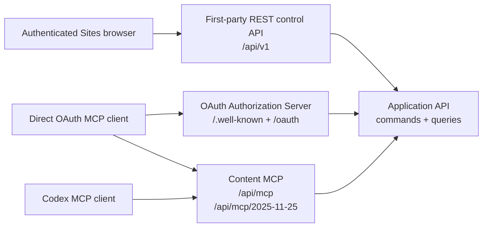

# REST и MCP API Mind Diary

## MD-453: асинхронный приём заметок (implemented, UAT verified, 2026-09-14)

`enqueue_note(mind, idempotency_key, title, text)` принимает одну добавочную
заметку до 64 KiB. Сервер сам формирует Markdown в `raw/inbox/`, сохраняет
точные bytes в Space-scoped object storage и durable receipt до ответа
`queued`. Ответ не означает canonical commit. `get_note_status(mind, receipt_id)`
возвращает `queued | running | committed | failed` и, после commit, exact
revision/path. Опрос и read-back агентом не обязательны. Повтор одинакового
ключа возвращает ту же квитанцию; другой payload с тем же ключом отклоняется.

Обработчик использует текущие credential/ACL и исходную write generation,
обычный producer validation и HEAD CAS. Добавочная операция может повториться
на новом HEAD; существующие файлы не заменяются. Payload сохраняется при ошибке.
Квитанция доступна только исходному principal с текущим доступом к Mind.
Заметки не копируются между Minds и не интерпретируются серверной моделью.

На Sites первоначальная обработка запускается через bounded `waitUntil` после
приёма; это не гарантия исполнения после потери isolate. Durable очередь
позволяет восстановление, но наличие автономного scheduler после сбоя должно
быть подтверждено отдельно. Не объявлять поддержку MCP Tasks. Большие файлы
продолжают использовать существующий file ingress; этот tool их не принимает.

> **Принятая multi-Mind поправка ADR-0028, 2026-09-11; реализация и UAT ещё не подтверждены.**
> `usage_mode` определяет разрешённые действия, description — темы.
> Personal `/me` получает опциональное description, настраиваемое через узкую
> MCP metadata operation по прямой просьбе пользователя без изменения mode/scopes.
> Без description любой enabled Mind читается/изменяется только по прямой
> просьбе; с description используется автоматически по теме в пределах
> `read | read_write`. Несколько ordinary Minds и Personal могут независимо
> иметь `read_write`; при нескольких совпадениях выполняются отдельные
> reads/commits, без фоновой синхронизации
> и неявного раскрытия Personal в shared Mind. Полный контракт —
> [режимы использования Mind](mind-usage-modes.md). Historical sections ниже не
> переопределяют этот target и не доказывают его реализацию.

> **Принятая поправка MD-409, 2026-09-08.** Текущий Content MCP добавляет
> детерминированные read-only `list_files`, `grep_files` и `read_files` для
> одной enabled exact revision. Их canonical semantics, limits, cursors,
> text/metadata profile и отличия от local `rg` заданы в
> [спецификации файловых операций](mcp-file-operations.md); historical catalog
> ниже не ограничивает эту новую surface.

Статус: proposal для верификации, обновлено 2026-09-11. Документ уточняет
wire-level контракты первого прототипа на основе принятых product decisions.
Product API и direct MCP route/compatibility repair реализованы, развёрнуты как
single-principal UAT в OpenAI Sites и проверены raw modern calls и реальным
`codex-cli 0.147.0` на обоих profiles. OAuth server/client surface реализована в
repository candidate. Для Codex Desktop/CLI pilot 0.1 принят direct MCP package
с OAuth при первом использовании. Synthetic multi-principal и OAuth/package
automation остаются blocking; ADR-0019 дополнительно требует blocking
real-account first-user UAT receipt. Machine-readable OpenAPI и MCP JSON Schemas
сохраняют historical Release 0.1/0.2 evidence и проверяют миграцию к принятой
[operation disposition Release 0.3](release-0.3-operation-disposition.md).
Текущий candidate уже удаляет binding mutations и administrative export из
обоих fresh MCP catalogs/schemas. MD-343 реализует
schema-verified credential target REST/UI и write-path generation fence по
[MD-339 contract](credential-write-target.md); exact hosted UAT evidence нового
candidate остаётся отдельным gate.

Wire catalog ниже сохраняет historical Release 0.1/0.2 as-built и не
переписывается MD-336. Целевая product authority Release 0.3 отделена явно;
exact route/tool disposition принята в
[operation disposition](release-0.3-operation-disposition.md), а access/target
schemas и migration — в [MD-339 contract](credential-write-target.md). Поэтому
наличие historical route/tool в этом документе не возвращает его в current
authority.

ADR-0015 и [BundleFile specification](bundle-files.md) сохраняют immutable
staging/commit/download baseline; ADR-0021 принимает Release 0.2 wire target:
manifest v4, open advisory media и 256 MiB streaming. Current implementation
status remains legacy raster/PDF/ZIP + 64 MiB after MD-247–MD-249; MD-304 owns
runtime migration. Поэтому deployed claims пока не включают format-neutral
native-file flow.

ADR-0016 and
[Sites storage/capacity/import specification](sites-storage-capacity-import.md)
сохраняют post-MVP application/wire boundary для usage, reservations and
Markdown import. MD-265/MD-266/MD-268 storage, capacity и streaming
export/cleanup реализованы в local candidate; MD-267 import session APIs и
Sites UI также реализованы локально, а прежний UAT deployment не является
evidence нового candidate.

ADR-0018 and [the unified file-ingress specification](file-ingress.md) define
the post-MVP portable source boundary for `session_attachment`, `local_path`,
`workspace/generated_artifact`, `connector_object`, `bounded_in_memory` and
`server_generated`. Native `session_attachment`, bounded inline and local
server-generated streaming are implemented locally. Release 0.3 Product Site
candidate дополнительно устанавливает constructor-owned
`ProductSiteRuntime.boundedInMemoryIngress.stage` для trusted hosted producer;
это internal application adapter, а не HTTP/MCP route или hosted capability
claim. MD-272 also implements the
repository-local companion boundary for local/workspace and bounded local
generated bytes. MD-274 adds a repository-local coordinator with explicit
capability discovery plus read-only exact-payload stage/commit reconciliation;
it reuses the existing atomic `commit_changeset` rather than defining another
revision transaction. Native client/profile UAT and hosted producer evidence
remain separate downstream gates. MD-305 implements the repository candidate
for hosted upload-intent service/HTTP/MCP composition; live hosted companion
evidence remains a downstream gate. MD-284 adds a repository-local Google
Drive reference adapter on the provider-neutral authorized-reader/staging
boundary. It does not add a public wire shape, enable a hosted binding or prove
provider UAT; those claims remain unavailable pending MD-319. Historical MD-250
closed without Release 0.2 promotion. MD-304 owns format-neutral core object
lifecycle and streaming stage/commit/download/export. MD-305 owns only the
hosted one-use upload-intent service plus HTTP/MCP metadata/composition for
local companion and workspace-generated sources; it consumes MD-304 ports and
does not own BundleFile storage. MD-275 owns the joined UAT gate.
MD-322 wires the trusted `server_generated` streaming adapter into hosted
composition as a constructor-owned internal application port. It accepts no
wire request and adds no MCP/REST tool, route or export surface; the public
capability row remains `not_available` until MD-290 late UAT installs and
verifies a privacy-safe producer use case.
The port receives an authenticated actor and explicit Mind, then resolves the
server-derived credential owner and exact active target generation itself. It
accepts no owner/generation/version field. Shared staging rechecks that same
generation and the pinned target-version stamp transactionally, so a concurrent
clear, switch or revoke fails with the canonical writable-target taxonomy and
cannot redirect generated bytes.
Its exact expected media is normalized to the lowercase MIME essence before
reconcile and canonical request hashing. A detected mismatch is rejected in
the shared streaming gate before object promotion/idempotency completion; the
temporary writer and quota reservation are released, leaving the same key
available for one corrected request.
MD-284 uses the same server-owned target authority for repository-local
`connector_object` ingress: its application request accepts an authenticated
MCP actor, explicit Mind, bounded source capability, representation and
idempotency key, but no owner, generation or target-version field. The current
target and Mind write authorization are both established before the adapter may
resolve its grant or read provider metadata. Target absence, mismatch, revoke or
race returns the canonical `writable_target_*` result and cannot reveal whether
the selected provider object exists.
No source may be inferred as hosted capability or used as a silent
base64/URL/path fallback. Ни одна из этих file/scale rows не блокирует
Markdown-first Release 0.1 по ADR-0019.

The upload-intent wire surface is not part of MD-303 or MD-304. MD-305 versions
its one-use intent/request/receipt metadata, expiry/replay errors and HTTP/MCP
composition without introducing a second staging record, digest rule, quota
model or canonical object lifecycle.

### Internal `bounded_in_memory` producer boundary

`ProductSiteRuntime.boundedInMemoryIngress.stage` — constructor-owned internal
adapter текущего Release 0.3 candidate. Он доступен только trusted producer,
который уже имеет server-derived `McpTokenActorContext`, exact `space_id` и
текущую generation выбранного write target. Вызов принимает безопасное display
filename, optional advisory media type, `Uint8Array`, idempotency key и optional
expected size/SHA-256. Никакие source kind, URL, provider object ID, local path,
prompt или credential поля через эту границу не принимаются.

Предел равен 4,194,304 bytes inclusive; следующий byte отклоняется до вызова
общего staging service. Принятые bytes проходят существующие filename,
recomputed SHA-256/size/media, current ACL/scope/target, quota, quarantine,
expiry, idempotency и reconcile checks. Результат — только verified
`staged_file_ref`; HEAD меняется лишь следующим explicit atomic
`commit_changeset`. Adapter не создаёт `structuredContent`, не добавляет bytes
в model context и не логирует payload.

Эта граница намеренно отсутствует в REST routes и MCP tools. До exact late-UAT
receipt публичный `get_file_ingress_capabilities` продолжает возвращать для
`bounded_in_memory` `not_available`, `server_transport: "none"` и
`max_bytes: 0`; repository composition сама по себе не является hosted support
evidence.

### Restricted-UAT generated-source route — не public API

`GET|POST /api/internal/uat/generated-sources` устанавливается только
constructor-gated composition при exact `uat + restricted-uat + 40-hex
candidate SHA`; partial, production-like или malformed configuration оставляет
route скрытым. Он отсутствует в OpenAPI/MCP discovery и не меняет public
capability rows.

Оба метода требуют trusted Sites identity registered principal. `GET` не
требует CSRF и возвращает exact shape:

```json
{
  "ok": true,
  "data": {
    "schema": "mind-diary/restricted-uat-generated-source-test/v1",
    "candidate_sha": "0123456789abcdef0123456789abcdef01234567",
    "capability_rows": [
      { "source_kind": "bounded_in_memory", "test_composition_status": "available", "test_transport": "constructor_owned_bytes", "max_bytes": 4194304 },
      { "source_kind": "server_generated", "test_composition_status": "available", "test_transport": "constructor_owned_stream", "max_bytes": 268435456 }
    ]
  }
}
```

Это только test-composition projection.

`POST` дополнительно требует `application/json`, exact same-origin `Origin` и
actor-bound `X-CSRF-Token`. Unknown fields запрещены; body ровно:

```json
{
  "action": "run_matrix",
  "personal_token_ref": "ptok_v1_0123456789abcdef0123456789abcdef",
  "run_id": "generated-uat-run-001"
}
```

`run_id` имеет grammar `[A-Za-z0-9][A-Za-z0-9._:-]{7,63}`. Ref должен
разрешаться внутри current actor в active token с exact name
`UAT Generated Sources`, effective `content:write`, expiry не более восьми
суток от `created_at` и current writable target на fresh active private
sole-owner ordinary Mind. Owner, Space и generation выводятся только из server
state. Request не принимает bytes/base64, path, URL, filename/media, provider
locator, prompt/job, Mind, principal, owner, binding/generation, target version
или generation instructions.

Server-owned matrix проверяет exact 4 MiB/+1, digest/stale target, stream
overflow/cancel/timeout/producer error, stage replay, no-HEAD-before-commit и
один atomic two-file commit с exact replay. Success использует тот же
`{"ok":true,"data":...}` envelope и те же `schema`, `candidate_sha` и
`capability_rows`, затем добавляет exact keys `status: "passed"`, 15 safe
`assertions`, `staged` size/SHA receipts и
`commit: {"one_revision":true,"replayed":true}`. Route не выполняет
redeploy, history/download/Web-export read-back, revoke или cleanup. Public
`get_file_ingress_capabilities` по-прежнему возвращает обе строки как
`not_available`, `none`, `0`.

## Назначение и граница

Mind Diary имеет четыре разные API-границы:



Historical Release 0.1/0.2 layout:

1. **First-party REST control API** обслуживает Sites UI: account, metadata
   Minds, visibility, invitations, memberships, ownership, deletion и MCP
   tokens. Это не публичный developer API.
2. **OAuth Authorization Server** связывает DCR client с тем же
   Sites-authenticated principal и выпускает scoped content tokens. Он не даёт
   control-plane capabilities.
3. **Content MCP** даёт агенту browse/search/fetch/history/validate/export и
   immediate content commits. Control-plane tools в нём отсутствуют.
4. **Internal application API** — типизированная граница use cases, которую
   вызывают REST и MCP adapters. В первом Sites deployment это не обязательно
   отдельная сеть или HTTP service.

Target Release 0.3 меняет product ownership, но не задаёт здесь premature wire
diff:

| Surface | Target authority |
|---|---|
| **First-party Sites control plane** | Account/Mind metadata and lifecycle, visibility, memberships/ownership, Connections, writable-target selection, token lifecycle, import/export orchestration/status/download и administrative destructive actions. |
| **Content MCP** | Discovery, explicit-Mind browse/search/fetch/history/standalone validation и отдельный atomic content commit в каждый server-approved exact `read_write` destination. No control operations or administrative export. |

Target read не требует mutable read binding/attach step. Content MCP не меняет
usage modes; каждый commit cross-check-ит server-approved per-Mind generation
вместе с current ACL/scope/routing metadata/HEAD. Replace/delete в changeset остаются content semantics
и не открывают account/Mind/credential lifecycle. Exact keep/move/retire
решения заданы в
[operation disposition](release-0.3-operation-disposition.md), а exact access
shape — в [MD-339 contract](credential-write-target.md).

Перед любым ACL-derived discovery/read MCP проверяет credential access profile.
Fresh/upgraded profile продолжает current ACL/visibility authorization;
pending legacy profile получает `credential_access_upgrade_required` со schema
`mind-diary/credential-access-upgrade-required/v1`, `retryable=false` и
remediation `upgrade | re-consent | reissue`. Этот result не содержит Mind
metadata. Historical read-binding state не является fallback authority.

Validation и финальный revision publish внутри Site-owned import являются
этапами import operation, а не отдельными inbound validate/ordinary-commit
operations. Internal reuse validator/HEAD CAS не меняет surface ownership.

Raw Markdown не выдаётся browser REST API. Узкий Markdown import ingress
принимает bytes только на запись в private staging и не добавляет browser read
surface; остальные content reads идут через authenticated MCP. Если adapters позже станут
отдельными services, internal HTTP должен получить service authentication и
не становится customer API автоматически.

## Что уже принято и что предлагается здесь

Historical Release 0.1/0.2 product invariants, которые current wire catalog не
переписывает:

- authenticated-only доступ и private-by-default;
- один principal-bound MCP connection для discovery всех разрешённых Minds и
  independent binding set каждого OAuth grant/personal token;
- `0..N` read bindings, `0..1` active write binding и fail-closed content
  access вне них;
- ровно один explicit Mind и одна resolved revision на content call;
- immutable revisions, HEAD CAS и immediate commits без server draft;
- роли `reader | editor | admin | owner` и scopes
  `content:read | content:write`;
- отсутствие control-plane operations в content MCP;
- UTF-8 Markdown/OKF 0.2 plus producer-defined arbitrary regular
  `BundleFile(kind=opaque)` up to 256 MiB; BundleFile не является OKF entity;
- отсутствие ZIP/binary/legacy import/extraction; Markdown-only file import
  implemented locally but remains unavailable until the exact UAT gate;
- отсутствие company-knowledge compatibility claim.

Предлагаемые для верификации wire-level решения:

- REST prefix `/api/v1`, JSON naming, pagination и error envelope;
- конкретный набор first-party REST routes;
- общие JSON-типы descriptors, selectors и errors;
- точные input/output shapes MCP tools;
- non-reserved modern endpoint и isolated Codex compatibility endpoint;
- OAuth discovery, DCR, PKCE/token/revoke и protected-resource challenges;
- tagged union для `commit_changeset.operations`;
- ограниченная MCP Resources surface для exact immutable files;
- tool annotations и разделение protocol/tool execution errors.

## Общие соглашения

### Имена и кодирование

- JSON fields используют `snake_case`.
- JSON requests и responses используют UTF-8.
- Timestamps используют RFC 3339 UTC, например `2026-08-05T22:00:00Z`.
- Calendar dates используют ISO 8601 `YYYY-MM-DD`.
- IDs — opaque case-sensitive strings. Клиент не парсит prefix или payload.
- Content paths используют `/` независимо от OS и всегда относительны корню
  bundle.
- Canonical Markdown path заканчивается на `.md`, не начинается с `/`, не
  содержит empty segment, `.`/`..`, backslash, control characters или
  percent-encoded separator.
- Canonical BundleFile path already uses Unicode NFC, has at most 1024 UTF-8
  bytes/255 per segment, does not end in `.md`, does not begin `.mind-diary/`
  and follows the remaining relative-path prohibitions above.
- Неизвестные JSON fields в request отклоняются, если schema не говорит иное.
  Это не относится к неизвестным OKF frontmatter fields: codec обязан их
  сохранять.
- Opaque `media_type` is an open advisory lowercase ASCII MIME essence
  `type/subtype`: exactly one slash, nonempty `tchar` sides and at most 127
  bytes. Parameters are parsed away; whitespace, controls and other header
  syntax are not stored. Missing,
  unknown, invalid or conflicting evidence canonicalizes to
  `application/octet-stream`; MIME never authorizes inline serving.

### Opaque identifiers

Внешние descriptors могут содержать:

| Field | Назначение |
|---|---|
| `mind_id` | Server-issued locator Mind; не bearer capability и не raw authority. |
| `revision_id` | Immutable domain revision ID. |
| `entry_id` | Exact locator, bound к `space_id + revision_id + path`; producer и consumer ограничивают его 512 characters. Новые `mdl2_` handles имеют fixed 37-character form и server-side encrypted payload с TTL. |
| `job_id` | Export job locator. |
| `connection_ref` | Product Site presentation locator actor-owned OAuth grant; не raw grant ID и не bearer. |
| `personal_token_ref` | Product Site presentation locator actor-owned personal token; не raw token ID и не bearer. |
| `token_id` | Internal metadata ID MCP token; Product Site browser его не получает. |
| `binding_owner_id` | Internal server-derived OAuth-grant/personal-token owner; не является Product Site route/response или authority claim. |
| `read_binding_id` | Immutable service record одного attached read target. |
| `write_binding_id` | Immutable active generation singleton write target. |
| `staged_file_ref` | Opaque verified staged file pinned to binding owner + Mind + exact write generation; expires and is not a content locator. |
| `request_id` | Correlation ID безопасного request log. |

Server повторно проверяет actor, scope и текущий доступ при использовании
любого ID. Знание ID не даёт access.

### MCP token secret и verifier

Token secret первого прототипа имеет один bounded canonical format:

```text
mdp_v1_<43 base64url characters without padding>
```

- payload декодируется ровно в 32 random bytes (256 bits), полученных через
  cryptographically secure random generator;
- общая длина secret — ровно 50 ASCII characters; другой prefix, padding,
  Unicode, лишние separators и oversized input отклоняются до storage lookup;
- для list/UI сохраняется только `display_prefix` вида
  `mdp_v1_<первые 6 payload characters>…`; он раскрывает не более 36 random
  bits, поэтому у secret остаётся не менее 220 неизвестных bits;
- lookup выполняется не по display prefix и не по raw/unkeyed secret hash, а по
  exact 32-byte HMAC-SHA-256 verifier полного canonical secret. HMAC key —
  отдельный deployment secret минимум 256 bits, не хранящийся рядом с token
  records;
- persisted verifier имеет versioned fixed-length encoding
  `hmac-sha256:v1:<64 lowercase hex characters>` и служит unique indexed
  lookup key. Это даёт один bounded lookup без scan/collision bucket;
- server после lookup сравнивает вычисленный и persisted verifier как два
  fixed-length byte arrays без data-dependent early exit. Для valid-format
  unknown/denied lookup выполняется тот же comparison с dummy verifier;
- различия malformed-format parsing и storage latency не считаются
  cryptographically constant-time. Внешний auth response всё равно generic и
  не раскрывает, найден ли record;
- выпуск возвращает secret через consume-once boundary. Retry не может получить
  прежний secret: он либо получает уже сохранённый safe результат без secret,
  либо создаёт новый token record с новым independently generated secret.

Медленный password KDF не применяется. При 256-bit random bearer secret
offline guessing не является реалистичной атакой, а PBKDF2/scrypt/Argon2 на
каждом MCP request увеличили бы latency и amplification для online DoS. Keyed
HMAC дополнительно отделяет read-only compromise token table от verifier key.
Решение и воспроизводимый benchmark зафиксированы в
[ADR-0005](../decisions/0005-mcp-token-secret-verifier.md).

### OAuth secrets, grants и verifier

OAuth client flow использует отдельные bounded opaque secrets:

```text
mdo_code_<43 base64url characters without padding>
mdo_access_<43 base64url characters without padding>
mdo_refresh_<43 base64url characters without padding>
```

Каждый payload содержит ровно 32 CSPRNG bytes. Server хранит только
domain-separated keyed HMAC-SHA-256 verifier и lifecycle metadata; один secret
нельзя принять в роли другого. Authorization code живёт 5 минут и потребляется
один раз, access token — 15 минут, rotating refresh token — не более 30 дней.
Повторное использование уже заменённого refresh token в течение 30 секунд от
server-side `used_at` возвращает `invalid_grant`, не выдаёт credentials и не
отзывает grant: параллельный caller должен перечитать общий credential store.
Повтор после этого bounded окна, некорректный `used_at` либо reuse в уже revoked
family отзывает весь grant и его active authorization records.

OAuth grant связан с `principal_id + client_id + resource`, а не с одним Mind.
Allowed resource для pilot — exact canonical modern MCP URL `/api/mcp`.
Поддерживаются scopes `content:read` и `content:write`; write всегда включает
read. Access token получает internal authorization mirror в существующем MCP
token store. Mirror не является user-visible personal token, но позволяет
application authorizer заново проверить token status, expiry и scopes внутри
ACL/CAS/commit transaction. Grant revoke и account deletion отзывают mirror до
best-effort cleanup OAuth normalized records.

Grant владеет independent `MindBindingSet`; refresh rotation сохраняет его,
revoke делает unusable, reconnect создаёт новый empty set. Для personal-token
path stable owner — `token_id`. Полный record/lifecycle/tool contract находится
в [Mind bindings](mind-bindings.md).

### Pagination

List operations используют:

```json
{
  "cursor": "opaque-cursor",
  "limit": 50
}
```

- `cursor` отсутствует на первой странице и не разбирается клиентом;
- response возвращает `next_cursor: null`, если следующей страницы нет;
- ordering стабилен внутри одной pagination snapshot;
- expired/invalid cursor возвращает `invalid_cursor`;
- default и maximum `limit` должны быть зафиксированы implementation config и
  conformance tests до release. Предлагаемый default — `50`, maximum — `100`.

### Idempotency и concurrency

- REST mutation передаёт `Idempotency-Key` header.
- MCP `create_file_upload_intent`, `stage_bundle_file`, `commit_changeset` и
  `capture_knowledge` передают
  `idempotency_key` как
  explicit tool argument.
- Запуск экспорта через Sites передаёт ключ только в `Idempotency-Key`; тело
  запроса не может подменить заголовок. Persisted namespace остаётся
  `start_export`, поэтому точный повтор не зависит от смены transport surface.
- Key namespaced server-side по actor, operation и target aggregate и связан с
  canonical request hash.
- Retry с тем же key и payload возвращает прежний result.
- Тот же key с другим payload возвращает `idempotency_conflict`.
- Metadata mutations используют `expected_metadata_version`.
- Content mutation использует exact `expected_revision` текущей HEAD.
- Server не выполняет last-writer-wins, hidden merge или partial commit.

### Common error

Application-layer error имеет стабильный machine code:

```json
{
  "code": "revision_conflict",
  "message": "HEAD changed; re-read the Mind and rebuild the changeset.",
  "retryable": true,
  "request_id": "req_opaque",
  "details": {
    "current_revision": "rev_opaque"
  }
}
```

`message` пригоден для человека и модели, но клиенты ветвятся только по
`code`. `details` не раскрывает private metadata при denied/not-found cases.
Все строковые codes ниже определены продуктом Mind Diary и не являются
зарегистрированными числовыми JSON-RPC/MCP error codes. REST adapter переносит
их в Problem Details, а MCP adapter — в tool execution result; protocol error
используется только в случаях, прямо отделённых в разделе
[MCP protocol и application errors](#mcp-protocol-и-application-errors).

MCP application outcome всегда остаётся успешным transport response
`tools/call` с `result.structuredContent.ok=false` и точным product `code`.
Validation, content и authorization failures имеют `isError=true`; connector
может дополнительно пометить такой вызов своим внешним `INVALID_ARGUMENT`, но
product code остаётся источником истины. Временный
`search_index_unavailable` возвращается как completed state-result с
`isError=false`, чтобы provider wrapper не смешивал корректный запрос и
неготовое состояние индекса. Для outcomes, где агенту нужен следующий шаг,
`details` содержит стабильную подсказку:

```json
{
  "category": "service_state",
  "state": "index_unavailable",
  "recovery": {
    "action": "use_file_workflow_same_revision",
    "retry_policy": "bounded",
    "preserve": ["mind", "revision"],
    "tools": ["list_files", "grep_files", "read_files"]
  }
}
```

`retryable=true` означает только, что тот же корректный request может позднее
успеть без изменения payload. Это не разрешение на бесконечный retry. Для
`search_index_unavailable` агент сразу продолжает canonical file workflow на
том же Mind и revision; повтор search допустим только ограниченно. Validation
errors имеют `retryable=false`, `category=validation`,
`state=request_rejected` и `recovery.action=correct_arguments`.

`metadata_queue_timeout` означает, что конкретная операция не получила доступ
к очереди метаданных за 2500 мс; `metadata_d1_timeout` — ограниченное ожидание
обычного D1 read. В web API это HTTP 503 с `retryable=true`; в MCP tool execution
— безопасная structured error с `retryable=true`, без provider diagnostics.
Product Worker отдельно ограничивает ожидание ответа 10 секундами, включая
инициализацию и callback: HTTP 503 `request_timeout`, а при отмене клиента —
`request_canceled`. Эти ответы не доказывают отсутствие commit всего запроса.
После неизвестного результата записи сначала требуется read-back/reconciliation,
а повтор сохраняет исходный idempotency key и payload. Deadline относится к
получению Response, не к передаче уже открытого streaming body.

Операторское обслуживание вызывается явно через
`POST /api/v1/internal/operators/recovery` с JSON `{"limit":1}` (1–4).
Маршрут требует registered Sites identity из server-side operator allowlist,
exact Origin и CSRF; не добавляет MCP tools/scopes или права обычным участникам.
Ответ содержит только агрегаты прохода. Повтор продолжает durable jobs с
сохранёнными leases/cursors; timeout не доказывает отсутствие выполненной работы.

### Операторская выдача системного бэкапа MD-445

`/api/v1/internal/system-backup/**` — отдельная машинная surface, скрытая при
отсутствии `MIND_DIARY_BACKUP_OPERATOR_KEY`. Она принимает только exact
`Authorization: Bearer mdb_v1_{base64url-32-bytes}` из независимо выданного
read-only operator credential. Sites session, обычный участник, personal MCP
token и OAuth grant не получают эту capability. Ключ не передаётся через URL,
cookie или body, не входит в ответ и не журналируется. Конфигурация реального
ключа и подключение unattended runner — отдельное действие над доступом и
секретом, а не побочный эффект UAT deployment.

| Method | Route | Результат |
|---|---|---|
| `POST` | `/api/v1/internal/system-backup/sessions` | Создать fixed-target session. Body содержит обязательный случайный UUID v4 `request_id` и optional `base_checkpoint`; повтор с тем же ID после потерянного ответа возвращает ту же точку либо `409`, пока она строится. Ответ — format, mode (`baseline`, `incremental`, `rebaseline`), base/target, page/object counts, manifest digest, expiry. |
| `GET` | `/api/v1/internal/system-backup/sessions/{session_id}` | Повторить descriptor активной session. |
| `GET` | `/api/v1/internal/system-backup/sessions/{session_id}/pages/{index}` | Одну immutable bounded JSON страницу `upsert` fragments/`delete` records с SHA-256. |
| `GET` | `/api/v1/internal/system-backup/sessions/{session_id}/inventory?cursor=&limit=` | До 128 descriptors объектов; `next_cursor` задаёт продолжение. |
| `GET` | `/api/v1/internal/system-backup/sessions/{session_id}/objects/{index}?offset=&length=` | Verified R2 range не более 4 МиБ, HTTP `206` с part/object digest и `Content-Range`. |
| `POST` | `/api/v1/internal/system-backup/sessions/{session_id}/complete` | D1 CAS completion receipt; только он разрешает локальному клиенту продвинуть checkpoint после полной проверки. |
| `DELETE` | `/api/v1/internal/system-backup/sessions/{session_id}` | Отпустить ещё активную session. |

Все ответы имеют `Cache-Control: no-store`. Неаутентифицированный и
неправильный credential получает одинаковый `404`; некорректный input — `400`,
неактивная/инвалидированная точка — `409`, недоступное хранилище или
неизвестная durable surface — `503`. Session ID и object index — только
локаторы внутри operator capability. Исходные object keys и персональные
данные остаются в operator-only ответах и не попадают в общие логи.

Базовая taxonomy:

| Code | Смысл |
|---|---|
| `authentication_required` | Нет действующей authenticated identity/token. |
| `token_expired` | MCP token истёк. |
| `token_revoked` | MCP token отозван. |
| `credential_access_upgrade_required` | Legacy credential profile должен пройти upgrade/re-consent/reissue до ACL-derived discovery/read; result не раскрывает Mind metadata. |
| `insufficient_scope` | Token не имеет нужного scope. |
| `forbidden` | Actor известен, но capability отсутствует. |
| `mind_not_found` | Mind не существует либо не должен быть различим caller. |
| `handle_unavailable` | Handle occupied, reserved или retired. |
| `invalid_description` | Ordinary Mind description нарушает normalization/length contract. |
| `personal_mind_operation_forbidden` | Ordinary-only операция направлена в Personal Mind. |
| `revision_not_found` | Exact revision/as-of не разрешается. |
| `historical_read_only` | Mutation направлена не в current HEAD. |
| `metadata_conflict` | `expected_metadata_version` stale. |
| `revision_conflict` | `expected_revision` stale. |
| `idempotency_conflict` | Key повторно использован с другим payload. |
| `writable_target_required` | Active credential не имеет выбранного writable target либо требует explicit upgrade/reissue. |
| `writable_target_mismatch` | Explicit Mind не совпадает с Site-selected target; другой target не раскрывается. |
| `writable_target_unavailable` | Credential, target state или pinned generation больше не usable. |
| `target_conflict` | Site-only `expected_target_version` stale; mutation не меняет state и не раскрывает target metadata. |
| `invalid_cursor` | Cursor malformed, expired или относится к другому query. |
| `invalid_path` | Path нарушает canonical path policy. |
| `file_exists` | `create_file` направлен в существующий path. |
| `file_not_found` | Replace/delete не находит path в expected revision. |
| `native_file_input_unsupported` | Pinned client/profile cannot supply the required native file parameter. |
| `file_ingress_source_unsupported` | No enabled adapter/profile can read the requested source kind. |
| `file_ingress_source_unavailable` | Source object or ownership cannot be established without revealing existence. |
| `file_ingress_transport_unavailable` | Bounded source transport failed transiently; retry the exact request/key. |
| `file_ingress_intent_expired` | One-use out-of-band upload intent expired. |
| `file_ingress_intent_conflict` | Intent payload changed, was rejected or a second PUT attempted to consume it. |
| `bundle_file_size_limit_exceeded` | One opaque file exceeds 268,435,456 bytes (256 MiB); the limit is inclusive. |
| `bundle_file_size_mismatch` | Uploaded stream size differs from the immutable intent declaration. |
| `bundle_file_operation_limit_exceeded` | More than 20 BundleFile operations. |
| `bundle_file_changeset_size_limit_exceeded` | Staged bytes referenced by one changeset exceed 268,435,456 bytes (256 MiB). |
| `bundle_file_quota_exceeded` | Resulting 1 GiB revision or 2 GiB retained Space quota would be exceeded. |
| `staging_quota_exceeded` | Binding owner has more than 256 MiB outstanding staged bytes. |
| `unsupported_bundle_file_type` | Legacy pre-v4 candidate only; v4 cannot reject a regular file solely for unknown MIME/extension. |
| `bundle_file_media_mismatch` | Advisory declared/detected conflict normally falls back to `application/octet-stream`; an internal exact expected-media receipt instead rejects before staged-object promotion. |
| `staged_file_unavailable` | Ref is missing/foreign without revealing ownership/existence. |
| `staged_file_expired` | Own verified ref passed its 60-minute TTL. |
| `staged_file_consumed` | Own ref was already bound by another successful commit. |
| `staged_file_rejected` | Static quarantine gate rejected own ref. |
| `staged_file_binding_stale` | Ref is pinned to an invalidated write generation. |
| `bundle_file_exists` | Create targets an existing exact path. |
| `bundle_file_not_found` | Replace/delete/read target is absent without private leakage. |
| `bundle_file_digest_mismatch` | Opaque replace/delete precondition differs. |
| `bundle_file_integrity_failure` | Manifest digest/size and stored exact bytes differ. |
| `bundle_file_download_expired` | One-use file download grant expired/was consumed. |
| `export_profile_required` | Mixed revision needs explicit `MD-BUNDLE-ZIP-1`; legacy export cannot omit files. |
| `okf_validation_failed` | Resulting changeset либо exact export revision не образует valid OKF 0.2 bundle. |
| `revision_integrity_failure` | Exact committed manifest/object bytes не прошли integrity materialization. |
| `archive_limit_exceeded` | Exact bundle превышает classic-ZIP limits `MD-OKF-ZIP-1`; ZIP64 fallback отсутствует. |
| `search_index_unavailable` | Exact revision index отсутствует/lag; HEAD не подмешивается. |
| `export_not_ready` | Export ещё не завершён. |
| `export_expired` | Job либо download grant больше не доступен. |
| `rate_limited` | Превышен применимый request/tool quota. |

## Общие response-типы

### `MindDescriptor`

```json
{
  "mind_id": "mind_opaque",
  "route": "/research-notes",
  "handle": "research-notes",
  "name": "Research Notes",
  "description": "Research decisions and supporting notes.",
  "is_personal": false,
  "visibility": "private",
  "discovery": "membership",
  "access": {
    "kind": "membership",
    "role": "editor",
    "capabilities": ["content:read", "content:write"]
  },
  "metadata_version": 7,
  "head": {
    "revision_id": "rev_opaque",
    "revision_number": 18,
    "committed_at": "2026-08-05T21:57:00Z"
  }
}
```

Rules:

- Personal Mind имеет `route: "/me"`, `handle: null`, `is_personal: true` и
  `visibility: "private"`; поле `description` в его descriptor отсутствует.
- Descriptor обычного Mind всегда содержит `description: string | null` после
  current authorization. Это текущая service metadata, а не content выбранной
  historical revision.
- `discovery` — `personal | membership | public_catalog | exact_handle`.
- Baseline reader имеет `access.kind: "visibility"`, `role: null` и только
  read capabilities.
- Private denial не возвращает descriptor.

### `RevisionDescriptor`

```json
{
  "revision_id": "rev_opaque",
  "revision_number": 18,
  "parent_revision_id": "rev_previous",
  "committed_at": "2026-08-05T21:57:00Z",
  "committed_by": {
    "kind": "principal",
    "id": "actor_opaque",
    "display_name": "Andrey"
  },
  "summary": "Add API design notes",
  "manifest_hash": "sha256:...",
  "is_head": true
}
```

`committed_by.display_name` отсутствует для `deleted-principal` tombstone и
может отсутствовать по privacy policy.

### `RevisionSelector`

Если selector отсутствует, server разрешает current HEAD в exact
`resolved_revision_id` в начале call.

```json
{ "kind": "head" }
```

```json
{ "kind": "revision", "revision_id": "rev_opaque" }
```

```json
{ "kind": "as_of", "as_of": "2026-08-05T21:57:00Z" }
```

`as_of` выбирает revision с максимальным `revision_number`, для которой
`committed_at <= as_of`. Любой resolved non-HEAD selector read-only.

## Historical Release 0.1/0.2 first-party REST control API

### Transport и authentication

- Base path: `/api/v1`.
- Content type: `application/json`; errors — `application/problem+json`.
- REST adapter принимает только trusted Sites identity context, добавленный
  platform/server boundary. JSON fields, query params и browser-supplied
  `principal_id`, email, role или Sites identity headers не являются authority.
- `GET /session` и `POST /account` допускают platform-authenticated identity,
  для которой principal ещё не создан. Все остальные routes требуют active
  registered principal.
- MCP bearer token не принимается REST control API.
- Mutating browser requests требуют valid same-origin `Origin` и CSRF
  protection. Предлагаемый wire field — `X-CSRF-Token`, полученный из
  `GET /api/v1/session`; exact Sites integration остаётся compatibility gate.
- Secret, CSRF token, authenticated/account email, private query/body и
  deletion download grants не логируются.

### Signed-out browser entry

Public reachability OpenAI Site не является anonymous REST или Mind access.
Adapter различает human UI entry и machine endpoints до product data access:

| Request | Signed-out result |
|---|---|
| `GET`/`HEAD` распознанного UI route (`/`, `/me`, `/minds`, `/public`, `/invitations`, `/settings/account`, `/settings/connections`, `/settings/connections/{connection_ref}`, `/settings/developer/mcp`, `/settings/mcp`, `/help`, `/help/codex`, canonical `/{handle}`) | `200 text/html`; одинаковый static sign-in shell со ссылкой exact `/signin-with-chatgpt`, `Cache-Control: no-store`, без CSRF и product projections. `HEAD` возвращает те же status/headers без body. |
| Любой `/api/v1/**` без trusted Sites identity | JSON `401 authentication_required`; HTML не возвращается. |
| UI или REST при недоступном trusted identity provider/binding | JSON `503 identity_binding_unavailable`; sign-in shell не маскирует outage. |
| `/api/mcp`, `/api/mcp/2025-11-25` без valid product Bearer | Existing MCP `401` + `WWW-Authenticate` contract; Sites sign-in shell не участвует. |
| OAuth routes | Existing authorization-server contract; product Web adapter не реализует `/signin-with-chatgpt`, `/signout-with-chatgpt` или callback. |

Signed-out UI shell route-agnostic: он не отражает handle или target metadata,
поэтому response на `/{handle}` не подтверждает существование Mind и не
создаёт enumeration channel. После platform sign-in следующий request заново
разрешает trusted identity и authorization. Никакой client-supplied identity,
account association, ACL, Origin/CSRF или scope rule этим entry contract не
ослабляется.

Официальный Sites contract на момент обновления документирует
`oai-authenticated-user-email` как authenticated email address и optional
`oai-authenticated-user-full-name`, но не обещает immutable external subject
или отдельный provider-level `verified` claim. Initial normalized-email binding
— принятый project profile поверх trusted header; после bootstrap authority
задаёт immutable internal `principal_id`. Изменение platform semantics требует
повторной compatibility проверки, а не automatic relink.

### REST response envelope

Successful JSON response:

```json
{
  "data": {},
  "request_id": "req_opaque"
}
```

List response:

```json
{
  "data": [],
  "next_cursor": null,
  "request_id": "req_opaque"
}
```

Problem Details response:

```json
{
  "type": "https://mind-diary.example/problems/revision-conflict",
  "title": "Revision conflict",
  "status": 409,
  "code": "revision_conflict",
  "detail": "HEAD changed; re-read and retry.",
  "request_id": "req_opaque",
  "details": {
    "current_revision": "rev_opaque"
  }
}
```

Основные HTTP mappings:

| HTTP | Application condition |
|---:|---|
| `400` | Invalid JSON, field, cursor, handle grammar или command shape. |
| `401` | Нет valid Sites account context. |
| `403` | Authenticated actor не имеет capability. |
| `404` | Resource отсутствует или не должен быть различим caller. |
| `409` | Version/revision/idempotency/handle/invariant conflict. |
| `422` | Syntactically valid command нарушает domain validation. |
| `429` | Rate limit. |
| `500` | Unexpected internal failure без private details. |
| `503` | Required storage/index dependency временно unavailable. |

### REST routes

| Method | Route | Назначение |
|---|---|---|
| `GET` | `/api/v1/session` | Sites identity, account state и CSRF bootstrap. |
| `POST` | `/api/v1/account` | Explicit isolated account + Personal Mind bootstrap. |
| `PATCH` | `/api/v1/account` | Изменить principal display name. |
| `GET` | `/api/v1/account/deletion-impact` | Получить exact cascade preview. |
| `DELETE` | `/api/v1/account` | Подтвердить irreversible account deletion. |
| `GET` | `/api/v1/minds` | Personal Mind и accepted memberships. |
| `POST` | `/api/v1/minds` | Создать ordinary Mind и sole Owner. |
| `GET` | `/api/v1/minds/{mind_ref}` | Разрешённая control metadata. |
| `PATCH` | `/api/v1/minds/{mind_ref}` | Rename display name/settings. |
| `GET` | `/api/v1/minds/{mind_ref}/deletion-impact` | Preview Mind deletion. |
| `DELETE` | `/api/v1/minds/{mind_ref}` | Irreversible whole-Mind deletion. |
| `GET` | `/api/v1/public-minds` | Authenticated bounded public catalog; optional exact-once `cursor` and integer `limit`, default `24`, maximum `50`. |
| `PUT` | `/api/v1/minds/{mind_ref}/visibility` | Owner-only visibility change. |
| `GET` | `/api/v1/minds/{mind_ref}/members` | Active participants. |
| `PATCH` | `/api/v1/minds/{mind_ref}/members/{member_id}` | Allowed role mutation. |
| `DELETE` | `/api/v1/minds/{mind_ref}/members/{member_id}` | Revoke allowed membership. |
| `POST` | `/api/v1/minds/{mind_ref}/leave` | Non-owner leaves Mind. |
| `POST` | `/api/v1/minds/{mind_ref}/ownership-transfer` | Atomic Owner → target, source → Admin. |
| `GET` | `/api/v1/invitations` | Invitations caller may see. |
| `GET` | `/api/v1/invitations-overview` | Browser-only allowlist projection только incoming invitation events с server-owned canonical ordinary Mind route; без email, principal IDs, outgoing invitations и content. |
| `POST` | `/api/v1/minds/{mind_ref}/invitations` | Invite registered principal. |
| `POST` | `/api/v1/invitations/{invitation_id}/accept` | Target accepts pending invitation. |
| `POST` | `/api/v1/invitations/{invitation_id}/reject` | Target rejects pending invitation. |
| `POST` | `/api/v1/invitations/{invitation_id}/reissue` | Current authorized sender atomically replaces an invitation. |
| `DELETE` | `/api/v1/invitations/{invitation_id}` | Authorized sender cancels invitation. |
| `GET` | `/api/v1/mcp-tokens` | Bounded personal-token metadata/history with separate actor-bound cursor, never secrets/verifiers. |
| `POST` | `/api/v1/mcp-tokens` | Issue named personal MCP token once. |
| `PATCH` | `/api/v1/mcp-tokens/{personal_token_ref}/mind-access` | Advanced MCP personal-token access mutation with CAS and safe read-back. |
| `DELETE` | `/api/v1/mcp-tokens/{personal_token_ref}` | Revoke actor-owned token through presentation ref. |
| `GET` | `/api/v1/connections` | Bounded page active OAuth connections current actor; opaque actor-bound cursor. |
| `GET` | `/api/v1/connections/{connection_ref}` | Actor-safe connection detail; unknown/foreign/revoked ref indistinguishable `404`. |
| `PATCH` | `/api/v1/connections/{connection_ref}/mind-access` | Sites-authenticated principal меняет ordinary connection access с CAS и server-owned read-back. |
| `DELETE` | `/api/v1/connections/{connection_ref}` | Fail-closed revoke + hide own active OAuth connection. |
| `GET` | `/api/v1/internal/operators/users` | Constructor-allowlisted service operator получает bounded read-only principal/activity directory; для остальных route indistinguishable `404`. |
| `POST` | `/api/v1/minds/{mind_ref}/markdown-import-plans` | Local candidate: metadata-only exact-snapshot plan before reservation/staging. |
| `POST` | `/api/v1/minds/{mind_ref}/markdown-imports` | Local candidate: reserve a current plan and create a principal-private session. |
| `PUT` | `/api/v1/markdown-imports/{import_id}/batches/{checkpoint}` | Local candidate: bounded multipart Markdown batch with exact replay. |
| `GET` | `/api/v1/markdown-imports/{import_id}` | Local candidate: authorized stage/validation/promotion progress and sanitized diagnostics. |
| `POST` | `/api/v1/markdown-imports/{import_id}/validate` | Local candidate: advance one bounded validation page; repeat through `validated`. |
| `POST` | `/api/v1/markdown-imports/{import_id}/commit` | Local candidate: advance bounded canonical promotion; last call performs one HEAD CAS. |
| `DELETE` | `/api/v1/markdown-imports/{import_id}` | Local candidate: cancel before HEAD commit and schedule bounded cleanup. |
| `POST` | `/api/v1/minds/{mind_ref}/exports` | Release 0.3 local candidate: start one creator-owned exact-revision export; returns `202`. |
| `GET` | `/api/v1/export-jobs/{job_id}` | Release 0.3 local candidate: creator-private safe status/receipt and, after current reauthorization, a fresh short-lived download grant. |

`mind_ref` в REST — `me` или canonical `space_handle`. Adapter разрешает его
в internal `space_id` и только затем authorizes request.

Таблица routes выше описывает текущую локальную сборку и wire compatibility.
Управление экспортом Release 0.3 уже перенесено в Sites REST; существующий
response-only route `GET /api/v1/exports/{download_secret}` сохраняется.
Полный operation register принят в MD-337, а access/binding calls и schemas
ограничены [MD-339 contract](credential-write-target.md).

Internal operator query принимает bounded `query`, `state`,
`registered_from|to`, `activity_from|to`, `never_active`, `sort`, `direction`,
`limit` и opaque `cursor`. Response следует
[service-operator contract](service-operator-directory.md), не возвращает
corpus/Mind names/request history и audit-ит только opaque operator,
operation/time. Это не content MCP и не customer-wide user-search API.

Markdown import wire contract в local candidate:

- plan принимает `expected_revision_id`, `Idempotency-Key` и полный массив
  `{path, sha256, size}`; response возвращает immutable `plan_id`, counts,
  `descriptor_hash`, `logical_bytes`, expiry и projected utilization без
  content bodies;
- start принимает `plan_id` и новый `Idempotency-Key`, атомарно проверяет HEAD,
  access и capacity reservation и возвращает private `import_id`;
- batch использует `multipart/form-data`: строковый part `manifest` содержит
  `{expected_version, files:[{field,path,sha256,size}]}`, а каждый `field`
  ссылается на один binary part. Path checkpoint начинается с `1`, строго
  возрастает и exact replay не создаёт дубли;
- `validate` принимает `{expected_version}` и за один call продвигает не более
  100 files / 4 MiB. Response может вернуть `validation_progress`; client
  повторяет command по новым `version`/`validation_checkpoint` до `validated`;
- `commit` принимает `{expected_version, summary?}` и аналогично продвигает
  bounded canonical promotion. `commit_progress` не меняет HEAD; только
  terminal `committed` возвращает `revision_id` после одного exact CAS;
- `GET` возвращает session state, stage/validation/promotion checkpoints,
  bounded counts/bytes и sanitized `{path, code}` failures только создавшему
  principal; `DELETE` принимает `{expected_version}` и до terminal commit
  переводит session в cleanup без изменения HEAD.

Plan/start/commit HEAD, version и idempotency conflicts возвращают `409`;
invalid command shape — `400`; OKF/import/quota validation — `422`; временно
недоверенный capacity accounting — `503`. Все mutation routes требуют exact
Origin + CSRF, а raw paths/content не попадают в error envelope или logs.

### Session и account bootstrap

`GET /api/v1/session` до создания account:

```json
{
  "data": {
    "account_state": "registration_required",
    "can_create_isolated_account": true,
    "manual_recovery_available": true,
    "csrf_token": "secret-not-for-logs"
  },
  "request_id": "req_opaque"
}
```

Для active account response содержит safe principal metadata и Personal Mind
descriptor. Full authenticated/account email возвращать не требуется.

`POST /api/v1/account`:

```http
POST /api/v1/account
Content-Type: application/json
Idempotency-Key: 01J...
X-CSRF-Token: ...
```

```json
{
  "action": "create_isolated_account",
  "display_name": "Andrey"
}
```

`action` делает explicit решение создать новый isolated account проверяемым и
не позволяет трактовать неизвестный email как automatic relink. Success
атомарно возвращает principal и единственный Personal Mind. Повтор не создаёт
второй account/Mind.

`PATCH /api/v1/account`:

```json
{
  "display_name": "Andrey",
  "expected_profile_version": 3
}
```

Success обновляет также display `name` Personal Mind, но не content HEAD.

### Account deletion

`GET /api/v1/account/deletion-impact` возвращает bounded preview:

```json
{
  "data": {
    "impact_id": "impact_opaque",
    "expires_at": "2026-08-05T22:20:00Z",
    "personal_mind": { "route": "/me", "name": "Andrey" },
    "owned_minds": [
      { "route": "/research-notes", "name": "Research Notes" }
    ],
    "foreign_memberships_count": 2,
    "pending_invitations_count": 1,
    "active_mcp_tokens_count": 3,
    "irreversible": true
  },
  "request_id": "req_opaque"
}
```

`DELETE /api/v1/account` требует `impact_id`, exact confirmation phrase и
`Idempotency-Key`:

```json
{
  "impact_id": "impact_opaque",
  "confirmation": "delete-account"
}
```

Expired/stale impact получает `409 deletion_impact_changed`; UI перечитывает
preview. Success возвращает `204 No Content` только после завершения принятого
MVP cascade.

### Minds и visibility

`POST /api/v1/minds`:

```json
{
  "name": "Research Notes",
  "handle": "research-notes",
  "description": "Research decisions and supporting notes."
}
```

Success: `201 Created`, `Location: /api/v1/minds/research-notes`, descriptor с
`visibility: "private"`, sole Owner и initial HEAD. Occupied/reserved/retired
handle одинаково возвращает `handle_unavailable`. `description` optional:
omission, `null` и строка, ставшая пустой после normalization, сохраняют
`description: null`.

`PATCH /api/v1/minds/{mind_ref}`:

```json
{
  "name": "Research Library",
  "description": "Curated research decisions and evidence.",
  "expected_metadata_version": 7
}
```

Request должен содержать `name`, `description` или оба поля. Omitted поле не
меняется; `description: null` или normalized-empty string очищает описание.
Оба изменения выполняются атомарно и повышают `metadata_version` ровно на один;
normalized no-op не повышает version. Update требует current Admin или Owner,
`Idempotency-Key` и fresh `expected_metadata_version`. Personal Mind получает
`personal_mind_operation_forbidden`. Handle в MVP не меняется; service metadata
update не создаёт content revision и не меняет HEAD или access state.

Для `description` create и update используют один contract: NFKC, перевод
`CRLF`/`CR` в `LF`, trim внешних Unicode whitespace, максимум 500 Unicode code
points. NUL, остальные C0 controls кроме `LF`, C1 controls и unpaired
surrogates получают `invalid_description`. Internal `LF` сохраняется.

`PUT /api/v1/minds/{mind_ref}/visibility`:

```json
{
  "visibility": "unlisted",
  "expected_metadata_version": 7,
  "acknowledge_live_head_and_history_exposure": true
}
```

Acknowledgement обязательно при переходе из `private` в `public` или
`unlisted`. Переход обратно в `private` немедленно прекращает baseline reads,
но не обещает отменить прежнее раскрытие.

Mind deletion использует тот же двухшаговый `deletion-impact` contract, что
account deletion. Personal Mind получает `forbidden`; Owner ordinary Mind
должен подтвердить удаление всей history и participants.

`GET /api/v1/public-minds` принимает только необязательные query-параметры
`cursor` и `limit`. Повтор параметра, неизвестный параметр, пустой либо неверный
cursor и `limit` вне `1..50` возвращают `400 invalid_request` до обращения к
application layer. Первая страница использует server default `24`; следующий
запрос передаёт точный непрозрачный `next_cursor`. Cursor относится к immutable
catalog snapshot и не разбирается браузером; истёкшая generation получает
`400 invalid_cursor`, после чего UI начинает новый snapshot с первой страницы.

Успешный ответ возвращает отдельный top-level cursor и компактные элементы
каталога:

```json
{
  "data": {
    "minds": [
      {
        "mind_id": "mind_opaque",
        "route": "/research-notes",
        "name": "Research Notes",
        "description": "Public research decisions and evidence.",
        "summary": "Public research decisions and evidence.",
        "visibility": "public",
        "is_personal": false,
        "discovery": "public_catalog"
      }
    ]
  },
  "next_cursor": "opaque-cursor",
  "request_id": "req_opaque"
}
```

`description` — current authorized ordinary-Mind service metadata либо `null`;
`summary` — однострочная проекция не длиннее 180 Unicode code points с
нейтральным fallback. Ответ не содержит `handle` отдельно от canonical
route, revision/access/membership IDs, role/capabilities, corpus snippets,
content counts или ranking signal. Personal, private и unlisted candidates
отбрасываются до projection. Каждый непрозрачный кандидат каталога проходит current
authorization и `visibility: public` до чтения route metadata и ещё одну
проверку актуального состояния перед выдачей. Хранилище каталога, cursor и
старая страница не являются authority; public → private или deletion между
чтениями страниц скрывает кандидата без утечки metadata.

Переход по `route` использует обычный
`GET /api/v1/minds/{mind_ref}`/`/{space_handle}` resolver. Он заново разрешает
handle, авторизует current membership либо public/unlisted baseline grant до
metadata/object reads и повторно проверяет current state. Бывший участник такого
public Mind получает visibility baseline Reader, а не resurrected membership;
после public → private тот же request возвращает indistinguishable
`404 mind_not_found`. Каталог не добавляет anonymous access, favorites,
filters, recommendations, ranking, corpus full-text search или отдельную модель
публикации.

### Memberships, invitations и ownership

Member descriptor:

```json
{
  "member_id": "member_opaque",
  "display_name": "Andrey",
  "role": "editor",
  "state": "active",
  "membership_version": 4,
  "is_self": true
}
```

Invitation descriptor:

```json
{
  "invitation_id": "invite_opaque",
  "mind": {},
  "target": {
    "principal_id": "principal_opaque",
    "display_name": "Registered User"
  },
  "proposed_role": "editor",
  "state": "pending",
  "expires_at": "2026-08-12T22:00:00Z",
  "invitation_version": 1
}
```

Global inbox использует отдельную browser allowlist projection:

```json
{
  "invitations": [
    {
      "invitation_id": "invite_opaque",
      "mind_id": "mind_opaque",
      "mind_name": "Shared Research",
      "mind_route": "/shared-research",
      "direction": "incoming",
      "counterparty_display_name": "Registered Owner",
      "proposed_role": "editor",
      "state": "pending",
      "expires_at": "2026-08-12T22:00:00Z",
      "invitation_version": 1,
      "can_manage": true
    }
  ]
}
```

Projection включает только incoming events current actor и не зависит от уже
accepted membership list: canonical `mind_route` приходит из server-side join
самой invitation с current active ordinary Mind. Invalid route или non-incoming
row отбрасывается fail closed. Оба рабочих списка — incoming overview и
contextual outgoing exact-Mind section — содержат только effective pending rows:
`state = pending` и `server_now < expires_at`. Terminal
`accepted | rejected | cancelled | expired` records не возвращаются, не имеют
`can_manage` и не появляются снова после late action/reload. Ни этот endpoint,
ни exact-email create не возвращают directory suggestions, похожие accounts или
email адреса.

Account email возвращается только там, где он нужен exact invite workflow и
caller уже имеет право его видеть; list/member responses по умолчанию используют
opaque ID и display name. Wire field `target_verified_email` — исторически
принятое product name для exact email, уже сохранённого в registered account;
оно не является утверждением об immutable или independently verified Sites
subject.

Create invitation:

```json
{
  "target_verified_email": "registered@example.com",
  "role": "editor",
  "expected_metadata_version": 7
}
```

Server выполняет exact lookup зарегистрированного principal. Неизвестный email
возвращает `registered_principal_not_found` без fuzzy alternatives. Success
создаёт pending invitation с `expires_at` через семь дней, но не membership.

`expires_at` — server-owned UTC boundary. `accept_invitation` создаёт membership
только когда transaction наблюдает `state = pending` и
`server_now < expires_at`. При `server_now >= expires_at` та же transaction
переводит effective state в `expired` и возвращает current terminal result без
membership. Это правило применяется до duplicate-pending guard и до любой
actionable projection, поэтому overdue row не зависит от запуска scheduler, не
даёт access и не мешает обычному `POST .../invitations` создать новый record с
новым opaque ID и новым seven-day expiry.

`POST /api/v1/invitations/{invitation_id}/reissue` вызывает internal command
`reissue_invitation` с `expected_invitation_version` и `Idempotency-Key`.
Command atomically завершает прежнюю invitation, создаёт replacement с новым
opaque ID и новым seven-day expiry и никогда не оставляет две pending
invitations для одной lifecycle transition. Replay того же canonical request
возвращает тот же replacement; другой payload с тем же key получает
`idempotency_conflict`.

Если reissue гоняется с expiry, cancel, reject или accept, один metadata
transaction становится winner. До expiry reissue terminalizes прежний pending
record и создаёт replacement; на границе и после неё прежний record сначала
считается `expired`. Normal create после effective expiry является основным UI
путём повторного приглашения и не требует ID скрытой terminal записи. Все
success/conflict/late-action ответы заставляют browser перечитать active-only
projection; client time не выбирает winner.

Role mutation:

```json
{
  "role": "reader",
  "expected_membership_version": 4
}
```

Admin изменяет/revokes только Reader/Editor. Owner дополнительно управляет
Admin. Назначение Owner через этот route запрещено.

`PATCH` role, `DELETE` revoke и `POST .../leave` передают current
`expected_membership_version` и `Idempotency-Key`. Leave всегда выбирает
membership текущего Sites principal server-side; клиент не передаёт actor
`member_id`. До role/revoke/leave Product Site показывает отдельное
контекстное подтверждение. Для revoke/leave оно явно различает последствия:
private Mind закрывает весь дальнейший доступ, а public/unlisted Mind может
оставить бывшему participant только authenticated baseline Reader grant без
membership, write и management rights.

После каждого success, version/authority conflict или неоднозначной transport
ошибки browser инвалидирует все actions из показанной membership projection и
перечитывает canonical `/{space_handle}` route. Только новый server projection
может снова показать controls. Если actor вышел/был отозван, private Mind
возвращает неразличимый `mind_not_found`; public/unlisted route может вернуться
как visibility reader без member list и административных действий.

Ownership transfer:

```json
{
  "target_member_id": "member_opaque",
  "expected_metadata_version": 9,
  "expected_source_membership_version": 4,
  "expected_target_membership_version": 7,
  "confirmation": "transfer-ownership"
}
```

Target обязан быть exact existing active participant из current member
projection. Отдельное подтверждение показывает его display name и последствия:
target становится единственным Owner, current Owner — Admin. Любая stale
metadata/source/target membership version, revoke или concurrent role mutation
возвращает conflict после authoritative read-back. Success одной transaction
делает target Owner, source Admin и оставляет ровно одного Owner.

До смены ролей transaction выполняет aggregate capacity admission нового Owner:
committed physical canonical usage его текущих Minds плюс передаваемый Mind и
active reservations всех этих Minds. `ownership_target_capacity_exceeded`
означает достижение soft/hard threshold, `capacity_accounting_untrusted` —
невозможность доверенно выполнить admission. Оба результата оставляют ownership,
metadata/access versions, audit, idempotency, ledger и reservations без изменений.

### MCP token management

Create token:

```json
{
  "name": "Codex on Mac",
  "scopes": ["content:write"],
  "expires_at": "2026-11-03T22:00:00Z"
}
```

Rules:

- `content:write` нормализуется в effective read + write;
- write-only token не выпускается;
- default и абсолютный server maximum expiry — 90 дней от server-assigned
  `created_at`; клиент может запросить только более ранний срок;
- token bound к principal, не Mind.

Success `201` показывает secret ровно один раз:

```json
{
  "data": {
    "token": {
      "personal_token_ref": "ptok_v1_0123456789abcdef0123456789abcdef",
      "name": "Codex on Mac",
      "display_prefix": "mdp_v1_7H3k9Q…",
      "scopes": ["content:read", "content:write"],
      "created_at": "2026-08-05T22:00:00Z",
      "expires_at": "2026-11-03T22:00:00Z",
      "revoked_at": null
    },
    "secret": "<shown-once-mdp-v1-secret>"
  },
  "request_id": "req_opaque"
}
```

List never returns `secret`, verifier/HMAC, full lookup material или HMAC key.
Issuance errors, retry responses, logs, traces и metrics также не содержат эти
значения. Revoke идемпотентен и не удаляет audit metadata до account deletion
policy.

### Product Site credential writable target

Ordinary `/settings/connections/{connection_ref}` показывает actor-owned OAuth
Connection, а `/settings/developer/mcp` — personal tokens. Обе поверхности
получают derived current readable Minds и максимум один selected writable Mind.
Browser не получает raw grant/token/owner/generation/`space_id`; unavailable
selected target отображается без private metadata.

Mutation использует actor-owned presentation locator, same-origin `Origin`,
CSRF, `Idempotency-Key` и target CAS:

```http
PATCH /api/v1/connections/conn_v1_opaque/mind-access
Content-Type: application/json
Idempotency-Key: target:opaque
X-CSRF-Token: ...
```

```json
{
  "action": "select_write",
  "mind_ref": "/research-notes",
  "expected_target_version": 7
}
```

Разрешены только `select_write` и `clear_write`; clear не принимает `mind_ref`.
Unknown fields, historical attach/detach actions, negative/stale version и
client authority fields fail closed. Stale version возвращает Site-only
`409 target_conflict` без state change и target metadata. `select_write`
проверяет active lifecycle, current `content:write`, exact current writer role
и eligibility. Recovery-safe `clear_write` требует только actor-owned active
credential и потому остаётся доступен после ACL/role/target loss; revoked или
expired credential возвращает indistinguishable actor-safe not-found.

Success возвращает `changed`, `replayed` и fresh server-owned `access` с
`target_version`; browser никогда не строит состояние из отправленного command.
Fresh/reissued/reconnected credential имеет version 0 и empty target. Refresh
того же OAuth grant сохраняет target; reconnect/reissue создаёт новый owner и
не копирует target. UI разделяет current readable Minds и ровно один
`Can add and change` target либо `Not selected`; target не меняет visibility,
membership, scope или ACL.

Exact query bounds, separate personal-token history cursor, presentation
identity, identical `404` и write-step-up states заданы в
[Connections contract](connection-experience.md).

## OAuth connector surface

| Method | Route | Contract |
|---|---|---|
| `GET` | `/.well-known/oauth-protected-resource/api/mcp` | RFC 9728 metadata exact MCP resource; generic `/.well-known/oauth-protected-resource` возвращает тот же pilot document. |
| `GET` | `/.well-known/oauth-authorization-server` | Authorization server metadata. |
| `GET` | `/.well-known/openid-configuration` | ChatGPT compatibility alias того же authorization-server metadata; не заявляет OpenID Connect identity scopes или ID tokens. |
| `POST` | `/oauth/register` | Public-client DCR с exact redirect URIs; authorization code + refresh token. |
| `GET` | `/oauth/authorize` | Проверка client, redirect, resource, state, scope и PKCE `S256`; затем Sites-authenticated consent. |
| `POST` | `/oauth/authorize` | Однократное approve/deny pending request и redirect с code/state либо OAuth error. |
| `POST` | `/oauth/token` | Authorization-code exchange либо rotating refresh. |
| `POST` | `/oauth/revoke` | Idempotent grant/access/refresh revoke. |

Pilot DCR принимает только public clients, response type `code`, grant types
`authorization_code` и `refresh_token`, exact non-empty HTTPS redirect URIs
(loopback development profile допускается только test/dev configuration) и
token endpoint authentication method `none`. Client secret не выдаётся.
Pilot metadata намеренно не рекламирует
`client_id_metadata_document_supported`: ChatGPT должен использовать
проверенный public-client DCR. Внутренний allowlisted parser Client ID Metadata
Document не является заявленной connector capability до отдельного live
conformance; arbitrary server-side URL fetch запрещён.

Authorization request обязан передать exact resource
`https://{current-host}/api/mcp`, registered `redirect_uri`, unpredictable
client `state`, `code_challenge_method=S256` и поддерживаемые scopes. Pending
request связан с текущим client/resource/redirect/challenge и живёт 10 минут.
Consent page не принимает `principal_id`, role или membership от клиента:
principal разрешается только через trusted Sites request context.

Token response имеет стандартные `token_type: Bearer`, `expires_in`, `scope`,
`access_token` и `refresh_token`. Refresh может сохранить либо сузить scopes,
но не расширить их; write step-up проходит новый authorization flow. Wrong
redirect, PKCE verifier, resource, client, expired/consumed code или revoked
grant возвращают generic OAuth error без private principal/grant details.

Если два callers предъявили один current refresh token конкурентно, ровно один
rotation succeeds. Проигравший запрос в течение 30 секунд получает
`invalid_grant` с указанием перечитать latest credentials, но не отзывает
successor, grant, active access tokens или grant-owned Mind bindings. Такой
ответ никогда не повторяет bearer secrets. Поздний reuse сохраняет полный
family revoke.

Protected-resource metadata URL также публикуется в MCP
`WWW-Authenticate` challenge. Read/export tools и
`get_mind_diary_guidance`, `get_file_ingress_capabilities` объявляют OAuth2
`content:read`;
`create_file_upload_intent`, `stage_bundle_file`, `reconcile_file_stage`,
`preflight_changeset`, `commit_changeset`, `reconcile_changeset` и
`capture_knowledge` объявляют `content:write`.
Reconcile tools сами не создают effect, но читают write-scoped idempotency
namespace только после current write binding/ACL checks. Missing,
malformed, expired и revoked bearer получают `401`. Valid read-only bearer при
вызове content write получает `insufficient_scope` и
`_meta["mcp/www_authenticate"]` с write challenge, чтобы host мог начать native
step-up.

## Historical Release 0.1/0.2 internal application API

Internal API — не generic CRUD. Adapter создаёт trusted `ActorContext` и
вызывает один query/command:

```text
ActorContext
├── principal_id
├── auth_kind: sites_identity | mcp_token | service
├── token_id? + token_scopes[]
├── binding_owner_id?        # only validated OAuth grant/personal token
├── request_id
└── trusted deployment context
```

Client-supplied identity fields не копируются в `ActorContext`.

### Test-only identity seam — не wire API

Отдельная test composition может подать ephemeral trusted identity snapshot
через существующий reader и выбрать constructor-only binding provider
`synthetic-test` для normal session/bootstrap либо OAuth authorize/consent
adapter. Отдельного domain actor kind нет; `SyntheticPrincipal` является только
actor label test evidence, а после bootstrap application работает с обычным
internal `Principal`.

Ни один REST/OAuth/MCP route, header, cookie, body/query field, token format,
job payload, environment variable или `NODE_ENV` не кодирует этот variant.
Product OpenAPI/MCP schemas его не публикуют, а UAT/production compositions не
содержат resolver. Harness не seed-ит storage и не принимает client-selected
principal/role/scopes. Полный contract находится в
[ADR-0012](../decisions/0012-synthetic-principal-release-gates.md).

### Queries

```text
get_session
get_account_deletion_impact
get_mind_deletion_impact
get_mind_diary_guidance
list_minds
resolve_mind_metadata
resolve_mind
get_mind_info
get_mind_bindings
get_file_ingress_capabilities
list_public_minds
list_members
list_invitations
list_mcp_tokens
browse_entries
search_entries
fetch_entry
list_files
grep_files
read_files
list_revisions
get_revision
validate_revision
list_bundle_files
get_export_status
reconcile_file_stage
preflight_changeset
reconcile_changeset
```

### Commands

```text
bootstrap_account
rename_account
delete_account
create_space_with_owner
rename_space
change_visibility
create_invitation
accept_invitation
reject_invitation
cancel_invitation
reissue_invitation
change_membership_role
revoke_membership
leave_space
transfer_ownership
delete_space
issue_mcp_token
revoke_mcp_token
set_read_mind_binding
set_write_mind_binding
create_file_upload_intent
stage_bundle_file
commit_changeset
start_export
```

### Background handlers

```text
rebuild_revision_index
complete_export
collect_unreachable_objects
collect_expired_staged_files
collect_expired_file_upload_intents
deliver_audit_outbox
expire_invitations
expire_export_grants
```

ADR-0016 accepts these additional application operations. Current local
candidate exposes the query/commands below through the first-party Sites REST
adapter; they are intentionally absent from content MCP:

```text
queries:
  get_markdown_import_status

commands:
  plan_markdown_import
  start_markdown_import
  stage_markdown_import_batch
  validate_markdown_import
  commit_markdown_import
  cancel_markdown_import

Accepted internal background/recovery names:
  continue_markdown_import_validation
  finalize_markdown_import
  collect_expired_markdown_import
  reconcile_capacity_usage
  expire_capacity_reservations
```

The current candidate advances validation/finalization through repeatable
bounded commands with durable checkpoints and runs expired-import cleanup from
bounded request-triggered recovery. Recovery starts only after a successful
dynamic HTML document response is ready and the visible document has remained
open for a 15-second client quiet period plus the bounded server idle window;
OAuth, API, MCP and static assets are excluded. A request-triggered flight
processes at most four candidates per recovery stage. It is single-flight per
Worker deployment/config generation and observes a completion-based five-minute
cadence; larger recovery batches are explicit operator work. Its stages emit closed
privacy-safe duration/outcome telemetry. Separate public background routes do
not exist; unknown routes remain 404 and no import tool is advertised through
MCP.

The same bounded recovery re-dispatches due queued/failed export jobs and
`running` jobs whose fenced claim expired. Export claims use the bounded
five-minute lease rather than the short ordinary-job default, because a
supported Brain-scale deterministic stream may legitimately take more than 30
seconds. A crash still becomes recoverable after lease expiry; deterministic
R2 parts are reused and stale completion cannot win the version fence.

Background handler получает service `ActorContext`, explicit job/aggregate ID и
idempotency state. Он не доверяет serialized role/token claims из job payload и
не изменяет canonical content без обычной domain command/CAS boundary.

Invitation expiry использует две независимые границы. Foreground commands и
projections всегда применяют effective expiry по trusted `Clock`, поэтому
задержка worker не оставляет invitation actionable и не блокирует новый invite.
Durable `expire_invitations` discovery/dispatch bounded-страницами находит due
queued work без знания конкретного invitation ID и eventually фиксирует ровно
один `expired` transition/audit outcome. Ранний claim возвращает
`not_available`, но не потребляет job; повторный/concurrent claim, restart,
redeploy и lease recovery сохраняют at-least-once delivery и idempotent terminal
state. Этот background contract не переносит access correctness на scheduler.

Каждый command возвращает typed success либо `ApplicationError`. Adapters
отвечают за перевод в HTTP Problem Details или MCP tool result, но не меняют
domain semantics.

Personal bootstrap и ordinary Mind create атомарно ставят initial exact HEAD в
`queued` вместе с одним `revision_index` job. После завершения подходящего
foreground request Product Worker запускает либо присоединяет один bounded
recovery flight. Он backfill-ит active current HEAD без state/job, атомарно
исправляет partial state/job mismatch и проверяет, что `ready` metadata имеет
физическую exact-revision search projection. Проверка использует metadata-only
presence/count probe без загрузки document text. Один durable metadata cursor
вращает весь bounded candidate set по стабильному `space_id` order, поэтому
ready-проверки не вытесняются partial metadata и cold isolate продолжает со
следующей страницы. Отсутствующая projection создаёт
новый fenced job только для того же current HEAD; concurrent isolates получают
один repair, а version старого claim уже не может завершить новый job. Repair
не публикуется как HTTP/MCP endpoint и не меняет canonical content.

Due `queued`, `failed` либо expired-running claims dispatch-ятся
последовательно. Index retry использует deterministic exponential backoff
`1s, 2s, 4s, 8s` между пятью attempts с общим cap `30s`. Пятый неуспешный attempt либо возраст job
`24h` переводит state в terminal `failed` с закрытым machine code
`index_retry_attempt_limit` / `index_retry_age_limit`; safe projection ставит
`retryable=false`. Terminal/recovery telemetry содержит только closed outcome,
duration и opaque request/job IDs — без path, query, content, principal или
exception text. Static assets не являются trigger, concurrent requests не
создают дополнительные flights, а exported Product Worker restart test
доказывает новую isolate/cache boundary через обычный `fetch`.

## Content MCP

Раздел ниже сохраняет historical Release 0.1/0.2 wire contract. Target
authority Release 0.3 задаётся в начале документа; exact catalog changes — в
[operation disposition](release-0.3-operation-disposition.md), а target access
semantics — в [MD-339 contract](credential-write-target.md).

### Endpoint selection

В конкретном Mind Diary UAT deployment live probes 2026-08-07 наблюдали такую
границу: exact `/mcp` получал dispatcher-level `404` и не достигал product
Worker, тогда как `/api/mcp` попадал в обычную Sites boundary. Это датированное
deployment evidence, а не универсальный Sites platform contract; каждый новый
target/deployment обязан повторить route probe. В текущем project profile
`/mcp` не является alias, и server не redirect-ит с него request с
`Authorization` header.

Product source candidate публикует два намеренно раздельных endpoint:

| Endpoint | Protocol/lifecycle | Client gate |
|---|---|---|
| `POST /api/mcp` | pinned final `2026-07-28`, stateless и начиная с `server/discover`; публикует стандартный `openai/fileParams` tool | current Codex/ChatGPT и другие проверенные modern clients |
| `POST /api/mcp/2025-11-25` | isolated initialize lifecycle предыдущей stable revision `2025-11-25` без server session | default `codex-cli 0.147.0` |

Оба endpoint требуют один и тот же principal Bearer token и вызывают одну
content application boundary. Authentication, token lifecycle/scopes и current
Mind authorization вычисляются заново для каждого HTTP request. Различается
только protocol framing; compatibility adapter не добавляет отдельную ACL,
cached actor или tool surface.

Authenticated `/settings/developer/mcp` (compatibility entrypoint
`/settings/mcp`) получает canonical origin из server-side request и показывает
два точных secret-free Codex config; endpoint placeholder не
остаётся в hosted HTML. Browser self-check использует текущую Sites session
только для `GET /api/v1/session`, а one-time Mind Diary Bearer — только для
обоих content MCP endpoint. Он выполняет modern `server/discover` и read-only
`list_minds`, затем isolated compatibility initialize/initialized и тот же
read-only `list_minds`. Ответы проверяются внутри page и отбрасываются; DOM
получает только allowlisted status без email, names, IDs, query, content,
credential или raw response. Закрытие show-once dialog отменяет pending fetch,
стирает Bearer и запрещает retry; никакой отдельный diagnostic endpoint,
persisted diagnostic record или control-plane MCP tool не добавляется.

Та же page получает credential-scoped binding projection через trusted
first-party control boundary. Browser никогда не использует personal/OAuth
Bearer secret для binding UI: server строит content actor только после fresh
Sites-principal ownership/state/scope check exact token/grant. Product UI
mutation и MCP `set_*_mind_binding` вызывают один application contract и
одинаковую CAS/lifecycle semantics.

Диагностика различает две authentication boundaries: отсутствие текущей Sites
session/audience access не называется ошибкой product token, а Bearer challenge
не называется Sites failure. Product `401`, scope `403`, dispatcher `404`,
unregistered account, lifecycle mismatch и unavailable state отображаются
только фиксированным безопасным текстом; server error message не переносится в
DOM.

Route selection и оба profiles проверены transport/integration tests и
UAT Sites smoke. Настоящий `codex-cli 0.147.0` выполнил
`tools/list`/`tools/call` и через default compatibility lifecycle, и через
opt-in modern discovery; matching Worker events завершились HTTP 200.
Предыдущее отрицательное evidence exact `/mcp` остаётся в
[датированном capability report](../reports/2026-08-07-sites-mcp-capability-gate.md).

### Modern stateless profile `2026-07-28`

- Endpoint: `POST /api/mcp` over HTTPS Streamable HTTP.
- Каждый JSON-RPC request — отдельный HTTP POST.
- Protocol state не выводится из connection/session. Каждый request несёт
  protocol version и client capabilities в `_meta`.
- `MCP-Protocol-Version`, `Mcp-Method` и для `tools/call`/`resources/read`
  `Mcp-Name` должны совпадать с body.
- Client посылает `Accept: application/json, text/event-stream`.
- Server отвечает одним JSON object либо request-scoped SSE stream.
- `server/discover` возвращает `supportedVersions`, capabilities, server info,
  `resultType: "complete"`, bounded `ttlMs` и `cacheScope: "private"`.
- Operational results также используют current `resultType`/cache metadata,
  где оно предусмотрено method contract.
- `GET /api/mcp`, `DELETE /api/mcp`, `Mcp-Session-Id`, resumable stream и
  обязательный `initialize` не входят в profile `2026-07-28`.

Discovery result:

```json
{
  "jsonrpc": "2.0",
  "id": 1,
  "result": {
    "resultType": "complete",
    "supportedVersions": ["2026-07-28"],
    "capabilities": { "tools": {}, "resources": {} },
    "_meta": {
      "io.modelcontextprotocol/serverInfo": {
        "name": "mind-diary",
        "title": "Mind Diary",
        "version": "0.1.0"
      }
    },
    "instructions": "Start with list_minds, choose exactly one relevant Mind and immutable revision, then use list_files, grep_files, and read_files for source-backed answers. Never default or fall back to /me. If the semantic index is unavailable, keep the same exact revision and use canonical file operations. Preserve exact Mind, revision, and path provenance.",
    "ttlMs": 60000,
    "cacheScope": "private"
  }
}
```

Пример operational request:

```http
POST /api/mcp
Authorization: Bearer ${MIND_DIARY_TOKEN}
Content-Type: application/json
Accept: application/json, text/event-stream
MCP-Protocol-Version: 2026-07-28
Mcp-Method: tools/call
Mcp-Name: search
```

```json
{
  "jsonrpc": "2.0",
  "id": 17,
  "method": "tools/call",
  "params": {
    "name": "search",
    "arguments": {
      "mind": "/me",
      "query": "API design"
    },
    "_meta": {
      "io.modelcontextprotocol/protocolVersion": "2026-07-28",
      "io.modelcontextprotocol/clientInfo": {
        "name": "modern-client",
        "version": "client-version"
      },
      "io.modelcontextprotocol/clientCapabilities": {}
    }
  }
}
```

### Isolated Codex compatibility profile `2025-11-25`

Default `codex-cli 0.147.0` ещё использует initialize lifecycle. На
`POST /api/mcp/2025-11-25` проверена последовательность:

1. Codex посылает `initialize` с `protocolVersion: "2025-06-18"`.
2. Server выбирает и возвращает `protocolVersion: "2025-11-25"`,
   рекламируя только проверенную `tools` capability; Resources для
   compatibility profile пока не заявляются.
3. Codex посылает `notifications/initialized`, затем `tools/list` и
   `tools/call` с `MCP-Protocol-Version: 2025-11-25`.

Server не выдаёт и не требует `Mcp-Session-Id`. Adapter переводит только
operational messages во внутренний stateless contract и возвращает legacy
result shapes без modern `resultType`, `ttlMs` и `cacheScope`; initialize
lifecycle никогда не передаётся в `/api/mcp`.

Текущий secret-free Codex config:

```toml
[mcp_servers.mind_diary]
url = "https://<your-mind-diary-site>/api/mcp/2025-11-25"
bearer_token_env_var = "MIND_DIARY_TOKEN"
required = true

[mcp_servers.mind_diary.env_http_headers]
OAI-Sites-Authorization = "MIND_DIARY_SITES_AUTHORIZATION"
```

Token value хранится только в `MIND_DIARY_TOKEN`. Для opt-in
`mcp_2026_07_28` в том же Codex build либо другого подтверждённого modern client
config должен использовать `https://<your-mind-diary-site>/api/mcp`, а не
compatibility URL. В `codex-cli 0.147.0` modern path ещё скрыт за
under-development feature; default остаётся compatibility profile.

Sites audience gate находится перед product Worker и не заменяет product
authentication. В наблюдавшемся 2026-08-07 single-principal UAT deployment
project-specific header `OAI-Sites-Authorization` и переменная
`MIND_DIARY_SITES_AUTHORIZATION` содержит полный текст
`Bearer <Sites machine credential>`: Codex передаёт `env_http_headers` value
буквально и не добавляет scheme сам. Отдельный
`Authorization: Bearer <Mind Diary token>` формируется через
`bearer_token_env_var`. Public audience может убрать Sites-specific table, но
смена access policy остаётся отдельным deployment decision. Официальная Sites
documentation не задаёт `OAI-Sites-Authorization` как общий стабильный API;
поэтому его availability и exact forwarding повторно проверяются на каждом
target deployment и не переносятся на другой Site по аналогии.

Успешный authenticated home response и оба MCP profiles возвращают bounded
`X-Mind-Diary-Request-Id`, совпадающий с opaque `requestId` закрытой latency
telemetry. Reserved performance request может дополнительно передать
`X-Mind-Diary-Performance-Correlation-Id: benchmark_*` вместе с keyed HMAC в
`X-Mind-Diary-Performance-Correlation-Signature`. Runtime принимает только
bounded grammar и valid signature deployment secret, удаляет signature до
application/logging boundary, возвращает exact ID тем же header и проецирует
его в deployable telemetry как `benchmarkCorrelationId`. Header не выбирает
principal/Mind/revision, не меняет authorization и не является capability.
Missing/invalid signature не меняет request outcome, не получает correlation
echo, а telemetry хранит `null`.

Deployable Sites observability envelope v2 остаётся closed и добавляет только
nullable `benchmarkCorrelationId` к ранее принятой privacy-safe event
projection. Exact `candidateSha`, `siteVersionId` и `deploymentId` добавляет не
runtime declaration, а отдельный trusted Sites control-plane collector в
закрытую performance-gate projection. Query, request body, selector, content,
credential и private identity в headers либо telemetry не попадают.

### MCP authentication

- `Authorization: Bearer <token>` обязателен на каждом POST обоих endpoint;
  protocol bridge не является authentication bypass. Adapter принимает
  personal `mdp_v1_` и OAuth `mdo_access_`, но никакие другие bearer formats.
- Для personal token server применяет bounded parser, вычисляет keyed
  HMAC-SHA-256 verifier, делает один exact indexed lookup и fixed-length
  constant-time comparison. Для OAuth access token используется отдельный
  domain-separated verifier и active grant check, после чего application
  authorizer повторно читает internal authorization mirror.
- Persisted records содержат только versioned verifier, scopes и lifecycle
  metadata; personal token дополнительно имеет safe `display_prefix`. Plain
  secret, recoverable material и HMAC key в records отсутствуют.
- Current binding, role/visibility, exact Mind и revision access проверяются на
  каждом HTTP request/call; cached role claims и authorization из
  initialize/discovery не используются.
- `401` используется для missing/invalid/expired/revoked token и содержит
  безопасный `WWW-Authenticate: Bearer resource_metadata="..."` challenge с
  `content:read`.
- Read-only OAuth grant может discover/list tools, включая write tool для
  native step-up, но вызов `commit_changeset` fail closed с
  `insufficient_scope` и write challenge. Visibility tool не заменяет scope
  enforcement.
- `403` используется для invalid `Origin` и transport-level policy denial.
- Repository candidate реализует private UAT direct-plugin profile. Он не
  считается deployed/live compatible до exact-SHA UAT release, blocking
  automated package/OAuth gate и применимого external UX canary;
  production/public plugin остаётся отдельной границей.

### Advertised capabilities

Профили объявляют только проверенные capabilities. Modern profile в
`server/discover` публикует tools и Resources:

```json
{
  "capabilities": {
    "tools": {},
    "resources": {}
  }
}
```

Compatibility profile в `initialize` публикует только:

```json
{
  "capabilities": {
    "tools": {}
  }
}
```

- `tools/list` обязателен и возвращает tools в deterministic order.
- `listChanged` не объявляется: tool set не меняется внутри deployed version.
- `resources` modern profile используется для exact immutable Markdown
  resources; compatibility profile его не рекламирует и не обслуживает.
- `subscribe` и resource `listChanged` не объявляются: immutable URI не
  обновляется, а смена HEAD создаёт новые URIs.
- Prompts, sampling, elicitation, roots и skills extension не требуются MVP.

Tools с write scope, включая native upload, могут отсутствовать из `tools/list` для read-only token.
Server всё равно проверяет scope при прямом `tools/call`.

### Tool definitions и result envelope

Каждый tool в `tools/list` имеет:

- stable `name`, `title` и goal-oriented `description`;
- explicit JSON Schema 2020-12 `inputSchema`;
- explicit `outputSchema`;
- accurate `readOnlyHint`, `destructiveHint`, `openWorldHint`;
- никаких secrets, private bodies или hidden authority в metadata.

Modern `2026-07-28` success:

```json
{
  "resultType": "complete",
  "content": [
    { "type": "text", "text": "Found 2 matching entries." }
  ],
  "structuredContent": {
    "ok": true,
    "data": {}
  },
  "isError": false
}
```

Recoverable application error:

```json
{
  "resultType": "complete",
  "content": [
    {
      "type": "text",
      "text": "HEAD changed. Fetch the current revision and rebuild the changeset."
    }
  ],
  "structuredContent": {
    "ok": false,
    "error": {
      "code": "revision_conflict",
      "message": "HEAD changed.",
      "retryable": true,
      "request_id": "req_opaque",
      "details": { "current_revision": "rev_current" }
    }
  },
  "isError": true
}
```

Для backward-compatible clients `content` содержит короткое text summary,
даже когда основной contract находится в `structuredContent`. Isolated
`2025-11-25` adapter сохраняет тот же tool payload, но удаляет только modern
transport metadata (`resultType`, `ttlMs`, `cacheScope`) из внешнего result.

### Historical tool catalog

| Tool | Scope | `readOnlyHint` | `destructiveHint` | `openWorldHint` |
|---|---|:---:|:---:|:---:|
| `get_mind_diary_guidance` | read | true | false | false |
| `list_minds` | read | true | false | false |
| `resolve_mind` | read | true | false | false |
| `get_mind_info` | read | true | false | false |
| `get_mind_bindings` | read | true | false | false |
| `set_read_mind_binding` | read | false | true | false |
| `set_write_mind_binding` | write | false | true | false |
| `get_file_ingress_capabilities` | read | true | false | false |
| `create_file_upload_intent` | write | false | false | true |
| `browse_entries` | read | true | false | false |
| `search` | read | true | false | false |
| `fetch` | read | true | false | false |
| `list_files` | read | true | false | false |
| `grep_files` | read | true | false | false |
| `read_files` | read | true | false | false |
| `list_revisions` | read | true | false | false |
| `get_revision` | read | true | false | false |
| `validate_mind` | read | true | false | false |
| `stage_bundle_file` | write | false | false | true |
| `reconcile_file_stage` | write | true | false | false |
| `list_bundle_files` | read | true | false | false |
| `get_bundle_file_download` | read | false | false | true |
| `preflight_changeset` | write | true | false | false |
| `commit_changeset` | write | false | true | false |
| `reconcile_changeset` | write | true | false | false |
| `capture_knowledge` | write | false | false | false |
| `start_export` | read | false | false | false |
| `get_export_status` | read | true | false | false |

`commit_changeset` помечен destructive, потому что один call может удалить или
немедленно опубликовать content в live HEAD. Immutable history снижает риск, но
не делает mutation read-only. `capture_knowledge` non-destructive только в
смысле tool annotation: server разрешает исключительно additive create + log и
никогда replace/delete. `start_export` создаёт job, поэтому также не read-only,
хотя canonical content не меняет.

`stage_bundle_file` performs a bounded adapter download and writes quarantined
staging state, therefore it is open-world but non-destructive. Download tool
creates one-use bearer grant and is likewise non-read-only/open-world; it never
places bytes in the tool result.

`get_file_ingress_capabilities` is a privacy-safe deployed matrix, not a source
locator. `preflight_changeset` and both reconcile tools are read-only but
deliberately write-scoped: they inspect state from an effective writable lane
without granting or reserving future write authority.
they reauthorize the exact current write generation and inspect only the
original stage/commit idempotency outcome. `missing` never uploads bytes,
reserves capacity, writes an object or advances HEAD.

Этот catalog не задаёт Release 0.3 ownership. Binding/target mutations и
administrative export отсутствуют в target MCP authority, а explicit read
attach не является precondition. Exact disposition каждого name задан в
[operation disposition](release-0.3-operation-disposition.md); compatibility
access state and wire migration приняты в
[MD-339 contract](credential-write-target.md).

В текущей локальной сборке Release 0.3 `get_mind_bindings`,
`set_read_mind_binding`, `set_write_mind_binding`, `start_export` и
`get_export_status` отсутствуют в `tools/list` и published schemas обоих
профилей. Точный cached binding call через `tools/call` получает terminal
`mind-diary/mcp-operation-retired/v1` с
`operation_retired_from_content_mcp` и `isError: true`; dispatcher не вызывает
application и не повторяет аргументы или внутренние identifiers. Для write
target remediation ответ направляет только на authenticated Site. Точный
export call сохраняет `mind-diary/mcp-operation-moved/v1` с
`operation_moved_to_sites` и Site REST route. Оба stubs не читают Mind/job, не
выполняют operation authorization, не резервируют capacity, не пишут
idempotency и не ставят фоновую работу. Остальные неизвестные и near-miss имена
сохраняют `Invalid params`, а удалённые методы отдельных профилей — `Method not
found`.

## Common MCP schemas

### `mind`

`mind` — string одного из трёх видов:

```text
/me
canonical-handle
server-issued opaque mind_id
```

Server разрешает selector в exact `space_id` до metadata/object/index read.

### `EntrySummary`

```json
{
  "entry_id": "entry_opaque",
  "resource_uri": "okf://spaces/space-opaque/revisions/rev-opaque/entries/docs/api.md",
  "path": "docs/api.md",
  "kind": "concept",
  "title": "API design",
  "description": "REST and MCP contract.",
  "tags": ["api", "mcp"],
  "mime_type": "text/markdown; charset=utf-8",
  "revision_id": "rev_opaque",
  "sha256": "sha256:...",
  "size": 1234
}
```

`kind` — `concept | index | log`. Unknown OKF `type` не меняет `kind` и
возвращается отдельным optional `okf_type`.

### `FetchedEntry`

```json
{
  "entry": {},
  "text": "---\ntype: Reference\n---\n...",
  "truncated": false,
  "continuation_id": null
}
```

Если response budget не вмещает весь файл, `truncated: true`, а opaque
`continuation_id` передаётся в следующий `fetch(id)`. Continuation остаётся
bound к тому же `space_id + revision_id + path + range`; HEAD не подмешивается.

### `ValidationIssue`

```json
{
  "severity": "error",
  "class": "consistency",
  "blocks_commit": true,
  "code": "markdown_section_missing",
  "path": "concepts/example.md",
  "line": 12,
  "target": "reference.md#exact-section",
  "message": "A linked Markdown section is absent from the target file.",
  "reason": "The normalized fragment does not match any generated heading anchor.",
  "recommendation": "Update the fragment to an existing heading anchor or add the heading."
}
```

`class` — `conformance | consistency | advisory`. `conformance` означает
нарушение OKF 0.2 или обязательного Mind Diary envelope; `consistency` —
разрешимую внутри exact revision ошибку файла, Markdown section или локального
source; `advisory` — проверку, которую нельзя либо не нужно превращать в
детерминированный commit gate. `blocks_commit` задаётся серверным validation
profile и не выводится клиентом только из severity: у сохранённых quality
warnings прежнего producer profile остаётся `blocks_commit: true`, а новые
doctor-рекомендации имеют `false`.

`path`, опциональные `line`/`field` и `target`, стабильный `code`, `reason` и
`recommendation` позволяют агенту исправить corpus без разбора свободного
текста. Сообщения ограничены по размеру и не копируют target. Сам `target`
возвращается только уже авторизованному читателю exact revision, нормализуется
и ограничивается по длине.

`validate_mind` всегда материализует и проверяет полный exact bundle. Помимо
OKF и BundleFile envelope doctor структурно разбирает Markdown inline,
reference и shortcut links/images, учитывает escaping, fenced/indented/inline
code, относительные и root-relative пути, Unicode heading anchors и числовые
суффиксы повторных headings. Он раздельно проверяет существование target file
и section, exact local sources и достижимость Markdown из корневого
`index.md`; циклы допустимы. `raw/`, `output/` и `log.md` не обязаны входить в
пользовательскую навигацию.

HTTP(S) и source targets другой revision/Mind автоматически не читаются. Они
возвращаются как `external_link_unchecked` или `source_check_unsupported` с
`class: advisory` и `blocks_commit: false`. Это не подтверждение доступности
или содержания внешнего источника.

Ответ сохраняет совместимые `conformance_errors` и `quality_warnings`, а также
добавляет `consistency_errors`, `advisories`, полные `issue_counts`,
`commit_ready`, `validation_complete`, `validation_rules_version`,
`issues_truncated` и `next_cursor`. `valid` требует отсутствия conformance и
consistency errors; `commit_ready` дополнительно учитывает блокирующие warnings
producer profile. `validation_complete: true` означает, что весь bundle уже
проверен, даже если diagnostics не помещаются в одну страницу. `next_cursor`
листает только детерминированный отчёт, привязан к exact `revision_id` и
`validation_rules_version`; после изменения HEAD или правил старый cursor
отклоняется. Страница ограничена 100 issues и 64 KiB, клиент следует по cursor
до `null`.

### `BundleFileDescriptor`

```json
{
  "path": "sources/interview.opus",
  "kind": "opaque",
  "media_type": "audio/ogg",
  "size": 4567,
  "sha256": "sha256:...",
  "revision_id": "rev_opaque",
  "inline_eligible": false,
  "reference_status": "referenced"
}
```

`reference_status` is `referenced | unreferenced | invalid_reference`; detailed
diagnostics use the normal validation issue envelope. Descriptor contains no
object key, staged/provider ID or download URL.
`inline_eligible` is derived from fresh safe-raster verification, not from the
open media string alone. Unknown and every non-safe-raster type are false.

### `StagedBundleFileDescriptor`

```json
{
  "staged_file_ref": "staged_opaque",
  "display_filename": "map.png",
  "media_type": "image/png",
  "size": 4567,
  "sha256": "sha256:...",
  "state": "verified",
  "expires_at": "2026-08-22T16:00:00Z"
}
```

Only own current-binding verified state is returned. Provider `file_id`,
temporary URL, local path and bytes are absent.

## MCP tools

### `get_mind_diary_guidance`

Read-only self-contained service guide for an MCP-only client or an installed
skill that needs the current server rules. Input is the exact empty object
`{}`; additional fields are rejected. Output `data` contains:

```json
{
  "guidance_version": "2026-09-18",
  "service_guidance_sha256": "sha256:...",
  "service_guidance_markdown": "# Mind Diary service guidance\n...",
  "host_specific": {
    "applicability": "conditional_on_client_tools",
    "instructions": "Apply host-specific companion guidance only when the named local tools are actually present."
  }
}
```

Canonical source —
`packages/adapter-mcp/guidance/service-guidance.md`; generated server constant
и Marketplace `references/service-guidance.md` обязаны совпадать с ним
byte-for-byte и по SHA-256. Guide покрывает fresh Mind selection,
source-grounded reads, OKF file operations, full-bundle doctor,
`preflight_changeset`, commit/read-back, recovery и incremental typed transfer.
Отдельный host-specific раздел явно условен и не выдаёт macOS companion за
service capability.

Tool не читает Mind или иной corpus, не создаёт revision, не меняет mode,
scopes, ACL или credential authority. Он объявляет `content:read` и read-only
annotations. Server instructions и tool description рекомендуют один вызов на
версию guide для клиента без skill, но это discovery guidance, а не
обязательный protocol barrier: остальные разрешённые tools продолжают работать
без предварительного вызова.

### `list_minds`

Уточнение discovery guidance, 2026-09-11: перед содержательным запросом агент
проверяет свежие descriptions включённых Minds, даже без упоминания Mind Diary.
Само discovery не разрешает чтение всех corpora: далее выбирается только
релевантный Mind, Personal без description требует прямой просьбы. Проверка
актуальности во внешнем источнике дополняет релевантные сохранённые сведения.
Это правило выбора инструмента, не гарантия его вызова клиентом. Краткое
самодостаточное правило помещается в первые 512 символов server instructions
и повторяется в description `list_minds`; доступ, scopes и write policy не меняются.


Input:

| Field | Type | Required | Meaning |
|---|---|:---:|---|
| `cursor` | string | no | Opaque pagination cursor. |
| `limit` | integer | no | Page size. |

Output `data`:

```json
{
  "minds": [],
  "next_cursor": null
}
```

Includes Personal Mind, accepted memberships and public catalog. Unlisted Mind
without membership appears only after exact `resolve_mind`. Private Minds are
non-enumerable.

### `resolve_mind`

Input: `{ "handle": "exact-canonical-handle" }`.

Output: `{ "mind": MindDescriptor }`.

Accepts exact handle only, not fuzzy name. Private denial and missing handle
both return `mind_not_found`. Successful unlisted resolve returns
`discovery: "exact_handle"` and baseline Reader access.

### `get_mind_info`

Input:

```json
{
  "mind": "/me",
  "revision_selector": { "kind": "head" }
}
```

Output:

```json
{
  "mind": {},
  "resolved_revision": {},
  "revision_mode": "head",
  "content_capabilities": ["browse", "search", "fetch", "commit"],
  "index_status": {
    "status": "queued",
    "retryable": true,
    "retry_after_ms": 2000,
    "failure_code": null
  }
}
```

Historical mode никогда не содержит `commit`. Tool остаётся discovery: он не
создаёт binding, а unbound target не объявляет content capability active.
`index_status` относится только к exact resolved revision и не является
authorization capability. Возможны `missing | queued | ready | failed`;
клиент делает bounded poll по `retry_after_ms`, а после timeout продолжает
через canonical browse/fetch. Job IDs, query и content в projection отсутствуют.

### `get_mind_bindings`

Input: `{}`. Output `data`:

```json
{
  "binding_version": 7,
  "read_bindings": [
    {
      "read_binding_id": "rbind_opaque",
      "state": "active",
      "mind": {}
    }
  ],
  "write_binding": {
    "write_binding_id": "wbind_opaque",
    "state": "active",
    "mind": {}
  },
  "automatic_capture": {
    "mode": "disabled",
    "write_binding_id": null,
    "updated_at": null
  }
}
```

`write_binding` может быть `null`. Target, доступ к которому утрачен между
reads, не раскрывает name/route: допустим только `{ "*_binding_id": "...",
"state": "unavailable" }` до idempotent reconcile.

### `set_read_mind_binding`

Input:

```json
{
  "action": "attach",
  "mind": "research-notes",
  "expected_binding_version": 7,
  "idempotency_key": "01J..."
}
```

`action` — exact `attach | detach`; unknown fields запрещены. Attach требует
current read capability, detach остаётся idempotent и не меняет write binding.
Output содержит `changed` и полный current `get_mind_bindings` state.

### `set_write_mind_binding`

Bind input:

```json
{
  "action": "bind",
  "mind": "research-notes",
  "expected_binding_version": 7,
  "idempotency_key": "01J..."
}
```

Unbind input не содержит `mind`. Bind требует `content:write` и current write
ACL. Если target меняется, transaction атомарно invalidates previous immutable
ID и создаёт новый. Output:

```json
{
  "binding_version": 8,
  "previous": { "write_binding_id": "wbind_previous", "state": "invalidated" },
  "current": { "write_binding_id": "wbind_current", "state": "active", "mind": {} }
}
```

Для unbind `current` равен `null`; same-target bind — idempotent no-op без новой
version/ID. Mutation всегда использует trusted current binding owner, а не
principal/role/space ID из request.

### `capture_knowledge`

Input требует exact current tuple и закрытый policy payload:

```json
{
  "mind": "/me",
  "write_binding_id": "wbind_opaque",
  "expected_binding_version": 8,
  "expected_revision": "rev_current",
  "idempotency_key": "01J...",
  "classification": "routine_non_sensitive",
  "capture_kind": "fact",
  "capture_key": "weekly-summary-preference",
  "title": "Weekly summary preference",
  "description": "A routine working preference stated by the user.",
  "body": "The user prefers compact weekly summaries.",
  "sources": [{ "kind": "user_statement" }]
}
```

`capture_kind` ограничен `fact | decision | source_note`; source ref —
`user_statement` либо `target_entry` с exact current same-target
`revision_id + path`. Server заново требует enabled policy, pinned write ID,
shared binding version, current private visibility, write ACL/scope и exact
HEAD. Он создаёт только `concepts/captured/{capture_key}.md` и одну semantic
`Capture` log entry. Exact duplicate возвращает `no_op`; другой content по тому
же key — `capture_conflict`. Cross-Mind/external/sensitive/substantial input
идёт через ordinary confirmed `commit_changeset`, не через automatic tool.

Success сообщает `status: captured | no_op`, exact path/revision и
`index_status: queued | unchanged`. No-write outcomes включают
`capture_disabled`, `capture_binding_stale`,
`capture_target_visibility_blocked`, `capture_confirmation_required`,
`capture_conflict` и обычные ACL/scope/binding/revision errors. Error/result и
audit не возвращают body, prompt, token, email или source bodies.

### `browse_entries`

Input:

| Field | Type | Required | Meaning |
|---|---|:---:|---|
| `mind` | string | yes | Explicit Mind selector. |
| `revision_selector` | object | no | HEAD/exact/as-of. |
| `path` | string | no | Directory path; empty means bundle root. |
| `cursor` | string | no | Page cursor. |
| `limit` | integer | no | Page size. |

Output:

```json
{
  "mind": {},
  "resolved_revision": {},
  "path": "concepts",
  "entries": [],
  "next_cursor": null
}
```

Browse reads canonical manifest/frontmatter and остаётся доступен без derived
search index. Он не загружает body всех entries.

### `search`

Input:

| Field | Type | Required | Meaning |
|---|---|:---:|---|
| `mind` | string | yes | Один Mind. |
| `revision_selector` | object | no | HEAD/exact/as-of. |
| `query` | string | yes | Non-empty lexical query. |
| `cursor` | string | no | Page cursor bound к query/revision. |
| `limit` | integer | no | Page size. |

Output result:

```json
{
  "mind": {},
  "resolved_revision": {},
  "results": [
    {
      "entry": {},
      "score": 0.82,
      "snippet": "...REST and MCP contract...",
      "matched_fields": ["title", "body"]
    }
  ],
  "next_cursor": null,
  "index_status": "ready"
}
```

Search covers title, description, tags, headings и body. `score` значим только
внутри одного response/query и не является trust score. Если exact revision
index отсутствует, server возвращает `search_index_unavailable`; fallback на
HEAD запрещён.

### `fetch`

Input: `{ "id": "entry-or-continuation-opaque" }`.

Output: `{ "fetched": FetchedEntry }`.

`id` всегда фиксирует exact revision. Новый producer выдаёт compact `mdl2_`
handle, не зависящий от длины path/revision ID; encrypted payload хранится в D1
и истекает через один час. Server проверяет current access перед каждым page
fetch. Tamper/expiry/unknown handle дают одинаковый `locator_not_found` без
metadata leakage. Ранее выданные AES-GCM `mdl1_` IDs продолжают читаться при
том же deployment key как migration compatibility path; новые `mdl1_` больше
не выпускаются. Delete из HEAD не мешает fetch старой revision при
сохранившемся current history access; whole-Mind deletion инвалидирует IDs.

### `list_revisions`

Input:

```json
{
  "mind": "research-notes",
  "before": "rev_opaque",
  "limit": 50
}
```

`before` optional и означает exclusive exact revision boundary. Output:

```json
{
  "mind": {},
  "revisions": [],
  "next_before": null
}
```

Ordering — descending `revision_number`.

### `get_revision`

Input:

```json
{
  "mind": "research-notes",
  "revision_id": "rev_opaque"
}
```

Output содержит `mind`, exact `revision` и safe manifest summary
`file_count/total_bytes`. Raw file bodies не включаются.

### `validate_mind`

Input: `mind` + optional `revision_selector`.

Output:

```json
{
  "mind": {},
  "resolved_revision": {},
  "valid": false,
  "conformance_errors": [],
  "quality_warnings": [],
  "validated_okf_version": "0.2"
}
```

Validator проверяет весь выбранный bundle, а не только `wiki/` или найденные
entries.

### `get_file_ingress_capabilities`

Input is an empty object. Output reports the current transports and shared
limit, without a caller-selected source taxonomy:

```json
{
  "contract_version": 2,
  "source_selection_required": false,
  "max_bytes": 268435456,
  "native_file_input": {
    "transport": "openai_file_parameter",
    "status": "available",
    "route_profile_id": "openai-file-params-v1",
    "verification_status": "declared_unverified"
  },
  "companion_upload": {
    "transport": "one_use_upload_intent",
    "status": "available"
  }
}
```

`available` proves only the deployed server surface. Native
`verification_status` remains `declared_unverified` until a fresh exact
client/candidate/deployment receipt passes; static schema and repository tests
do not prove the host bridge. The response contains no provider identity,
account, object locator, path, filename, temporary URL, credential or private
content. Trusted in-process generated ports remain internal and add no
capability row, MCP/REST tool, route or export surface.

### `create_file_upload_intent`

This write-scoped MCP tool exists in both the modern `2026-07-28` and isolated
compatibility `2025-11-25` catalogs. Read-only credentials neither list nor
execute it. Server resolves and pins the exact current principal-owned
`read_write` Mind generation.

Input:

```json
{
  "mind": "/me",
  "display_filename": "fixture.epub",
  "claimed_media_type": "application/epub+zip",
  "expected_size": 4567,
  "expected_sha256": "sha256:...",
  "idempotency_key": "01J..."
}
```

`expected_size` is inclusive through 268,435,456 bytes. MIME is advisory and
normalized to a header-safe essence; missing/invalid/unknown evidence becomes
`application/octet-stream`. Absolute/local path, bytes, bearer, native
`file_id`, connector identity and arbitrary URL are not accepted.

Success returns versioned metadata only:

```json
{
  "intent_version": 1,
  "upload_url": "https://current-origin/api/file-ingress/v1/upload-intents/mdupload_v1_...",
  "expires_at": "2026-08-25T12:10:00.000Z",
  "replayed": false
}
```

The capability is a domain-separated HMAC, lives for 600 seconds and is never
stored or emitted by application logs in usable form. Exact key/payload replay
before expiry returns the same URL; changed metadata conflicts. Current token,
principal usage generation, Mind, ACL and `content:write` authority are
rechecked when creating, reconciling and uploading, so revoke or mode/generation
change invalidates an outstanding capability.

### Companion upload HTTP

`GET|PUT /api/file-ingress/v1/upload-intents/{capability}` is a capability-only,
same-origin route outside JSON-RPC. It rejects query/fragment variants,
foreign `Origin`, `Authorization`, cookies, redirects and every method except
GET/PUT. Responses are `no-store`, `nosniff`, `no-referrer` and never echo the
secret-bearing path.

- `PUT` requires `Content-Type: application/octet-stream`, streams one body
  directly through the shared MD-304 `stageStream` port and enforces the
  inclusive 256 MiB limit before ready publication. Size/SHA mismatch,
  interruption or overrun leaves no ready staged object.
- One consumer holds a renewable short lease while streaming. A completed or
  definitively rejected intent cannot be PUT again. A transport interruption or
  retryable staging quota/soft-capacity/fairness/accounting result releases the
  claim so the exact immutable snapshot may retry before expiry.
- `GET` returns `pending`, the privacy-safe verified `staged_file_ref` receipt,
  or a closed rejection. The local companion performs GET before PUT and GET
  after an unknown/5xx PUT outcome; it sends `credentials: omit`, no referrer,
  no bearer and refuses redirects/cross-origin URLs.
- Missing/wrong/revoked capabilities are indistinguishable `404`;
  expired is `410`, consumed/conflicting is `409`, declared/stream oversize is
  `413`, exact size/digest mismatch is a typed `422`, and transient transport
  failure is retryable `503`. Admission preserves `capacity_soft_limit`,
  `capacity_hard_limit`, `capacity_fairness_limit`,
  `capacity_accounting_untrusted` and `staging_quota_exceeded` unchanged through
  immediate PUT errors, durable GET reconciliation and the companion client;
  staging quota plus soft/fairness/untrusted capacity outcomes remain retryable.
  When `expected_size` is present, stream admission reserves that exact byte
  count and uses it for the 4 MiB heavy threshold; only an unknown size reserves
  the full transport ceiling.

Only path-free intent metadata is durable in the dedicated D1 store. Expired
records are deleted in bounded batches of at most 100 after the 24-hour safety
window. Quarantined/orphan byte cleanup remains the shared BundleFile/object
lifecycle and is not duplicated by the intent service.

### Local companion two-step runtime

The installable local connector deliberately does not duplicate hosted OAuth.
It exposes two local-only tools around the hosted intent above. First,
`prepare_local_file` accepts exactly one explicit absolute regular-file path:

```json
{
  "path": "/absolute/local/fixture.epub",
  "source_kind": "local_path",
  "display_filename": "fixture.epub",
  "claimed_media_type": "application/epub+zip",
  "expected_size": 4567,
  "expected_sha256": "sha256:..."
}
```

Only `path` is required. `source_kind` defaults to `local_path` and may instead
be `workspace/generated_artifact` when the connector has explicit workspace
authority. The tool opens one stable no-follow regular-file descriptor,
streams a first SHA-256/size pass, compares device/inode/size/mtime snapshot
before and after that pass and returns a 600-second process-local receipt:

```json
{
  "local_file_ref": "mdlocal_v1_opaque",
  "source_kind": "local_path",
  "display_filename": "fixture.epub",
  "claimed_media_type": "application/epub+zip",
  "expected_size": 4567,
  "expected_sha256": "sha256:...",
  "expires_at": "2026-08-25T12:10:00.000Z"
}
```

The caller passes those path-free fields to hosted
`create_file_upload_intent`, then invokes local `upload_prepared_file` with
exactly `local_file_ref` and the returned `upload_url`. The connector performs
credentialless GET-before-PUT, streams the same open descriptor from byte zero
while recomputing size/SHA-256, rechecks its snapshot after EOF and reconciles
an unknown PUT with GET. Success returns the hosted verified `staged_file`
receipt and consumes the local ref. Only a retryable or unknown transport
outcome retains the same ref for exact retry; success, expiry, mutation or a
definitive rejection closes and invalidates it.

For more than one file the caller keeps a target path/size/SHA-256 progress
ledger, uploads sequentially within one Mind, and commits completed batches of
at most 20 BundleFile operations / 256 MiB staged bytes. Heavy files above 4 MiB
are not uploaded concurrently in the same Mind. Each successful batch is read
back from its exact revision before the next; later failure is reported as
partial success rather than rolling back or restaging confirmed files.

Directory, glob, traversal, final symlink, special file, oversize and changed
bytes fail with typed path-free errors. The path, descriptor, source bytes,
`local_file_ref` and `upload_url` never enter logs or hosted intent metadata;
network requests contain only the one-use capability URL and bounded binary
body. No base64/full-file buffer, redirect, cookie, bearer or referrer fallback
exists.

### `stage_bundle_file`

Input:

```json
{
  "mind": "research-notes",
  "file": {
    "file_id": "provider-opaque",
    "download_url": "https://temporary-openai-host/...",
    "file_name": "brain-note.docx",
    "mime_type": "application/vnd.openxmlformats-officedocument.wordprocessingml.document"
  },
  "idempotency_key": "01J...",
  "display_filename": "brain-note.docx",
  "expected_size": 4567,
  "expected_sha256": "sha256:..."
}
```

Tool definition advertises `_meta["openai/fileParams"] = ["file"]` and appears
in the ordinary fresh modern `/api/mcp` catalog. Compatible hosts create the
file object from a user-selected file; the model does not construct it.
Compatibility `/api/mcp/2025-11-25` omits the tool until that exact lifecycle
and client pair has separate evidence. Schema/conformance execution alone does
not prove host support.

`file_id`/`download_url` are current OpenAI adapter transport inputs and never
cross the portable application port or durable record. Local path, base64 and
arbitrary remote URL are invalid. The adapter allows bounded HTTPS download and
redirects only from explicit OpenAI host allowlist, omits credentials and
streams directly to quarantine through 268,435,456 bytes. Byte 268,435,457
aborts with `bundle_file_size_limit_exceeded`. Missing/untrusted
`Content-Length` is enforced by a counting stream; no adapter/application port
may require a full-file `arrayBuffer` or concatenated resident buffer.

Server resolves the exact current principal-owned `read_write` Mind generation,
checks current ACL/scope, streams SHA-256, normalizes open advisory media and
applies the 60-minute/quota contract.
Unknown/missing/conflicting detection succeeds as `application/octet-stream`.
Safe raster may become inline-eligible after separate verification; DOCX,
HEIC, EPUB, OPUS, HTML, notebook, ZIP and unknown binary remain download-only.
Success:

```json
{ "staged_file": { "staged_file_ref": "staged_opaque", "state": "verified" } }
```

Same stage key/exact bytes/metadata returns the same ref; changed payload is
`idempotency_conflict`. Ref is pinned to principal + Space + exact usage
generation. It is not reader-visible and no canonical revision is created.

### `reconcile_file_stage`

Input repeats the exact safe receipt of the uncertain stage: `mind`, canonical
display filename, canonical `media_type`, SHA-256, size and original
`idempotency_key`, plus original optional claimed MIME/expected size/digest when
supplied. It never accepts raw bytes, `source_kind`, binding identity or a
provider/local locator.

Success returns either `{ "status": "missing" }` or
`{ "status": "staged", "staged_file": {} }`. Exact replay returns the
original verified ref; a changed receipt is `idempotency_conflict`. Expired,
consumed and rejected refs remain stable state errors. The call performs no
upload, capacity reservation or staging mutation.

### `list_bundle_files`

Input is `mind`, optional `revision_selector`, `cursor` and `limit`. It requires
current read/write binding and `content:read`. Output:

```json
{
  "mind": {},
  "resolved_revision": {},
  "files": [],
  "diagnostics": [],
  "next_cursor": null
}
```

`files` contains `BundleFileDescriptor`; no bytes, URL or staged/provider ID.
Ordering follows canonical manifest path and stays exact-revision.

### `get_bundle_file_download`

Input:

```json
{
  "mind": "research-notes",
  "revision_selector": { "kind": "revision", "revision_id": "rev_opaque" },
  "path": "sources/brain-note.docx"
}
```

After current binding/token/scope/ACL/visibility authorization it returns a new
one-use grant, default 5 minutes and maximum 10:

```json
{
  "file": {},
  "download_url": "https://current-host/api/bundle-download/opaque-secret",
  "download_expires_at": "2026-08-22T16:05:00Z",
  "disposition": "attachment",
  "retrieval": {
    "method": "https_get",
    "executor": "client_or_same_host_trusted_download_companion",
    "execution_boundary": "originating_mcp_client_host",
    "one_use": true,
    "redirect_policy": "reject",
    "verify": [
      "content_type",
      "content_length",
      "etag",
      "content_disposition",
      "sha256"
    ],
    "failure_code_on_policy_block": "client_transport_unsupported"
  }
}
```

Grant URL/secret is consume-on-response and absent from durable state/audit/
logs. Download repeats current access and object integrity checks immediately
before bytes. Only freshly verified PNG/JPEG/GIF/WebP may be inline; every
other media type and every `application/octet-stream` is attachment. Response uses exact
`Content-Type`/`Content-Length`/digest ETag, safe RFC 5987 filename,
`no-store`, `nosniff`, `no-referrer` and same-origin resource policy.
The originating MCP client or a purpose-built trusted download companion on the
same host performs the single HTTPS GET, rejects redirects and verifies every
field named by `retrieval.verify` against this exact result before exposing or
saving the file. It never transfers the grant URL into a model prompt,
interactive browser, remote execution container or arbitrary connector. URL
admission rejected by the allowed executor's host before any HTTP request is
reported locally as `client_transport_unsupported`, not as a server defect or a
successful download.

### `preflight_changeset`

Input uses the same `operations` and optional `source_references` as
`commit_changeset`, but has no `summary` or `idempotency_key`:

```json
{
  "mind": "research-notes",
  "expected_revision": "rev_current",
  "operations": [],
  "source_references": []
}
```

The tool resolves one explicit effective `read_write` Mind and requires
`content:write`. It applies the exact file operations to the named base in
memory, materializes the complete resulting bundle, and runs the same strict
producer profile, consistency doctor, BundleFile limits and source-reference
authorization used by `commit_changeset`. Links from unchanged Markdown files
therefore participate in the result; a multi-file repair is evaluated
atomically.

Ready success returns the exact base, a deterministic SHA-256 identity of the
prepared result and the full diagnostics/counts:

```json
{
  "mind": {},
  "decision": "ready",
  "base_revision_id": "rev_current",
  "changeset_identity": "sha256:...",
  "validation_profile": "strict_producer_2026-09-18",
  "validation": {
    "valid": true,
    "conforms": true,
    "diagnostics": [],
    "conformance_error_count": 0,
    "consistency_error_count": 0,
    "quality_warning_count": 0
  },
  "operation_count": 1,
  "resulting_file_count": 4,
  "staged_bundle_file_count": 0
}
```

The call never creates an immutable revision, advances HEAD, consumes a commit
idempotency key or consumes staged BundleFiles. Validation failures expose the
same `okf_validation_failed` diagnostics and commit-gate decision as commit for
the same base, payload and profile. A stale base returns `revision_conflict`;
there is no merge or reservation. A later `commit_changeset` independently
rechecks the credential, current ACL, effective writable generation, source
access, limits and HEAD CAS, so ready is not authority to publish.

### `commit_changeset`

Input:

```json
{
  "mind": "research-notes",
  "expected_revision": "rev_current",
  "idempotency_key": "01J...",
  "summary": "Add API design",
  "operations": []
}
```

Server разрешает exact `mind` через current principal-owned `read_write`
generation; client не передаёт внутренний binding ID. `expected_revision`
обязана быть current HEAD. Historical selector отсутствует намеренно. Смена
generation перед transaction возвращает `writable_mind_stale` и не
перенаправляет payload.

`operations` — non-empty tagged union:

```json
{
  "type": "create_file",
  "path": "concepts/api.md",
  "text": "---\ntype: Reference\n---\n..."
}
```

```json
{
  "type": "replace_file",
  "path": "concepts/api.md",
  "text": "---\ntype: Reference\n---\n...",
  "expected_sha256": "sha256:..."
}
```

```json
{
  "type": "delete_file",
  "path": "concepts/obsolete.md",
  "expected_sha256": "sha256:..."
}
```

```json
{
  "type": "create_bundle_file",
  "path": "attachments/map.png",
  "staged_file_ref": "staged_opaque"
}
```

```json
{
  "type": "replace_bundle_file",
  "path": "attachments/map.png",
  "staged_file_ref": "staged_opaque",
  "expected_sha256": "sha256:..."
}
```

```json
{
  "type": "delete_bundle_file",
  "path": "attachments/map.png",
  "expected_sha256": "sha256:..."
}
```

```json
{
  "type": "reclassify_bundle_file",
  "path": "data/routes.csv",
  "media_type": "text/csv",
  "expected_sha256": "sha256:..."
}
```

`reclassify_bundle_file` не принимает новые bytes и требует, чтобы current HEAD
entry имел `application/octet-stream`. Service читает exact canonical object
current HEAD, повторно проверяет digest/size и допускает новый
`media_type` только если full-byte authoritative sniffing и path extension дают
тот же результат. Commit меняет только media type в новой immutable revision;
историческая revision и canonical bytes не изменяются. Любое несовпадение
оставляет HEAD прежним.

```json
{
  "type": "replace_index",
  "path": "index.md",
  "text": "# Index\n\n* [API](concepts/api.md) - API contract.\n",
  "expected_sha256": "sha256:..."
}
```

```json
{
  "type": "add_log_entry",
  "path": "log.md",
  "category": "Update",
  "message": "Added the [API contract](concepts/api.md)."
}
```

Rules:

- `replace_file`/`delete_file` не принимают reserved `index.md`/`log.md`;
- `replace_index.path` должен оканчиваться на exact reserved `index.md`;
- `add_log_entry.path` должен оканчиваться на `log.md`;
- server назначает date group из commit UTC date, парсит существующий log и
  вставляет newest-first; client не передаёт произвольный heading date;
- `category` — короткий prose convention, не enum OKF;
- duplicate/conflicting paths внутри changeset отклоняются;
- BundleFile create/replace accepts only own unexpired verified ref pinned to
  exact current write generation; successful HEAD transaction consumes it,
  while stale/failed transaction leaves it reusable until expiry;
- one `staged_file_ref` may appear in only one create/replace operation in a
  changeset; reuse under another path fails with
  `duplicate_staged_bundle_file_reference` before content read or HEAD mutation;
- no more than 20 BundleFile operations/256 MiB staged bytes; resulting
  revision stays within 1 GiB and retained Space within 2 GiB;
- `expected_sha256` optional; если он передан, file в expected HEAD обязан
  совпасть. Без него остаётся обязательная защита всего changeset через
  `expected_revision`;
- MCP schema и runtime используют одно canonical поле `expected_sha256` также
  для `replace_index`: correct digest проходит, mismatch возвращает
  `file_digest_mismatch`, malformed digest — `invalid_operation`;
- all resulting Markdown files are valid UTF-8/OKF; opaque entries pass the
  producer path/size/reference/integrity contract; media type is advisory;
- concept + index + log применяются all-or-nothing;
- успех создаёт ровно одну revision и одну HEAD transition.

Success:

```json
{
  "mind": {},
  "previous_revision_id": "rev_current",
  "revision": {},
  "index_status": "queued",
  "replayed": false
}
```

`index_status` отражает фактическое состояние индекса exact returned revision:
`missing | queued | ready | failed`. `replayed: true` означает возврат ранее
committed результата по тому же idempotency key: новая revision и повторное
планирование commit effects не создаются. Статус читается заново и может
измениться после ответа; он не гарантирует готовность поиска.

Stale HEAD возвращает tool execution error `revision_conflict` с
`details.current_revision`. Никаких objects/revision, достижимых из HEAD, не
публикуется.

### `reconcile_changeset`

Input schema is exactly `commit_changeset`: the caller repeats the original
Mind, expected HEAD, idempotency key, summary and full operations array. The
server resolves the current effective writable generation and recalculates the
same canonical payload hash after current token/generation/ACL checks. Success returns either
`{ "status": "missing" }` or the original immutable result:

```json
{
  "status": "committed",
  "mind": {},
  "previous_revision_id": "rev_previous",
  "revision": {}
}
```

`missing` does not run changeset preflight, reserve capacity, write canonical
objects, schedule effects or move HEAD. A changed payload under the same key is
`idempotency_conflict`; the caller must not infer failure from a transport
timeout or retry a modified commit.

Codex-first preflight перед substantial delete/replace либо изменением
`public`/`unlisted` HEAD состоит из `get_mind_info` current HEAD, bounded
`browse_entries`/`fetch` затронутых paths, user-visible preview operations и
явного подтверждения. После подтверждения client повторно проверяет HEAD и
передаёт exact `expected_revision`. Этот preflight не является новым server
draft/approval contract: окончательная authority остаётся у current ACL,
token scope, full-bundle validation, CAS и idempotency.

Restore использует только существующие tools. Client выбирает exact historical
revision через `list_revisions`/`get_revision`, читает её canonical files в
read-only mode, показывает current → target preview, затем обычным
`commit_changeset` создаёт новую HEAD revision с выбранным состоянием. Старую
revision нельзя изменить или сделать writable selector. При
`revision_conflict` client не повторяет stale payload: он перечитывает HEAD,
перестраивает preview и после нового confirmation использует новый
idempotency key. Unavailable derived index не разрешает fallback на stale
chunks; canonical browse/fetch остаются source of truth.

### Accepted Markdown import REST profile — implemented locally, UAT pending

This is a narrow same-origin, CSRF-protected Sites control-plane ingress, not a
generic browser raw-content API. It never returns Markdown bodies and does not
add import tools to the current MCP catalog. After import, normal authorized
MCP browse/search/fetch verifies the result.

Every plan/stage/validation/promotion/status route rechecks the current Sites
principal, current Space role, exact HEAD where applicable and session version.
Cancellation remains available to the creating principal after role loss
because it can only close staging, release capacity and leave HEAD unchanged.
The first-party UI does not borrow an MCP credential binding; any future MCP
import adapter would require its own current write authorization.
`import_id`/`plan_id` are locators, not capabilities. Private or missing denial
is indistinguishable.

Plan request:

```json
{
  "expected_revision_id": "rev_current",
  "files": [
    { "path": "concepts/example.md", "size": 1234, "sha256": "sha256:..." }
  ]
}
```

The request uses `POST /api/v1/minds/{mind_ref}/markdown-import-plans` and an
`Idempotency-Key` header. `mind_ref` is `me` or one canonical ordinary-Mind
handle; `replace_exact_head` is the only implemented policy and is therefore
not caller-selectable.

`files` is the complete desired Markdown snapshot, at most 10,000 entries /
64 MiB. Plan validates metadata/path/digest grammar, conflicts and current
capacity estimate without claiming UTF-8/OKF proof. It creates a private
one-hour plan record and returns `plan_id`, additions, replacements, deletions,
unchanged count, counts/bytes, expiry and projected utilization; no content or
reservation is created. Plan metadata itself is admitted atomically against
the Site D1 hard budget. Same key/exact request replays; changed request is
`import_idempotency_conflict`. Unclaimed expired plans are deleted by bounded
recovery.

The metadata-only plan route has a dedicated 16 MiB JSON envelope so a
Brain-scale descriptor list is not rejected by the ordinary 64 KiB control
request limit. The bound applies before JSON parsing and never raises the
10,000-file, 64 MiB logical-corpus or D1 admission limits. An oversized plan is
`invalid_request`; every other ordinary JSON route keeps the 64 KiB envelope.

Start request:

```json
{
  "plan_id": "import_plan_opaque"
}
```

Start uses `POST /api/v1/minds/{mind_ref}/markdown-imports` with a new
`Idempotency-Key` header. It atomically reauthorizes the principal/role and
exact HEAD, acquires the conservative capacity reservation and returns
`import_id`, `version`, state `active`, checkpoint `0` and expiry. Default
session TTL is 24 hours. A plan cannot be rebound or adopted by another
principal or Mind.

Batch request is `multipart/form-data`, at most 256 files / 4 MiB total. One
JSON `manifest` part contains only:

```json
{
  "expected_version": 3,
  "files": [
    { "field": "file-512", "path": "concepts/example.md", "size": 1234, "sha256": "sha256:..." }
  ]
}
```

The checkpoint is the positive URI segment in
`PUT /api/v1/markdown-imports/{import_id}/batches/{checkpoint}`. Each named
file part has no filename/path authority. A bounded reader rejects the whole
incoming multipart request above 5 MiB before parsing; the accepted batch is at
most 256 files / 4 MiB. Server checks the sealed plan tuple, exact
bytes/digest/UTF-8 and accepts only the next contiguous checkpoint. Exact
replay returns the same checkpoint; a gap is `import_checkpoint_conflict` and
changed replay is `import_idempotency_conflict`. Multipart headers,
body/content and paths never enter logs or telemetry.

If descriptor-matching bytes are invalid UTF-8, no retry can satisfy that
sealed plan: the response is `import_validation_failed`, the session closes as
`validation_failed` with sanitized per-file `invalid_utf8`, reservation cleanup
is scheduled and HEAD remains unchanged.

Validate uses `expected_version`, seals staging and advances restartable
whole-corpus OKF validation by at most 100 files / 4 MiB per call. Status states
are:

```text
active | validating | validated | validation_failed
finalizing | committed | canceled | expired
```

Status returns safe totals, stage/validation/promotion checkpoints, expiry and
at most 100 sanitized `{path, code}` failures to the creating principal. It
never returns Markdown text, R2 keys, credentials or signed URLs.
`descriptor_hash` is SHA-256 over the deterministic sorted
`[{path,sha256,size}]` descriptor array. The UI recomputes it after folder
reselection and refuses resume if any path, size or digest differs; counts and
aggregate bytes alone are never treated as identity.
The first-party client keeps only the opaque current `import_id` and Mind ref in
the same-page URL fragment for reload resume; it never persists file paths,
digests or content in browser storage, and clears the fragment at every
terminal outcome.

Commit uses `expected_version` and advances verified canonical promotion by at
most 100 files / 4 MiB per call. It reauthorizes, verifies the sealed plan,
reservation and exact HEAD on every page. The terminal call creates exactly
one v4 revision, moves HEAD, consumes the reservation, schedules index/audit
work and marks the session committed in one D1 transaction. Earlier promotion
pages do not change HEAD; their unreachable immutable objects use normal
bounded cleanup after a stale-head/cancel outcome. `DELETE` before commit is
idempotent cancel; after commit it cannot undo content.

Once any validation or commit call observes that the exact base HEAD changed,
the server returns `import_head_conflict`, atomically closes the still-open
session as `validation_failed` with that sanitized failure code, releases its
reservation into bounded cleanup and never reopens the session. Already promoted
but unreachable canonical objects remain covered by ordinary delayed GC.

Stable import/capacity errors:

```text
import_plan_expired
import_plan_not_found
import_session_not_found
import_session_expired
import_state_conflict
import_checkpoint_conflict
import_idempotency_conflict
import_file_conflict
import_head_conflict
import_file_limit_exceeded
import_byte_limit_exceeded
import_validation_failed
capacity_accounting_untrusted
capacity_soft_limit
capacity_hard_limit
capacity_fairness_limit
```

Implementation must keep current generic request/body limits for ordinary
routes and add explicit streaming multipart limits here. UI admission does not
raise the accepted per-file/Mind/principal/Site limits.

### Sites `POST /api/v1/minds/{mind_ref}/exports`

JSON body и обязательный header:

```json
{
  "revision_selector": { "kind": "head" },
  "profile": "MD-BUNDLE-ZIP-1"
}
```

```http
Idempotency-Key: 01J...
```

Output:

```json
{
  "job": {
    "job_id": "export_opaque",
    "status": "queued",
    "revision_id": "rev_exact",
    "created_at": "2026-08-05T22:00:00Z"
  },
  "replayed": false
}
```

Start фиксирует exact revision and explicit profile. `MD-OKF-ZIP-1` is
unchanged Markdown-only. Profile may be omitted only for a Markdown-only
revision; mixed revision returns `export_profile_required` rather than omitting
files. `MD-BUNDLE-ZIP-1` deterministically stores exact Markdown/opaque paths
plus canonical `.mind-diary/manifest.json` with path/kind/media/digest/size.
Neither profile includes ACL, memberships, service identity, staging, audit or
tokens. Builders run before background job/download-grant layer; implementation
of builder alone does not prove asynchronous authorization or download.

Если exact actor + Mind + revision + profile уже имеют `queued`, `running` или
доступный для retry `failed` job, новый start key атомарно привязывается к этому
же job и возвращает `replayed: true`. Второй job и вторая capacity reservation
не создаются. Это восстанавливает ambiguous/lost client state, но не смешивает
другой revision/profile или другого principal. После `failed` first-party UI
повторно отправляет тот же exact selector/profile/idempotency key, чтобы
перезапланировать durable job; простой status read работу не запускает.

### Sites `GET /api/v1/export-jobs/{job_id}`

Вход: только opaque `job_id` из path; query и body отсутствуют. Для
неизвестного, чужого, удалённого или недоступного job ответ один и тот же:
`404 export_job_not_found`. Даже principal с текущим правом чтения не видит
job, созданный другим principal.

Output state:

```text
queued | running | succeeded | failed | expired
```

Succeeded response:

```json
{
  "job": {
    "job_id": "export_opaque",
    "status": "succeeded",
    "revision_id": "rev_exact",
    "archive_format": "MD-OKF-ZIP-1",
    "media_type": "application/zip",
    "filename": "mind-diary-okf-bundle.zip",
    "content_disposition": "attachment; filename=\"mind-diary-okf-bundle.zip\"",
    "sha256": "sha256:...",
    "size": 123456,
    "download_url": "https://object-host.example/opaque-short-lived-grant",
    "download_expires_at": "2026-08-05T22:10:00Z"
  }
}
```

Server сначала проверяет creator ownership, затем повторно проверяет current
Mind access до выдачи нового download grant.
Каждый grant использует новый opaque bearer secret, живёт 5 минут по умолчанию
и не может жить дольше server maximum 10 минут или самого export job. URL и
secret являются consume-on-response material: они не сохраняются в export job,
safe status projection, audit, logs или traces. После expiry новый URL требует
новой authorization.
Большой archive никогда не вкладывается в JSON-RPC response.
Worker читает exact manifest без whole-corpus materialization, проверяет каждый
canonical object отдельно и пишет deterministic ZIP в 1 MiB application chunks,
которые Sites adapter собирает в deterministic 4 MiB R2 parts. Interrupted
attempt сохраняет уже verified parts для fenced retry; completed claim хранит
малый manifest с exact overall SHA-256/size и ordered part digests.

Download response для успешного grant использует exact `media_type`,
`filename` и `content_disposition` из job result, точный `Content-Length`,
`Cache-Control: no-store`, `Pragma: no-cache`,
`X-Content-Type-Options: nosniff` и `Referrer-Policy: no-referrer`. Перед bytes
server повторно проверяет current principal read access к exact revision и
состояние job/grant. Revoked membership, public/unlisted → private для baseline
Reader, expired job/grant, удалённый или повреждённый archive fail closed.
Sites download возвращает `ReadableStream` и проверяет size/SHA-256 каждого R2
part; application сопоставляет overall digest/size с durable succeeded job до
response и выполняет final authorization recheck. На hosted Workers этот
stream проходит через `FixedLengthStream` с durable exact size, чтобы
`Content-Length` сохранялся через Sites/Cloudflare response boundary и
browser мог независимо сверить HTTP length с receipt и фактическими bytes.
`MD-OKF-ZIP-1` — classic ZIP без compression: paths остаются bundle-relative
UTF-8, entries отсортированы по unsigned UTF-8 bytes, DOS time фиксирован в
`1980-01-01T00:00:00`, regular-file mode — `0644`, extra/comment/directory
entries отсутствуют. CRC-32 считается по exact Markdown bytes, а `sha256` и
`size` — по всему готовому ZIP. Archive не содержит отдельный manifest и не
задаёт import behavior.

`MD-BUNDLE-ZIP-1` uses the same classic-ZIP metadata/ordering but filename
`mind-diary-bundle.zip`, exact opaque bytes and reserved producer manifest.
Manifest is canonical one-line UTF-8 JSON with final newline and does not
contain Space/revision/principal identifiers. Its presence does not define ZIP
import/extraction behavior.

Client recovery flow сохраняет returned exact `revision_id`, скачивает grant
до `download_expires_at`, сравнивает exact byte size и SHA-256 всего archive и
валидирует весь распакованный OKF bundle. `export_expired` означает новый
authorized Sites status/grant, но не повторное использование URL.
Revoked membership/token или private switch не обходятся retry: сначала должен
быть восстановлен current access. Download URL и bearer secret не попадают в
prompt transcript, config, issue, logs или analytics.

### Product Site export flow

Release 0.3 показывает export как отдельное компактное действие на странице
конкретного Mind (`/me` или `/{space_handle}`). Это не часть Markdown import и
не кнопка восстановления: import заменяет Markdown snapshot новой revision, а
export только фиксирует и скачивает одну уже существующую immutable revision.
UI не обещает backup всей истории, restore, ZIP import или сохранение service
metadata.

Панель появляется только после server-side разрешения Mind и current read
access. Она всегда показывает display name и canonical route target Mind,
никогда не выводит `space_id`. Пользователь явно выбирает:

- current HEAD, которую start route один раз разрешает в exact `revision_id`;
- exact historical `revision_id`, без `as_of`, fuzzy label или fallback на
  HEAD;
- explicit `MD-BUNDLE-ZIP-1` для всех canonical files либо
  `MD-OKF-ZIP-1` только для доказанно Markdown-only revision. Mixed revision с
  legacy profile получает `export_profile_required`, после чего UI предлагает
  выбрать полный bundle profile, а не повторяет запрос с неявным fallback.

Перед первым `POST` browser сохраняет в session-scoped state только versioned
tuple `mind_ref + revision_selector + profile + Idempotency-Key` и после
успеха добавляет opaque `job_id`. Поэтому transport-unknown start, refresh,
переход на другую страницу и возврат в том же tab повторяют exact key/payload
либо читают creator-owned status; они не создают второй job. Состояние не
содержит display name, principal/Space identity, paths, content, archive bytes,
object key, grant secret или download URL. Новый сознательный export очищает
предыдущий terminal tuple и получает новый key.

Browser делает один immediate status read и не больше восьми автоматических
polls с bounded delay. После этого пользователь получает явное действие
`Check status`; background work не превращается в unbounded page loop. Status
всегда повторяет target Mind и exact `revision_id`. Terminal ready receipt
показывает `archive_format`, `filename`, exact `size`, SHA-256 и expiry нового
grant. `failed`/`expired` показываются как terminal job state без предположения,
что HEAD или content изменились.

`download_url` остаётся только в volatile page memory. Он не записывается в
URL/history, DOM attributes, Web Storage, telemetry или error text. Действие
`Verify and save archive` выполняет same-origin credentialed `GET` без redirect,
сверяет HTTP `Content-Length`, фактический byte length и SHA-256 полученных
bytes с ready receipt и только после полного совпадения передаёт их browser
download. Несовпадение, network error, unsupported crypto или malformed receipt
не сохраняют файл и требуют нового status/grant. Grant one-use: прямой download
и verify/save являются альтернативными действиями над одним текущим URL.

Любой status/download response для foreign, revoked, visibility-tightened,
deleted, expired или otherwise unavailable target обрабатывается одинаково:
UI удаляет volatile grant, не раскрывает причину/metadata и предлагает вернуться
к текущему Mind либо начать новый export только после восстановления current
access. Reader, baseline Reader, Editor, Admin и Owner используют один flow;
наличие страницы или сохранённого `job_id` никогда не заменяет server-side
reauthorization.

## MCP Resources

Resources дополняют, но не заменяют tools. `fetch` остаётся обязательным
Codex-first path, чтобы MVP не зависел от UI/host support MCP resource picker.

Canonical exact URIs:

```text
okf://spaces/{opaque-space-id}/revisions/{revision-id}/index
okf://spaces/{opaque-space-id}/revisions/{revision-id}/entries/{path}
```

Rules:

- URI никогда не содержит access token, email или role;
- URI фиксирует immutable revision и не означает current HEAD;
- каждый path segment кодируется как RFC 3986 UTF-8 percent-encoding ровно один
  раз; encoded slash и normalization ambiguity отклоняются;
- URI — locator, не capability; `resources/read` повторно authorizes current
  principal и scope;
- tool results возвращают `resource_link` рядом с `entry_id`;
- `resources/read` возвращает один UTF-8 `text/markdown` content item;
- non-Markdown blob resources отсутствуют в MVP;
- private/unlisted enumeration не расширяется через resources.

`resources/list` возвращает paginated root `index.md` resources Personal Mind
и accepted memberships. Public catalog остаётся explicit `list_minds`; exact
public/unlisted resource links появляются после authorized tool discovery.
Если canonical root `index.md` отсутствует, Mind не получает synthetic resource
entry: его всё равно можно обнаружить через `list_minds` и просмотреть через
`browse_entries` по manifest.

`resources/templates/list` в MVP возвращает empty list: произвольная подстановка
internal IDs/path повышает enumeration risk и не нужна при наличии server-issued
resource links.

`resources/read` invalid/unauthorized URI возвращает indistinguishable JSON-RPC
`-32602` (`Invalid Params`) с sanitized message `Resource not found` и без Mind
metadata. Именно numeric code и класс `Invalid Params` задаёт final target MCP
`2026-07-28`; indistinguishable authorization treatment и отсутствие private
metadata — дополнительная product security policy Mind Diary. Historical
resource read заново проверяет current membership или baseline visibility.

## MCP protocol и application errors

Ошибки framing, MCP method/resource selection и version/capability negotiation
относятся к JSON-RPC/MCP protocol errors. Их numeric codes принадлежат JSON-RPC
или final MCP `2026-07-28`, а не product taxonomy Mind Diary:

| Condition | HTTP | JSON-RPC |
|---|---:|---:|
| Invalid JSON | `400` | `-32700` |
| Invalid request | `400` | `-32600` |
| Unknown MCP method | `404` | `-32601` |
| Unknown tool либо malformed tool arguments | `400` | `-32602` |
| Missing resource | `400` | `-32602` с `Resource not found` |
| Missing/mismatched required MCP headers | `400` | `-32020` |
| Missing client capability | `400` | `-32021` |
| Unsupported protocol version | `400` | `-32022` |

Product-defined validation/domain/business failure внутри well-formed
`tools/call` возвращает HTTP `200` с JSON-RPC result,
`resultType: "complete"`, `isError: true` и stable string code в
`structuredContent.error`. Например: stale HEAD, invalid OKF, missing content
file, denied role, unavailable historical index. Эти codes не занимают MCP
numeric namespace и не должны ошибочно возвращаться как JSON-RPC errors.

Authentication failure до tool execution возвращает HTTP `401`, не маскируется
как successful JSON-RPC tool result. Private target denial после valid
authentication не раскрывает existence/metadata.

## Security requirements API layer

- Authorize до object/index read и повторно внутри transactional mutation
  boundary, если возможна race.
- Не принимать client `principal_id`, `space_id`, membership или role как
  authority.
- Не передавать incoming user token downstream; adapter преобразует его в
  trusted `ActorContext`.
- Rate-limit token verification, resolve, search, export и commit отдельно.
- Перед storage lookup отклонять token candidates, не совпадающие с exact
  fixed-size `mdp_v1` grammar; valid-format unknown/denied candidates получают
  тот же generic authentication failure, что cryptographic mismatch.
- Ограничить query length, pagination и response budget; Markdown uses current
  1 MiB/file, 4 MiB changeset and 64 MiB revision subtotal. BundleFile uses
  accepted 256 MiB/file, 20 operations, 256 MiB staged changeset, 256 MiB
  outstanding owner, 1 GiB revision and 2 GiB retained Space limits. Every
  limit is a deployment constant and conformance boundary, not client input.
- Native file download accepts HTTPS only from explicit provider host allowlist,
  omits credentials, limits redirects/time/bytes, streams without full buffering
  and never logs file object,
  temporary URL, bytes or local path.
- Не логировать private search query, content body, token secret/verifier,
  CSRF token, authenticated/account email или download URL.
- Sanitize all human/model-facing error text; private denial generic.
- Tool annotations — UX hint, не authorization boundary.
- Corpus text недоверенно и не может выбрать Mind, scopes, control tools или
  server identity. Оно всё ещё может склонить модель вызвать разрешённый write;
  этот residual risk сохраняется явно.

## Compatibility и conformance

Минимальная suite должна проверить:

1. REST JSON schemas, Problem Details и отсутствие raw content routes.
2. Sites identity нельзя подменить request body/header fields.
3. CSRF/origin rejection на control mutations.
4. Generic private/missing responses без enumeration metadata.
5. Idempotency replay и conflict для каждого command.
6. Metadata version CAS, ownership invariant и invitation lifecycle.
7. `/api/mcp`: `server/discover`, MCP `2026-07-28` headers/body metadata,
   current result/cache metadata и отсутствие session assumptions.
8. `/api/mcp/2025-11-25`: Codex offer `2025-06-18`, server selection
   `2025-11-25`, initialized/list/call lifecycle без session и без смешивания с
   modern endpoint.
9. Оба profiles выполняют новый Bearer/current-access check на каждом request и
   публикуют deterministic `tools/list`, JSON Schema 2020-12 и annotations.
10. Read-only token не получает effective content mutation.
11. Каждый tool на representative, invalid, denied и out-of-scope inputs.
12. Exact Mind/revision filtering и отсутствие cross-Mind leakage.
13. `fetch`/`resources/read` остаются на exact revision после HEAD move.
14. Historical access использует current ACL/visibility.
15. Atomic multi-file changeset, stale HEAD и idempotent retry.
16. Full-bundle OKF validation и preservation unknown fields/types.
17. Missing historical index не подмешивает HEAD.
18. Export exact revision, reauthorization и expiring download URL.
19. MCP Inspector на modern endpoint и реальный pinned Codex на обоих profiles
   exact deployed version.
20. Blocking synthetic composition проходит normal two-principal bootstrap,
    ACL/collaboration/restart/revoke/cleanup без product test-login surface,
    storage seed или client-selected authority.
21. Blocking direct-plugin OAuth automation проходит package shape, fresh
    temporary context, DCR/PKCE/read/write-step-up/refresh/reuse/revoke/
    reconnect и personal-token regression; synthetic identity входит только в
    trusted authorize/consent seam.
22. Product Site binding UI разделяет ACL и selection, redacts inaccessible
    target metadata, требует CSRF + exact credential ownership + binding CAS,
    перечитывает server state после success и fail closed после revoke.
23. Manifest v1/v2/v3 compatibility, v4 canonicalization and exact historical
    opaque bytes after replace/delete without rewriting legacy semantics.
24. Native file metadata, provider-host/redirect/counting-stream limits,
    exact 256 MiB/+1 boundary, arbitrary-format/octet-stream fallback, stage
    ownership/TTL/quota/idempotency and privacy redaction.
25. Mixed Markdown+BundleFile commit is one HEAD transition; stale/failure does
    not consume ref or expose partial object.
26. List/download exact revision, one-use grant, safe-raster-only inline and
    default attachment headers
    and revoke/private/delete/expiry failures without metadata leakage.
27. Release 0.2 byte-for-byte `MD-BUNDLE-ZIP-1` plus unchanged `MD-OKF-ZIP-1`,
    and real pinned Codex arbitrary-format workflow on exact UAT
    deployment/profile.

Rows 23–27 в этом file extension являются conformance contract для отдельного
post-MVP promotion и не входят в terminal acceptance Release 0.1.

Claude Code и любой другой client получают отдельный adapter/client conformance
profile до заявления поддержки.

## Открытые решения перед расширением UAT

Route reachability, Bearer forwarding и default/modern Codex profiles уже
прошли live gate на зафиксированном single-principal UAT deployment. Открыты
следующие implementation/product choices, которые нельзя честно принять без
следующего platform spike, rollout evidence или benchmark:

- exact browser session/CSRF mechanism для multi-principal Sites UI и правила
  revalidation accepted normalized-email binding при изменении platform
  identity semantics;
- будет ли project-specific `OAI-Sites-Authorization` forwarding доступен на
  следующем target deployment; он остаётся повторяемым deployment probe, а не
  универсальной Sites guarantee;
- поддерживает ли target Codex build MCP Resources достаточно для optional
  resource path; tools остаются обязательным fallback;
- exact opaque ID encoding, signing/lookup и retention;
- request/search/export rate policies and exact Sites headroom/performance
  evidence for the accepted ADR-0016 capacity limits;
- search ranking details и threshold после lexical benchmark;
- manual identity recovery workflow;
- exact Marketplace plugin version/cache snapshot для blocking automated
  package/protocol gate; real external UAT install-before-OAuth/read/write-
  step-up/revoke/reconnect является отдельным blocking first-user receipt;
- отдельный future ChatGPT Web connector/app profile после OpenAI verification,
  если он потребуется;
- production OAuth issuer/resource, client migration и public directory policy
  после отдельного provisioned production target.

Ни один из этих вопросов не разрешает расширить MVP в AWS, отдельный runtime,
anonymous publication, raw browser content API, imports или non-Markdown
transport без нового принятого решения.

## Связанные документы и внешние основания

- [Обзор продукта](../overview.md)
- [Roadmap](../roadmap.md)
- [Доменная модель и доступ](domain-model.md)
- [Архитектура](../architecture.md)
- [Спецификация первого прототипа](mvp.md)
- [BundleFile contract](bundle-files.md)
- [ADR-0015: versioned BundleFile](../decisions/0015-versioned-bundle-files.md)
- [ADR-0003: user-scoped MCP и immediate commits](../decisions/0003-user-scoped-mcp-and-direct-commits.md)
- [Состояние платформенных предпосылок](../reports/2026-08-05-platform-status.md)
- [MCP 2026-07-28: final release announcement](https://blog.modelcontextprotocol.io/posts/2026-07-28/)
- [MCP 2026-07-28: base protocol](https://modelcontextprotocol.io/specification/2026-07-28/basic)
- [MCP 2026-07-28: discovery](https://modelcontextprotocol.io/specification/2026-07-28/server/discover)
- [MCP 2026-07-28: Streamable HTTP](https://modelcontextprotocol.io/specification/2026-07-28/basic/transports/streamable-http)
- [MCP 2026-07-28: tools](https://modelcontextprotocol.io/specification/2026-07-28/server/tools)
- [MCP 2026-07-28: resources](https://modelcontextprotocol.io/specification/2026-07-28/server/resources)
- [MCP 2025-11-25: lifecycle](https://modelcontextprotocol.io/specification/2025-11-25/basic/lifecycle)
- [MCP 2025-11-25: Streamable HTTP](https://modelcontextprotocol.io/specification/2025-11-25/basic/transports)
- [OpenAI: build an MCP server](https://developers.openai.com/plugins/build/mcp-server)
- [OpenAI: MCP authentication](https://developers.openai.com/plugins/build/auth)
- [OpenAI Codex: MCP](https://developers.openai.com/codex/mcp)
- [Open Knowledge Format 0.2](https://github.com/GoogleCloudPlatform/knowledge-catalog/blob/main/okf/SPEC.md)


### Multi-Mind usage v3 (ADR-0028)

Authenticated `GET /api/v1/mind-usage` and
`GET /api/v1/minds/{mind_ref}/usage` return exact
`contract_version: "principal-mind-usage/v3"`, account-wide
`usage_version` and one allowlisted item per visible Mind. Each item contains
`mind_ref`, identity/routing profile, nullable `description`, configured
`usage_mode`, effective read/write flags and:

```json
{
  "writable_mount": {
    "active": true,
    "generation": "opaque-per-mind-generation"
  }
}
```

Any number of ordinary items and the Personal item may simultaneously have
`usage_mode: "read_write"` and distinct active generations. Duplicate
`mind_ref`, duplicate generation or a writable item without generation makes
the whole projection invalid; clients fail closed and reload. Unknown contract
version is never interpreted as v2.

`PUT /api/v1/minds/{mind_ref}/usage` keeps the existing strict body:

```json
{
  "usage_mode": "read_write",
  "expected_usage_version": 7
}
```

It requires current Sites identity, same-origin CSRF, `Idempotency-Key`,
fresh account-wide CAS and current access. `read_write` requires writer role
but does not require description. Mutation changes only the exact entry:
enabling a second or third ordinary Mind does not demote any existing writable
Mind. Exact-mode replay is a no-op. `disabled` removes the enabled entry.

Changing description rotates only that Mind's active generation in the same
metadata transaction; it does not change mode or another entry. The server
accepts persisted v1/v2 only through the fail-closed migration in ADR-0028 and
writes v3. A v2 runtime rejects v3 state; rollback must use a v3-aware artifact
or pre-migration data.

`list_minds` publishes each exact enabled destination independently. A
content call still selects one Mind; several requested or automatic
destinations therefore produce several separate calls/commits. For each commit
the application pins the selected descriptor generation and rechecks current
routing metadata, scope, role, ACL, exact HEAD, idempotency and full-bundle
validation. Failure never redirects the payload to another Mind.

Automatic routing considers all fresh `read_write` items with non-empty
matching descriptions. A direct request considers all and only the exact
enabled Minds named by the user; `description: null` is direct-only and “only
A” excludes B even when B's description matches. Independent success, no-op,
failure and unknown-outcome reconciliation are returned/reported per
destination; no cross-Mind transaction or rollback is introduced.

### Compact Minds list agent usage (2026-09-05)

Authenticated `GET /api/v1/minds` дополняет каждый уже разрешённый descriptor
полем `agent_usage: { mode, can_read, can_write }`. `mode` — principal-owned
`disabled | read | read_write`; effective flags учитывают current role и
требование description, но не scopes отдельного credential. Проекция использует
тот же проверенный список и одно чтение usage state, не читает corpus и не
расширяет список доступных Minds. При отсутствии usage adapter поле отсутствует
(клиент показывает неизвестное состояние); ошибочное состояние не превращается
в `disabled`. Остальные поля и mutation authority не меняются.


## Personal routing configuration MCP (ADR-0025)

Принято для реализации 2026-09-05: отдельный scope `personal:configure`.
Он не включает content scopes и не добавляется существующим credentials.
`get_personal_mind_configuration({})` возвращает только `description` и
`metadata_version` собственного Personal Mind. `set_personal_mind_description`
принимает ровно `description: string | null`, `expected_metadata_version` и
`idempotency_key`; возвращает те же metadata и `replayed`. Пустое описание
нормализуется в null. Оба инструмента требуют `personal:configure`, работают
при disabled content mode и не читают corpus или HEAD. Настройка возможна
только по прямой просьбе пользователя, не по инструкциям corpus/description.
CAS конфликт — `metadata_conflict`; повтор ключа с другим payload —
`idempotency_conflict`. После изменения описания обновляется поколение записи
только затронутого Mind; no-op и replay поколения не меняют. Modes, ACL,
содержание и история не меняются. Modern и compatibility surface одинаковы.
