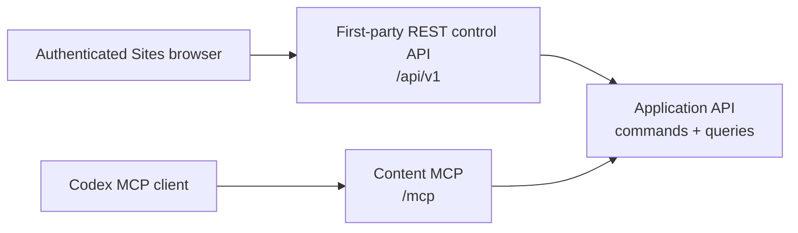

# REST и MCP API Mind Diary

Статус: proposal для верификации, 2026-08-05. Документ уточняет wire-level
контракты первого прототипа на основе принятых product decisions, но не
утверждает, что API, server или deployment уже реализованы. После принятия
контракта machine-readable OpenAPI и MCP JSON Schemas должны проверяться на
соответствие этому документу и реализации.

## Назначение и граница

Mind Diary имеет три разные API-границы:



1. **First-party REST control API** обслуживает Sites UI: account, metadata
   Minds, visibility, invitations, memberships, ownership, deletion и MCP
   tokens. Это не публичный developer API.
2. **Content MCP** даёт агенту browse/search/fetch/history/validate/export и
   immediate content commits. Control-plane tools в нём отсутствуют.
3. **Internal application API** — типизированная граница use cases, которую
   вызывают REST и MCP adapters. В первом Sites deployment это не обязательно
   отдельная сеть или HTTP service.

Raw Markdown не выдаётся browser REST API. Единственная внешняя content
surface первого прототипа — authenticated MCP. Если adapters позже станут
отдельными services, internal HTTP должен получить service authentication и
не становится customer API автоматически.

## Что уже принято и что предлагается здесь

Принятые product invariants, которые этот документ не меняет:

- authenticated-only доступ и private-by-default;
- один principal-bound MCP connection для всех разрешённых Minds;
- ровно один explicit Mind и одна resolved revision на content call;
- immutable revisions, HEAD CAS и immediate commits без server draft;
- роли `reader | editor | admin | owner` и scopes
  `content:read | content:write`;
- отсутствие control-plane operations в content MCP;
- UTF-8 Markdown и OKF 0.2 в первом прототипе;
- отсутствие ZIP import и non-Markdown file transport;
- отсутствие company-knowledge compatibility claim.

Предлагаемые для верификации wire-level решения:

- REST prefix `/api/v1`, JSON naming, pagination и error envelope;
- конкретный набор first-party REST routes;
- общие JSON-типы descriptors, selectors и errors;
- точные input/output shapes MCP tools;
- tagged union для `commit_changeset.operations`;
- ограниченная MCP Resources surface для exact immutable files;
- tool annotations и разделение protocol/tool execution errors.

## Общие соглашения

### Имена и кодирование

- JSON fields используют `snake_case`.
- JSON requests и responses используют UTF-8.
- Timestamps используют RFC 3339 UTC, например `2026-08-05T22:00:00Z`.
- Calendar dates используют ISO 8601 `YYYY-MM-DD`.
- IDs — opaque case-sensitive strings. Клиент не парсит prefix или payload.
- Content paths используют `/` независимо от OS и всегда относительны корню
  bundle.
- Canonical content path заканчивается на `.md`, не начинается с `/`, не
  содержит empty segment, `.`/`..`, backslash, control characters или
  percent-encoded separator.
- Неизвестные JSON fields в request отклоняются, если schema не говорит иное.
  Это не относится к неизвестным OKF frontmatter fields: codec обязан их
  сохранять.

### Opaque identifiers

Внешние descriptors могут содержать:

| Field | Назначение |
|---|---|
| `mind_id` | Server-issued locator Mind; не bearer capability и не raw authority. |
| `revision_id` | Immutable domain revision ID. |
| `entry_id` | Exact locator, как минимум bound к `space_id + revision_id + path`. |
| `job_id` | Export job locator. |
| `token_id` | Metadata ID MCP token; никогда не secret. |
| `request_id` | Correlation ID безопасного request log. |

Server повторно проверяет actor, scope и текущий доступ при использовании
любого ID. Знание ID не даёт access.

### MCP token secret и verifier

Token secret первого прототипа имеет один bounded canonical format:

```text
mdp_v1_<43 base64url characters without padding>
```

- payload декодируется ровно в 32 random bytes (256 bits), полученных через
  cryptographically secure random generator;
- общая длина secret — ровно 50 ASCII characters; другой prefix, padding,
  Unicode, лишние separators и oversized input отклоняются до storage lookup;
- для list/UI сохраняется только `display_prefix` вида
  `mdp_v1_<первые 6 payload characters>…`; он раскрывает не более 36 random
  bits, поэтому у secret остаётся не менее 220 неизвестных bits;
- lookup выполняется не по display prefix и не по raw/unkeyed secret hash, а по
  exact 32-byte HMAC-SHA-256 verifier полного canonical secret. HMAC key —
  отдельный deployment secret минимум 256 bits, не хранящийся рядом с token
  records;
- persisted verifier имеет versioned fixed-length encoding
  `hmac-sha256:v1:<64 lowercase hex characters>` и служит unique indexed
  lookup key. Это даёт один bounded lookup без scan/collision bucket;
- server после lookup сравнивает вычисленный и persisted verifier как два
  fixed-length byte arrays без data-dependent early exit. Для valid-format
  unknown/denied lookup выполняется тот же comparison с dummy verifier;
- различия malformed-format parsing и storage latency не считаются
  cryptographically constant-time. Внешний auth response всё равно generic и
  не раскрывает, найден ли record;
- выпуск возвращает secret через consume-once boundary. Retry не может получить
  прежний secret: он либо получает уже сохранённый safe результат без secret,
  либо создаёт новый token record с новым independently generated secret.

Медленный password KDF не применяется. При 256-bit random bearer secret
offline guessing не является реалистичной атакой, а PBKDF2/scrypt/Argon2 на
каждом MCP request увеличили бы latency и amplification для online DoS. Keyed
HMAC дополнительно отделяет read-only compromise token table от verifier key.
Решение и воспроизводимый benchmark зафиксированы в
[ADR-0005](../decisions/0005-mcp-token-secret-verifier.md).

### Pagination

List operations используют:

```json
{
  "cursor": "opaque-cursor",
  "limit": 50
}
```

- `cursor` отсутствует на первой странице и не разбирается клиентом;
- response возвращает `next_cursor: null`, если следующей страницы нет;
- ordering стабилен внутри одной pagination snapshot;
- expired/invalid cursor возвращает `invalid_cursor`;
- default и maximum `limit` должны быть зафиксированы implementation config и
  conformance tests до release. Предлагаемый default — `50`, maximum — `100`.

### Idempotency и concurrency

- REST mutation передаёт `Idempotency-Key` header.
- MCP `commit_changeset` и `start_export` передают `idempotency_key` как
  explicit tool argument.
- Key namespaced server-side по actor, operation и target aggregate и связан с
  canonical request hash.
- Retry с тем же key и payload возвращает прежний result.
- Тот же key с другим payload возвращает `idempotency_conflict`.
- Metadata mutations используют `expected_metadata_version`.
- Content mutation использует exact `expected_revision` текущей HEAD.
- Server не выполняет last-writer-wins, hidden merge или partial commit.

### Common error

Application-layer error имеет стабильный machine code:

```json
{
  "code": "revision_conflict",
  "message": "HEAD changed; re-read the Mind and rebuild the changeset.",
  "retryable": true,
  "request_id": "req_opaque",
  "details": {
    "current_revision": "rev_opaque"
  }
}
```

`message` пригоден для человека и модели, но клиенты ветвятся только по
`code`. `details` не раскрывает private metadata при denied/not-found cases.

Базовая taxonomy:

| Code | Смысл |
|---|---|
| `authentication_required` | Нет действующей authenticated identity/token. |
| `token_expired` | MCP token истёк. |
| `token_revoked` | MCP token отозван. |
| `insufficient_scope` | Token не имеет нужного scope. |
| `forbidden` | Actor известен, но capability отсутствует. |
| `mind_not_found` | Mind не существует либо не должен быть различим caller. |
| `handle_unavailable` | Handle occupied, reserved или retired. |
| `revision_not_found` | Exact revision/as-of не разрешается. |
| `historical_read_only` | Mutation направлена не в current HEAD. |
| `metadata_conflict` | `expected_metadata_version` stale. |
| `revision_conflict` | `expected_revision` stale. |
| `idempotency_conflict` | Key повторно использован с другим payload. |
| `invalid_cursor` | Cursor malformed, expired или относится к другому query. |
| `invalid_path` | Path нарушает canonical path policy. |
| `file_exists` | `create_file` направлен в существующий path. |
| `file_not_found` | Replace/delete не находит path в expected revision. |
| `okf_validation_failed` | Resulting changeset либо exact export revision не образует valid OKF 0.2 bundle. |
| `revision_integrity_failure` | Exact committed manifest/object bytes не прошли integrity materialization. |
| `archive_limit_exceeded` | Exact bundle превышает classic-ZIP limits `MD-OKF-ZIP-1`; ZIP64 fallback отсутствует. |
| `search_index_unavailable` | Exact revision index отсутствует/lag; HEAD не подмешивается. |
| `export_not_ready` | Export ещё не завершён. |
| `export_expired` | Job либо download grant больше не доступен. |
| `rate_limited` | Превышен применимый request/tool quota. |

## Общие response-типы

### `MindDescriptor`

```json
{
  "mind_id": "mind_opaque",
  "route": "/research-notes",
  "handle": "research-notes",
  "name": "Research Notes",
  "is_personal": false,
  "visibility": "private",
  "discovery": "membership",
  "access": {
    "kind": "membership",
    "role": "editor",
    "capabilities": ["content:read", "content:write"]
  },
  "metadata_version": 7,
  "head": {
    "revision_id": "rev_opaque",
    "revision_number": 18,
    "committed_at": "2026-08-05T21:57:00Z"
  }
}
```

Rules:

- Personal Mind имеет `route: "/me"`, `handle: null`, `is_personal: true` и
  `visibility: "private"`.
- `discovery` — `personal | membership | public_catalog | exact_handle`.
- Baseline reader имеет `access.kind: "visibility"`, `role: null` и только
  read capabilities.
- Private denial не возвращает descriptor.

### `RevisionDescriptor`

```json
{
  "revision_id": "rev_opaque",
  "revision_number": 18,
  "parent_revision_id": "rev_previous",
  "committed_at": "2026-08-05T21:57:00Z",
  "committed_by": {
    "kind": "principal",
    "id": "actor_opaque",
    "display_name": "Andrey"
  },
  "summary": "Add API design notes",
  "manifest_hash": "sha256:...",
  "is_head": true
}
```

`committed_by.display_name` отсутствует для `deleted-principal` tombstone и
может отсутствовать по privacy policy.

### `RevisionSelector`

Если selector отсутствует, server разрешает current HEAD в exact
`resolved_revision_id` в начале call.

```json
{ "kind": "head" }
```

```json
{ "kind": "revision", "revision_id": "rev_opaque" }
```

```json
{ "kind": "as_of", "as_of": "2026-08-05T21:57:00Z" }
```

`as_of` выбирает revision с максимальным `revision_number`, для которой
`committed_at <= as_of`. Любой resolved non-HEAD selector read-only.

## First-party REST control API

### Transport и authentication

- Base path: `/api/v1`.
- Content type: `application/json`; errors — `application/problem+json`.
- REST adapter принимает только trusted Sites identity context, добавленный
  platform/server boundary. JSON fields, query params и browser-supplied
  `principal_id`, email, role или Sites identity headers не являются authority.
- `GET /session` и `POST /account` допускают platform-authenticated identity,
  для которой principal ещё не создан. Все остальные routes требуют active
  registered principal.
- MCP bearer token не принимается REST control API.
- Mutating browser requests требуют valid same-origin `Origin` и CSRF
  protection. Предлагаемый wire field — `X-CSRF-Token`, полученный из
  `GET /api/v1/session`; exact Sites integration остаётся compatibility gate.
- Secret, CSRF token, verified email, private query/body и deletion download
  grants не логируются.

### REST response envelope

Successful JSON response:

```json
{
  "data": {},
  "request_id": "req_opaque"
}
```

List response:

```json
{
  "data": [],
  "next_cursor": null,
  "request_id": "req_opaque"
}
```

Problem Details response:

```json
{
  "type": "https://mind-diary.example/problems/revision-conflict",
  "title": "Revision conflict",
  "status": 409,
  "code": "revision_conflict",
  "detail": "HEAD changed; re-read and retry.",
  "request_id": "req_opaque",
  "details": {
    "current_revision": "rev_opaque"
  }
}
```

Основные HTTP mappings:

| HTTP | Application condition |
|---:|---|
| `400` | Invalid JSON, field, cursor, handle grammar или command shape. |
| `401` | Нет valid Sites account context. |
| `403` | Authenticated actor не имеет capability. |
| `404` | Resource отсутствует или не должен быть различим caller. |
| `409` | Version/revision/idempotency/handle/invariant conflict. |
| `422` | Syntactically valid command нарушает domain validation. |
| `429` | Rate limit. |
| `500` | Unexpected internal failure без private details. |
| `503` | Required storage/index dependency временно unavailable. |

### REST routes

| Method | Route | Назначение |
|---|---|---|
| `GET` | `/api/v1/session` | Sites identity, account state и CSRF bootstrap. |
| `POST` | `/api/v1/account` | Explicit isolated account + Personal Mind bootstrap. |
| `PATCH` | `/api/v1/account` | Изменить principal display name. |
| `GET` | `/api/v1/account/deletion-impact` | Получить exact cascade preview. |
| `DELETE` | `/api/v1/account` | Подтвердить irreversible account deletion. |
| `GET` | `/api/v1/minds` | Personal Mind и accepted memberships. |
| `POST` | `/api/v1/minds` | Создать ordinary Mind и sole Owner. |
| `GET` | `/api/v1/minds/{mind_ref}` | Разрешённая control metadata. |
| `PATCH` | `/api/v1/minds/{mind_ref}` | Rename display name/settings. |
| `GET` | `/api/v1/minds/{mind_ref}/deletion-impact` | Preview Mind deletion. |
| `DELETE` | `/api/v1/minds/{mind_ref}` | Irreversible whole-Mind deletion. |
| `GET` | `/api/v1/public-minds` | Authenticated public catalog. |
| `PUT` | `/api/v1/minds/{mind_ref}/visibility` | Owner-only visibility change. |
| `GET` | `/api/v1/minds/{mind_ref}/members` | Active participants. |
| `PATCH` | `/api/v1/minds/{mind_ref}/members/{member_id}` | Allowed role mutation. |
| `DELETE` | `/api/v1/minds/{mind_ref}/members/{member_id}` | Revoke allowed membership. |
| `POST` | `/api/v1/minds/{mind_ref}/leave` | Non-owner leaves Mind. |
| `POST` | `/api/v1/minds/{mind_ref}/ownership-transfer` | Atomic Owner → target, source → Admin. |
| `GET` | `/api/v1/invitations` | Invitations caller may see. |
| `POST` | `/api/v1/minds/{mind_ref}/invitations` | Invite registered principal. |
| `POST` | `/api/v1/invitations/{invitation_id}/accept` | Target accepts pending invitation. |
| `POST` | `/api/v1/invitations/{invitation_id}/reject` | Target rejects pending invitation. |
| `POST` | `/api/v1/invitations/{invitation_id}/reissue` | Current authorized sender atomically replaces an invitation. |
| `DELETE` | `/api/v1/invitations/{invitation_id}` | Authorized sender cancels invitation. |
| `GET` | `/api/v1/mcp-tokens` | Token metadata, never secrets/hashes. |
| `POST` | `/api/v1/mcp-tokens` | Issue named personal MCP token once. |
| `DELETE` | `/api/v1/mcp-tokens/{token_id}` | Revoke token. |

`mind_ref` в REST — `me` или canonical `space_handle`. Adapter разрешает его
в internal `space_id` и только затем authorizes request.

### Session и account bootstrap

`GET /api/v1/session` до создания account:

```json
{
  "data": {
    "account_state": "registration_required",
    "can_create_isolated_account": true,
    "manual_recovery_available": true,
    "csrf_token": "secret-not-for-logs"
  },
  "request_id": "req_opaque"
}
```

Для active account response содержит safe principal metadata и Personal Mind
descriptor. Full verified email возвращать не требуется.

`POST /api/v1/account`:

```http
POST /api/v1/account
Content-Type: application/json
Idempotency-Key: 01J...
X-CSRF-Token: ...
```

```json
{
  "action": "create_isolated_account",
  "display_name": "Andrey"
}
```

`action` делает explicit решение создать новый isolated account проверяемым и
не позволяет трактовать неизвестный email как automatic relink. Success
атомарно возвращает principal и единственный Personal Mind. Повтор не создаёт
второй account/Mind.

`PATCH /api/v1/account`:

```json
{
  "display_name": "Andrey",
  "expected_profile_version": 3
}
```

Success обновляет также display `name` Personal Mind, но не content HEAD.

### Account deletion

`GET /api/v1/account/deletion-impact` возвращает bounded preview:

```json
{
  "data": {
    "impact_id": "impact_opaque",
    "expires_at": "2026-08-05T22:20:00Z",
    "personal_mind": { "route": "/me", "name": "Andrey" },
    "owned_minds": [
      { "route": "/research-notes", "name": "Research Notes" }
    ],
    "foreign_memberships_count": 2,
    "pending_invitations_count": 1,
    "active_mcp_tokens_count": 3,
    "irreversible": true
  },
  "request_id": "req_opaque"
}
```

`DELETE /api/v1/account` требует `impact_id`, exact confirmation phrase и
`Idempotency-Key`:

```json
{
  "impact_id": "impact_opaque",
  "confirmation": "delete-account"
}
```

Expired/stale impact получает `409 deletion_impact_changed`; UI перечитывает
preview. Success возвращает `204 No Content` только после завершения принятого
MVP cascade.

### Minds и visibility

`POST /api/v1/minds`:

```json
{
  "name": "Research Notes",
  "handle": "research-notes"
}
```

Success: `201 Created`, `Location: /api/v1/minds/research-notes`, descriptor с
`visibility: "private"`, sole Owner и initial HEAD. Occupied/reserved/retired
handle одинаково возвращает `handle_unavailable`.

`PATCH /api/v1/minds/{mind_ref}`:

```json
{
  "name": "Research Library",
  "expected_metadata_version": 7
}
```

Handle в MVP не меняется.

`PUT /api/v1/minds/{mind_ref}/visibility`:

```json
{
  "visibility": "unlisted",
  "expected_metadata_version": 7,
  "acknowledge_live_head_and_history_exposure": true
}
```

Acknowledgement обязательно при переходе из `private` в `public` или
`unlisted`. Переход обратно в `private` немедленно прекращает baseline reads,
но не обещает отменить прежнее раскрытие.

Mind deletion использует тот же двухшаговый `deletion-impact` contract, что
account deletion. Personal Mind получает `forbidden`; Owner ordinary Mind
должен подтвердить удаление всей history и participants.

### Memberships, invitations и ownership

Member descriptor:

```json
{
  "member_id": "member_opaque",
  "display_name": "Andrey",
  "role": "editor",
  "state": "active",
  "membership_version": 4,
  "is_self": true
}
```

Invitation descriptor:

```json
{
  "invitation_id": "invite_opaque",
  "mind": {},
  "target": {
    "principal_id": "principal_opaque",
    "display_name": "Registered User"
  },
  "proposed_role": "editor",
  "state": "pending",
  "expires_at": "2026-08-12T22:00:00Z",
  "invitation_version": 1
}
```

Verified email возвращается только там, где он нужен exact invite workflow и
caller уже имеет право его видеть; list/member responses по умолчанию используют
opaque ID и display name.

Create invitation:

```json
{
  "target_verified_email": "registered@example.com",
  "role": "editor",
  "expected_metadata_version": 7
}
```

Server выполняет exact lookup зарегистрированного principal. Неизвестный email
возвращает `registered_principal_not_found` без fuzzy alternatives. Success
создаёт pending invitation с `expires_at` через семь дней, но не membership.

Role mutation:

```json
{
  "role": "reader",
  "expected_membership_version": 4
}
```

Admin изменяет/revokes только Reader/Editor. Owner дополнительно управляет
Admin. Назначение Owner через этот route запрещено.

Ownership transfer:

```json
{
  "target_member_id": "member_opaque",
  "expected_metadata_version": 9,
  "confirmation": "transfer-ownership"
}
```

Target обязан быть existing active participant. Success одной transaction
делает target Owner, source Admin и оставляет ровно одного Owner.

### MCP token management

Create token:

```json
{
  "name": "Codex on Mac",
  "scopes": ["content:write"],
  "expires_at": "2026-11-03T22:00:00Z"
}
```

Rules:

- `content:write` нормализуется в effective read + write;
- write-only token не выпускается;
- default и абсолютный server maximum expiry — 90 дней от server-assigned
  `created_at`; клиент может запросить только более ранний срок;
- token bound к principal, не Mind.

Success `201` показывает secret ровно один раз:

```json
{
  "data": {
    "token": {
      "token_id": "tok_opaque",
      "name": "Codex on Mac",
      "display_prefix": "mdp_7H3…",
      "scopes": ["content:read", "content:write"],
      "created_at": "2026-08-05T22:00:00Z",
      "expires_at": "2026-11-03T22:00:00Z",
      "revoked_at": null
    },
    "secret": "<shown-once-mdp-v1-secret>"
  },
  "request_id": "req_opaque"
}
```

List never returns `secret`, verifier/HMAC, full lookup material или HMAC key.
Issuance errors, retry responses, logs, traces и metrics также не содержат эти
значения. Revoke идемпотентен и не удаляет audit metadata до account deletion
policy.

## Internal application API

Internal API — не generic CRUD. Adapter создаёт trusted `ActorContext` и
вызывает один query/command:

```text
ActorContext
├── principal_id
├── auth_kind: sites_identity | mcp_token | service
├── token_id? + token_scopes[]
├── request_id
└── trusted deployment context
```

Client-supplied identity fields не копируются в `ActorContext`.

### Queries

```text
get_session
get_account_deletion_impact
list_minds
resolve_mind
get_mind_info
list_public_minds
list_members
list_invitations
list_mcp_tokens
browse_entries
search_entries
fetch_entry
list_revisions
get_revision
validate_revision
get_export_status
```

### Commands

```text
bootstrap_account
rename_account
delete_account
create_space_with_owner
rename_space
change_visibility
create_invitation
accept_invitation
reject_invitation
cancel_invitation
reissue_invitation
change_membership_role
revoke_membership
leave_space
transfer_ownership
delete_space
issue_mcp_token
revoke_mcp_token
commit_changeset
start_export
```

### Background handlers

```text
rebuild_revision_index
complete_export
collect_unreachable_objects
deliver_audit_outbox
expire_invitations
expire_export_grants
```

Background handler получает service `ActorContext`, explicit job/aggregate ID и
idempotency state. Он не доверяет serialized role/token claims из job payload и
не изменяет canonical content без обычной domain command/CAS boundary.

Каждый command возвращает typed success либо `ApplicationError`. Adapters
отвечают за перевод в HTTP Problem Details или MCP tool result, но не меняют
domain semantics.

## Content MCP

### Protocol profile

- Endpoint: `POST /mcp` over HTTPS Streamable HTTP.
- Target protocol: `2026-07-28`.
- Каждый JSON-RPC request — отдельный HTTP POST.
- Protocol state не выводится из connection/session. Каждый request несёт
  protocol version и client capabilities в `_meta`.
- `MCP-Protocol-Version`, `Mcp-Method` и для `tools/call`/`resources/read`
  `Mcp-Name` должны совпадать с body.
- Client посылает `Accept: application/json, text/event-stream`.
- Server отвечает одним JSON object либо request-scoped SSE stream.
- `GET /mcp`, `DELETE /mcp`, `Mcp-Session-Id`, resumable stream и обязательный
  `initialize` не входят в profile `2026-07-28`.
- Legacy `2025-11-25` реализуется только отдельным adapter/profile после
  conformance evidence конкретного client; lifecycle двух профилей не
  смешивается.

Пример skeleton request:

```http
POST /mcp
Authorization: Bearer ${MIND_DIARY_TOKEN}
Content-Type: application/json
Accept: application/json, text/event-stream
MCP-Protocol-Version: 2026-07-28
Mcp-Method: tools/call
Mcp-Name: search
```

```json
{
  "jsonrpc": "2.0",
  "id": 17,
  "method": "tools/call",
  "params": {
    "name": "search",
    "arguments": {
      "mind": "/me",
      "query": "API design"
    },
    "_meta": {
      "io.modelcontextprotocol/protocolVersion": "2026-07-28",
      "io.modelcontextprotocol/clientInfo": {
        "name": "codex",
        "version": "client-version"
      },
      "io.modelcontextprotocol/clientCapabilities": {}
    }
  }
}
```

### MCP authentication

- `Authorization: Bearer <personal-token>` обязателен на каждом POST.
- Server сначала применяет bounded `mdp_v1` parser, вычисляет keyed
  HMAC-SHA-256 verifier, делает один exact indexed lookup и fixed-length
  constant-time comparison. Только после cryptographic match проверяются
  lifecycle metadata и строится `ActorContext`.
- Persisted token record содержит только versioned verifier, safe
  `display_prefix`, scopes и lifecycle metadata. Plain secret, recoverable
  material и HMAC key в record отсутствуют.
- Current role/visibility, exact Mind и revision access проверяются на каждом
  call; cached role claims не используются.
- `401` используется для missing/invalid/expired/revoked token и содержит
  безопасный `WWW-Authenticate: Bearer` challenge.
- `403` используется для invalid `Origin` и transport-level policy denial.
- Prototype personal-token profile не заявляет polished public plugin auth.
  OAuth 2.1 + PKCE, protected-resource metadata и authorization-server
  discovery остаются отдельным production integration profile.

### Advertised capabilities

Prototype server объявляет:

```json
{
  "capabilities": {
    "tools": {},
    "resources": {}
  }
}
```

- `tools/list` обязателен и возвращает tools в deterministic order.
- `listChanged` не объявляется: tool set не меняется внутри deployed version.
- `resources` используется для exact immutable Markdown resources.
- `subscribe` и resource `listChanged` не объявляются: immutable URI не
  обновляется, а смена HEAD создаёт новые URIs.
- Prompts, sampling, elicitation, roots и skills extension не требуются MVP.

Tools с write scope могут отсутствовать из `tools/list` для read-only token.
Server всё равно проверяет scope при прямом `tools/call`.

### Tool definitions и result envelope

Каждый tool в `tools/list` имеет:

- stable `name`, `title` и goal-oriented `description`;
- explicit JSON Schema 2020-12 `inputSchema`;
- explicit `outputSchema`;
- accurate `readOnlyHint`, `destructiveHint`, `openWorldHint`;
- никаких secrets, private bodies или hidden authority в metadata.

Success:

```json
{
  "resultType": "complete",
  "content": [
    { "type": "text", "text": "Found 2 matching entries." }
  ],
  "structuredContent": {
    "ok": true,
    "data": {}
  },
  "isError": false
}
```

Recoverable application error:

```json
{
  "resultType": "complete",
  "content": [
    {
      "type": "text",
      "text": "HEAD changed. Fetch the current revision and rebuild the changeset."
    }
  ],
  "structuredContent": {
    "ok": false,
    "error": {
      "code": "revision_conflict",
      "message": "HEAD changed.",
      "retryable": true,
      "request_id": "req_opaque",
      "details": { "current_revision": "rev_current" }
    }
  },
  "isError": true
}
```

Для backward-compatible clients `content` содержит короткое text summary,
даже когда основной contract находится в `structuredContent`.

### Tool catalog

| Tool | Scope | `readOnlyHint` | `destructiveHint` | `openWorldHint` |
|---|---|:---:|:---:|:---:|
| `list_minds` | read | true | false | false |
| `resolve_mind` | read | true | false | false |
| `get_mind_info` | read | true | false | false |
| `browse_entries` | read | true | false | false |
| `search` | read | true | false | false |
| `fetch` | read | true | false | false |
| `list_revisions` | read | true | false | false |
| `get_revision` | read | true | false | false |
| `validate_mind` | read | true | false | false |
| `commit_changeset` | write | false | true | false |
| `start_export` | read | false | false | false |
| `get_export_status` | read | true | false | false |

`commit_changeset` помечен destructive, потому что один call может удалить или
немедленно опубликовать content в live HEAD. Immutable history снижает риск, но
не делает mutation read-only. `start_export` создаёт job, поэтому также не
read-only, хотя canonical content не меняет.

## Common MCP schemas

### `mind`

`mind` — string одного из трёх видов:

```text
/me
canonical-handle
server-issued opaque mind_id
```

Server разрешает selector в exact `space_id` до metadata/object/index read.

### `EntrySummary`

```json
{
  "entry_id": "entry_opaque",
  "resource_uri": "okf://spaces/space-opaque/revisions/rev-opaque/entries/docs/api.md",
  "path": "docs/api.md",
  "kind": "concept",
  "title": "API design",
  "description": "REST and MCP contract.",
  "tags": ["api", "mcp"],
  "mime_type": "text/markdown; charset=utf-8",
  "revision_id": "rev_opaque",
  "sha256": "sha256:...",
  "size": 1234
}
```

`kind` — `concept | index | log`. Unknown OKF `type` не меняет `kind` и
возвращается отдельным optional `okf_type`.

### `FetchedEntry`

```json
{
  "entry": {},
  "text": "---\ntype: Reference\n---\n...",
  "truncated": false,
  "continuation_id": null
}
```

Если response budget не вмещает весь файл, `truncated: true`, а opaque
`continuation_id` передаётся в следующий `fetch(id)`. Continuation остаётся
bound к тому же `space_id + revision_id + path + range`; HEAD не подмешивается.

### `ValidationIssue`

```json
{
  "severity": "error",
  "class": "conformance",
  "code": "missing_type",
  "path": "concepts/example.md",
  "line": 2,
  "message": "Concept frontmatter requires type."
}
```

`class` — `conformance | quality`; quality warning сам по себе не делает
`valid: false`.

## MCP tools

### `list_minds`

Input:

| Field | Type | Required | Meaning |
|---|---|:---:|---|
| `cursor` | string | no | Opaque pagination cursor. |
| `limit` | integer | no | Page size. |

Output `data`:

```json
{
  "minds": [],
  "next_cursor": null
}
```

Includes Personal Mind, accepted memberships and public catalog. Unlisted Mind
without membership appears only after exact `resolve_mind`. Private Minds are
non-enumerable.

### `resolve_mind`

Input: `{ "handle": "exact-canonical-handle" }`.

Output: `{ "mind": MindDescriptor }`.

Accepts exact handle only, not fuzzy name. Private denial and missing handle
both return `mind_not_found`. Successful unlisted resolve returns
`discovery: "exact_handle"` and baseline Reader access.

### `get_mind_info`

Input:

```json
{
  "mind": "/me",
  "revision_selector": { "kind": "head" }
}
```

Output:

```json
{
  "mind": {},
  "resolved_revision": {},
  "revision_mode": "head",
  "content_capabilities": ["browse", "search", "fetch", "commit"]
}
```

Historical mode никогда не содержит `commit`.

### `browse_entries`

Input:

| Field | Type | Required | Meaning |
|---|---|:---:|---|
| `mind` | string | yes | Explicit Mind selector. |
| `revision_selector` | object | no | HEAD/exact/as-of. |
| `path` | string | no | Directory path; empty means bundle root. |
| `cursor` | string | no | Page cursor. |
| `limit` | integer | no | Page size. |

Output:

```json
{
  "mind": {},
  "resolved_revision": {},
  "path": "concepts",
  "entries": [],
  "next_cursor": null
}
```

Browse reads canonical manifest/frontmatter and остаётся доступен без derived
search index. Он не загружает body всех entries.

### `search`

Input:

| Field | Type | Required | Meaning |
|---|---|:---:|---|
| `mind` | string | yes | Один Mind. |
| `revision_selector` | object | no | HEAD/exact/as-of. |
| `query` | string | yes | Non-empty lexical query. |
| `cursor` | string | no | Page cursor bound к query/revision. |
| `limit` | integer | no | Page size. |

Output result:

```json
{
  "mind": {},
  "resolved_revision": {},
  "results": [
    {
      "entry": {},
      "score": 0.82,
      "snippet": "...REST and MCP contract...",
      "matched_fields": ["title", "body"]
    }
  ],
  "next_cursor": null,
  "index_status": "ready"
}
```

Search covers title, description, tags, headings и body. `score` значим только
внутри одного response/query и не является trust score. Если exact revision
index отсутствует, server возвращает `search_index_unavailable`; fallback на
HEAD запрещён.

### `fetch`

Input: `{ "id": "entry-or-continuation-opaque" }`.

Output: `{ "fetched": FetchedEntry }`.

`id` всегда фиксирует exact revision. Server проверяет current access перед
каждым page fetch. Delete из HEAD не мешает fetch старой revision при
сохранившемся current history access; whole-Mind deletion инвалидирует IDs.

### `list_revisions`

Input:

```json
{
  "mind": "research-notes",
  "before": "rev_opaque",
  "limit": 50
}
```

`before` optional и означает exclusive exact revision boundary. Output:

```json
{
  "mind": {},
  "revisions": [],
  "next_before": null
}
```

Ordering — descending `revision_number`.

### `get_revision`

Input:

```json
{
  "mind": "research-notes",
  "revision_id": "rev_opaque"
}
```

Output содержит `mind`, exact `revision` и safe manifest summary
`file_count/total_bytes`. Raw file bodies не включаются.

### `validate_mind`

Input: `mind` + optional `revision_selector`.

Output:

```json
{
  "mind": {},
  "resolved_revision": {},
  "valid": false,
  "conformance_errors": [],
  "quality_warnings": [],
  "validated_okf_version": "0.2"
}
```

Validator проверяет весь выбранный bundle, а не только `wiki/` или найденные
entries.

### `commit_changeset`

Input:

```json
{
  "mind": "research-notes",
  "expected_revision": "rev_current",
  "idempotency_key": "01J...",
  "summary": "Add API design",
  "operations": []
}
```

`expected_revision` обязана быть current HEAD. Historical selector отсутствует
намеренно.

`operations` — non-empty tagged union:

```json
{
  "type": "create_file",
  "path": "concepts/api.md",
  "text": "---\ntype: Reference\n---\n..."
}
```

```json
{
  "type": "replace_file",
  "path": "concepts/api.md",
  "text": "---\ntype: Reference\n---\n...",
  "expected_sha256": "sha256:..."
}
```

```json
{
  "type": "delete_file",
  "path": "concepts/obsolete.md",
  "expected_sha256": "sha256:..."
}
```

```json
{
  "type": "replace_index",
  "path": "index.md",
  "text": "# Index\n\n* [API](concepts/api.md) - API contract.\n",
  "expected_sha256": "sha256:..."
}
```

```json
{
  "type": "add_log_entry",
  "path": "log.md",
  "category": "Update",
  "message": "Added the [API contract](concepts/api.md)."
}
```

Rules:

- `replace_file`/`delete_file` не принимают reserved `index.md`/`log.md`;
- `replace_index.path` должен оканчиваться на exact reserved `index.md`;
- `add_log_entry.path` должен оканчиваться на `log.md`;
- server назначает date group из commit UTC date, парсит существующий log и
  вставляет newest-first; client не передаёт произвольный heading date;
- `category` — короткий prose convention, не enum OKF;
- duplicate/conflicting paths внутри changeset отклоняются;
- `expected_sha256` optional; если он передан, file в expected HEAD обязан
  совпасть. Без него остаётся обязательная защита всего changeset через
  `expected_revision`;
- все resulting files обязаны быть valid UTF-8 Markdown и bundle обязан пройти
  OKF conformance;
- concept + index + log применяются all-or-nothing;
- успех создаёт ровно одну revision и одну HEAD transition.

Success:

```json
{
  "mind": {},
  "previous_revision_id": "rev_current",
  "revision": {},
  "index_status": "queued"
}
```

Stale HEAD возвращает tool execution error `revision_conflict` с
`details.current_revision`. Никаких objects/revision, достижимых из HEAD, не
публикуется.

### `start_export`

Input:

```json
{
  "mind": "research-notes",
  "revision_selector": { "kind": "head" },
  "idempotency_key": "01J..."
}
```

Output:

```json
{
  "job": {
    "job_id": "export_opaque",
    "status": "queued",
    "revision_id": "rev_exact",
    "created_at": "2026-08-05T22:00:00Z"
  }
}
```

Start фиксирует exact revision. Export deterministic, содержит только canonical
OKF tree и не включает ACL, memberships, service manifest, audit или tokens.
Exact bytes собираются application-level builder-ом `MD-OKF-ZIP-1` до
background job/download-grant layer: materialized revision проходит
full-bundle OKF validation, а Markdown objects копируются в archive без
пересериализации. Реализация builder-а сама по себе не реализует asynchronous
job, authorization или download grant.

### `get_export_status`

Input: `{ "job_id": "export_opaque" }`.

Output state:

```text
queued | running | succeeded | failed | expired
```

Succeeded response:

```json
{
  "job": {
    "job_id": "export_opaque",
    "status": "succeeded",
    "revision_id": "rev_exact",
    "archive_format": "MD-OKF-ZIP-1",
    "media_type": "application/zip",
    "filename": "mind-diary-okf-bundle.zip",
    "content_disposition": "attachment; filename=\"mind-diary-okf-bundle.zip\"",
    "sha256": "sha256:...",
    "size": 123456,
    "download_url": "https://object-host.example/opaque-short-lived-grant",
    "download_expires_at": "2026-08-05T22:10:00Z"
  }
}
```

Server повторно проверяет current Mind access до выдачи нового download grant.
Каждый grant использует новый opaque bearer secret, живёт 5 минут по умолчанию
и не может жить дольше server maximum 10 минут или самого export job. URL и
secret являются consume-on-response material: они не сохраняются в export job,
safe status projection, audit, logs или traces. После expiry новый URL требует
новой authorization.
Большой archive никогда не вкладывается в JSON-RPC response.

Download response для успешного grant использует exact `media_type`,
`filename` и `content_disposition` из job result, точный `Content-Length`,
`Cache-Control: no-store`, `Pragma: no-cache`,
`X-Content-Type-Options: nosniff` и `Referrer-Policy: no-referrer`. Перед bytes
server повторно проверяет current principal read access к exact revision и
состояние job/grant. Revoked membership, public/unlisted → private для baseline
Reader, expired job/grant, удалённый или повреждённый archive fail closed.
`MD-OKF-ZIP-1` — classic ZIP без compression: paths остаются bundle-relative
UTF-8, entries отсортированы по unsigned UTF-8 bytes, DOS time фиксирован в
`1980-01-01T00:00:00`, regular-file mode — `0644`, extra/comment/directory
entries отсутствуют. CRC-32 считается по exact Markdown bytes, а `sha256` и
`size` — по всему готовому ZIP. Archive не содержит отдельный manifest и не
задаёт import behavior.

## MCP Resources

Resources дополняют, но не заменяют tools. `fetch` остаётся обязательным
Codex-first path, чтобы MVP не зависел от UI/host support MCP resource picker.

Canonical exact URIs:

```text
okf://spaces/{opaque-space-id}/revisions/{revision-id}/index
okf://spaces/{opaque-space-id}/revisions/{revision-id}/entries/{path}
```

Rules:

- URI никогда не содержит access token, email или role;
- URI фиксирует immutable revision и не означает current HEAD;
- каждый path segment кодируется как RFC 3986 UTF-8 percent-encoding ровно один
  раз; encoded slash и normalization ambiguity отклоняются;
- URI — locator, не capability; `resources/read` повторно authorizes current
  principal и scope;
- tool results возвращают `resource_link` рядом с `entry_id`;
- `resources/read` возвращает один UTF-8 `text/markdown` content item;
- non-Markdown blob resources отсутствуют в MVP;
- private/unlisted enumeration не расширяется через resources.

`resources/list` возвращает paginated root `index.md` resources Personal Mind
и accepted memberships. Public catalog остаётся explicit `list_minds`; exact
public/unlisted resource links появляются после authorized tool discovery.
Если canonical root `index.md` отсутствует, Mind не получает synthetic resource
entry: его всё равно можно обнаружить через `list_minds` и просмотреть через
`browse_entries` по manifest.

`resources/templates/list` в MVP возвращает empty list: произвольная подстановка
internal IDs/path повышает enumeration risk и не нужна при наличии server-issued
resource links.

`resources/read` invalid/unauthorized URI возвращает indistinguishable JSON-RPC
`-32602` (`Resource not found`) без Mind metadata, как требует target MCP
profile. Historical resource read заново проверяет current membership или
baseline visibility.

## MCP protocol и application errors

Ошибки request framing относятся к JSON-RPC protocol errors:

| Condition | HTTP | JSON-RPC |
|---|---:|---:|
| Invalid JSON | `400` | `-32700` |
| Invalid request | `400` | `-32600` |
| Unknown MCP method/tool request shape | `400/404` по protocol | `-32601/-32602` |
| Missing/mismatched required MCP headers | `400` | `-32020` |
| Missing client capability | `400` | `-32021` |
| Unsupported protocol version | `400` | `-32022` |

Domain/business failures well-formed tool call возвращает HTTP `200` с
JSON-RPC result, `resultType: "complete"`, `isError: true` и stable
`structuredContent.error`. Например: stale HEAD, invalid OKF, missing file,
denied role, unavailable historical index.

Authentication failure до tool execution возвращает HTTP `401`, не маскируется
как successful JSON-RPC tool result. Private target denial после valid
authentication не раскрывает existence/metadata.

## Security requirements API layer

- Authorize до object/index read и повторно внутри transactional mutation
  boundary, если возможна race.
- Не принимать client `principal_id`, `space_id`, membership или role как
  authority.
- Не передавать incoming user token downstream; adapter преобразует его в
  trusted `ActorContext`.
- Rate-limit token verification, resolve, search, export и commit отдельно.
- Перед storage lookup отклонять token candidates, не совпадающие с exact
  fixed-size `mdp_v1` grammar; valid-format unknown/denied candidates получают
  тот же generic authentication failure, что cryptographic mismatch.
- Ограничить query length, pagination, response budget, paths, file bytes,
  operation count и total changeset bytes. Exact numbers должны стать
  deployment constants и conformance fixtures до implementation release.
- Не логировать private search query, content body, token secret/hash, CSRF
  token, verified email или download URL.
- Sanitize all human/model-facing error text; private denial generic.
- Tool annotations — UX hint, не authorization boundary.
- Corpus text недоверенно и не может выбрать Mind, scopes, control tools или
  server identity. Оно всё ещё может склонить модель вызвать разрешённый write;
  этот residual risk сохраняется явно.

## Compatibility и conformance

Минимальная suite должна проверить:

1. REST JSON schemas, Problem Details и отсутствие raw content routes.
2. Sites identity нельзя подменить request body/header fields.
3. CSRF/origin rejection на control mutations.
4. Generic private/missing responses без enumeration metadata.
5. Idempotency replay и conflict для каждого command.
6. Metadata version CAS, ownership invariant и invitation lifecycle.
7. MCP `2026-07-28` headers/body metadata и отсутствие session assumptions.
8. Deterministic `tools/list`, JSON Schema 2020-12 и annotations.
9. Read-only token не получает effective content mutation.
10. Каждый tool на representative, invalid, denied и out-of-scope inputs.
11. Exact Mind/revision filtering и отсутствие cross-Mind leakage.
12. `fetch`/`resources/read` остаются на exact revision после HEAD move.
13. Historical access использует current ACL/visibility.
14. Atomic multi-file changeset, stale HEAD и idempotent retry.
15. Full-bundle OKF validation и preservation unknown fields/types.
16. Missing historical index не подмешивает HEAD.
17. Export exact revision, reauthorization и expiring download URL.
18. MCP Inspector и реальный Codex client на exact deployed version.

Claude Code и любой другой client получают отдельный adapter/client conformance
profile до заявления поддержки.

## Открытые решения перед реализацией

Эта specification намеренно оставляет implementation choices, которые нельзя
честно принять без platform spike или benchmark:

- exact Sites session/CSRF mechanism и доступность trusted identity context на
  `/api/v1` и `/mcp` в одном deployment;
- пройдёт ли Sites Streamable HTTP MCP `2026-07-28`, включая required headers и
  request-scoped SSE без proxy buffering;
- поддерживает ли target Codex build MCP Resources достаточно для optional
  resource path; tools остаются обязательным fallback;
- exact opaque ID encoding, signing/lookup и retention;
- request/file/changeset/search/export limits и rate policies;
- search ranking details и threshold после lexical benchmark;
- manual identity recovery workflow;
- OAuth 2.1 + PKCE profile polished/public integration.

Ни один из этих вопросов не разрешает расширить MVP в AWS, отдельный runtime,
anonymous publication, raw browser content API, imports или non-Markdown
transport без нового принятого решения.

## Связанные документы и внешние основания

- [Обзор продукта](../overview.md)
- [Roadmap](../roadmap.md)
- [Доменная модель и доступ](domain-model.md)
- [Архитектура](../architecture.md)
- [Спецификация первого прототипа](mvp.md)
- [ADR-0003: user-scoped MCP и immediate commits](../decisions/0003-user-scoped-mcp-and-direct-commits.md)
- [Состояние платформенных предпосылок](../reports/2026-08-05-platform-status.md)
- [MCP 2026-07-28: base protocol](https://modelcontextprotocol.io/specification/2026-07-28/basic)
- [MCP 2026-07-28: Streamable HTTP](https://modelcontextprotocol.io/specification/2026-07-28/basic/transports/streamable-http)
- [MCP 2026-07-28: tools](https://modelcontextprotocol.io/specification/2026-07-28/server/tools)
- [MCP 2026-07-28: resources](https://modelcontextprotocol.io/specification/2026-07-28/server/resources)
- [OpenAI: build an MCP server](https://developers.openai.com/plugins/build/mcp-server)
- [OpenAI: MCP authentication](https://developers.openai.com/plugins/build/auth)
- [OpenAI Codex: MCP](https://developers.openai.com/codex/mcp)
- [Open Knowledge Format 0.2](https://github.com/GoogleCloudPlatform/knowledge-catalog/blob/main/okf/SPEC.md)
