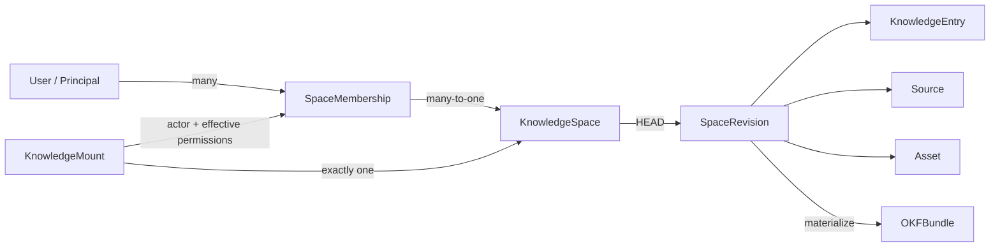

# Доменная модель и доступ

Статус: proposal, 2026-08-05. Модель расширяет первоначальный single-user MVP
до приватных совместных пространств; код и migrations ещё не реализованы.

## Терминология

Главная пользовательская сущность называется **KnowledgeSpace** («пространство
знаний», в коротком UI — `Space`). Это живой совместный объект CloudBrain: у
него есть содержимое, HEAD revision, участники, роли, настройки и audit history.

Название выбрано вместо:

- `KnowledgeBase`, чтобы не путать продуктовую сущность с конкретной БД и
  Amazon Bedrock Knowledge Bases;
- `Workspace`, потому что термин уже перегружен в ChatGPT и других SaaS;
- `Vault`, потому что Space может стать публично читаемым;
- `OKFBundle`, потому что bundle — переносимый файл-снимок, а не live-сервис.

Остальные термины:

| Термин | Значение |
|---|---|
| `KnowledgeSpace` | Совместный aggregate и access boundary вокруг одного логического дерева знаний. |
| `SpaceRevision` | Неизменяемый снимок содержимого Space с manifest и parent revision. |
| `OKFBundle` | Материализованный импорт/экспорт ровно одной `SpaceRevision`. В нём нет memberships и ACL. |
| `KnowledgeEntry` | Пользовательский searchable OKF concept document. Это не общий тип для любых bytes. |
| `Source` | Source-faithful материал или typed source concept с provenance. |
| `Asset` | Binary/non-Markdown объект со своими правилами чтения и передачи. |
| `Index` / `Log` | Reserved OKF `index.md` и `log.md`, не обычные `KnowledgeEntry`. |
| `SpaceMembership` | Связь principal с одним Space, ролью и lifecycle state. |
| `KnowledgeMount` | Authorization binding одного MCP connection к одному Space. Не часть знания. |

Слово «артефакт» допустимо как неформальное общее описание содержимого, но API
не должен скрывать под ним разные правила concept, source, asset и reserved
files. Во внутреннем manifest любой path-addressed object можно назвать
`RevisionObject` или `BundleEntry`.

## Отношения



Один пользователь может иметь memberships в нескольких Spaces. У одного Space
может быть несколько пользователей и несколько одновременных editors. Web
control plane показывает список доступных Spaces; content MCP по-прежнему
работает только с одним Space на connection и не делает неявный cross-space
search.

## Principal и membership

`principal_id` — opaque stable ID, полученный из проверенной пары
`issuer + subject`; email или display name не являются identity key.

Минимальная запись `SpaceMembership`:

```text
tenant_id
space_id
principal_id
role: reader | editor | admin | owner
state: active | revoked
version
created_at / created_by
updated_at / updated_by
```

На `(tenant_id, space_id, principal_id)` существует не более одного active
membership. Revoke сохраняет tombstone и историю вместо физического удаления.
Invitation lifecycle, groups и external collaborators требуют отдельной
спецификации; MVP добавляет только уже существующий точный `principal_id`.

Membership — service metadata. Его изменение не создаёт OKF concept, не меняет
content HEAD и не попадает в `OKFBundle`.

## Роли

Человеческая роль `write-only` не используется. Редактору необходимо видеть
текущий content, sources и HEAD, чтобы не создавать слепые конфликты. Поэтому
роль называется `editor` и включает чтение.

Роли образуют понятную продуктовую иерархию, но authorization code проверяет
именованные capabilities, а не числовое сравнение enum:

| Capability | Reader | Editor | Admin | Owner |
|---|:---:|:---:|:---:|:---:|
| Browse, search, fetch, history, validate | ✓ | ✓ | ✓ | ✓ |
| Create draft, inspect diff, reviewed commit | — | ✓ | ✓ | ✓ |
| Full OKF export | — | — | ✓ | ✓ |
| Add/revoke `reader` or `editor` | — | — | ✓ | ✓ |
| Configure non-destructive Space settings | — | — | ✓ | ✓ |
| Grant/revoke `admin` or `owner` | — | — | — | ✓ |
| Change visibility, transfer ownership, archive/delete | — | — | — | ✓ |

Запрет bulk export для Reader/Editor — продуктовая защита от простой массовой
выгрузки, а не обещание предотвратить копирование уже прочитанного content.

Если позже понадобится настоящий ingest-only principal, это будет отдельный
machine capability наподобие `source.submit`, а не человеческая роль в этой
иерархии.

## Effective permissions

Роль задаёт верхнюю границу. Реальные права конкретного вызова равны:

```text
membership capabilities
∩ mount / OAuth scopes
∩ deployment-enabled capabilities
```

Например, Owner с read-only mount остаётся read-only. Editor/Admin/Owner всё
равно не обходят reviewed approval artifact для content commit.

Предлагаемые scopes:

- `space.read`;
- `space.draft`;
- `space.commit`;
- `space.export`;
- `space.settings`;
- `space.members.read`;
- `space.members.write`;
- `space.owner`.

Role и membership state не кэшируются в JWT как источник истины. Каждый
tool/resource проверяет текущий active membership. `membership_epoch` Space
инвалидирует будущие caches и входит в security-sensitive approval artifacts.
Если membership отозван после создания draft, commit отклоняется.

## Owner invariants

Минимальная отличительная семантика Owner фиксируется уже сейчас:

- создание Space и creator-owner membership — одна атомарная операция;
- у active Space всегда есть хотя бы один active Owner;
- Owners может быть несколько;
- только Owner назначает или отзывает `admin`/`owner`;
- последнего Owner нельзя demote, revoke или удалить;
- Owner может выйти или понизить себя только при наличии другого Owner;
- transfer ownership атомарно повышает target и понижает source;
- import OKF bundle никогда не импортирует owner или memberships.

Billing, legal ownership, recovery после удаления аккаунта и organization-level
policy остаются открытыми вопросами. До их решения Space без bootstrap Owner не
создаётся.

## Membership mutations

Membership commands работают через command-level storage port, а не generic
CRUD:

```text
create_space_with_owner
add_membership
change_membership_role
revoke_membership
transfer_ownership
```

Каждая mutation принимает `expected_membership_version` и `idempotency_key`.
Одна storage transaction:

1. повторно проверяет active actor membership и capability;
2. делает CAS target membership;
3. сохраняет last-owner invariant;
4. увеличивает `membership_epoch`;
5. записывает audit event и idempotency result.

Успешного membership change без audit event быть не может. Audit содержит
opaque actor/subject IDs, before/after role and state, request ID и outcome, но
не email, JWT, approval token или private content.

## Совместное редактирование

Membership не заменяет content concurrency protocol. Несколько Editors могут
создавать drafts параллельно, но commit по-прежнему требует:

- active membership и `space.commit` в момент commit;
- внешний approval artifact для точного draft hash;
- `expected_revision` HEAD CAS;
- новую immutable `SpaceRevision` без last-writer-wins.

Текстовый merge, rebase и разрешение semantic conflicts остаются отдельной
функцией. Role change не блокирует Space целиком и не создаёт content revision.

## Content plane и control plane

Membership management не публикуется в том же MCP, который помещает corpus в
model context. Это защита от prompt injection, а не только UI-решение.

- **Content MCP:** `search`, `fetch`, browse, drafts, diff и commit с внешним
  approval.
- **Trusted control plane:** список Spaces, memberships, role changes,
  ownership, visibility, lifecycle и approval issuance через web UI/CLI.

`get_space_info` может вернуть текущую role, effective content capabilities и
`management_url`, но клиент никогда не передаёт role обратно как доказательство
прав. Если agent-assisted administration понадобится позже, для него нужен
отдельный privileged MCP без corpus/search/fetch и со step-up approval.

## Visibility

Visibility — отдельная политика, не роль и не fake membership:

- `private` — единственный режим MVP;
- `unlisted` — возможный будущий режим;
- `public_read` — возможный будущий Wikipedia-like режим.

Первый Wikipedia-like сценарий CloudBrain означает совместное авторство,
revision history и revert внутри private Space. Настоящий public read требует
отдельного threat model для anonymous identity, discovery, indexing, cache,
citations и переходов private ↔ public.

## Граница MVP

Обновлённый MVP включает private shared Space, несколько active users, четыре
роли, membership audit и last-owner protection. Он не включает invitations,
groups, path/tag grants, public links, cross-tenant sharing или organization
administration.
