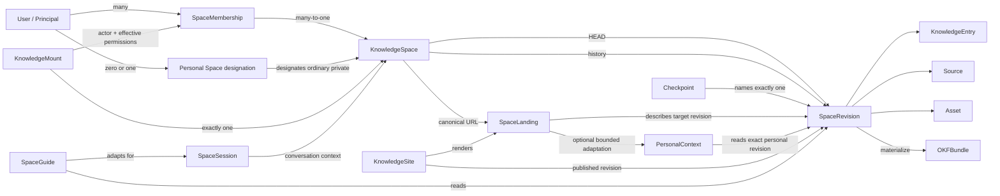

# Доменная модель и доступ

Статус: proposal, 2026-08-05. Модель расширяет первоначальный single-user MVP
до именованных совместных пространств и будущей web-публикации; код и
migrations ещё не реализованы.

## Терминология

Главная техническая сущность называется **KnowledgeSpace** («пространство
знаний», в product UI — **Mind**, в коротком техническом тексте — `Space`). Это
живой совместный объект Mind Diary: у
него есть canonical URL, содержимое, HEAD revision, участники, роли, настройки
и audit history.

Название выбрано вместо:

- `KnowledgeBase`, чтобы не путать продуктовую сущность с конкретной БД и
  Amazon Bedrock Knowledge Bases;
- `Workspace`, потому что термин уже перегружен в ChatGPT и других SaaS;
- `Vault`, потому что Space может стать публично читаемым;
- `OKFBundle`, потому что bundle — переносимый файл-снимок, а не live-сервис.

Остальные термины:

| Термин | Значение |
|---|---|
| `KnowledgeSpace` / `Mind` | Совместный aggregate и access boundary вокруг одного логического дерева знаний; `Mind` — product language. |
| `SpaceRevision` | Неизменяемый снимок содержимого Space с manifest и parent revision. |
| `Checkpoint` | Неизменяемая именованная ссылка на одну `SpaceRevision`. Это service metadata, не OKF `tags`. |
| `Snapshot View` | Read-only view/mount, один раз разрешённый в точную revision по ID, времени или Checkpoint. |
| `OKFBundle` | Материализованный импорт/экспорт ровно одной `SpaceRevision`. В нём нет memberships и ACL. |
| `KnowledgeEntry` / `Memory` | Пользовательский searchable OKF concept document; `Memory` — product umbrella, но не общий тип для любых bytes. |
| `Source` | Source-faithful материал или typed source concept с provenance. |
| `Asset` | Binary/non-Markdown объект со своими правилами чтения и передачи. |
| `Index` / `Log` | Reserved OKF `index.md` и `log.md`, не обычные `KnowledgeEntry`. |
| `SpaceMembership` | Связь principal с одним Space, ролью и lifecycle state. |
| `KnowledgeMount` | Authorization binding одного MCP connection к одному Space. Не часть знания. |
| `Personal Space designation` | Service-level связь principal с одним private KnowledgeSpace для разрешённой персонализации. |
| `PersonalContext` | Минимальная derived projection exact Personal Space revision для адаптации, не второй corpus. |
| `SpaceLanding` | Base или personalized представление одной разрешённой target revision по canonical Space URL. |
| `KnowledgeSite` | Web-представление явно опубликованной `SpaceRevision`; не отдельная копия знаний. |
| `SpaceSession` | Контекст одного участника или посетителя и его audience profile; service metadata, не OKF. |
| `SpaceGuide` | Read-only orchestration, которая отвечает и предлагает материалы по разрешённой revision. |

Слово «артефакт» допустимо как неформальное общее описание содержимого, но API
не должен скрывать под ним разные правила concept, source, asset и reserved
files. Во внутреннем manifest любой path-addressed object можно назвать
`RevisionObject` или `BundleEntry`.

## Отношения



Один пользователь может иметь memberships в нескольких Spaces. У одного Space
может быть несколько пользователей и несколько одновременных editors. Web
control plane показывает список доступных Spaces; content MCP по-прежнему
работает только с одним Space на connection и не делает неявный cross-space
search. Server-side PersonalContext является узким исключением для presentation
и не превращает Personal Space во второй mount.

## Имя и адресация

Space имеет человекочитаемую внешнюю identity и отдельную внутреннюю identity:

```text
space_id          # immutable opaque internal primary identity
space_handle      # required stable external URL identity, one path segment
normalized_handle # service-derived key within verified host namespace
name              # required mutable display name
metadata_version  # CAS for name/settings
canonical_path    # derived /{space_handle}
```

Canonical URL с момента создания имеет форму:

```text
https://{space-host}/{space_handle}
```

`space_handle` — то самое имя Space, которым человек адресует его в сети.
`normalized_handle` уникален по `(host_namespace, normalized_handle)`; при
едином product host это означает глобальную уникальность на всём host. Host
берётся из trusted deployment configuration, а не из клиентского tenant input.
Минимальная normalization policy, Unicode/confusable rules, reserved routes и
percent encoding фиксируются до реализации.

Router сначала разрешает handle в `space_id`. API, ACL, audit, revisions,
mounts, jobs, indexes и object keys после этого используют только `space_id`.
Это не обесценивает внешнюю identity handle: она является canonical web
address, а ID остаётся внутренним ключом целостности и авторизации.

В MVP `space_handle` immutable, а display `name` можно менять с
`expected_metadata_version`. Rename name, смена visibility, новая HEAD или
promotion published revision не меняют URL. Будущий rename handle потребует
отдельной CAS-команды, permanent redirect и tombstone: старый handle нельзя
отдать другому Space. Production использует управляемый product/custom domain;
перенос Sites → AWS сохраняет host либо permanent redirect со старого домена.

Canonical URL существует и у private Space, но не является публичным доступом
или bearer secret. Resolver не раскрывает name, landing или revision до проверки
visibility, current membership и scopes. Запрос к неизвестному и существующему
private handle не должен различаться по раскрываемой Space metadata. При этом
конфликт регистрации host-unique handle сам может раскрыть занятость имени;
этот privacy/UX trade-off остаётся открытым до публичного self-service signup.

## SpaceLanding

Успешный переход по canonical URL возвращает `SpaceLanding` для ровно одной
разрешённой target revision: HEAD для обычного member view, resolved revision
для Snapshot View или `published_revision_id` для anonymous KnowledgeSite.

Минимальная модель landing:

```text
space_id
space_handle
canonical_url
target_revision_id
title
base_summary
personalization_mode: base | personal_space
personal_context_revision_id?
personalized_summary?
entrypoints[]
source / freshness indicators
suggested_questions[]
available_actions[]
```

Режим `base` даёт общее описание: что находится в Space, с чего начать, на
какой revision и evidence оно опирается. Title, summary и entrypoints в
приоритете берутся из authored presentation/OKF content выбранной revision.
Derived summary или suggested questions явно помечаются как generated и не
становятся canonical knowledge. Для anonymous publication Owner отдельно
подтверждает base landing; private HEAD не может автоматически породить public
summary.

Режим `personal_space` строится для authenticated principal из той же target
revision и ограниченного `PersonalContext`, разрешённого из exact revision его
designated Personal Space. Он может менять язык, глубину, порядок, примеры и
suggested questions, но не target facts, provenance, trust или ACL. Пользователь
без designation/scope/consent и любой anonymous visitor получает `base`;
аутентифицированный пользователь может переключиться на base вручную.

Сам `SpaceLanding` — revision-bound projection, а не новый OKF document и не
вторая копия corpus. Его authored inputs могут храниться в OKF, presentation
settings — в service metadata, а generated части помечены как derived и
трассируются до exact target/personal revisions. Детерминированное
воспроизведение дополнительно потребует зафиксированных generator/model,
policy и receipt; один revision ID его не гарантирует.

`SpaceLanding` не содержит memberships, contributor identities, private
settings, raw personal facts или conversation history и не загружает target или
personal corpus целиком в browser/model context. Personalized output приватен
для principal, не виден Owners целевого Space и не попадает в shared cache.
После начала разговора отдельная `SpaceSession` продолжает адаптацию. Canonical
URL остаётся адресом Space, а не ID пользователя или сессии.

Точная модель designation, bounded provider, consent и cache isolation описана
в [спецификации персонализированного открытия](personalized-opening.md).

## Сценарии, а не типы Space

Не вводится enum `personal | group | community | site`: один Space может менять
способ использования без миграции содержимого.

| Сценарий | Конфигурация |
|---|---|
| Personal | `private`, один Owner, publication отсутствует; может быть designated для principal. |
| Shared/family | `private`, несколько memberships и параллельные Editors. |
| Community wiki | Несколько trusted Editors; moderation/reputation пока отсутствуют. |
| Knowledge site | Space имеет publication на выбранную revision и presentation surface. |

Visibility, membership и publication policy остаются независимыми осями.

## Principal и membership

`principal_id` — opaque stable ID, полученный из проверенной пары
`issuer + subject`; email или display name не являются identity key.

У principal может быть не более одного `default_personal_space_id`. Designation
явно ссылается на обычный private KnowledgeSpace, где principal — Owner; это
service metadata, не membership role и не OKF type. В MVP designated Personal
Space не имеет других participants. Автоматическое создание Personal Space и
долговременный consent пока остаются продуктовыми гипотезами.

Минимальная запись `SpaceMembership`:

```text
tenant_id
space_id
principal_id
role: reader | editor | admin | owner
state: active | revoked
version
created_at / created_by
updated_at / updated_by
```

На `(tenant_id, space_id, principal_id)` существует не более одного active
membership. Revoke сохраняет tombstone и историю вместо физического удаления.
Invitation lifecycle, groups и external collaborators требуют отдельной
спецификации; MVP добавляет только уже существующий точный `principal_id`.

Membership — service metadata. Его изменение не создаёт OKF concept, не меняет
content HEAD и не попадает в `OKFBundle`.

## Роли

Человеческая роль `write-only` не используется. Редактору необходимо видеть
текущий content, sources и HEAD, чтобы не создавать слепые конфликты. Поэтому
роль называется `editor` и включает чтение.

Роли образуют понятную продуктовую иерархию, но authorization code проверяет
именованные capabilities, а не числовое сравнение enum:

| Capability | Reader | Editor | Admin | Owner |
|---|:---:|:---:|:---:|:---:|
| Browse, search, fetch, history, validate | ✓ | ✓ | ✓ | ✓ |
| Create draft, inspect diff, reviewed commit | — | ✓ | ✓ | ✓ |
| Create immutable Checkpoint | — | ✓ | ✓ | ✓ |
| Full OKF export | — | — | ✓ | ✓ |
| Add/revoke `reader` or `editor` | — | — | ✓ | ✓ |
| Configure non-destructive Space settings | — | — | ✓ | ✓ |
| Grant/revoke `admin` or `owner` | — | — | — | ✓ |
| Change visibility, transfer ownership, archive/delete | — | — | — | ✓ |
| Publish a revision or change publication policy | — | — | — | ✓ |

Запрет bulk export для Reader/Editor — продуктовая защита от простой массовой
выгрузки, а не обещание предотвратить копирование уже прочитанного content.

Если позже понадобится настоящий ingest-only principal, это будет отдельный
machine capability наподобие `source.submit`, а не человеческая роль в этой
иерархии.

## Effective permissions

Роль задаёт верхнюю границу. Реальные права конкретного вызова равны:

```text
membership capabilities
∩ mount / OAuth scopes
∩ deployment-enabled capabilities
```

Например, Owner с read-only mount остаётся read-only. Editor/Admin/Owner всё
равно не обходят reviewed approval artifact для content commit.

Предлагаемые scopes:

- `space.read`;
- `space.history.read`;
- `space.draft`;
- `space.commit`;
- `space.checkpoint.write`;
- `space.export`;
- `space.settings`;
- `space.members.read`;
- `space.members.write`;
- `space.publish`;
- `space.owner`;
- `personal.context.read` — отдельный user-level scope только для bounded
  presentation из designated Personal Space; он не даёт content MCP второй
  mount или bulk access к личному corpus.

`personal.context.read` не входит в role matrix target Space и не может быть
выдан его Admin/Owner. Authorizer отдельно проверяет, что designated Personal
Space принадлежит тому же verified principal и остаётся private.

Role и membership state не кэшируются в JWT как источник истины. Каждый
tool/resource проверяет текущий active membership. `membership_epoch` Space
инвалидирует будущие caches и входит в security-sensitive approval artifacts.
Если membership отозван после создания draft, commit отклоняется.

## Owner invariants

Минимальная отличительная семантика Owner фиксируется уже сейчас:

- создание Space и creator-owner membership — одна атомарная операция;
- у active Space всегда есть хотя бы один active Owner;
- Owners может быть несколько;
- только Owner назначает или отзывает `admin`/`owner`;
- последнего Owner нельзя demote, revoke или удалить;
- Owner может выйти или понизить себя только при наличии другого Owner;
- transfer ownership атомарно повышает target и понижает source;
- import OKF bundle никогда не импортирует owner или memberships.

Billing, legal ownership, recovery после удаления аккаунта и organization-level
policy остаются открытыми вопросами. До их решения Space без bootstrap Owner не
создаётся.

## Space и membership mutations

Space/membership commands работают через command-level storage port, а не
generic CRUD:

```text
create_space_with_owner(space_handle, name)
rename_space
designate_personal_space
add_membership
change_membership_role
revoke_membership
transfer_ownership
```

Create дополнительно принимает host-unique `space_handle`. Membership changes
принимают `expected_membership_version`, rename display name —
`expected_metadata_version`; все повторяемые commands принимают
`idempotency_key`. Create условно резервирует handle, когда Space ещё не
существует.
Одна storage transaction:

1. проверяет tenant-level create capability либо current active membership;
2. резервирует host-scoped `normalized_handle` при create; display name не
   является uniqueness key;
3. делает CAS target membership или Space metadata;
4. сохраняет last-owner invariant;
5. увеличивает нужный epoch/version;
6. записывает audit event и idempotency result.

Успешного Space/membership/designation change без audit event быть не может.
Audit содержит opaque actor/subject IDs, handle, before/after display name,
role/designation state, request ID и outcome, но не email, personal facts, JWT,
approval token или private content.

## Совместное редактирование

Membership не заменяет content concurrency protocol. Несколько Editors могут
создавать drafts параллельно, но commit по-прежнему требует:

- active membership и `space.commit` в момент commit;
- внешний approval artifact для точного draft hash;
- `expected_revision` HEAD CAS;
- новую immutable `SpaceRevision` без last-writer-wins.

Текстовый merge, rebase и разрешение semantic conflicts остаются отдельной
функцией. Role change не блокирует Space целиком и не создаёт content revision.

## История, Checkpoints и Snapshot View

Каждый успешный content commit добавляет полную immutable `SpaceRevision` в
линейную историю Space. Линейность MVP следует из HEAD CAS: новая revision
имеет ровно одного parent и становится новой HEAD. Branches, merges и запись
поверх detached revision не поддерживаются.

Минимальная service metadata revision:

```text
revision_id
revision_number       # монотонно растёт внутри Space
parent_revision_id
committed_at          # server-assigned UTC
committed_by
manifest_hash
summary
```

Историческое состояние выбирается одним из selector:

- точный `revision_id`;
- `as_of` — максимальная `revision_number`, у которой server-assigned
  `committed_at <= as_of`;
- `checkpoint` — tenant/Space-scoped имя, неизменно указывающее на точную
  revision.

Фраза вроде «два месяца назад» сначала интерпретируется клиентом или trusted
control plane с явной timezone и превращается в точный UTC instant. Resolver
один раз фиксирует `resolved_revision_id`; все последующие browse/search/fetch
в сессии используют его. Ответ показывает и исходный selector, и фактически
разрешённую revision. Даты внутри OKF content, `generated.at` и source metadata
не участвуют в выборе истории. Если до указанного `as_of` ещё не было ни одной
revision, resolver возвращает not found, а не подставляет первую revision или
HEAD.

`Checkpoint` создаётся Editor/Admin/Owner с `space.checkpoint.write` через
trusted web/CLI control plane. Имя уникально внутри Space после нормализации,
а ссылка неизменяема: retarget запрещён, для новой точки создаётся новое имя.
Checkpoint не меняет HEAD, не создаёт `SpaceRevision`, не является publication
и не входит в `OKFBundle`. В разговорном UI его можно пояснять как «метка
версии», но API не использует слово `tag`, чтобы не путать с OKF content tags.

Любой selector, отличный от HEAD, создаёт `Snapshot View`: mount помечается как
historical и принудительно становится read-only независимо от роли. Mutation
tools в нём отсутствуют или возвращают однозначную read-only ошибку. Доступ
каждый раз проверяется по текущей active membership и `space.history.read`;
исторические ACL/memberships не восстанавливаются, поэтому отозванный участник
не получает доступ к старому content.

Исторический search/fetch обязан читать и фильтровать только
`resolved_revision_id`. Производный индекс строится отдельно для revision и
может быть восстановлен лениво из canonical objects. Отсутствующий индекс не
разрешает fallback на HEAD или смешивание chunks: browse/fetch остаются
доступными, а search либо запускает/ожидает rebuild, либо честно сообщает о
недоступности.

В MVP все успешно committed, достижимые из истории revisions сохраняются.
Удаление entry из HEAD не стирает его из прежних revisions; интерфейс явно
предупреждает об этом. Hard erasure, юридический right-to-delete и сроки
retention требуют отдельного дизайна, потому что могут нарушить
воспроизводимость старых revisions. Неуспешно записанные и недостижимые objects
могут удаляться безопасным garbage collection после retention window.

`KnowledgeSite` не открывает history или Checkpoints автоматически. Anonymous
visitor видит только `published_revision_id` и утверждённый landing; публикация
другой revision или landing — отдельное явное действие Owner.

## Content plane и control plane

Membership management не публикуется в том же MCP, который помещает corpus в
model context. Это защита от prompt injection, а не только UI-решение.

- **Content MCP:** `search`, `fetch`, browse, read-only просмотр истории,
  drafts, diff и commit с внешним approval.
- **Trusted control plane:** список Spaces, memberships, role changes,
  ownership, visibility, lifecycle, создание Checkpoint и approval issuance
  через web UI/CLI.

`get_space_info` может вернуть текущую role, effective content capabilities и
`management_url`, но клиент никогда не передаёт role обратно как доказательство
прав. Если agent-assisted administration понадобится позже, для него нужен
отдельный privileged MCP без corpus/search/fetch и со step-up approval.

## Publication и adaptive interaction

`KnowledgeSite` — projection, а не новая копия Space. Минимальная publication
configuration содержит:

```text
site_id
space_id
published_revision_id
canonical space_handle / visibility
entrypoint
approved base landing
presentation settings
publication_version
```

По умолчанию publication pinned к одной immutable revision. Новый content HEAD
не становится публичным автоматически: Owner явно продвигает проверенную
revision через `space.publish`. Возможный режим `follow_head` требует отдельного
решения, заметного предупреждения всем writers и теста на accidental disclosure.

В первой public-модели все objects опубликованной revision считаются читаемыми
через site/search/fetch, даже если entrypoint на них не ссылается. Entrypoint —
навигация, не ACL. Для смеси private и public content нужны разные Spaces; subset
publication потребует отдельного publication manifest и security model.

KnowledgeSite сначала рендерит authored entrypoint, например root `index.md` или
выбранный concept. Для anonymous visitor это approved base landing. Для
authenticated visitor с consent presentation layer может до разговора создать
personalized landing, а интерактивный слой затем создаёт `SpaceSession` и
использует `SpaceGuide`:

1. visitor читает base либо personalized представление published revision;
2. задаёт вопрос или дополняет audience profile, например сообщает уровень
   подготовки;
3. Guide делает revision-bound search/fetch и строит ответ с provenance;
4. profile меняет глубину, терминологию и последовательность объяснения, но не
   факты, ACL или каноническую revision;
5. generated answer, suggested question или recommendation остаётся derived
   session output, пока Editor явно не проведёт его через draft/review/commit.

В authenticated personal/shared сценарии тот же Guide читает target revision,
доступную через KnowledgeMount, и может получить bounded PersonalContext. В
anonymous site-сценарии он всегда ограничен `published_revision_id` и не имеет
Personal Space; profile не может расширить corpus.

«Проактивность» первой версии interaction означает opening brief, suggested
questions и revision-bound recommendations во время активной сессии. Outbound
push, расписания, действия во внешних системах и рекомендации по нескольким
Spaces требуют отдельной consent/delivery/authorization спецификации.

Audience profile и conversation history по умолчанию session-scoped и не
попадают ни в SpaceRevision, ни в OKFBundle. Долговременные предпочтения могут
быть authored knowledge в designated Personal Space, но их использование
требует scope/consent и privacy policy. Один visitor не меняет представление
для остальных.

## Visibility

Visibility — отдельная политика, не роль и не fake membership:

- `private` — единственный режим MVP;
- `unlisted` — возможный будущий режим;
- `public_read` — возможный будущий Wikipedia-like режим.

Первый Wikipedia-like сценарий Mind Diary означает совместное авторство,
revision history и revert внутри private Space. `public_read` реализуется через
KnowledgeSite и только по `published_revision`; он требует отдельного threat
model для anonymous identity, discovery, indexing, cache, citations и переходов
private ↔ public.

## Граница MVP

Обновлённый MVP включает required host-unique immutable `space_handle`, mutable
display name, private shared Space, designated private Personal Space,
несколько active users, четыре роли, membership audit и last-owner protection.
Он также включает read-only историю по revision ID, времени и immutable
Checkpoint, canonical auth-gated `/{space_handle}`, base landing и ограниченный
personalized landing для разрешённой revision. Он не включает public
discovery, anonymous KnowledgeSite, branches, merges, historical writes,
moving tags, hard-erasure policy, полноценный SpaceGuide, invitations, groups,
path/tag grants, public links, cross-tenant sharing, general cross-space search
или organization administration.
