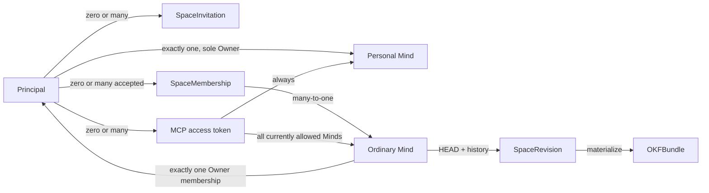

# Доменная модель и доступ

Статус: proposal, 2026-08-05. Product decisions в этом документе приняты для
первого прототипа; точные API schemas и storage implementation ещё не
реализованы.

## Терминология

Главная техническая сущность называется **KnowledgeSpace** (в product UI —
**Mind**, в коротком техническом тексте — `Space`). Это живой совместный объект
Mind Diary: у него есть стабильная identity, дерево OKF content, HEAD revision,
история, участники, visibility и audit trail.

| Термин | Значение |
|---|---|
| `Principal` | Внутренний пользователь Mind Diary, связанный с проверенной внешней identity. |
| `KnowledgeSpace` / `Mind` | Access boundary вокруг одного логического дерева знаний. |
| `Personal Mind` | Ровно один private Mind, автоматически и навсегда связанный с одним principal. |
| `SpaceRevision` | Неизменяемый снимок всего content Mind с manifest и parent revision. |
| `Checkpoint` | Неизменяемая именованная ссылка на одну `SpaceRevision`; service metadata, не OKF `tags`. |
| `Snapshot View` | Read-only view одной исторической revision. |
| `OKFBundle` | Материализованный импорт или export одной revision; memberships и ACL в него не входят. |
| `KnowledgeEntry` / `Memory` | Пользовательский searchable OKF concept; `Memory` — umbrella term в UI. |
| `Source` | Source-faithful материал или typed source concept с provenance. |
| `Asset` | Binary/non-Markdown объект со своими правилами передачи. |
| `Index` / `Log` | Reserved OKF `index.md` и `log.md`, а не обычные `KnowledgeEntry`. |
| `SpaceMembership` | Принятая связь principal с обычным Mind, ролью и lifecycle state. |
| `SpaceInvitation` | Ожидающее принятия приглашение уже зарегистрированного principal. |
| `Baseline visibility grant` | Reader-equivalent доступ authenticated non-member по visibility; не membership. |
| `SpaceLanding` | Base или personalized представление одной разрешённой revision. |
| `PersonalContext` | Ограниченная derived projection Personal Mind для персонализации, не второй corpus. |

Слово «артефакт» допустимо как неформальное общее описание content, но API не
должен скрывать под ним разные правила concept, source, asset и reserved files.

## Основные отношения



Один principal может участвовать во многих ordinary Minds. Один MCP connection
представляет principal, а не отдельный Mind; каждая content operation при этом
явно выбирает ровно один Mind и одну revision.

## Account и identity

Доступ к системе имеет только зарегистрированный и аутентифицированный
principal. Anonymous access отсутствует во всех visibility modes.

Первый Sites prototype получает проверенный account context от Sites и создаёт
собственный immutable `principal_id`. Текущая документация Sites подтверждает
verified email header, но не фиксирует стабильный внешний subject identifier;
поэтому правила смены email и relink account остаются platform gap до
реализации.

Account bootstrap — одна атомарная операция:

1. создать `Principal`;
2. создать его Personal Mind;
3. создать единственный owner binding этого Personal Mind;
4. вернуть успешный результат только после выполнения всех трёх действий.

Состояние «аккаунт есть, Personal Mind отсутствует» недопустимо. Lazy
provisioning не используется: первый пользовательский сценарий сразу работает
с Personal Mind.

## Identity и адресация Mind

Обычный Mind имеет независимые internal, URL и display identities:

```text
space_id          # immutable opaque primary identity
space_handle      # immutable в прототипе URL identity
normalized_handle # server-derived uniqueness key
name              # mutable, non-unique display name
metadata_version  # CAS для metadata/settings
canonical_path    # derived /{space_handle}
```

Canonical URL обычного Mind:

```text
https://{space-host}/{space_handle}
```

При создании пользователь вводит `name`; UI предлагает handle из имени и
позволяет исправить его до подтверждения. Handle уникален внутри verified host
namespace, резервируется атомарно и после создания не меняется в прототипе.
Router сначала разрешает handle в `space_id`, после чего ACL, revisions, audit,
jobs и object keys используют только `space_id`. Handle не является bearer
secret или доказательством доступа.

Reserved route Personal Mind:

```text
https://{space-host}/me
```

Personal Mind также имеет внутренние `space_id` и service-managed уникальный
`space_handle`, но этот handle не показывается и не выбирается пользователем.
`/me` всегда разрешается через authenticated `principal_id`. Display `name`
Personal Mind автоматически следует за display name principal и не редактируется
отдельно.

## Personal Mind invariants

Personal Mind использует тот же OKF content/revision storage, что обычный Mind,
но service layer обеспечивает более строгие правила:

- у principal ровно один Personal Mind;
- в нём ровно один participant — тот же principal с ролью Owner;
- visibility всегда `private`;
- нельзя приглашать или добавлять другого participant даже как Reader;
- нельзя передать ownership, сменить visibility, опубликовать или удалить Mind
  отдельно;
- весь content изменяется обычными authorized content commits и сохраняет
  immutable history;
- удалить Personal Mind можно только как часть удаления account.

Это не отдельный OKF type: binding и invariants находятся в service metadata.

## Ordinary Mind lifecycle и Owner

Создание ordinary Mind атомарно резервирует handle, создаёт Space и назначает
создателя его единственным Owner. Для каждого active ordinary Mind действует
инвариант **ровно одного Owner**.

Owner может передать ownership только existing active participant этого Mind.
Операция требует явного подтверждения текущего Owner и выполняется атомарно:
target становится Owner, прежний Owner становится Admin. Дополнительное
подтверждение target не нужно, потому что он уже принял membership. Pending
invitation не подходит для transfer.

Любой participant, кроме Owner, может выйти самостоятельно. Owner должен
сначала передать ownership или удалить Mind. Ownerless active state никогда не
используется как промежуточный или фоновый механизм удаления.

Только Owner может немедленно и безвозвратно удалить ordinary Mind. Для первого
прототипа удаляются metadata, content HEAD, все immutable revisions, indexes,
memberships, invitations и tokens/links, относящиеся к этому Mind. Более
детальная retention/privacy модель будет спроектирована позже.

Удаление account в прототипе также немедленное и безвозвратное:

- Personal Mind удаляется целиком;
- каждый ordinary Mind, где principal является Owner, удаляется целиком вместе
  с историей, даже если в нём есть другие participants;
- memberships и pending invitations principal в Minds других Owners удаляются;
- все MCP access tokens principal отзываются.

UI обязан заранее показать точный каскад удаления. Эта политика сознательно
временная и требует скорого пересмотра до production.

## Invitations и membership

Приглашать можно только уже зарегистрированного principal. Базовый lookup идёт
по exact verified email; глобальный fuzzy/display-name search и приглашение
незарегистрированных пользователей отложены.

При создании invitation сразу выбирается роль:

- Admin — `reader` или `editor`;
- Owner — `reader`, `editor` или `admin`.

Invitation отображается адресату внутри Mind Diary. Email delivery не входит в
прототип. Адресат принимает или отклоняет invitation; только после acceptance
атомарно создаётся active membership. Invitation живёт семь дней, может быть
отменено и выпущено заново. Pending invitation не даёт access и не может стать
target ownership transfer.

Минимальные service records:

```text
SpaceMembership:
  space_id
  principal_id
  role: reader | editor | admin | owner
  state: active | revoked
  version
  created_at / created_by
  updated_at / updated_by

SpaceInvitation:
  invitation_id
  space_id
  target_principal_id
  proposed_role: reader | editor | admin
  state: pending | accepted | rejected | cancelled | expired
  expires_at
  version
  created_at / created_by
```

На `(space_id, principal_id)` существует не более одной active membership и не
более одного актуального pending invitation. Membership/invitation — service
metadata и не входят в `OKFBundle`.

## Роли и capabilities

Роли иерархичны по content capabilities, но authorization проверяет именованные
capabilities, а не числовое значение enum.

| Capability | Reader | Editor | Admin | Owner |
|---|:---:|:---:|:---:|:---:|
| Browse, search, fetch, history, validate | ✓ | ✓ | ✓ | ✓ |
| Create/update/delete content and commit HEAD | — | ✓ | ✓ | ✓ |
| Create immutable Checkpoint | — | ✓ | ✓ | ✓ |
| Full OKF export | — | — | ✓ | ✓ |
| Invite/remove/change Reader or Editor | — | — | ✓ | ✓ |
| Configure non-destructive settings | — | — | ✓ | ✓ |
| Grant/revoke Admin | — | — | — | ✓ |
| Change visibility | — | — | — | ✓ |
| Transfer ownership or delete Mind | — | — | — | ✓ |

`editor` — техническое имя роли с write access. Оно включает чтение и полное
изменение content: create, replace и delete любых разрешённых файлов. Более
тонкие path/type grants отложены.

Admin не может создать, изменить или удалить Admin/Owner. Owner не назначает
второго Owner обычной role mutation: только атомарный `transfer_ownership`
сохраняет invariant единственного Owner.

Effective permissions вызова равны:

```text
current role or baseline visibility grant
∩ access-token scopes
∩ deployment-enabled capabilities
∩ revision mode capabilities
```

Role и membership state не принимаются из MCP arguments и не считаются
достоверными из долгоживущего JWT. Authorizer читает актуальное состояние на
каждом вызове.

## Visibility

Visibility — отдельная owner-controlled политика, а не роль или fake
membership. Новый ordinary Mind по умолчанию `private`.

| Mode | Authenticated participant | Authenticated non-member | Discovery |
|---|---|---|---|
| `private` | По своей роли | Нет доступа; ответ не раскрывает metadata/существование | Нет |
| `unlisted` | По своей роли | Reader-equivalent по точному handle/URL | Нет каталога |
| `public` | По своей роли | Reader-equivalent | Глобальный каталог Public Minds |

Baseline reader-equivalent access включает live HEAD, browse/search/fetch и
immutable history на тех же условиях, что Reader membership. Он не делает
principal participant, не показывает его в member list и не даёт write или
management capabilities. Явный Reader membership в public Mind разрешён и
может использоваться будущими функциями.

Только Owner меняет visibility. Переход в `private` немедленно прекращает все
baseline grants. Для `public` и `unlisted` отдельного `published_revision` нет:
успешный Editor commit становится новой HEAD и сразу виден всем текущим
читателям. Anonymous visitors доступа не получают ни в одном mode.

## Content commits и concurrency

Content mutation из MCP сразу пытается создать committed revision. Отдельных
server-side draft, diff confirmation и approval artifact в первом прототипе
нет.

Каноническая команда:

```text
commit_changeset(
  mind,
  expected_revision,
  idempotency_key,
  operations[]
)
```

Один changeset может содержать create/replace/delete нескольких файлов и
special operations для `index.md`/`log.md`. Он валидируется и применяется
атомарно: создаёт ровно одну immutable `SpaceRevision` и переводит HEAD либо не
меняет ничего. Stale `expected_revision` возвращает `409 Conflict` с current
revision; клиент перечитывает данные и повторно строит изменение. Автоматический
semantic merge, branches и last-writer-wins не поддерживаются.

Reserved files требуют явной семантики:

- `index.md` остаётся canonical authored OKF content; начальная special
  operation заменяет его под общим HEAD CAS. Автоматический merge отложен;
- `log.md` обновляется через `add_log_entry`, который сохраняет требуемый OKF
  newest-first/date-grouped порядок. Это не буквальный byte append;
- idempotency key не допускает повторной log entry или второй revision при
  сетевом retry;
- service audit/revision log не смешивается с canonical OKF `log.md`.

Добавление concept, его ссылки в `index.md` и записи в `log.md` должно проходить
одним changeset. Search/index infrastructure всегда производна и может быть
перестроена из точной canonical revision.

## История, Checkpoints и Snapshot View

Каждый успешный commit добавляет immutable revision в линейную историю:

```text
revision_id
revision_number
parent_revision_id
committed_at       # server-assigned UTC
committed_by
manifest_hash
summary
```

Исторический selector — exact `revision_id`, UTC `as_of` или immutable
Checkpoint — один раз разрешается в `resolved_revision_id`. Non-HEAD view всегда
read-only даже для Owner. Доступ проверяется заново по current membership или
current baseline visibility grant; отозванные старые права не
«воскрешаются».

Удаление файла из HEAD не стирает его из уже committed revisions. Whole-Mind и
account deletion, напротив, в прототипе физически удаляют всю историю согласно
описанному lifecycle. Эти две операции UI обязан различать явно.

## Content plane и control plane

Content MCP не публикует membership и ownership tools рядом с недоверенным
corpus:

- **Sites control plane:** accounts, Minds, visibility, invitations,
  memberships, roles, ownership, deletion, MCP tokens и settings;
- **Content MCP:** list/resolve allowed Minds, browse/search/fetch/history,
  validate/export и immediate content commits;
- **Internal application API:** единая граница use cases, которой пользуются
  web и MCP adapters. Raw file endpoints браузеру не выдаются.

Если agent-assisted administration понадобится позже, для него потребуется
отдельная privileged surface и отдельный threat model.

## Граница первого прототипа

В прототип входят authenticated-only account model, автоматический Personal
Mind, ordinary Minds, single-owner transfer, invitations registered users,
четыре роли, три visibility modes, public catalog, immutable history, direct
CAS commits, individual-file OKF access и user-scoped MCP.

Не входят anonymous access/publication, unregistered-user onboarding,
email invitations, fuzzy global user search, granular content grants, branches,
automatic semantic merge, legal retention policy, recovery after deletion,
billing/organization administration и cross-Mind content synthesis без
отдельного explicit use case.
