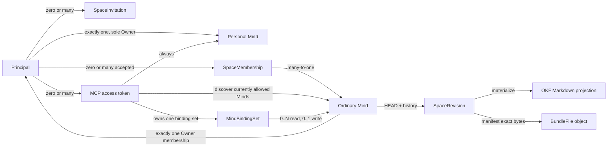

# Доменная модель и доступ

Статус: proposal, обновлено 2026-08-25. Product decisions первого прототипа
приняты для первого прототипа; format-neutral BundleFile amendment принят
отдельно для Release 0.2. Точные wire schemas принадлежат
[API specification](api.md); repository baseline уже содержит domain,
application, memory/Sites storage adapters и tests, а их live UAT evidence
учитывается отдельно от нормативной модели.

## Терминология

Главная техническая сущность называется **KnowledgeSpace** (в product UI —
**Mind**, в коротком техническом тексте — `Space`). Это живой совместный объект
Mind Diary: у него есть стабильная identity, дерево OKF content, HEAD revision,
история, участники, visibility и audit trail.

| Термин | Значение |
|---|---|
| `Principal` | Внутренний пользователь Mind Diary, связанный с проверенной внешней identity. |
| `KnowledgeSpace` / `Mind` | Access boundary вокруг одного логического дерева знаний. |
| `Personal Mind` | Ровно один private Mind, автоматически и навсегда связанный с одним principal. |
| `SpaceRevision` | Неизменяемый снимок всего content Mind с manifest и parent revision. |
| `Snapshot View` | Read-only view одной исторической revision. |
| `OKFBundle` | Markdown/OKF projection одной revision; memberships и ACL в неё не входят. |
| `KnowledgeEntry` / `Memory` | Пользовательский searchable OKF concept; `Memory` — umbrella term в UI. |
| `Source` | Source-faithful материал или typed source concept с provenance. |
| `BundleFile` | Принятый producer-defined regular non-Markdown file одной revision с `kind: opaque`; в UI attachment/asset. OKF 0.2 не задаёт эту entity или manifest. Release 0.2 admission format-neutral; preview/index policy separate. |
| `FileIngressSource` | Closed provenance class `session_attachment`, `local_path`, `workspace/generated_artifact`, `connector_object`, `bounded_in_memory` или `server_generated`; не authorization identity. |
| `VerifiedFileInput` | Adapter-produced bounded byte stream plus source kind, safe filename, advisory media evidence, size and SHA-256; provider IDs/URLs and local paths terminate at the adapter boundary. |
| `staged_file_ref` | Service-owned quarantined/verified locator pinned to owner, Space and write binding; it is consumed atomically by a BundleFile changeset and is not a provider/local locator. |
| `ImportSession` | Private resumable Markdown-only staging aggregate, pinned to principal/write binding/Space/base revision/idempotency key; не revision и не reader-visible content. |
| `CapacityReservation` | Durable bounded budget for one admitted operation; consumed/released atomically with canonical transition or cleanup. |
| `Index` / `Log` | Reserved OKF `index.md` и `log.md`, а не обычные `KnowledgeEntry`. |
| `SpaceMembership` | Принятая связь principal с обычным Mind, ролью и lifecycle state. |
| `SpaceInvitation` | Ожидающее принятия приглашение уже зарегистрированного principal. |
| `Baseline visibility grant` | Reader-equivalent доступ authenticated non-member по visibility; не membership. |
| `SpaceLanding` | Отложенный proposal: base или personalized представление одной разрешённой revision. |
| `PersonalContext` | Отложенный proposal: ограниченная derived projection Personal Mind для персонализации, не второй corpus. |

Слово «артефакт» допустимо как неформальное общее описание content, но API не
должен скрывать под ним разные правила concept, source, `BundleFile` и reserved
files. `BundleFile` принят как service envelope по
[отдельной specification](bundle-files.md), а не часть нормативного OKF core.

## Основные отношения



Один principal может участвовать во многих ordinary Minds. Один MCP connection
представляет principal, а не отдельный Mind; OAuth grant либо personal token
владеет независимым binding set `0..N` read и `0..1` write. Каждая content
operation явно выбирает ровно один Mind и одну revision.

## Account и identity

Доступ к системе имеет только зарегистрированный и аутентифицированный
principal. Anonymous access отсутствует во всех visibility modes.

UAT MVP на Sites получает platform-authenticated account context и создаёт
собственный immutable `principal_id`. Начальный external binding использует
server-normalized email из этого context. Exact match открывает существующий
principal, но email не считается стабильным внешним subject.
Текущая документация Sites не фиксирует стабильный внешний subject identifier,
поэтому неизвестный email невозможно автоматически отличить от смены email:
пользователь явно создаёт новый изолированный account без унаследованных прав
либо запускает manual recovery. Relink, merge и перенос access требуют отдельной
проверки identity и никогда не выполняются автоматически. Email не становится
internal authorization ID.

`Principal.display_name` инициализируется из optional platform-provided full
name, если он есть; иначе пользователь задаёт его при первом входе. Дальнейшее изменение profile
name атомарно обновляет display name Personal Mind, но не его content revision.

Account bootstrap — одна атомарная операция:

1. создать `Principal`;
2. создать его Personal Mind;
3. создать единственный owner binding этого Personal Mind;
4. вернуть успешный результат только после выполнения всех трёх действий.

Состояние «аккаунт есть, Personal Mind отсутствует» недопустимо. Lazy
provisioning не используется: первый пользовательский сценарий сразу работает
с Personal Mind.

### Test-only identity boundary

`SyntheticPrincipal` не является сущностью этой модели, subtype `Principal`,
login account, persisted actor kind или service principal. Это только actor
class автоматического release probe из
[ADR-0012](../decisions/0012-synthetic-principal-release-gates.md). После
обычного account bootstrap probe получает тот же `Principal`, Personal Mind,
memberships и tokens, что любой другой isolated account; synthetic label в них
не сохраняется.

Отдельная test composition может до bootstrap подать ephemeral trusted identity
snapshot через существующий reader и выбрать constructor-only external-binding
provider `synthetic-test`. Отдельного domain actor kind нет. Generic provider
dependency default-ится на `openai-sites`; Product Worker не меняет default, а
route, header, body/query, cookie, environment variable, serialized job,
deployment flag или `NODE_ENV` не могут выбрать provider.

Harness обязан использовать normal bootstrap, invitation, membership, token,
OAuth, ACL, CAS, revoke и deletion commands. Direct storage seed, client-
selected principal/role/scopes и authorization bypass запрещены. Поэтому
synthetic gate проверяет обычную доменную модель, а не параллельную test-only
модель доступа.

## Identity и адресация Mind

Обычный Mind имеет независимые internal, URL и display identities:

```text
space_id          # immutable opaque primary identity
space_handle      # immutable в прототипе URL identity
normalized_handle # server-derived uniqueness key
name              # mutable, non-unique display name
metadata_version  # CAS для metadata/settings
canonical_path    # derived /{space_handle}
```

Canonical URL обычного Mind:

```text
https://{space-host}/{space_handle}
```

При создании пользователь вводит `name`; UI предлагает handle из имени и
позволяет исправить его до подтверждения. Handle уникален внутри verified host
namespace, резервируется атомарно и после создания не меняется в прототипе.
Router сначала разрешает handle в `space_id`, после чего ACL, revisions, audit,
jobs и object keys используют только `space_id`. Handle не является bearer
secret или доказательством доступа.

Handle policy первого прототипа фиксирована до создания persistent IDs:

- canonical form — lowercase ASCII `[a-z0-9]` с одиночным `-` между segments;
- длина 3–63 characters; leading/trailing/consecutive hyphen запрещены;
- input проходит Unicode NFKC, затем либо явную transliteration в UI, либо
  отклоняется server-side, если итог не canonical ASCII;
- percent-decoding выполняется ровно один раз; encoded slash, backslash, dot
  segments и control characters отклоняются;
- reserved registry включает `me`, `mcp`, `api`, `admin`, `settings`, `public`,
  `assets`, `www` и все занятые top-level service routes;
- comparison и uniqueness выполняются по canonical form;
- после hard deletion handle навсегда остаётся retired в минимальном registry,
  который не содержит `space_id`, Owner или content. Старый URL не может начать
  указывать на другой Mind.

Create возвращает одинаковое `handle_unavailable` для occupied, reserved и
retired values. Это снижает usefulness availability probe, но глобальная
уникальность всё равно не считается абсолютной защитой от inference.

Reserved route Personal Mind:

```text
https://{space-host}/me
```

Personal Mind также имеет внутренние `space_id` и service-managed уникальный
`space_handle`, но этот handle не показывается и не выбирается пользователем.
`/me` всегда разрешается через authenticated `principal_id`. Display `name`
Personal Mind автоматически следует за display name principal и не редактируется
отдельно.

## Personal Mind invariants

Personal Mind использует тот же OKF content/revision storage, что обычный Mind,
но service layer обеспечивает более строгие правила:

- у principal ровно один Personal Mind;
- в нём ровно один participant — тот же principal с ролью Owner;
- visibility всегда `private`;
- нельзя приглашать или добавлять другого participant даже как Reader;
- нельзя передать ownership, сменить visibility, опубликовать или удалить Mind
  отдельно;
- весь content изменяется обычными authorized content commits и сохраняет
  immutable history;
- удалить Personal Mind можно только как часть удаления account.

Это не отдельный OKF type: binding и invariants находятся в service metadata.

## Ordinary Mind lifecycle и Owner

Создание ordinary Mind атомарно резервирует handle, создаёт Space и назначает
создателя его единственным Owner. Для каждого active ordinary Mind действует
инвариант **ровно одного Owner**.

Owner может передать ownership только existing active participant этого Mind.
Операция требует явного подтверждения текущего Owner и выполняется атомарно:
target становится Owner, прежний Owner становится Admin. Дополнительное
подтверждение target не нужно, потому что он уже принял membership. Pending
invitation не подходит для transfer.

Любой participant, кроме Owner, может выйти самостоятельно. Owner должен
сначала передать ownership или удалить Mind. Ownerless active state никогда не
используется как промежуточный или фоновый механизм удаления.

Только Owner может немедленно и безвозвратно удалить ordinary Mind. Для первого
прототипа удаляются metadata, content HEAD, все immutable revisions, indexes,
memberships, invitations и все остальные связанные с Mind service records.
Principal-bound MCP tokens не удаляются: после удаления они просто больше не
могут разрешить этот Mind. Более детальная retention/privacy модель будет
спроектирована позже. Единственное исключение — неразрешимый retired-handle
record без связи с прежним `space_id`; target-linked audit и idempotency records
также удаляются. Отдельный forensic deletion receipt не сохраняется: это
сознательный accountability trade-off принятого delete-all прототипа, который
должен быть пересмотрен вместе с retention/privacy model.

Удаление account в прототипе также немедленное и безвозвратное:

- Personal Mind удаляется целиком;
- каждый ordinary Mind, где principal является Owner, удаляется целиком вместе
  с историей, даже если в нём есть другие participants;
- memberships и pending invitations principal в Minds других Owners удаляются;
- все MCP access tokens principal отзываются;
- external bindings, verified email, display name и прочий profile удаляются;
- commits и canonical content в Minds других Owners не меняются. Их
  `committed_by` ссылается на необратимый `deleted-principal` tombstone с opaque
  ID и состоянием `deleted`, без email, display name или возможности login.

UI обязан заранее показать точный каскад удаления. Эта политика сознательно
временная и требует пересмотра перед production-grade расширением за пределы
MVP.

## Invitations и membership

Приглашать можно только уже зарегистрированного principal. Базовый lookup идёт
по exact verified email; глобальный fuzzy/display-name search и приглашение
незарегистрированных пользователей отложены.

При создании invitation сразу выбирается роль:

- Admin — `reader` или `editor`;
- Owner — `reader`, `editor` или `admin`.

Invitation отображается адресату внутри Mind Diary. Email delivery не входит в
прототип. Адресат принимает или отклоняет invitation; только после acceptance
атомарно создаётся active membership. Invitation живёт семь дней, может быть
отменено и выпущено заново. Pending invitation не даёт access и не может стать
target ownership transfer.

Минимальные service records:

```text
SpaceMembership:
  space_id
  principal_id
  role: reader | editor | admin | owner
  state: active | revoked
  version
  created_at / created_by
  updated_at / updated_by

SpaceInvitation:
  invitation_id
  space_id
  target_principal_id
  proposed_role: reader | editor | admin
  state: pending | accepted | rejected | cancelled | expired
  expires_at
  version
  created_at / created_by
```

На `(space_id, principal_id)` существует не более одной active membership и не
более одного актуального pending invitation. Membership/invitation — service
metadata и не входят в `OKFBundle`.

## Роли и capabilities

Роли иерархичны по content capabilities, но authorization проверяет именованные
capabilities, а не числовое значение enum.

| Capability | Reader | Editor | Admin | Owner |
|---|:---:|:---:|:---:|:---:|
| Browse, search, fetch, history, validate | ✓ | ✓ | ✓ | ✓ |
| Create/update/delete content and commit HEAD | — | ✓ | ✓ | ✓ |
| Full OKF export | ✓ | ✓ | ✓ | ✓ |
| Invite/remove/change Reader or Editor | — | — | ✓ | ✓ |
| Configure non-destructive settings | — | — | ✓ | ✓ |
| Grant/revoke Admin | — | — | — | ✓ |
| Change visibility | — | — | — | ✓ |
| Transfer ownership or delete Mind | — | — | — | ✓ |

`editor` — техническое имя роли с write access. Оно включает чтение и полное
изменение content: create, replace и delete любых разрешённых файлов. Более
тонкие path/type grants отложены.

Full export — bulk convenience operation, а не security boundary: Reader и
baseline Reader уже могут прочитать тот же corpus по файлам. Export требует
`content:read`, фиксирует exact revision, повторно проверяет current access при
выдаче download URL и может иметь отдельные rate/size limits.

Admin не может создать, изменить или удалить Admin/Owner. Owner не назначает
второго Owner обычной role mutation: только атомарный `transfer_ownership`
сохраняет invariant единственного Owner.

Effective permissions вызова равны:

```text
current role or baseline visibility grant
∩ access-token scopes
∩ current grant/token Mind binding
∩ deployment-enabled capabilities
∩ revision mode capabilities
```

Role, membership state и выбранный `space_id` не принимаются как достоверные из
MCP arguments или cached token claims. Opaque access token определяет только
principal и scopes; Authorizer читает актуальное состояние Mind на каждом
вызове.

`content:write` включает `content:read`; write-only token в первом прототипе не
существует. Scope и ACL не выбирают destination: content read требует read
binding либо current write binding, а commit — exact active immutable
`write_binding_id`. Полный lifecycle и CAS описаны в
[Mind bindings](mind-bindings.md).

## Visibility

Visibility — отдельная owner-controlled политика, а не роль или fake
membership. Новый ordinary Mind по умолчанию `private`.

| Mode | Authenticated participant | Authenticated non-member | Discovery |
|---|---|---|---|
| `private` | По своей роли | Нет доступа; ответ не раскрывает metadata/существование | Нет |
| `unlisted` | По своей роли | Reader-equivalent по точному handle/URL | Нет каталога; URL не является secret |
| `public` | По своей роли | Reader-equivalent | Глобальный каталог Public Minds |

Baseline reader-equivalent access включает live HEAD, browse/search/fetch и
immutable history на тех же условиях, что Reader membership. Он не делает
principal participant, не показывает его в member list и не даёт write или
management capabilities. Явный Reader membership в public Mind разрешён и
может использоваться будущими функциями.

Только Owner меняет visibility. Переход в `private` немедленно прекращает все
baseline grants. Для `public` и `unlisted` отдельного `published_revision` нет:
успешный Editor commit становится новой HEAD и сразу виден всем текущим
читателям. Baseline grant также открывает всю immutable history, поэтому UI
перед включением `public`/`unlisted` предупреждает, что последующий возврат в
`private` прекратит будущий доступ, но не отменит уже состоявшееся раскрытие.
Anonymous visitors доступа не получают ни в одном mode.

## Content commits и concurrency

Content mutation из MCP сразу пытается создать committed revision. Отдельных
server-side draft, diff confirmation и approval artifact в первом прототипе
нет.

Каноническая команда:

```text
commit_changeset(
  mind,
  write_binding_id,
  expected_revision,
  idempotency_key,
  operations[]
)
```

`mind` обязан совпадать с current target exact `write_binding_id`; binding ID
проверяется в authoritative transaction и не перенаправляется после rebind.
Один changeset может содержать create/replace/delete Markdown и BundleFile,
а также special operations для `index.md`/`log.md`. Opaque create/replace
ссылается только на verified staged ref exact active write binding. Changeset
валидируется и применяется
атомарно: создаёт ровно одну immutable `SpaceRevision` и переводит HEAD либо не
меняет ничего. Stale `expected_revision` возвращает `409 Conflict` с current
revision; клиент перечитывает данные и повторно строит изменение. Автоматический
semantic merge, branches и last-writer-wins не поддерживаются.

Accepted Brain-scale storage model materializes manifest as a separately
digested Space-scoped object. Legacy v3 uses the historical closed-media entry
semantics; Release 0.2 v4 keeps the storage layout with open advisory media and
`application/octet-stream` fallback. Delta commit reuses unchanged parent digests;
reachability, usage and reservation move with revision/HEAD in the same D1
transaction. Resumable Markdown import stages private batches and invokes this
same final CAS once; checkpoints never become partial revisions. Normative
details and not-started status are in
[Sites storage/capacity/import](sites-storage-capacity-import.md).

MD-271's [file-ingress contract](file-ingress.md) applies the same boundary to
all BundleFile sources. The current candidate has local `session_attachment`,
bounded-inline and server-generated streaming code/tests, plus the repo-local
MD-272 companion for explicit `local_path`, `workspace/generated_artifact` and
bounded local bytes. These adapters do not claim hosted upload-intent or
native-client capability; connector and hosted producer evidence remain
separate until their owning adapters and exact evidence exist.

The accepted 0.2 opaque-file maximum is exactly 268,435,456 bytes (256 MiB),
inclusive, and one changeset may reference at most the same staged-byte total.
Upload, SHA-256, quarantine, promotion, historical read/download and export are
streaming/non-buffering: no application/domain port requires resident memory
proportional to the file. Current adapters still implement the legacy
64 MiB/allowlist baseline until MD-304.

Reserved files требуют явной семантики:

- `index.md` остаётся canonical authored OKF content; начальная special
  operation заменяет его под общим HEAD CAS. Автоматический merge отложен;
- `log.md` обновляется через `add_log_entry`, который сохраняет требуемый OKF
  newest-first/date-grouped порядок. Это не буквальный byte append;
- idempotency key namespaced по `principal_id + space_id + operation + key` и
  связан с canonical request hash. Тот же key с тем же payload возвращает тот
  же result; тот же key с другим payload возвращает `409 Idempotency Conflict`;
- service audit/revision log не смешивается с canonical OKF `log.md`.

Добавление concept, его ссылки в `index.md` и записи в `log.md` должно проходить
одним changeset. Search/index infrastructure всегда производна и может быть
перестроена из точной canonical revision. Индексируются только Markdown
entries; opaque bytes не становятся snippets.

## История и Snapshot View

Каждый успешный commit добавляет immutable revision в линейную историю:

```text
revision_id
revision_number
parent_revision_id
committed_at       # server-assigned UTC
committed_by
manifest_hash
summary
```

Исторический selector — exact `revision_id` или UTC `as_of` — один раз
разрешается в `resolved_revision_id`. `as_of` выбирает revision с максимальным
`revision_number`, у которой server-assigned `committed_at <= as_of`; если такой
revision нет, возвращается not found, без fallback на HEAD. Non-HEAD view всегда
read-only даже для Owner. Доступ проверяется заново по current membership или
current baseline visibility grant; отозванные старые права не
«воскрешаются». Именованные checkpoints/tags не входят в первый прототип.

Удаление файла из HEAD не стирает его из уже committed revisions. Whole-Mind и
account deletion, напротив, в прототипе физически удаляют всю историю согласно
описанному lifecycle. Эти две операции UI обязан различать явно.

## Content plane и control plane

Content MCP не публикует membership и ownership tools рядом с недоверенным
corpus:

- **Sites control plane:** accounts, Minds, visibility, invitations,
  memberships, roles, ownership, deletion, MCP tokens и settings;
- **Content MCP:** discovery allowed Minds, управление per-grant/token read и
  singleton write bindings, bound browse/search/fetch/history, validate/export
  и immediate content commits;
- **Internal application API:** единая граница use cases, которой пользуются
  web и MCP adapters. Raw file endpoints браузеру не выдаются.

Service-wide operator authority не является ролью Space. Она задаётся только
constructor configuration по opaque `principal_id`, открывает один read-only
support projection и не расширяет content/control capabilities. Compact
success-only web/MCP activity summary является observational metadata, не
authorization signal; поля, deletion и privacy contract заданы в
[отдельной accepted specification](service-operator-directory.md).

Если agent-assisted administration понадобится позже, для него потребуется
отдельная privileged surface и отдельный threat model.

## Граница Release 0.1

В Release 0.1 входят authenticated-only account model, автоматический Personal
Mind, ordinary Minds, single-owner transfer, invitations registered users,
четыре роли, три visibility modes, public catalog, immutable history, direct
CAS commits, individual-file UTF-8 Markdown/OKF 0.2 access, deterministic
Markdown export, user-scoped MCP и internal read-only UAT operator directory.
Принятые BundleFile, Space-scoped delta/capacity/import и universal file-ingress
contracts относятся к post-MVP и не блокируют terminal 0.1.

Не входят anonymous access/publication, unregistered-user onboarding,
email invitations, fuzzy global user search, granular content grants, branches,
automatic semantic merge, named checkpoints, BundleFile/file ingress,
Brain-scale storage/import/export, ZIP/binary/legacy bundle import,
extraction/OCR/general file types, legacy 0.1 migration, legal retention policy, recovery after
deletion, billing/organization administration и cross-Mind content synthesis
без отдельного explicit use case.

## Граница Release 0.2 BundleFile

Accepted domain target разрешает arbitrary regular non-Markdown file as opaque
versioned member. `media_type` is advisory and open; unknown/missing/conflicting
evidence becomes `application/octet-stream`. Only Markdown is OKF knowledge and
indexed content. Only a separately verified safe-raster subset may be inline;
all other objects are attachment/download-only and never executed/extracted.

MD-306 may add one typed OKF Markdown entry with unknown producer fields and
individually staged linked files through ordinary changesets. This does not add
an OKF `Asset`, directory/glob/batch/archive importer, migration database or
whole-Brain atomicity; `recorded_by`, `applies_to` and `sources` remain
producer content, not service authority.
