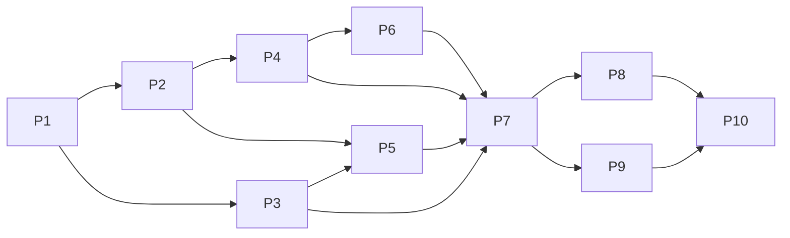

# Операции над Memory без знания OKF: план перехода

Статус: superseded, 2026-09-18. План серверного сокрытия OKF отменён по
решению пользователя; MD-454 и его подзадачи отменены. Этот документ сохранён
как история предложения, а не действующий план реализации.

Заменивший его контракт Release 0.5: MD-469 — серверный доктор
консистентности, MD-470 — проверка файлового changeset без сохранения,
MD-471 — инструкции и полный файловый сценарий, MD-472 — отдельный
MCP-инструмент выдачи руководства из общего со skill источника. Агент сам
читает и изменяет OKF; сервер проверяет корректность, доступ и конкурентные
изменения. Существующий `enqueue_note` сохраняется, новый server-managed
Memory CRUD не вводится. Нормативный текущий контракт находится в
[API](api.md) и [Plugin и OAuth](plugin-connector.md); состояние реализации и
hosted evidence принадлежит Task Manager и release evidence, а не этому
историческому документу.

## Исторический статус на 2026-09-16

Пользователь поручил разработать подробный
план и разложить работу на задачи релиза. Документ не утверждает, что новые
операции реализованы. Конкретные имена и схемы ниже — проектное предложение;
их окончательный контракт закрепляет первая задача. Состояние выполнения
принадлежит Task Manager, а не этому документу.

План заведён в [Release 0.5](https://task-manager.example.invalid/projects/525e801d-0ae9-4be7-bae4-6a9c8f85f581/releases/541b77b6-c95f-43e6-bf6a-78df014741c5)
проекта Mind Diary: Active, Epic
[MD-454](https://task-manager.example.invalid/issues/12b27b57-2c0a-403d-a8b2-03def42f75ba).
При создании 2026-09-16 Epic и десять подзадач находились в Backlog; реализация
не запускалась. По прямому поручению пользователя 0.3 переведён в Released,
0.4 оставлен в уже существовавшем Released.

## Проблема и ожидаемый результат

Обычный ChatGPT должен найти, прочитать, создать, исправить и удалить отдельную
запись в выбранном Mind, не составляя YAML, пути или служебные файлы OKF.
Сервер сохраняет переносимый OKF 0.2 и действующие гарантии доступа, истории,
происхождения данных и конкурентных изменений. Codex использует тот же обычный
контракт; расширенные файловые операции остаются для специальной работы.

Критерий результата: новый разговор ChatGPT без учебника OKF и без Codex skill
проходит поиск → чтение → создание → изменение → повторный поиск. Серверная
проверка и чтение точной ревизии подтверждают содержание и происхождение.
Периодическое обслуживание другим агентом не требуется для корректности этих
операций.

## Требования пользователя и решения плана

Пользователь поставил проблему зависимости ChatGPT от знания структуры OKF,
предложил серверное сокрытие формата, инструкции в ChatGPT и последующее
обслуживание Codex как альтернативы, затем поручил разработать план переделки
и создать задачи в релизе.

Предлагаемое техническое решение агента:

- сервер владеет представлением, агент — содержанием и смыслом изменений;
- Content MCP получает операции над отдельной Memory поверх существующего
  commit pipeline; второй store и второй механизм публикации не создаются;
- Custom Instructions содержат пользовательские правила выбора Minds и
  использования знаний, а контракт инструментов передаётся через MCP;
- новые операции вводятся совместимо, без переписывания существующего corpus;
- источники, выводы и неопределённость остаются различимыми; сервер не
  придумывает авторство, доказательства, тип знания или степень достоверности.

Имена инструментов, набор редактируемых полей, идентификаторы и последовательность
задач являются Agent Plan, а не дословными требованиями пользователя.

## Проверенная исходная реализация

| Область | Текущее поведение | Что требуется изменить |
|---|---|---|
| Входящие заметки | `enqueue_note` принимает `mind`, `idempotency_key`, `title`, `text`; сервер создаёт `Source` в `raw/inbox/` | Переиспользовать общий producer и сохранить короткий путь добавочной заметки |
| Обычная запись файлов | `commit_changeset` принимает полные тексты и пути | Дать операции над содержанием и метаданными Memory без ручного OKF |
| Валидация | Producer проверяет весь результирующий Markdown bundle, включая quality warnings | Сохранить серверный gate; убрать обязательную сборку/валидацию всего bundle обычным клиентом |
| Поиск и чтение | Есть `search`, `browse_entries`, `fetch`, `list_files`, `grep_files`, `read_files`; выдача привязана к ревизии | Добавить удобную структурированную проекцию записи и переход к её изменению |
| Неизвестные поля | Codec умеет сохранять неизвестные types/fields; body-only update сохраняет исходный header | Развить явную семантику patch и доказать отсутствие потерь |
| Очередь | Durable receipt отделён от canonical commit; autonomous scheduler после потери isolate не доказан | Не менять смысл `queued` и не обещать новую гарантию фонового исполнения |
| Клиенты | Инструкции упоминают OKF и требуют client-side полного контроля bundle | Сделать обычный сценарий самодостаточным на уровне инструментов |

Основания: [API](api.md), [актуальный аудит codec pin](../reports/2026-08-30-okf-status.md),
`packages/application-content/src/note-queue.ts`,
`packages/application-content/src/changeset-preflight.ts`,
`packages/okf-codec/src/validator.ts`,
`packages/adapter-mcp/src/tool-definitions.ts`.

MD-419 и MD-430 уже обеспечивали discovery/read без обязательного skill;
MD-453 реализовал быстрый приём входящих заметок. Этот план расширяет их
результат до управляемого жизненного цикла Memory. Завершённые задачи не
переоткрываются и не копируются. Отменённые работы по semantic search,
морфологии и entity resolution не возобновляются этим планом.

## Границы ответственности

| Решение | Агент | Сервер |
|---|---|---|
| Mind назначения | Выбирает по запросу/действующим пользовательским правилам | Проверяет exact target, usage mode, scope и ACL |
| Содержание | Формулирует запись, сохраняет существенные оговорки | Сохраняет переданный смысл без LLM-переписывания |
| Источник или синтез | Явно выбирает поддерживаемую семантику | Отображает её в утверждённый профиль OKF |
| Дубликат или исправление | Находит прежнюю запись и принимает смысловое решение | Обеспечивает idempotency и concurrency; не делает fuzzy merge |
| Источники | Передаёт доступные фактические ссылки и атрибуцию | Проверяет форму, exact internal refs и актуальные права |
| Формат | Не составляет frontmatter и служебные файлы | Сериализует, сохраняет расширения, валидирует |
| История | Выбирает нужную ревизию для чтения | Не разрешает запись в историю, создаёт новую ревизию |

MCP adapter занимается схемой, transport и trusted actor mapping. Преобразование
Memory в OKF принадлежит `application-content` и `okf-codec`, чтобы одинаковые
правила могли использовать разные adapters. Слой не вызывает model API.

## Предлагаемая поверхность инструментов

Имена должны быть окончательно согласованы с existing catalog в задаче P1.
Не добавлять универсальный `save`, который сам угадывает create/update/delete.

| Операция | Вход и результат | Граница |
|---|---|---|
| `enqueue_note` | Сохраняет текущий короткий контракт, возвращает durable receipt | Только новая добавочная заметка; `queued` не означает `committed` |
| `create_memory` | Mind, idempotency, согласованная версия HEAD, заголовок, body Markdown, семантика записи, опциональные источники/метаданные; возвращает Memory и revision | Синхронное создание структурированной записи и перенос с точными source refs |
| `get_memory` | Mind, server-issued reference, selector ревизии; возвращает body, тип, источники, поля, ограничения редактирования и concurrency token | Не требует path/frontmatter; размер ограничен, чтение имеет continuation |
| `update_memory` | Exact Memory, ожидаемая версия, idempotency, явный patch | Обновляет только названные поля; не переименовывает/переносит запись |
| `delete_memory` | Exact Memory, ожидаемая версия, idempotency | Удаление из HEAD; история сохраняется; никакого каскадного удаления |
| Существующий поиск | Сохраняет привычный запрос; возвращает references для чтения Memory и точную ревизию | Без нового поискового движка или обещания semantic search |
| `commit_changeset` и файловые reads | Сохраняют полный низкоуровневый контракт | Расширенное редактирование, atomic multi-file changes и обслуживание |

Обычная запись работает с конечным текстом body, а не natural-language командой
серверу «перепиши получше». Для больших исходных файлов сохраняется file ingress;
добавление Memory не дублирует транспорт вложений и не загружает URL автоматически.

### Идентичность и история

- Reference выдаёт сервер, клиент не конструирует её из имени или пути.
- Reference не является полномочием: каждый read/write проверяет доступ.
- Не смешивать identity записи, selector ревизии и истекающий pagination/fetch
  locator. Истёкший locator требует нового разрешённого чтения.
- Предпочтение первой итерации — использовать существующую Mind/path identity
  под server-issued reference без глобальной миграции идентификаторов. Rename
  и move не входят в scope; стабильность reference после них не обещается.
- Запись возможна только в live HEAD при ожидаемой версии. Historical result
  нельзя автоматически преобразовать в разрешение на замену текущей записи.
- История и export остаются производными от существующих immutable revisions;
  новая проекция не создаёт параллельную canonical базу Memory.

### Содержание и метаданные

- Минимальная модель разделяет исходный материал и производное знание;
  точное отображение в OKF types утверждается P1. Не называть все записи `Source`.
- `title`, `body`, выбранные descriptive fields, lifecycle и references имеют
  типизированные схемы. Unknown types/fields читаются и сохраняются; неподдерживаемая
  семантическая операция возвращает ограничение вместо потери информации.
- В patch отсутствие поля означает сохранить; очистка означает отдельное
  явное действие. `null`, пустая строка, пустой массив и отсутствие поля не
  считаются взаимозаменяемыми. Источники можно явно добавить/удалить, но они
  не исчезают при изменении body.
- Существующие `verified`, provenance и custom fields нельзя молча обновлять
  вместе с содержанием. Сохранённый verification signal не означает проверку
  нового body: P1 определяет сохранение исторического evidence и явное
  отображение утраты актуальности attestation после изменения содержания.
- Сервер не ставит `verified`, не приписывает неизвестного автора или время
  происхождения и не превращает сообщение пользователя в подтверждённый факт.
  Commit time и source time различаются.
- Ссылки на внутренние источники содержат exact Mind/revision/locator. Для
  переносимого export используется существующий принятый provenance envelope;
  service authority fields в OKF не добавляются.
- Для новых файлов сервер выбирает путь по утверждённому producer profile;
  display title не определяет identity и не вызывает rename при изменении.
- `index.md` и `log.md` остаются authored canonical files. Не регенерировать
  их целиком и не уничтожать ручные разделы. P1 перечисляет необходимые
  точечные изменения; если изменение не требуется, файл остаётся byte-identical.

### Проверка, ошибки и конкурентность

- Все пути записи используют существующие authorization, write generation,
  idempotency, capacity, audit, full-bundle validation и HEAD CAS.
- Изменение записи с устаревшей версией возвращает конфликт. Автоматическое
  семантическое слияние или перезапись свежего текста запрещены.
- Retry после неизвестного результата использует исходный payload и ключ;
  reconciliation должен работать и для новых операций, а не требовать знания
  сгенерированного changeset. No-op не должен плодить пустые ревизии.
- Ошибки объясняют исправимое поле, конфликт, отсутствие source, размер или
  ограничение операции. Нормальному клиенту не предлагается чинить YAML.
- Существующий warning в неизменённом legacy bundle может блокировать
  producer commit. Это отдельное понятное ограничение; не ослаблять gate и не
  исправлять произвольный corpus скрытой миграцией.
- Удаление записи с входящими ссылками не проходит ценой разрушения bundle.
  Первая итерация возвращает понятный conflict/references error и оставляет
  HEAD неизменным; связанное atomic исправление доступно через expert path.
- Cross-Mind source read не даёт права раскрывать источник другим читателям.
  Правило прямого разрешения на перенос Personal content сохраняется в policy;
  сервер проверяет доступные ему ACL/scopes, но не объявляет намерение человека
  криптографически доказанным из client flag.

## Совместимый переход

1. Зафиксировать contract и примеры запросов/ответов, затем реализовать общий
   producer и структурированное чтение без смены существующих форматов хранения.
2. Добавить новые операции рядом со старыми. Сохранить имена, input и error
   semantics существующих tools, `enqueue_note` receipts и retired-tool behavior.
3. Перевести входящие заметки на общий producer, не меняя уже принятые payloads,
   idempotency keys или трактовку состояний очереди. Старые pending jobs должны
   либо обработаться по прежнему контракту, либо завершиться видимой ошибкой.
4. Обновить descriptions/schema/examples обоих MCP transport profiles и, где
   применимо, Apps profile. Обычный сценарий не требует local skill, сборки
   всего bundle в контексте или клиентского OKF validator.
5. Обновить help, канонические Custom Instructions и optional Codex skill.
   Source/package/Marketplace/installed-client evidence различать. Metadata
   refresh существующего ChatGPT подключения проверяется отдельно от deployment.
6. Выполнить UAT приёмку на synthetic content и подтвердить saved settings
   реального клиента по действующему delivery profile. Не менять scopes, ACL
   или режимы Minds ради обхода ограничений теста.

Rollback означает возврат совместимого server/client artifact при сохранении
валидных новых ревизий. Удаление новых пользовательских записей не является
rollback. Для новых durable records, если без них нельзя обойтись, P1 отдельно
задаёт additive schema и возможность чтения/безопасного отказа старой версии.

## Декомпозиция задач

Каждая P-задача — отдельный проверяемый результат под Epic MD-454. Всем задачам
явно назначен Release 0.5 и начальный статус Backlog. Labels взяты из текущего
каталога: Epic для родителя; Feature или Improvement для конкретных результатов.
Номера P сохраняются как обозначения в контракте и графе зависимостей.

| План | Task Manager | Результат |
|---|---|---|
| P1 | [MD-455](https://task-manager.example.invalid/issues/4407db23-fced-4665-bb67-3495e3bddc54) | Закрепить контракт управляемых операций над Memory |
| P2 | [MD-456](https://task-manager.example.invalid/issues/706f8f07-c076-4220-8815-4c67feecc841) | Формировать и изменять OKF на сервере без потери метаданных |
| P3 | [MD-457](https://task-manager.example.invalid/issues/cf02ca04-c8ec-408b-bd99-d317ea76522f) | Читать и находить Memory через структурированную проекцию |
| P4 | [MD-458](https://task-manager.example.invalid/issues/9e35f9b7-757c-4a1d-ba40-ea5db3fa3812) | Создавать Memory с источниками через существующий commit pipeline |
| P5 | [MD-459](https://task-manager.example.invalid/issues/56358429-71f7-439f-8008-29ef03dd0199) | Изменять и удалять Memory без потери чужих изменений |
| P6 | [MD-460](https://task-manager.example.invalid/issues/fead9247-bd13-438e-a536-3f48a49b0c9e) | Согласовать queued capture с общим producer Memory |
| P7 | [MD-461](https://task-manager.example.invalid/issues/7c33db11-26fa-4b34-8c30-4a834075f021) | Опубликовать самодостаточные MCP-инструменты работы с Memory |
| P8 | [MD-462](https://task-manager.example.invalid/issues/6529c00b-bd02-450c-aedf-fdd57ab49671) | Перевести инструкции и пакет подключения на операции Memory |
| P9 | [MD-463](https://task-manager.example.invalid/issues/3f0ffd4b-047d-47f0-945c-ea610bcc3331) | Доказать совместимость и целостность полного Memory workflow |
| P10 | [MD-464](https://task-manager.example.invalid/issues/ce28da0c-8758-4791-9567-e99b18bf7659) | Подтвердить работу Memory в UAT и новом разговоре ChatGPT |

### P1. Закрепить контракт управляемых операций над Memory

Результат: спецификация и ADR для нового application/MCP contract, operation
disposition и границ совместимости. Уточнить types/fields, reference lifecycle,
patch/unset, stale verification, source mapping, deletion references, лимиты,
no-op, reconciliation и существующие warning-bearing bundles. Привести минимум
по одному полному примеру create/read/update/delete и queued capture.

Приёмка: все сценарии из матрицы ниже имеют один определённый исход; формат
хранения и authority не меняются неявно; открытых семантических решений,
блокирующих реализацию P2–P7, не остаётся. Обновлены затронутые спецификации,
navigation и contract fixtures. Без реализации новых product paths.

### P2. Формировать и изменять OKF на сервере без потери метаданных

Результат: общий детерминированный producer/patch layer в `okf-codec` и
`application-content`; не зависит от MCP, Sites и model API. Управляет
генерацией пути, frontmatter, sources и необходимыми служебными изменениями.

Приёмка: ordinary fields сериализуются валидно; body-only и partial metadata
updates сохраняют unknown fields/types, authored index/log и незатронутые
bytes; explicit unset и verification/provenance policy проверены; unicode,
multiline, заголовки с YAML-символами и конфликтующие ссылки имеют fixtures.
Зависит от P1.

### P3. Читать и находить Memory через структурированную проекцию

Результат: application query для Memory и совместимые ссылки из существующих
search/browse results. Body, тип, источники, доступные поля и current revision
возвращаются без необходимости разбирать raw frontmatter.

Приёмка: current и historical reads фиксируют одну revision; pagination и
большой body не теряют provenance; existing custom records читаются без миграции;
expired/foreign refs не обходят ACL; canonical fallback сохраняет Mind/revision
при недоступном search index. Новый search engine не создаётся. Зависит от P1.

### P4. Создавать Memory с источниками через существующий commit pipeline

Результат: синхронный application command создания source/derived Memory с
идемпотентностью, exact source references и результатом committed.

Приёмка: агент не передаёт path/YAML; повтор не создаёт дубликат; source
transfers сохраняют exact provenance и проверяют доступ; invalid fields,
лимиты и full-bundle defects не двигают HEAD. Новый результат читается query
P3 и существующими raw tools. Зависит от P2.

### P5. Изменять и удалять Memory без потери чужих изменений

Результат: application commands update/delete по exact reference и ожидаемой
версии; явный patch, no-op и reconciliation неизвестного результата.

Приёмка: сохранены неизвестные поля и источники; stale/concurrent update
отклонён; no-op не создаёт лишнюю revision; история read-only; delete сохраняет
историю и не делает cascade; входящие ссылки получают определённый исход;
same-key retry/reconcile не требует клиента восстанавливать raw changeset.
Зависит от P2 и P3.

### P6. Согласовать queued capture с общим producer Memory

Результат: `enqueue_note` использует общую materialization логику, сохраняя
совместимость MD-453 и независимое завершение приёма от commit.

Приёмка: legacy title/text и pending payloads совместимы; receipt states и
original idempotency сохраняются; добавочный rebase не превращается в update;
failure сохраняет payload и видимую причину; follow-up lookup находит committed
Memory. Обычный агент не начинает polling. Новая scheduler guarantee и фоновая
смысловая переработка не входят в задачу. Зависит от P4.

### P7. Опубликовать самодостаточные MCP-инструменты работы с Memory

Результат: handlers, input/output schemas, descriptions, annotations,
errors/recovery и inventories новых operations на действующих MCP profiles.

Приёмка: fresh discovery даёт достаточно правил для обычных действий без
OKF/skill; security scopes не расширены; source/derived выбор описан коротко;
expert `commit_changeset` остаётся доступен; старые calls и retired names не
меняют поведения; queue и synchronous tools имеют различимые назначения.
Зависит от P3, P4, P5 и P6.

### P8. Перевести инструкции и пакет подключения на операции Memory

Результат: help, копируемые Custom Instructions и optional skill используют
один обычный workflow. Rules о Mind routing, direct requests, fan-out,
provenance, Personal transfer и silent routine work сохранены.

Приёмка: нет требования знать OKF, локально валидировать весь bundle или
использовать Codex для последующей починки; advanced guide остаётся доступным;
package source, Marketplace и installed discovery согласованы применимым
способом; инструкция не смешивает queued и committed. Реальные персональные
настройки проверяет P10. Зависит от P7.

### P9. Доказать совместимость и целостность полного Memory workflow

Результат: integration/conformance evidence для связанного сценария и
граничных условий, сверх unit tests отдельных P-задач.

Приёмка: новый и legacy corpus проходят create/read/update/delete,
retry/reconcile, no-op, parallel raw/managed writes, current/history access,
source transfer и export round-trip. Tests доказывают сохранность untouched
files/unknown fields, отказ без HEAD change при дефекте, независимость двух
Mind destinations и видимость partial outcome. Матрица ниже покрыта на
подходящем слое; existing evidence не повторяется механически. Зависит от P7.

### P10. Подтвердить работу Memory в UAT и новом разговоре ChatGPT

Результат: exact candidate опубликован в UAT и проверен реальным клиентом без
подсказок про OKF. Применить действующий delivery profile; production исключён.

Приёмка: fresh tools metadata и сохранённые пользовательские инструкции
перечитаны; новый разговор выбирает нужный Mind, сохраняет synthetic source и
derived knowledge, находит, исправляет и удаляет запись через новые операции;
отдельный queued сценарий продолжает ответ после receipt. Точные server-side
read-backs, revision/path и validation подтверждают результат. Есть один
применимый Codex smoke и сравнение raw compatibility, а не повтор всех матриц.
Синтетические данные изолированы и очищены из HEAD; оставшаяся immutable history
не называется стёртой. Login/consent/metadata limitations фиксируются честно.
Зависит от P8 и P9.

## Граф зависимостей

Стрелка означает обязательную зависимость результата, а не разрешение на
параллельный запуск агентов. P4 → P7 дополнительно фиксирует прямую зависимость
MCP creation от синхронного command, хотя P6 также опирается на P4.
MD-453 связан с Epic как предыдущая основа, без повторного исполнения.

## Сквозная матрица проверки

| Сценарий | Наблюдаемый результат | Основное доказательство |
|---|---|---|
| Простая новая заметка | Durable receipt, позднее одна committed запись | P6 tests и P10 ChatGPT/server read-back |
| Source и derived Memory | Различимая семантика, проверяемые источники | P2/P4 fixtures, P10 |
| Исправление одного поля | Остальные fields/sources сохранены | P2/P5 byte/semantic comparison |
| Проверенное старое содержание изменено | Старое evidence не удостоверяет новый body | P1 policy, P2/P5 tests |
| Повтор / потерянный ответ | Один эффект либо exact reconcile | P4/P5/P6/P9 |
| Другой writer изменил HEAD | Явный conflict, отсутствие lost update | P5/P9 |
| Чтение старой ревизии | Exact historical data, запрет write | P3/P5/P9 |
| Unknown type/field | Сохранение либо явный unsupported outcome | P2/P3/P9 |
| Warning-bearing imported corpus | Понятная причина отказа, нет скрытой починки | P4/P9 |
| Удаление записи со ссылками | Нет cascade/битого canonical bundle | P5/P9 |
| Search index unavailable | Canonical fallback того же Mind/revision | P3/P7/P9 |
| Два подходящих writable Minds | Независимые writes, видимый partial failure | P7/P9; один применимый live scenario |
| Отзыв scope/ACL/mode | Отказ на фактической операции | Existing authorization tests + P9 |
| Legacy queue/catalog/client | Нет незаявленного breaking change | P6/P7/P9 |
| Export и history | OKF-valid результат, исходные неизвестные поля сохранены | P9 |
| Новый ChatGPT без OKF | Рабочий CRUD и поиск по tool metadata | P10, не disposable подсказка в prompt |

## Вне текущего scope

- новый semantic/vector search, автоматическое entity resolution;
- автоматическое объединение дубликатов и разрешение противоречий моделью;
- периодический Codex-редактор или новая фоновая AI-служба;
- массовая миграция/переписывание пользовательских файлов и OKF version upgrade;
- rename/move, graph-wide каскады и новый механизм atomic multi-record editing;
- новые ACL, OAuth scopes, режимы Minds, sharing или control-plane tools;
- новое вложение/архивирование/экспортирование вместо существующих workflows;
- AWS/production deployment и безвозвратное удаление истории.

## Оценка полноты плана

План считается перенесённым в Task Manager после создания Epic и P1–P10 с
одним explicit Release, status Backlog, native hierarchy, подходящими Labels,
описаниями границ/приёмки и направленными blocks relations. Каждая запись и
её Release перечитываются; успешный create без read-back недостаточен.

Создание проверено 2026-09-16: перечитаны Epic и десять подзадач, их explicit
Release 0.5, Backlog, labels и hierarchy. Проверены 14 направленных blocks
relations и related-связь Epic с завершённой MD-453. Состав прежних релизов
не менялся. Технические вопросы P1 остаются частью будущего исполнения плана.

## Связанные документы

- [Обзор](../overview.md) и [roadmap](../roadmap.md).
- [Архитектура](../architecture.md) и [границы реализации](implementation-boundaries.md).
- [API](api.md), [file operations](mcp-file-operations.md),
  [operation disposition](release-0.3-operation-disposition.md).
- [Mind usage modes](mind-usage-modes.md) и [BundleFile](bundle-files.md).
- [Профиль доставки](../operations/ship-work-release-profile.md).
