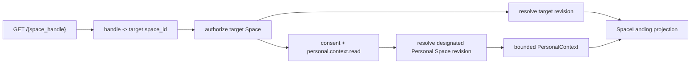

# URL-адресация и персонализированное открытие Space

Статус: proposal, 2026-08-05. Спецификация фиксирует обновлённое продуктовое
направление; код и deployment ещё не реализованы.

В product language `KnowledgeSpace` называется **Mind**, а `KnowledgeEntry` —
**Memory**. Ниже сохраняются Space-термины там, где описываются технические
идентификаторы, ACL и MCP boundaries.

## Что считается решённым

- Человекочитаемое имя в пути URL является внешним идентификатором Space:
  `https://{space-host}/{space_handle}`.
- Внутренний immutable `space_id` сохраняется как primary identity для ACL,
  revisions, audit, jobs и ссылочной целостности.
- Первый ответ может быть персонализирован до начала разговора. Для
  аутентифицированного пользователя целевая модель — derived presentation
  выбранной revision с ограниченным контекстом из его Personal Space.
- Personal Space остаётся обычным `KnowledgeSpace` и обычным `OKFBundle` при
  export. Его особая роль задаётся service metadata, а не OKF type.

Точные правила автоматического создания Personal Space, consent и допустимые
категории профиля пока являются частью MVP-гипотезы, а не принятым privacy
контрактом.

## Два уровня идентичности

Чтобы имя в URL было настоящим внешним идентификатором и при этом rename,
Unicode и ACL не разрушали данные, модель разделяет три поля:

```text
space_id          # immutable opaque internal primary identity
space_handle      # required stable URL name, one path segment
name              # required mutable display name
normalized_handle # key reserved within one verified host namespace
```

Canonical URL имеет форму:

```text
https://{space-host}/{space_handle}
```

`space-host` берётся только из trusted deployment configuration. В одном host
namespace `normalized_handle` уникален; custom domain создаёт отдельный host
namespace. Router нормализует handle и разрешает его в `space_id`, после чего
authorization, revision lookup и любой object read работают только с ID.
Знание URL никогда не заменяет membership или publication policy.

В MVP `space_handle` immutable. Изменение display `name`, HEAD или presentation
settings не меняет URL. Будущий rename handle потребует отдельной CAS-команды,
непереиспользуемого tombstone старого handle и permanent redirect; молчаливое
переназначение старого URL другому Space запрещено.

До реализации фиксируются ASCII/Unicode policy, case folding, длина, reserved
routes, percent encoding и защита от confusable/homograph handles. Private URL
не является секретом: запрос к неизвестному и существующему private handle не
раскрывает Space metadata, но конфликт при регистрации глобального handle всё
равно может раскрывать занятость имени. Этот privacy/UX trade-off требует
отдельного решения до публичной регистрации имён.

## Personal Space

`Personal Space` — продуктовая роль одного обычного private KnowledgeSpace, а
не отдельный storage schema или фиксированный `space_type`:

```text
Principal.default_personal_space_id -> KnowledgeSpace
```

Начальная политика:

- у principal может быть не более одного designated Personal Space;
- principal является его Owner, Space private и не публикуется;
- в MVP у designated Personal Space нет других memberships;
- содержимое имеет обычные revisions, history, provenance и OKF export;
- designation не находится в OKF frontmatter и не переносится через bundle;
- удаление или смена designation немедленно прекращает его использование в
  новых открытиях других Spaces.

Не каждый private Space с одним Owner автоматически является Personal Space.
Designation явный: это не даёт сервису права незаметно использовать любую
личную базу пользователя как профиль.

## SpaceLanding: базовая и персональная проекции

`SpaceLanding` остаётся revision-bound derived projection. Он имеет два режима:

- `base` — authored/derived общее представление целевой revision без личного
  контекста;
- `personalized` — представление той же целевой revision, адаптированное с
  помощью разрешённого контекста из exact revision Personal Space.

Anonymous visitor, пользователь без Personal Space, пользователь без scope или
пользователь, отключивший адаптацию, получает `base`. Для
аутентифицированного пользователя с designation и consent продуктовая гипотеза
MVP — сразу возвращать `personalized`, не требуя сначала открыть отдельную
`SpaceSession`. В интерфейсе остаются «показать базовую версию» и объяснение,
что подача была адаптирована.

Минимальная воспроизводимая модель:

```text
target_space_id
target_space_handle
target_revision_id
canonical_url
base_presentation
personalization_mode: base | personal_space
personal_context_revision_id?  # только в private authenticated response
personalized_presentation?
entrypoints[]
source / freshness indicators
available_actions[]
```

Personal context меняет глубину, язык, порядок, примеры и suggested questions,
но не canonical facts, source trust, target revision или права. Фактические
утверждения по теме должны происходить из целевой revision и сохранять её
provenance. Персонализированный текст, рекомендация и выбранный порядок не
попадают ни в один Space без отдельного draft/review/commit flow.

## Ограниченная композиция двух Spaces

Это единственное разрешённое исключение из правила one-Space mount:



Content MCP по-прежнему монтирует ровно один target Space. Клиент не получает
второй corpus и не выбирает произвольный Space для overlay. Server-side
`PersonalContextProvider` может читать только Personal Space того же verified
principal, по отдельному `personal.context.read`, и возвращает минимальный
purpose-bound профиль: например, язык, уровень знаний, интересы, цели и
предпочтительную глубину. Чувствительные категории исключены по умолчанию и
потребуют отдельного явного consent.

Общее cross-space search, рекомендации по нескольким произвольным Spaces и
передача Personal Space целевому Space остаются запрещены.

## Security и privacy invariants

- Сначала проверяются target Space membership/visibility и revision; лишь затем
  может разрешаться Personal Space текущего principal.
- Текст целевого Space считается недоверенным input. Он не формирует запросы к
  Personal Space, не выбирает поля профиля и не расширяет scope.
- PersonalContextProvider применяет server-owned policy и лимит; raw personal
  corpus не передаётся target Space, его Owners, Editors или публичному site.
- Landing фиксирует exact target и personal revision IDs для воспроизводимости,
  но personal revision ID показывается только самому аутентифицированному
  пользователю.
- Personalized responses используют private per-principal cache или `no-store`;
  общий CDN cache содержит только явно опубликованный `base`.
- Логи и traces не содержат personal facts, landing body, conversation body,
  access tokens или presigned URLs.
- Отключение consent, revoke membership или смена Personal Space
  инвалидирует производные caches. Старые ACL не восстанавливаются.
- Owners целевого Space не получают analytics, из которых можно восстановить
  personal context конкретного посетителя.

## Открытые вопросы

- Создавать Personal Space автоматически при регистрации или только по явному
  действию пользователя?
- Какие OKF concepts или отдельная authored projection считаются допустимым
  источником профиля вместо поиска по всему Personal Space?
- Как показать и редактировать использованный контекст до генерации landing?
- Какие категории данных требуют отдельного consent и какие retention сроки
  допустимы для personalization receipts?
- Должен ли один пользователь позднее иметь несколько профилей/Personal Spaces
  для разных ролей и контекстов?
- Как разрешать конфликты и privacy leakage при регистрации handle, уникального
  на всём product host?
