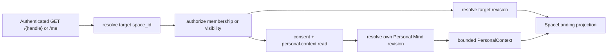

# URL-адресация и персонализированное открытие Mind

Статус: proposal, 2026-08-05. Product behavior принято для первого прототипа;
generation policy и UI ещё не реализованы.

В product language `KnowledgeSpace` называется **Mind**, а `KnowledgeEntry` —
**Memory**. Технические разделы сохраняют Space-термины для identifiers, ACL и
revision semantics.

## Базовые положения

- Обычный Mind открывается по `https://{space-host}/{space_handle}`.
- Personal Mind текущего principal всегда открывается по reserved route `/me`.
- Внутренний immutable `space_id` остаётся primary identity для ACL, revisions,
  audit, jobs и ссылочной целостности.
- Доступ к любому landing требует authenticated Mind Diary account; anonymous
  opening в первом прототипе отсутствует.
- Первый ответ может быть адаптирован до начала разговора с помощью
  server-filtered контекста Personal Mind текущего principal.

## Два уровня identity

Обычный Mind имеет:

```text
space_id          # immutable opaque internal primary identity
space_handle      # immutable в прототипе URL segment
normalized_handle # unique key within verified host namespace
name              # mutable, non-unique display name
```

Host берётся только из trusted deployment configuration. Router нормализует
handle и разрешает его в `space_id`, после чего authorization и object read
работают только с ID. Знание URL никогда не заменяет membership или visibility
grant.

При создании UI предлагает handle из display name и позволяет изменить его до
подтверждения. Будущий rename handle потребует CAS, tombstone и permanent
redirect. До реализации фиксируются normalization, reserved routes, length,
percent encoding и confusable/homograph policy.

Personal Mind имеет service-managed скрытый handle, но user-facing resolver
его не использует:

```text
GET /me -> authenticated principal -> personal_space_id
```

Display name Personal Mind следует за display name пользователя. `/me` не
может разрешиться в чужой Personal Mind и не раскрывает его internal handle.

## Проверка доступа при открытии

После authentication обычный `/{space_handle}` разрешается так:

1. Router превращает normalized handle в `space_id` без доверия к клиентскому
   tenant или role.
2. Authorizer проверяет active membership либо baseline visibility grant:
   `private` — только participant, `unlisted` — authenticated non-member по
   точному URL, `public` — authenticated non-member также из каталога.
3. Revision resolver выбирает live HEAD либо exact historical revision для
   Snapshot View.
4. Presentation layer строит base landing выбранной revision.
5. Если включена разрешённая персонализация, trusted provider читает
   ограниченный контекст exact Personal Mind revision и строит personalized
   variant.

Private request без membership не раскрывает name, summary или существование
Mind. При переводе public/unlisted Mind в private baseline grants прекращаются
немедленно. Public/unlisted landing читает live HEAD: отдельного
`published_revision` в прототипе нет.

## Personal Mind как источник контекста

Personal Mind создаётся атомарно с account и навсегда связан с ним:

```text
Principal.personal_space_id -> KnowledgeSpace
```

Он private, имеет единственного participant-owner, не допускает sharing,
ownership transfer, publication или отдельного deletion. Это service
invariants, а не новый `space_type` или OKF field. Content сохраняет обычные
revisions, provenance и export semantics.

Personalization не даёт целевому Mind или его Owner доступ к Personal Mind.
`PersonalContextProvider` работает server-side от identity текущего principal,
не принимает произвольный personal space/path/query из target content и
возвращает минимальную purpose-bound projection, например язык, уровень знаний,
интересы, цели и предпочтительную глубину. Sensitive categories потребуют
отдельного явного consent и пока исключены.

## SpaceLanding

`SpaceLanding` — revision-bound derived projection, а не OKF document. Он имеет
два режима:

- `base` — authored/derived общее представление target revision;
- `personal_space` — представление той же target revision, адаптированное через
  разрешённый PersonalContext.

Концептуальная trace-модель:

```text
space_id
space_handle | /me
target_revision_id
personalization_mode: base | personal_space
personal_context_revision_id?  # виден только самому principal
base_presentation:
  title
  summary
  entrypoints[]
  suggested_questions[]
personalized_presentation?:
  title
  summary
  entrypoints[]
  suggested_questions[]
source / freshness indicators
available_actions[]
```

Personal context может менять язык, глубину, порядок, примеры и suggested
questions, но не target facts, provenance, trust, revision или authorization.
Derived text помечается как generated. Он не записывается автоматически; если
authorized agent должен сохранить результат, это происходит обычным immediate
content commit с HEAD CAS.

Новое opening фиксирует exact target revision и exact Personal Mind revision.
Уже возвращённая projection не следует за последующим продвижением HEAD; новый
request разрешает revisions заново. Пользователь может выключить адаптацию и
получить `base`.

## Ограниченная композиция



User-scoped MCP сам по себе умеет выбирать разные доступные Minds, но один
content call всегда работает с явно указанным target Mind. Personalization —
отдельный trusted server-side use case; он не означает implicit cross-Mind
search или смешивание нескольких corpora. Любой будущий general cross-Mind
retrieval должен явно авторизовать каждый target и описать provenance результата.

## Security и privacy invariants

- Target access проверяется до чтения Personal Mind.
- Target content считается недоверенным input и не выбирает personal fields,
  queries, scopes или tools.
- Raw personal corpus не передаётся target Mind, его participants или shared
  browser/model context.
- Personalized response использует private per-principal cache либо `no-store`.
- Логи и traces не содержат personal facts, landing body, conversation body,
  access tokens или presigned URLs.
- Revoke target access, отключение consent или account deletion инвалидируют
  производные caches.
- Participants целевого Mind не получают analytics, позволяющую восстановить
  personal context конкретного посетителя.

## Открытые вопросы

- Какие authored concepts/projection Personal Mind допустимы как источник
  профиля вместо поиска по всему corpus?
- Как показать пользователю использованный контекст до генерации landing?
- Какие категории требуют отдельного consent и как долго хранить receipts?
- Нужна ли персонализация уже в первом UI slice или после базовой MCP работы?
- Как разрешить account relink при смене verified email, пока Sites не
  документирует стабильный внешний subject identifier?
