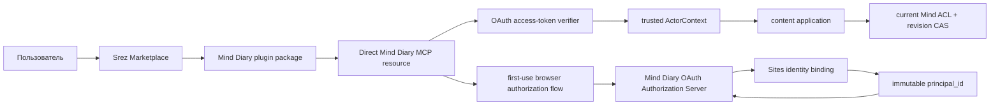

# Plugin и OAuth Mind Diary

> **ADR-0028, 2026-09-11; локальная multi-Mind реализация подтверждена, UAT ещё нет.**
> Mode задаёт разрешённые действия, nullable description — темы автоматического
> использования Personal и ordinary Minds. Любой enabled Mind без description
> используется только по прямой просьбе; с description — по теме. Все
> совпавшие `read_write` destinations читаются и сохраняются независимо с
> отдельным dedupe и сообщением о частичном результате. Узкая настройка
> тем Personal через MCP требует `personal:configure` и прямой просьбы о настройке.
> Перенос извлечённых Personal сведений к другим читателям требует прямой просьбы.
> Полный контракт — [режимы использования Mind](mind-usage-modes.md).

Статус: accepted historical Release 0.1/0.2 contract и Release 0.4 optional-skill
boundary, обновлено 2026-09-11.
OAuth Authorization Server, dual
personal/OAuth MCP authentication, write step-up и connected-app revocation
реализованы. Для Codex Desktop/CLI pilot 0.1 принят direct MCP package с OAuth
при первом использовании. Blocking package/OAuth automation из ADR-0012
реализована; ADR-0019 дополнительно делает один fresh external-account
first-user receipt обязательным release gate. Registered connector не входит в этот release path и
остаётся возможным будущим ChatGPT Web/public-directory вариантом.

Связанные документы: [архитектура](../architecture.md),
[MVP](mvp.md), [API](api.md),
[доменная модель](domain-model.md) и
[профиль доставки](../operations/ship-work-release-profile.md). Принятое
server-side OAuth решение зафиксировано в
[ADR-0010](../decisions/0010-oauth-marketplace-connector.md), а текущая
distribution boundary — в
[ADR-0011](../decisions/0011-direct-mcp-plugin-oauth-on-use.md). Validation
carrier релиза 0.1 уточнён
[ADR-0012](../decisions/0012-synthetic-principal-release-gates.md) и
[ADR-0019](../decisions/0019-release-0-1-codex-first-small-data-boundary.md).

Этот документ сохраняет проверенный package/OAuth и tool contract первых
релизов как as-built evidence. Он не является целевой картой product authority
Release 0.3 и не переносит исторические binding/export tools в будущий Content
MCP.

## Optional skill boundary Release 0.4

Базовый hosted MCP workflow не зависит от skill: tool descriptions и schemas
самодостаточно задают `list_minds`, bounded discovery/read, exact-revision file
operations, history, validation, changeset commit и reconciliation. Отсутствие
skill не является основанием просить пользователя установить его до обычного
content call.

Marketplace skill остаётся optional advanced guidance. Его entrypoint — thin
router с общими authority/privacy boundaries. Отдельный portable reference
содержит только provenance-sensitive multi-Mind preservation и incremental
typed OKF transfer на hosted tools. Инструкции bundled macOS local companion
вынесены в другой reference и загружаются только когда текущий Codex host
действительно публикует соответствующие local tools.

Portable reference предназначен для отдельного сравнительного теста
skill-assisted и no-skill поведения. Его наличие не заявляет поддержку skill
installation в ChatGPT Web, native file transport на другом host или
переносимость macOS companion. Базовую корректность без skill доказывают
server-side tool descriptions и независимый no-skill MCP journey; сложные
workflow проверяются отдельно на exact Marketplace package.

## Product authority Release 0.3

- Site создаёт и показывает Connections, отзывает их, управляет principal-owned
  `disabled | read | read_write` mode на странице Mind, токенами и остальными
  account/Mind controls.
- Plugin и Content MCP только discover-ят enabled Minds, читают, ищут,
  открывают историю, выполняют standalone validation и отдельный content commit
  в каждый exact `read_write` destination, настроенный пользователем через Site.
- Read не требует обязательного onboarding attach или mutable read binding:
  доступные Minds выводятся из текущей identity, ACL и visibility при каждом
  вызове. Plugin не меняет usage modes и не добавляет destinations.
- Import/export lifecycle, membership, visibility, token management и
  destructive account/Mind actions не публикуются как Content MCP tools.
  Replace/delete файлов внутри exact content commit остаются content
  mutation, а не административным удалением Mind или account.

[Operation disposition Release 0.3](release-0.3-operation-disposition.md)
определяет целевую surface каждого исторического tool/route, а точный access и
writable-target contract принят в
[режимах использования Mind](mind-usage-modes.md). Исторические
`get_mind_bindings`, `set_read_mind_binding`, `set_write_mind_binding`,
`start_export` и связанные payloads ниже следует читать только как Release
0.1/0.2 as-built: fresh catalogs и schemas Release 0.3 их не публикуют.
Exact cached binding call получает только versioned side-effect-free retired
response; неизвестные и похожие имена остаются protocol errors. MD-336 не
меняет OAuth/token protocol, runtime, schemas, UI или deployment.

## Текущий implementation checkpoint

Repository candidate уже содержит:

- OAuth discovery и protected-resource metadata;
- public-client DCR; allowlisted Client ID Metadata Document parser остаётся
  не рекламируемым compatibility path до отдельного live conformance;
- authorization code + PKCE `S256`, exact redirect/resource validation;
- 15-minute access token, rotating 30-day refresh token, bounded
  concurrent-refresh tolerance и grant-family revoke при позднем refresh reuse;
- read-first grant и `content:write` step-up;
- dual `mdp_v1_`/`mdo_access_` MCP authentication, tool
  `securitySchemes` и OAuth challenges;
- одинаковые modern `2026-07-28` и compatibility `2025-11-25` definitions и
  application semantics для `get_mind_bindings`,
  `set_read_mind_binding`, `set_write_mind_binding`; strict schemas не
  допускают array write targets или unknown fields;
- internal authorization mirror, благодаря которому application ACL/CAS/commit
  повторно проверяют OAuth token внутри текущих transaction boundaries;
- actor-owned active connection list/detail/revoke на `/settings/connections`,
  Advanced personal tokens на `/settings/developer/mcp` и account-deletion cleanup;
- D1 migration и repository tests для positive и negative OAuth paths.

Этот checkpoint и executable gate — доказательство repository implementation,
но не hosted release evidence. Blocking run требует direct package validation
и automated OAuth/transport lifecycle на exact SHA; exact-SHA single-owner UAT lineage остаётся
обязательной hosted проверкой. Fresh external-account install/read/write/
revoke/reconnect — отдельный blocking first-user receipt exact candidate и
deployment; automation не подменяет этот host/UI evidence.

## Решение

Mind Diary добавляется в существующий Srez Marketplace вторым plugin рядом с
Task Manager. Для Codex Desktop/CLI pilot 0.1 принят следующий путь:

1. Package сохраняет thin skill и использует canonical modern transport
   `/api/mcp`, включая единый `openai/fileParams` input. Isolated
   `/api/mcp/2025-11-25` остаётся только для exact legacy clients, которые ещё
   требуют прежний initialize lifecycle.
2. Установка с policy `AVAILABLE + ON_USE` завершается без product OAuth и без
   чтения private registered app.
3. Первый content tool call запускает native OAuth discovery, DCR и PKCE к
   Mind Diary UAT.
4. Content MCP принимает OAuth access tokens и возвращает standard discovery/
   challenge metadata; personal tokens сохраняются как advanced compatibility
   path.
5. Pilot остаётся restricted UAT. Public directory, ChatGPT Web connector и
   production plugin требуют отдельных verification, provisioned production
   environment и решения о выпуске.

Это даёт простой пользовательский flow без ручного MCP URL, client secret и
копирования bearer token. Marketplace package и OAuth-protected MCP resource
остаются отдельными объектами; private registered connector package не нужен.

Наличие Srez Marketplace в аккаунте автоматически делает новую карточку Mind
Diary доступной после обновления каталога. Оно не должно автоматически
устанавливать plugin или предоставлять доступ к данным: пользователь явно
нажимает `Install`; OAuth consent начинается при первом MCP use. Plugin
использует catalog policy `installation: AVAILABLE` и
`authentication: ON_USE`.

## Что взято из Task Manager

Текущая интеграция Task Manager подтверждает пригодность следующего шаблона:

| Слой | Task Manager сейчас | Mind Diary accepted profile |
| --- | --- | --- |
| Marketplace | `srez-marketplace` | тот же Marketplace |
| Plugin package | `plugins/task-manager` | новый `plugins/mind-diary` |
| Connection | direct production MCP в `.mcp.json` | canonical modern UAT OAuth resource `/api/mcp` в `.mcp.json` |
| Transport profiles | public MCP URL в `.mcp.json` | `/api/mcp` для current Codex/ChatGPT; isolated `/api/mcp/2025-11-25` только для отдельно проверенного legacy client |
| Installation | `AVAILABLE` + `ON_USE` | то же поведение |
| OAuth | authorization code + PKCE, DCR | тот же protocol profile, но Mind Diary scopes и identity rules |
| Data authorization | internal Task Manager user | internal immutable Mind Diary `principal_id` |
| Tool surface | task operations | fresh principal-owned enabled projection + per-Mind generations для `0..N` ordinary `read_write` и independently Personal `/me` |

Не следует механически копировать из Task Manager:

- scopes `api:read` и `api:write`: Mind Diary сохраняет
  `content:read` и `content:write`;
- Task Manager token verifier: Mind Diary сохраняет keyed HMAC verifier и для
  OAuth secrets, а не ослабляет существующий secret-storage baseline;
- implicit user creation: неизвестная Sites identity не связывается и не
  объединяется автоматически с существующим principal;
- production endpoint Task Manager нельзя переносить в Mind Diary; exact
  resource остаётся UAT `/api/mcp` до отдельного production release.

## Исторический пользовательский flow Release 0.1

### Первое подключение

1. Пользователь уже имеет Srez Marketplace в Codex/ChatGPT.
2. После обновления Marketplace он видит карточку `Mind Diary` или, на pilot
   стадии, `Mind Diary UAT`.
3. Пользователь нажимает `Install`.
4. Установка завершается до OAuth. При первом content tool call host открывает
   native `Authenticate` flow без запроса MCP URL, client ID, client secret или
   personal token.
5. Mind Diary authorization page использует текущую authenticated Sites
   identity, разрешает её в immutable `principal_id` и показывает запрошенные
   scopes.
6. После consent host получает authorization code, обменивает его с PKCE и
   сохраняет connector grant.
7. В новом чате пользователь перечисляет доступные Minds, явно attach-ит
   нужные read sources и выбирает не более одного writable target. Только после
   этого content tools читают либо пишут.

### Запись

Рекомендуемый default — `content:read` при установке и step-up consent на
`content:write` при первом `set_write_mind_binding` либо
`commit_changeset`. Scope сам target не выбирает: user/agent сначала явно
bind-ит exact writable Mind, а commit передаёт immutable `write_binding_id`.
Так capability немедленно создавать revisions и destination selection остаются
двумя независимыми boundaries.

Если fresh-host validation покажет, что incremental scopes в installed plugin
не дают надёжного UX, release останавливается на product-decision boundary.
Запросить оба scopes при первом OAuth flow либо изменить first-user claim можно
только отдельным явным решением; silent fallback запрещён.

### Повторное подключение и отзыв

- Пользователь видит active connection, `Can read`/`Can add and change`, время
  создания и last use в `/settings/connections`; protocol scopes остаются в
  Advanced MCP.
- `Revoke` немедленно отзывает grant, access tokens и всю refresh-token family.
- Следующий tool call возвращает стандартный OAuth challenge; ручной bearer
  token не подставляется как скрытый fallback.
- `Reconnect` запускает новый consent и создаёт новый grant.

## Историческая package/OAuth архитектура Release 0.1



Marketplace не получает данные Mind Diary. Plugin package описывает direct MCP
resource, skills и assets, а server остаётся единственным authority для
identity, scopes и Mind ACL.

## Marketplace package

Предлагаемая структура в Srez Marketplace:

```text
plugins/
├── task-manager/
└── mind-diary/
    ├── .codex-plugin/
    │   └── plugin.json
    ├── .mcp.json
    ├── assets/
    │   ├── icon.png
    │   └── logo.png
    └── skills/
        └── mind-diary/
            └── SKILL.md
```

`plugin.json` должен использовать:

- package name `mind-diary`;
- user-facing name `Mind Diary`, а для private pilot — ясный UAT marker;
- начальную version `0.1.0`;
- skills, MCP server и existing brand assets; поле `apps` отсутствует;
- категорию `Productivity`, пока каталог не подтвердит более точную knowledge
  category.

`.app.json` отсутствует. `.mcp.json` использует canonical modern transport и
OAuth resource `https://mind-diary.example.invalid/api/mcp`. Это
даёт current Codex/ChatGPT один connection source и делает standard
`openai/fileParams` tool видимым без отдельного Apps package. Legacy
`/api/mcp/2025-11-25` не рекламируется current package и остаётся только для
точечно проверенного старого клиента.

Skill остаётся тонким interaction adapter и поставляет агенту полную целевую
инструкцию Release 0.3. Перед релевантным workflow он получает fresh
`list_minds`: прямое имя пользователя требует exact enabled Mind, а без прямого
имени агент выбирает один или несколько readable Minds только по semantic fit
недоверенных descriptions. Disabled/недоступный Mind, `/me`, похожее имя и
предыдущий результат не дают fallback. Каждый content call остаётся внутри
одного exact Mind/revision, а corpus раскрывается постепенно через browse,
search и fetch без общего cross-Mind search или фонового vacuum.

После содержательного разговора skill рассматривает всё durable knowledge,
явно обсуждённое в текущей conversation, включая обсуждённое знание из другого
enabled readable Mind. Каждый fresh effective `read_write` Mind с непустым
подходящим description становится самостоятельным destination: отдельная
write-инструкция, toggle или confirmation не нужны. Перед изменением агент
целево ищет существующую Memory и выбирает create/update/явный
delete/semantic no-op для каждого Mind; changeset детерминированно обновляет
index/log, сохраняет неизвестные OKF types/fields и при cross-Mind переносе
передаёт optional exact `source_references`.

Любой writable Mind без description используется для записи только после
прямой просьбы текущего пользователя сохранить, запомнить, добавить, обновить
или удалить конкретное знание именно там. Такая просьба снимает только
semantic-match условие; mode, scope, ACL и current role остаются обязательными.
Фраза «only» ограничивает destinations названным множеством. Для каждого Mind
skill выполняет независимый commit/read-back, сообщает no-op, failure и unknown
отдельно, не откатывает успешную копию и не синхронизирует их позднее.
Отдельного Personal write tool и клиентского intent flag нет.

Client `mind` — только exact assertion. Server сам разрешает principal-owned
writable mount, pin-ит текущую generation и повторяет проверки credential,
scope, writer role, authorized routing profile, HEAD, digests, idempotency и
полного результирующего OKF 0.2 bundle. Неопределённый transport outcome сверяется
`reconcile_changeset` только с exact original payload. После commit skill
читает exact revision, повторно валидирует полный bundle и кратко сообщает
пользователю результат. Skill не показывает principal/token/grant/email,
internal Mind IDs, generation или приватные source bodies и не переносит
control-plane operations в Content MCP.

Marketplace catalog получает вторую запись с local source
`./plugins/mind-diary`, `installation: AVAILABLE` и
`authentication: ON_USE`. Добавление plugin не меняет Task Manager package.

## OAuth protocol profile

### Discovery и endpoints

Resource Server публикует path-specific protected-resource metadata для exact
MCP resource. Authorization Server публикует metadata и endpoints:

```text
GET  /.well-known/oauth-protected-resource/<exact-mcp-path>
GET  /.well-known/oauth-authorization-server
GET  /.well-known/openid-configuration
GET  /oauth/authorize
POST /oauth/register
POST /oauth/token
POST /oauth/revoke
```

`/.well-known/openid-configuration` возвращает тот же authorization-server
metadata как compatibility alias для ChatGPT discovery. Pilot не выдаёт
`id_token`, не публикует identity scopes и не заявляет OpenID Connect provider
semantics.

Нужны authorization code flow и только PKCE `S256`. Для первого connector
следует поддержать Dynamic Client Registration: именно этот путь доказан
текущей интеграцией Task Manager. Pilot metadata не публикует
`client_id_metadata_document_supported`, поэтому ChatGPT выбирает DCR. Client
ID Metadata Documents можно рекламировать только после отдельного conformance
test; они не являются prerequisite pilot-а.

Authorization и token requests обязаны передавать один и тот же exact
`resource`; access token получает такую же audience. Redirect URI сравнивается
с зарегистрированным exact value. CSP consent page разрешает `form-action`
только для собственного authorization endpoint и origin уже проверенного
`redirect_uri`, чтобы браузер не блокировал финальный code redirect. DCR
разрешает только public clients с `token_endpoint_auth_method=none`; shared
client secret не вводится.

### Challenges и tool metadata

Unauthenticated `initialize`, `ping` и `tools/list` могут возвращать только
protocol metadata и schemas, никогда пользовательские данные. Каждый
защищённый call проверяет bearer token до content application.

Ответ `401` содержит `WWW-Authenticate` с `resource_metadata` и нужным scope.
MCP authorization error также содержит `_meta["mcp/www_authenticate"]`, чтобы
host мог открыть native linking или step-up flow. `tools/list` публикует
`securitySchemes`:

- enabled discovery, browse, search, fetch, history и validation —
  `content:read`;
- `commit_changeset` — `content:write`;
- verified single-file staging/ingress — `content:write`;
- exact BundleFile read/download — `content:read`.

Tool annotations сохраняют фактическую семантику. В частности,
`commit_changeset` остаётся immediate commit и destructive-capable operation;
OAuth consent не превращает его в draft или approval artifact.
Fresh catalogs не публикуют отдельный simplified automatic-save tool или
control-plane mutation.

### Token lifecycle

Предлагаемый baseline:

- authorization code: одноразовый, короткоживущий, bound to client, redirect,
  resource, principal, scopes и PKCE challenge;
- access token: opaque, 15 минут, exact resource audience;
- refresh token: opaque, 30 дней, rotation при каждом использовании;
- повтор уже использованного refresh token не позднее 30 секунд после
  server-side `used_at`: `invalid_grant` без новых credentials и без отзыва
  grant/family; caller обязан перечитать общий credential store и использовать
  сохранённый первым refresh successor;
- reuse того же старого refresh token после 30-секундного окна, с некорректным
  `used_at` либо в уже revoked family: отзыв всей token family и grant;
- revoke connector: отзыв grant, active access tokens и refresh family;
- verifier: keyed HMAC-SHA-256, constant-time compare, secret показывается
  только как bearer value и не логируется.

Окно является узкой защитой от normal race двух Codex-процессов, которые
прочитали один current refresh token до того, как первый caller сохранил его
successor. Второй caller не получает ни successor, ни новый access token, а
потому окно не становится повторной выдачей bearer secret. За пределами окна
reuse detection сохраняет fail-closed family revoke. Timestamp назначает
server; client time, retry count и process identity не участвуют в решении.

OAuth tokens получают отдельные bounded prefixes, чтобы auth boundary могла
без перебора выбрать verifier. Existing `mdp_v1_` personal tokens продолжают
работать как явно обозначенный advanced path. Оба типа после проверки дают
одинаковый trusted `ActorContext`; downstream application не принимает raw
token, email или client-supplied principal.

### Service records

Нужны отдельные service-side records:

- `OAuthRegisteredClient`;
- `OAuthAuthorizationRequest`;
- `OAuthGrant`;
- `OAuthAuthorizationCode`;
- `OAuthAccessToken`;
- `OAuthRefreshToken` и rotation family state.

Эти records, scopes, idempotency и audit metadata не входят в `OKFBundle`,
revision export или user content. Account deletion и connector revoke удаляют
либо отзывают все identity-linked OAuth credentials согласно общей privacy
model.

Bounded concurrent-refresh tolerance не хранит recoverable successor или
plaintext replay response. Достаточны существующие server-side `used_at`,
grant/family linkage и HMAC verifier. Secret, authorization URL и raw token
response не попадают в logs, UAT receipts или Task evidence.

## Identity и authorization

OAuth authorization page должна работать за той же trusted Sites identity
boundary, что и control UI. Normalized authenticated email остаётся только
initial external binding; после resolution grant привязывается к immutable
internal `principal_id`.

Правила fail closed:

- client не передаёт authoritative email, `principal_id`, `space_id` или role;
- exact existing binding открывает существующий account;
- неизвестная identity проходит явное создание нового isolated account либо
  manual recovery до OAuth consent;
- automatic relink, merge или access transfer запрещены;
- один connector grant относится к principal, но каждый content call явно
  выбирает один bound Mind и revision; сам immutable grant владеет independent
  binding set, refresh его сохраняет, revoke делает unusable, reconnect создаёт
  новый empty state;
- текущие ACL и visibility проверяются при каждом call, а не фиксируются в
  access token;
- OAuth не публикует membership, visibility, ownership transfer или personal
  token management через content MCP.

## MCP endpoint decision

Canonical resource, audience и current package transport pilot-а — existing
`POST /api/mcp` с profile `2026-07-28`. Exact modern client/adapter conformance
проверяется в каждом release receipt. Compatibility adapter
`/api/mcp/2025-11-25` принимает тот же OAuth audience и вызывает тот же content
application contract, но подключается только для отдельно подтверждённого
legacy клиента; automatic lifecycle fallback внутри request отсутствует.

Смена canonical `oauth_resource` позднее считается package/client migration:
новая plugin version, повторный consent и fresh-task validation, а не
незаметная замена URL. Смена только transport profile также требует fresh
conformance на exact Codex build, но не должна автоматически менять resource
audience.

Все adapters вызывают существующий content application contract. Modern
profile публикует один standard native file tool; отдельного Apps profile,
picker/UI resource или app-only stage нет. OAuth меняет authentication boundary
и discovery, но не ACL или revision semantics.

## Sites и environments

Сейчас Mind Diary имеет UAT Site, но не provisioned production. Поэтому
начальный plugin допустим только как personal/private pilot и должен явно
указывать UAT status.

Перед external pilot нужно проверить внешний access path. OAuth discovery,
authorization callbacks и MCP requests host-а не могут зависеть от ручного
`OAI-Sites-Authorization` secret в пользовательской конфигурации. Возможные
решения — поддержанный Sites connector path либо публично достижимая UAT edge
surface, на которой все пользовательские данные по-прежнему закрыты product
OAuth и ACL. Изменение Site access policy является отдельной security boundary
и не следует из этого proposal автоматически.

Публичный universal plugin и production name `Mind Diary` допускаются только
после:

- provisioned production environment и stable public MCP/OAuth URL;
- release, rollback и incident operations для exact artifact;
- abuse/rate-limit и OAuth security validation;
- reviewer-safe test account и privacy-minimized test data;
- отдельного решения пользователя о production release и public submission.

## Product UI Release 0.1/0.2 as-built

Repository contract разделяет ordinary Connections и Advanced MCP:

1. `/settings/connections` — только active connection: client name, user
   capabilities, created/last-used times, readable Minds и отдельный exact
   writable Mind либо `Not selected`. После revoke карточка скрывается, detail
   возвращает `404`, а reconnect guidance остаётся в Help/Advanced MCP.
2. `/settings/developer/mcp` — существующие `mdp_v1_` create/list/revoke для
   CLI, compatibility и диагностики.

Active connection detail отделяет readable Minds от единственного
`Can add and change` target/`Not selected`, поддерживает attach/detach/select/
switch/clear с server read-back и redacts inaccessible target metadata.
Revoked/expired OAuth card не удерживается в ordinary UI. Advanced personal-
token history может показывать revoked/expired metadata без mutation controls.
Switch copy объясняет, что previous target больше не writable; visibility copy
отдельно предупреждает об immediate `unlisted`/`public` live HEAD/history
exposure. Это source-candidate evidence, не claim о уже развёрнутом UAT UI.

В onboarding следует объяснять четыре пользовательских действия: установить
Mind Diary из Srez Marketplace, пройти Authenticate, выбрать для каждого Mind
`disabled | read | read_write` на Site и при необходимости пройти native write
step-up. Настройка принадлежит principal и одинакова для всех его Connections и
personal tokens; scope только сужает effective capability. MCP URL, DCR, PKCE,
resource audience, generation и token rotation остаются implementation details.
Полный IA/state/query contract — в
[Connections, Advanced MCP и Codex Help](connection-experience.md), а agent
routing/automatic-save contract — в
[режимах использования Mind](mind-usage-modes.md).

## Проверка и acceptance

Release 0.1 блокирует реализованная команда
`npm run gate:oauth-direct-plugin -- --candidate-sha <exact-HEAD-sha>
--evidence-out <private-temp-path>/evidence.json` в fresh temporary
Codex/plugin context. Она не ограничивается прямым MCP curl и не переиспользует
старый chat/cache snapshot. Synthetic identity может входить только через
trusted authorize/consent seam test composition; package, OAuth client и MCP
requests не выбирают principal.

Blocking matrix:

1. Existing Srez Marketplace показывает новую карточку после refresh/update;
   Task Manager продолжает устанавливаться отдельно.
2. `Install` завершается до OAuth и не обращается к private registered app;
   первый content tool call запускает native Authenticate без ручного URL,
   client secret или personal token.
3. Unknown identity не получает старые права и проходит explicit onboarding
   либо recovery.
4. Read-only grant разрешает fresh enabled projection, browse, search, fetch,
   history и validation, но не commit; одна configured projection остаётся
   общей для всех credentials principal.
5. Первый `commit_changeset` без write scope запускает native step-up; после
   consent commit пишет только в exact current principal-owned `read_write`
   Mind и сохраняет generation/HEAD CAS, idempotency и full-bundle validation.
6. Один principal видит все и только enabled доступные ему Minds; direct user
   selection не обходит disabled/access, description routing не делает общего
   cross-Mind search, Personal `/me` не содержит description и не получает
   topic-only/automatic write, provenance проверяется отдельно.
7. Revocation делает следующий call unauthorized; reconnect создаёт новый
   grant, а старые refresh tokens не оживают.
8. Existing personal-token modern и compatibility flows остаются рабочими.
9. Access-token expiry, refresh rotation, refresh reuse, wrong resource,
   redirect mismatch и revoked client имеют negative tests.
10. Fresh temporary Codex/plugin context проходит skill/tool discovery:
    `codex debug prompt-input` без model/network call показывает exact installed
    `mind-diary` skill в model-visible index, а `codex mcp list` разрешает exact
    transport. Одного чтения cached `SKILL.md` недостаточно. Representative
    read, write, revoke и reconnect выполняются на exact package/candidate;
    package snapshot, client/version и routes входят в redacted receipt, raw
    prompt input не сохраняется.
11. Test identity seam нельзя активировать product route/header/body/query/
    env/job/`NODE_ENV`; normal token, current ACL, CAS и MCP authorization не
    обходятся.

Real external Marketplace/Codex installation и OAuth UI на exact UAT
deployment выполняются отдельно как blocking first-user flow. Его failure или
отсутствие required real account блокирует release 0.1. ChatGPT Web требует
отдельного connector conformance.

Repository tests должны покрывать OAuth state machines, persistence, verifier,
scope enforcement, challenge metadata, identity binding и оба MCP profiles.
UAT evidence отдельно связывает exact Git SHA, Site deployment, Marketplace
plugin version/cache snapshot и automated receipt; external canary сохраняется
как отдельное owner observation и не подменяет automated gate.

## Исторические этапы реализации Release 0.1

### 0. Read-only resource spike

- Проверить Sites reachability, discovery и exact `/api/mcp` resource.
- Проверить callback URI и DCR без private registered app dependency.
- Зафиксировать необходимость access-policy change отдельно от package work.

### 1. OAuth foundation

- Принять protocol/storage contract и добавить service records.
- Реализовать metadata, DCR, authorize, token, revoke, PKCE, rotation и audit.
- Связать consent с existing principal binding и добавить connected-app UI.

### 2. MCP OAuth integration

- Добавить dual personal/OAuth verifier, anonymous discovery,
  `securitySchemes`, challenges и per-tool scopes.
- Публиковать binding inspection/read mutation с `content:read`, singleton
  write mutation с `content:write`; discovery не создаёт binding и `/me` не
  используется как fallback.
- Сохранить application contract, Mind ACL, CAS и idempotency.
- Выполнить local tests и полный repository gate на exact candidate.

### 3. Marketplace package

- Добавить direct `.mcp.json`, assets, thin skill и catalog entry в Srez
  Marketplace без `apps`/`.app.json`.
- Использовать `AVAILABLE + ON_USE` и новую immutable plugin version.
- Проверить package locally; не изменять Task Manager package.

### 4. Private UAT pilot

- Опубликовать exact candidate в текущий UAT по release contract.
- Установить plugin из уже подключённого Marketplace в fresh task/chat.
- Выполнить полную acceptance matrix и revoke/reconnect recovery.

### 5. Production/public decision

- Provision production только по отдельному решению.
- Повторить security, conformance и release evidence на production artifact.
- Отдельно решить public plugin directory submission; private Git Marketplace
  не требует выдавать pilot за глобально опубликованный connector.

## Риски и открытые решения

| Вопрос | Почему важен | Как закрыть |
| --- | --- | --- |
| Проходит ли direct MCP OAuth в target Codex build | определяет protocol/package compatibility | blocking fresh temporary-context automation + blocking exact-UAT first-user receipt |
| Пропускает ли Sites boundary host без ручного audience secret | иначе OAuth discovery не начнётся | read-only reachability test и отдельное access-policy решение |
| Надёжен ли incremental write consent в installed plugin | влияет на безопасность и число dialogs | automated step-up gate + blocking fresh-host first-user receipt; fallback к read+write в первом OAuth flow только по принятому решению |
| DCR или CIMD | неверный client profile ломает linking | DCR для pilot; CIMD только после conformance |
| UAT или production branding | нельзя выдавать pilot за live service | `Mind Diary UAT` до provisioned production |
| Как мигрировать exact MCP resource | resource — token audience | новая plugin version и reconnect, без silent URL swap |

## Внешние protocol references

- [OpenAI Plugins: concepts](https://developers.openai.com/plugins/concepts/plugins)
- [OpenAI Plugins: authentication](https://developers.openai.com/plugins/build/auth)
- [OpenAI Plugins: package structure](https://developers.openai.com/plugins/build/plugins)
- [OpenAI Plugins: connect from ChatGPT](https://developers.openai.com/plugins/deploy/connect-chatgpt)
- [OpenAI Plugins: public submission](https://developers.openai.com/plugins/deploy/submission)
