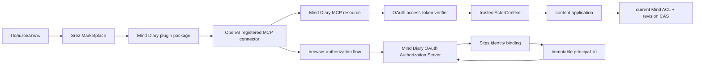

# Plugin и OAuth-коннектор Mind Diary

Статус: accepted, обновлено 2026-08-17. OAuth Authorization Server, dual
personal/OAuth MCP authentication, write step-up и connected-app revocation
реализованы в repository candidate. Registered connector, Marketplace package
и live UAT acceptance ещё не завершены; текущий deployed Site по-прежнему
обслуживает только прежний single-principal UAT и personal `mdp_v1_` tokens.

Связанные документы: [архитектура](../architecture.md),
[MVP](mvp.md), [API](api.md),
[доменная модель](domain-model.md) и
[профиль доставки](../operations/ship-work-release-profile.md). Принятое
решение зафиксировано в
[ADR-0010](../decisions/0010-oauth-marketplace-connector.md).

## Текущий implementation checkpoint

Repository candidate уже содержит:

- OAuth discovery и protected-resource metadata;
- public-client DCR и optional allowlisted Client ID Metadata Document;
- authorization code + PKCE `S256`, exact redirect/resource validation;
- 15-minute access token, rotating 30-day refresh token и grant-family revoke
  при refresh reuse;
- read-first grant и `content:write` step-up;
- dual `mdp_v1_`/`mdo_access_` MCP authentication, tool
  `securitySchemes` и OAuth challenges;
- internal authorization mirror, благодаря которому application ACL/CAS/commit
  повторно проверяют OAuth token внутри текущих transaction boundaries;
- connected-app list/revoke на `/settings/mcp` и account-deletion cleanup;
- D1 migration и repository tests для positive и negative OAuth paths.

Этот checkpoint — доказательство реализации, не deployment. App registration,
реальный `.app.json`, Marketplace validation, exact-SHA UAT release и fresh
install/read/write/revoke/reconnect smoke остаются обязательными этапами.

## Решение

Mind Diary можно добавить в уже существующий Srez Marketplace вторым plugin
рядом с Task Manager. Рекомендуемый путь:

1. Сначала подтвердить живую совместимость registered connector с одним из
   существующих MCP profiles Mind Diary и доступность OAuth discovery через
   внешнюю Sites boundary.
2. Добавить в Mind Diary OAuth 2.1 Authorization Server, связанный с той же
   внутренней principal identity, что и Sites UI.
3. Научить content MCP принимать OAuth access tokens и возвращать стандартные
   OAuth discovery/challenge metadata, сохранив personal tokens как advanced
   compatibility path.
4. Создать registered MCP connector и только затем положить
   `plugins/mind-diary` в Srez Marketplace.
5. Сначала выпустить явно обозначенный personal UAT pilot. Публичный каталог и
   production plugin требуют отдельной provisioned production environment и
   отдельного решения о выпуске.

Это даст простой пользовательский flow без ручного MCP URL, client secret и
копирования bearer token. Marketplace, plugin package и registered connector
при этом остаются отдельными объектами.

Наличие Srez Marketplace в аккаунте автоматически делает новую карточку Mind
Diary доступной после обновления каталога. Оно не должно автоматически
устанавливать plugin или предоставлять доступ к данным: пользователь явно
нажимает `Install` и проходит OAuth consent. Для plugin следует использовать
catalog policy `installation: AVAILABLE` и `authentication: ON_INSTALL`.

## Что взято из Task Manager

Текущая интеграция Task Manager подтверждает пригодность следующего шаблона:

| Слой | Task Manager сейчас | Mind Diary accepted profile |
| --- | --- | --- |
| Marketplace | `srez-marketplace` | тот же Marketplace |
| Plugin package | `plugins/task-manager` | новый `plugins/mind-diary` |
| Registered app | ID `asdk_app_*` в `.app.json` | новый отдельный ID, создаваемый после регистрации connector |
| Transport fallback | public MCP URL в `.mcp.json` | exact Mind Diary UAT MCP resource |
| Installation | `AVAILABLE` + `ON_INSTALL` | то же поведение |
| OAuth | authorization code + PKCE, DCR | тот же protocol profile, но Mind Diary scopes и identity rules |
| Data authorization | internal Task Manager user | internal immutable Mind Diary `principal_id` |
| Tool surface | task operations | один principal-wide content MCP для доступных Minds |

Не следует механически копировать из Task Manager:

- scopes `api:read` и `api:write`: Mind Diary сохраняет
  `content:read` и `content:write`;
- Task Manager token verifier: Mind Diary сохраняет keyed HMAC verifier и для
  OAuth secrets, а не ослабляет существующий secret-storage baseline;
- implicit user creation: неизвестная Sites identity не связывается и не
  объединяется автоматически с существующим principal;
- production endpoint Task Manager: у Mind Diary сейчас есть только UAT;
- MCP lifecycle: совместимость registered connector с текущим modern profile
  `2026-07-28` должна быть доказана отдельно.

## Целевой пользовательский flow

### Первое подключение

1. Пользователь уже имеет Srez Marketplace в Codex/ChatGPT.
2. После обновления Marketplace он видит карточку `Mind Diary` или, на pilot
   стадии, `Mind Diary UAT`.
3. Пользователь нажимает `Install`.
4. Host открывает native `Authenticate` flow без запроса MCP URL, client ID,
   client secret или personal token.
5. Mind Diary authorization page использует текущую authenticated Sites
   identity, разрешает её в immutable `principal_id` и показывает запрошенные
   scopes.
6. После consent host получает authorization code, обменивает его с PKCE и
   сохраняет connector grant.
7. В новом чате пользователь сразу может перечислить свои Minds, искать и
   читать Memories.

### Запись

Рекомендуемый default — `content:read` при установке и step-up consent на
`content:write` при первом вызове `commit_changeset`. Так простой read path
остаётся одноразовым подключением, а capability немедленно создавать immutable
revisions выдаётся явно и только когда она нужна.

Если fresh-host validation покажет, что incremental scopes в installed plugin
не дают надёжного UX, допустим pilot-компромисс: запросить оба scopes при
`ON_INSTALL`, но показать отдельное ясное предупреждение об immediate commits.
Этот fallback требует отдельного принятия product/security trade-off.

### Повторное подключение и отзыв

- Пользователь видит connected app, scopes, время создания и last use в
  `/settings/mcp`.
- `Revoke` немедленно отзывает grant, access tokens и всю refresh-token family.
- Следующий tool call возвращает стандартный OAuth challenge; ручной bearer
  token не подставляется как скрытый fallback.
- `Reconnect` запускает новый consent и создаёт новый grant.

## Целевая архитектура



Marketplace не получает данные Mind Diary. Plugin package описывает connector,
skills и assets, registered app хранит connection metadata, а server остаётся
единственным authority для identity, scopes и Mind ACL.

## Marketplace package

Предлагаемая структура в Srez Marketplace:

```text
plugins/
├── task-manager/
└── mind-diary/
    ├── .codex-plugin/
    │   └── plugin.json
    ├── .app.json
    ├── .mcp.json
    ├── assets/
    │   ├── icon.png
    │   └── logo.png
    └── skills/
        └── mind-diary/
            └── SKILL.md
```

`plugin.json` должен использовать:

- package name `mind-diary`;
- user-facing name `Mind Diary`, а для private pilot — ясный UAT marker;
- начальную version `0.1.0`;
- apps, skills, MCP server и existing brand assets;
- категорию `Productivity`, пока каталог не подтвердит более точную knowledge
  category.

`.app.json` ссылается на новый registered app ID. Его нельзя подставлять до
фактического создания connector. `.mcp.json` содержит exact HTTPS MCP resource
и такой же `oauth_resource`; это transport fallback и reviewable source, но не
замена registered app.

Skill остаётся тонким interaction adapter. Он должен объяснять progressive
disclosure, явный выбор одного Mind/revision, read-before-write,
`expected_revision`, idempotency и безопасный preview. Skill не может
расширять OAuth scopes, обходить ACL или переносить control-plane operations в
content MCP.

Marketplace catalog получает вторую запись с local source
`./plugins/mind-diary`, `installation: AVAILABLE` и
`authentication: ON_INSTALL`. Добавление plugin не меняет Task Manager package.

## OAuth protocol profile

### Discovery и endpoints

Resource Server публикует path-specific protected-resource metadata для exact
MCP resource. Authorization Server публикует metadata и endpoints:

```text
GET  /.well-known/oauth-protected-resource/<exact-mcp-path>
GET  /.well-known/oauth-authorization-server
GET  /oauth/authorize
POST /oauth/register
POST /oauth/token
POST /oauth/revoke
```

Нужны authorization code flow и только PKCE `S256`. Для первого connector
следует поддержать Dynamic Client Registration: именно этот путь доказан
текущей интеграцией Task Manager. Client ID Metadata Documents можно добавить
после отдельного conformance test, но они не являются prerequisite pilot-а.

Authorization и token requests обязаны передавать один и тот же exact
`resource`; access token получает такую же audience. Redirect URI сравнивается
с зарегистрированным exact value. DCR разрешает только public clients с
`token_endpoint_auth_method=none`; shared client secret не вводится.

### Challenges и tool metadata

Unauthenticated `initialize`, `ping` и `tools/list` могут возвращать только
protocol metadata и schemas, никогда пользовательские данные. Каждый
защищённый call проверяет bearer token до content application.

Ответ `401` содержит `WWW-Authenticate` с `resource_metadata` и нужным scope.
MCP authorization error также содержит `_meta["mcp/www_authenticate"]`, чтобы
host мог открыть native linking или step-up flow. `tools/list` публикует
`securitySchemes`:

- read tools — `content:read`;
- `commit_changeset` — `content:write`;
- `start_export` — `content:read`, поскольку он создаёт delivery job, но не
  изменяет canonical Mind content.

Tool annotations сохраняют фактическую семантику. В частности,
`commit_changeset` остаётся immediate commit и destructive-capable operation;
OAuth consent не превращает его в draft или approval artifact.

### Token lifecycle

Предлагаемый baseline:

- authorization code: одноразовый, короткоживущий, bound to client, redirect,
  resource, principal, scopes и PKCE challenge;
- access token: opaque, 15 минут, exact resource audience;
- refresh token: opaque, 30 дней, rotation при каждом использовании;
- reuse старого refresh token: отзыв всей token family и grant;
- revoke connector: отзыв grant, active access tokens и refresh family;
- verifier: keyed HMAC-SHA-256, constant-time compare, secret показывается
  только как bearer value и не логируется.

OAuth tokens получают отдельные bounded prefixes, чтобы auth boundary могла
без перебора выбрать verifier. Existing `mdp_v1_` personal tokens продолжают
работать как явно обозначенный advanced path. Оба типа после проверки дают
одинаковый trusted `ActorContext`; downstream application не принимает raw
token, email или client-supplied principal.

### Service records

Нужны отдельные service-side records:

- `OAuthRegisteredClient`;
- `OAuthAuthorizationRequest`;
- `OAuthGrant`;
- `OAuthAuthorizationCode`;
- `OAuthAccessToken`;
- `OAuthRefreshToken` и rotation family state.

Эти records, scopes, idempotency и audit metadata не входят в `OKFBundle`,
revision export или user content. Account deletion и connector revoke удаляют
либо отзывают все identity-linked OAuth credentials согласно общей privacy
model.

## Identity и authorization

OAuth authorization page должна работать за той же trusted Sites identity
boundary, что и control UI. Normalized authenticated email остаётся только
initial external binding; после resolution grant привязывается к immutable
internal `principal_id`.

Правила fail closed:

- client не передаёт authoritative email, `principal_id`, `space_id` или role;
- exact existing binding открывает существующий account;
- неизвестная identity проходит явное создание нового isolated account либо
  manual recovery до OAuth consent;
- automatic relink, merge или access transfer запрещены;
- один connector grant относится к principal, но каждый content call явно
  выбирает один разрешённый Mind и revision;
- текущие ACL и visibility проверяются при каждом call, а не фиксируются в
  access token;
- OAuth не публикует membership, visibility, ownership transfer или personal
  token management через content MCP.

## MCP endpoint decision

Product-preferred resource — existing `POST /api/mcp` с profile
`2026-07-28`. Однако registered connector нельзя считать совместимым с этим
profile только по repository tests: перед реализацией OAuth нужен live
read-only spike с draft registered app.

Решение spike-а:

1. Если host проходит discovery, tool listing и representative read call на
   `2026-07-28`, registered connector фиксирует exact resource `/api/mcp`.
2. Если host всё ещё требует initialize lifecycle, pilot временно использует
   доказанный compatibility resource `/api/mcp/2025-11-25`.
3. Modern и compatibility lifecycle не смешиваются внутри одного request.
4. Смена exact OAuth resource позднее считается connector migration: новый
   registered-app version, повторный consent и fresh-chat validation, а не
   незаметная замена URL.

Оба adapters вызывают существующий content application contract. OAuth меняет
authentication boundary и discovery, но не tool payload, ACL или revision
semantics.

## Sites и environments

Сейчас Mind Diary имеет UAT Site, но не provisioned production. Поэтому
начальный plugin допустим только как personal/private pilot и должен явно
указывать UAT status.

До регистрации connector нужно проверить внешний access path. OAuth discovery,
authorization callbacks и MCP requests host-а не могут зависеть от ручного
`OAI-Sites-Authorization` secret в пользовательской конфигурации. Возможные
решения — поддержанный Sites connector path либо публично достижимая UAT edge
surface, на которой все пользовательские данные по-прежнему закрыты product
OAuth и ACL. Изменение Site access policy является отдельной security boundary
и не следует из этого proposal автоматически.

Публичный universal plugin и production name `Mind Diary` допускаются только
после:

- provisioned production environment и stable public MCP/OAuth URL;
- release, rollback и incident operations для exact artifact;
- abuse/rate-limit и OAuth security validation;
- reviewer-safe test account и privacy-minimized test data;
- отдельного решения пользователя о production release и public submission.

## Product UI

`/settings/mcp` следует превратить из primarily manual-token page в две явно
разделённые области:

1. `Connected apps` — client name, granted scopes, created/last-used times,
   revoke и reconnect status.
2. `Advanced: personal tokens` — существующие `mdp_v1_` create/list/revoke для
   CLI, compatibility и диагностики.

В onboarding следует объяснять только пользовательские действия: установить
Mind Diary из Srez Marketplace и пройти Authenticate. MCP URL, DCR, PKCE,
resource audience и token rotation остаются implementation details.

## Проверка и acceptance

Pilot считается доказанным только при fresh installation, а не при прямом
MCP curl либо повторном использовании старого chat snapshot.

Минимальная матрица:

1. Existing Srez Marketplace показывает новую карточку после refresh/update;
   Task Manager продолжает устанавливаться отдельно.
2. `Install` запускает native Authenticate без ручного URL, client secret или
   personal token.
3. Unknown identity не получает старые права и проходит explicit onboarding
   либо recovery.
4. Read-only grant разрешает `list_minds`, `resolve_mind`, browse, search,
   fetch, history, validation и export, но не commit.
5. Первый commit без write scope запускает native step-up; после consent
   `commit_changeset` сохраняет CAS и idempotency semantics.
6. Один principal видит все и только доступные ему Minds; каждый call явно
   выбирает один Mind, cross-Mind leakage отсутствует.
7. Revocation делает следующий call unauthorized; reconnect создаёт новый
   grant, а старые refresh tokens не оживают.
8. Existing personal-token modern и compatibility flows остаются рабочими.
9. Access-token expiry, refresh rotation, refresh reuse, wrong resource,
   redirect mismatch и revoked client имеют negative tests.
10. Fresh Codex/ChatGPT chat после установки проходит discovery, representative
    read, write, revoke и reconnect smoke на exact deployed candidate.

Repository tests должны покрывать OAuth state machines, persistence, verifier,
scope enforcement, challenge metadata, identity binding и оба MCP profiles.
UAT evidence отдельно связывает exact Git SHA, Site deployment, registered app
version, Marketplace plugin version и fresh-chat smoke.

## Этапы реализации

### 0. Read-only connector spike

- Создать draft registered app без публикации Marketplace package.
- Проверить Sites reachability, callback URI и оба existing MCP profiles.
- Выбрать exact pilot resource и зафиксировать необходимость access-policy
  change до schema/code work.

### 1. OAuth foundation

- Принять protocol/storage contract и добавить service records.
- Реализовать metadata, DCR, authorize, token, revoke, PKCE, rotation и audit.
- Связать consent с existing principal binding и добавить connected-app UI.

### 2. MCP OAuth integration

- Добавить dual personal/OAuth verifier, anonymous discovery,
  `securitySchemes`, challenges и per-tool scopes.
- Сохранить application contract, Mind ACL, CAS и idempotency.
- Выполнить local tests и полный repository gate на exact candidate.

### 3. Marketplace package

- Зарегистрировать connector и записать реальный app ID в `.app.json`.
- Добавить plugin package, assets, thin skill и catalog entry в Srez
  Marketplace.
- Проверить package locally; не изменять Task Manager package.

### 4. Private UAT pilot

- Опубликовать exact candidate в текущий UAT по release contract.
- Установить plugin из уже подключённого Marketplace в fresh task/chat.
- Выполнить полную acceptance matrix и revoke/reconnect recovery.

### 5. Production/public decision

- Provision production только по отдельному решению.
- Повторить security, conformance и release evidence на production artifact.
- Отдельно решить public plugin directory submission; private Git Marketplace
  не требует выдавать pilot за глобально опубликованный connector.

## Риски и открытые решения

| Вопрос | Почему важен | Как закрыть |
| --- | --- | --- |
| Поддерживает ли registered connector MCP `2026-07-28` | определяет exact OAuth resource и lifecycle | Stage 0 live spike |
| Пропускает ли Sites boundary host без ручного audience secret | иначе OAuth discovery не начнётся | read-only reachability test и отдельное access-policy решение |
| Надёжен ли incremental write consent в installed plugin | влияет на безопасность и число dialogs | fresh-host UX test; fallback к read+write on install только по принятому решению |
| DCR или CIMD | неверный client profile ломает linking | DCR для pilot; CIMD только после conformance |
| UAT или production branding | нельзя выдавать pilot за live service | `Mind Diary UAT` до provisioned production |
| Как мигрировать exact MCP resource | resource — token audience | новый connector version и reconnect, без silent URL swap |

## Внешние protocol references

- [OpenAI Plugins: concepts](https://developers.openai.com/plugins/concepts/plugins)
- [OpenAI Plugins: authentication](https://developers.openai.com/plugins/build/auth)
- [OpenAI Plugins: package structure](https://developers.openai.com/plugins/build/plugins)
- [OpenAI Plugins: connect from ChatGPT](https://developers.openai.com/plugins/deploy/connect-chatgpt)
- [OpenAI Plugins: public submission](https://developers.openai.com/plugins/deploy/submission)
